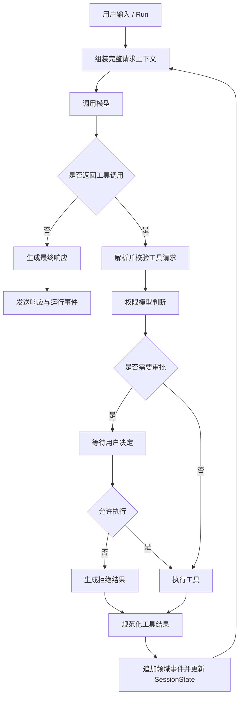
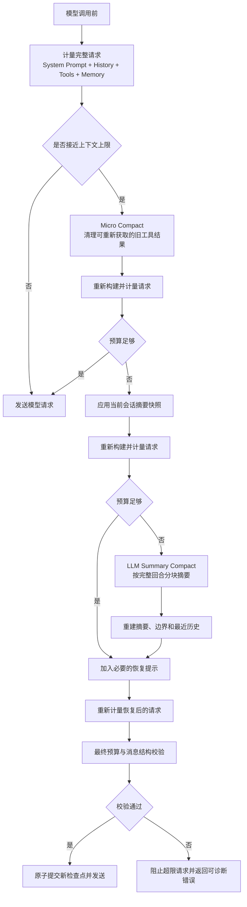
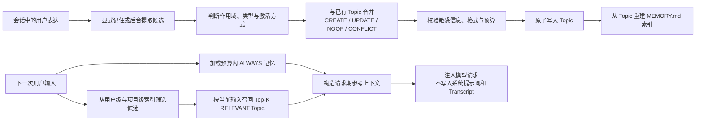

# My Claude Code

> 参考 Claude Code 设计思想、使用 Java 实现的本地 Agent Harness。

My Claude Code 面向本地工作区，把大模型从一次性对话扩展为可持续执行任务的运行时：它负责维护工作上下文、协调工具调用、控制权限和审批、压缩超长上下文、管理跨会话记忆，并将每一步以事件流反馈给客户端。

项目不绑定特定业务领域。桌面端只是一个客户端，Harness 后端可以通过本地 HTTP/SSE API 被其他客户端复用。

## 技术栈

| 层次 | 技术 |
| --- | --- |
| 运行时 | Java 17、Spring Boot 3.5 |
| 模型接入 | LangChain4j 1.2、OpenAI-compatible Chat API |
| 服务协议 | REST、Server-Sent Events（SSE） |
| 状态与持久化 | Session Event Stream、Run Snapshot、可重建 SessionIndex、Markdown Memory Topic |
| 桌面客户端 | React 19、TypeScript、Vite、Tauri 2 |
| 测试与约束 | JUnit 5、ArchUnit、Node Test Runner |

## 核心能力

- **可持续的 Agent 执行**：模型可以在同一任务中多次调用工具、读取结果并继续决策。
- **本地工作区工具**：文件读写与编辑、Glob、Grep、Bash、Todo 和后台任务。
- **安全的工具边界**：统一做输入校验、路径约束、权限判断和用户审批。
- **长上下文续航**：在模型请求真正超出预算前，自动压缩可丢弃结果、复用会话摘要或生成新的摘要。
- **跨会话记忆**：按用户和项目隔离长期记忆，只召回与当前输入相关且在预算内的内容。
- **会话可观察、恢复与时间旅行**：Run 通过 `202 Accepted` 进入后台队列，过程通过 SSE 推送；单一 Event Stream、结构化 Run Snapshot 和 Run 树支持崩溃恢复、回退与从历史检查点继续。
- **客户端无关**：桌面端使用同一套本地 API，其他 CLI、Web 或自动化客户端也可以接入。

## 核心设计

### 1. Agent Loop

Agent Loop 是 Harness 的主执行闭环。它不把模型当作一次请求，而是把“请求模型、处理工具、回填结果、继续请求”组织成一个可停止、可观察的状态机。



核心不变量：

- 每次模型请求都基于当前完整工作历史，而不是孤立的最后一条消息。
- 工具请求和工具结果必须配对，并按稳定顺序回填。
- 同一会话的 Run 按提交顺序串行执行；会话之间可以并行。
- 每个阶段都能发出结构化事件，客户端不需要猜测 Agent 当前处于什么状态。

### 2. 上下文压缩

上下文压缩的目标不是简单删除旧消息，而是在不破坏工具调用结构和用户约束的前提下，为下一次模型请求重建一个可验证的上下文。



压缩采用由低成本到高成本的三级策略：

1. **Micro Compact**：只处理可以从工作区重新读取的旧工具结果，不调用模型。
2. **Session Summary**：复用当前会话已生成的摘要检查点，替代它已经覆盖的历史。
3. **LLM Summary**：对旧历史按完整回合分块总结，生成新的摘要和覆盖边界。

每次策略变化后都会重新构建完整请求并计量；系统不在并行工具批次执行中修改历史，也不会在摘要失败时静默丢弃用户输入。

### 3. 记忆系统

长期记忆只保存跨会话仍有价值的信息，例如用户偏好、协作反馈和稳定的项目背景。当前任务状态、临时调试过程和会话摘要不属于长期记忆。



设计要点：

- 用户级和项目级是两个隔离的 Memory Namespace。
- Topic 文件是事实来源，`MEMORY.md` 只是可重建的派生索引。
- `ALWAYS` 只用于少量稳定偏好；其他内容默认按当前输入以 `RELEVANT` 方式召回。
- 所有写入都经过统一记忆服务，并在命名空间内原子更新；后台提取失败不阻塞主 Agent。
- 记忆正文以低优先级参考消息注入当前请求，不覆盖系统规则和用户当前指令。

### 4. 权限模型

权限模型把“模型请求了什么”和“系统是否允许执行”分成两个阶段。任何工具都必须经过统一的权限管线，不能在工具内部绕过审批。

```mermaid
flowchart TD
    Request["工具调用请求"] --> Parse["解析参数与规范化路径"]
    Parse --> Validate["Schema、输入和工作区边界校验"]
    Validate --> DenyRule{"命中拒绝规则"}
    DenyRule -- "是" --> Deny["拒绝执行"]
    DenyRule -- "否" --> AskRule{"命中询问规则"}
    AskRule -- "是" --> Approval["进入审批队列"]
    AskRule -- "否" --> AllowRule{"命中允许规则"}
    AllowRule -- "是" --> Execute["执行工具"]
    AllowRule -- "否" --> Mode{"权限模式兜底"]
    Mode -- "ask_every_time" --> Approval
    Mode -- "project_auto 且在工作区内" --> Execute
    Mode -- "auto_approve" --> Execute
    Approval --> Decision{"用户决定"}
    Decision -- "allow_once" --> Execute
    Decision -- "allow_for_session" --> SessionRule["记录会话级允许规则"]
    SessionRule --> Execute
    Decision -- "deny" --> Deny
    Execute --> Result["返回标准化工具结果"]
```

权限模式：

| 模式 | 默认行为 |
| --- | --- |
| `ask_every_time` | 未命中允许规则时请求审批，适合首次运行 |
| `project_auto` | 工作区允许目录内自动执行，越界操作仍需审批 |
| `auto_approve` | 自动批准工具调用，仅适合受控环境 |

## 项目结构

```text
.
├── src/main/java/cn/ayice
│   ├── Main.java                 # CLI 入口
│   └── veyra
│       ├── boot                 # 运行时对象装配与生命周期
│       ├── control              # HTTP API、DTO、SSE 和错误边界
│       ├── runtime              # Run 编排与会话运行时
│       ├── context              # Prompt、项目指令和请求上下文
│       ├── compaction           # 上下文预算、压缩与检查点
│       ├── memory               # 长期记忆、召回和自动提取
│       ├── tool                 # 工具目录、执行和权限模型
│       ├── session               # Transcript、事件和会话状态
│       ├── subagent              # 子任务运行时
│       └── llm                  # LangChain4j 模型调用
├── src/test                    # 单元、集成和架构约束测试
├── veyra-desktop               # React + Tauri 客户端
└── docs                        # 架构规范与设计文档
```

## 快速开始

### 环境要求

- JDK 17+
- Maven 3.9+
- 支持工具调用的 OpenAI-compatible 模型服务
- 构建桌面端还需要 Node.js 20+、Rust stable 和 Tauri 2 系统依赖

### 启动后端

```powershell
git clone https://github.com/codingayice/my-claude-code.git
cd my-claude-code

$env:DEEPSEEK_API_KEY = "your-api-key"
mvn test
mvn package
java -Dfile.encoding=UTF-8 -jar target/veyra-1.0-SNAPSHOT.jar --port 17361
```

默认配置位于 [`src/main/resources/config.yaml`](src/main/resources/config.yaml)。使用外部配置文件：

```powershell
java -Dfile.encoding=UTF-8 -jar target/veyra-1.0-SNAPSHOT.jar `
  --config config.local.yaml `
  --port 17361
```

Veyra 的内部持久化内容统一位于 `~/.veyra`：会话 Journal 和恢复状态在
`~/.veyra/sessions`，长期记忆在 `~/.veyra/memory`，桌面日志在
`~/.veyra/logs`，UI 偏好保存在 `~/.veyra/preferences.json`。可通过
`storage.root` 整体调整根目录，不支持为各类数据配置根目录之外的独立路径。

检查服务：

```powershell
curl.exe http://127.0.0.1:17361/v1/health
```

### 启动桌面端

```powershell
mvn compile
mvn dependency:build-classpath "-Dmdep.outputFile=target/classpath.txt"

cd veyra-desktop
npm ci
npm test
npm run typecheck
npm run tauri dev
```

桌面端开发启动器会使用 `target/classes` 和 `target/classpath.txt` 启动本地 Agent 服务。

## 设计文档

- [架构与开发规范](docs/veyra-architecture-development-guidelines.md)：模块边界、依赖方向、并发和测试约束。
- [LangChain4j 架构设计](docs/design/veyra-langchain4j-architecture-design.md)：模型接入和请求边界。
- [上下文压缩设计](docs/design/veyra-context-compaction-enhancement-design.md)：三级压缩、预算和检查点。
- [长期记忆设计](docs/design/veyra-memory-system-design.md)：Topic、索引、命名空间和召回。
- [中断运行恢复设计](docs/design/veyra-interrupted-run-recovery-design.md)：JSONL Transcript 与恢复语义。

## 致谢

本项目参考了 [Claude Code](https://docs.anthropic.com/en/docs/claude-code/overview)、[learn-claude-code](https://github.com/shareAI-lab/learn-claude-code)、[Pi](https://github.com/badlogic/pi-mono)、[Mem0](https://github.com/mem0ai/mem0) 和 [LangGraph](https://github.com/langchain-ai/langgraph) 等项目的设计理念，并使用 [Spring Boot](https://spring.io/projects/spring-boot)、[LangChain4j](https://github.com/langchain4j/langchain4j) 与 [Tauri](https://tauri.app/) 构建。

My Claude Code 是独立的社区实现，与 Anthropic 不存在隶属、授权或背书关系。
