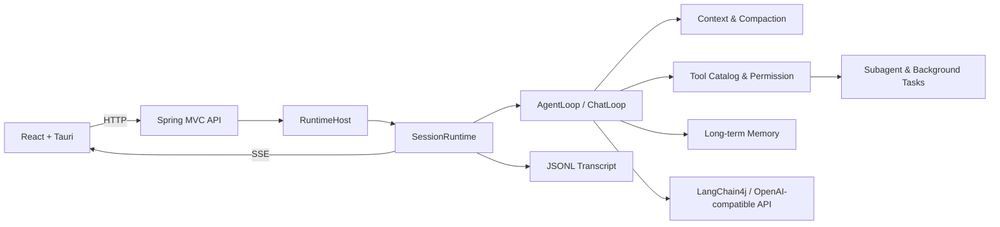

# My Claude Code

> 面向本地工作区的 Java Agent Harness：把模型、工具、权限、上下文与会话运行时组合成一个可恢复的执行系统。


My Claude Code 将大模型的推理能力与本地工作区、工具调用、权限审批、上下文管理和任务执行连接起来。它不绑定某个垂直业务场景，而是提供一个可以被桌面端或其他客户端复用的 Agent 运行时。

它参考了 Claude Code 的产品与 Harness 设计理念，但不是 Claude Code 的复刻，也不隶属于 Anthropic。核心后端使用 Java 17、Spring Boot 与 LangChain4j 实现，并提供 React + Tauri 桌面端。

> [!IMPORTANT]
> 项目目前处于积极开发阶段，接口、配置和桌面端体验仍可能发生变化，暂不建议直接用于无人值守的生产环境。

## 核心能力

- **Agent Loop**：支持模型推理、工具调用、结果回填、继续决策与停止条件。
- **本地工具系统**：内置 Bash、文件读写与编辑、Glob、Grep、Todo 等工作区工具。
- **权限与审批**：提供逐次询问、项目内自动授权和自动批准三种权限模式，并支持单次或会话级授权。
- **上下文工程**：具备 token 预算、工具结果微压缩、自动摘要压缩、检查点与压缩后恢复。
- **会话运行时**：同一会话串行执行、不同会话并行运行，通过 JSONL 持久化并支持历史恢复。
- **实时事件流**：通过 HTTP API 提交任务，通过 SSE 推送模型、工具、审批和运行状态事件。
- **长期记忆**：支持用户级与项目级记忆、自动提取、索引、相关内容召回和上下文注入。
- **子 Agent 与后台任务**：可委派独立任务，查询、停止子任务，并隔离工具范围与权限策略。
- **项目指令**：可读取工作区中的 `CLAUDE.md` 与 `.claude/CLAUDE.md`，将项目约束注入 Agent 上下文。
- **桌面客户端**：基于 React 19、Tauri 2 和 TypeScript，提供会话、审批、工具过程与工作区交互界面。

## 设计取舍

My Claude Code 把“模型会说什么”和“系统允许做什么”明确分开。下面这些约束贯穿后端实现，也决定了模块如何组织：

- **协议与运行时分离**：Controller 只负责 HTTP、DTO 和 SSE；Agent、Chat、Session 和 Tool 不依赖 Spring MVC。
- **单一可变状态所有者**：一个 `SessionRuntime` 持有一个会话的运行状态；同一会话的 Run 串行执行，不同会话可以并行。
- **工具执行有固定边界**：每次调用按 `lookup -> parse -> validate -> permission -> approval -> execute -> normalize` 流程处理，工具本身不能绕过权限判断。
- **策略保持独立**：Agent、Chat、Subagent 是三种不同的执行策略；共享稳定阶段，但不通过一套巨型循环隐藏行为差异。
- **记忆与压缩分层**：上下文压缩只处理当前会话，长期记忆只处理跨会话事实，二者不会互相读取对方的持久化数据。
- **恢复优先于“重新开始”**：运行过程写入 JSONL，并通过检查点、摘要和恢复提示降低长任务中断后的重建成本。

这样可以让模型、工具和 UI 各自可替换，并为每个边界提供独立测试。

## 工作原理



一次 Agent 请求会经历以下过程：

1. 客户端创建会话并订阅 SSE 事件。
2. Run 进入对应会话的串行队列，`AgentLoop` 组装模型上下文。
3. 模型返回工具调用后，Harness 依次完成查找、参数解析、校验、权限判断、审批和执行。
4. 工具结果回填模型，循环继续，直到模型给出最终答案或运行终止。
5. 会话过程写入 JSONL；上下文接近窗口上限时自动压缩并保留恢复信息。

## 技术栈

| 范围 | 技术 |
| --- | --- |
| Agent 后端 | Java 17、Spring Boot 3.5、LangChain4j 1.2 |
| 模型协议 | OpenAI-compatible Chat API |
| API 与事件 | REST、Server-Sent Events |
| 持久化 | 本地文件、JSONL |
| 桌面端 | React 19、TypeScript、Vite、Tauri 2 |
| 测试 | JUnit 5、ArchUnit、Node Test Runner |

## 工程质量

后端测试覆盖 Agent/Chat 循环、会话串行队列、工具权限、审批、上下文压缩、长期记忆、JSONL 恢复和包依赖方向。模型调用通过 fake service 或回调替身隔离，测试不依赖真实第三方网络。

架构约束由 ArchUnit 测试保护，文档规则还会检查业务类的职责说明和公开契约。后端完整测试集可通过 `mvn test` 一次运行。

## 快速开始

### 1. 环境要求

仅运行后端需要：

- JDK 17+
- Maven 3.9+
- 一个支持工具调用的 OpenAI-compatible 模型服务

运行桌面端还需要：

- Node.js 20+
- Rust stable
- [Tauri 2 系统依赖](https://v2.tauri.app/start/prerequisites/)

桌面端启动器当前主要面向 Windows 开发环境；纯 Java 后端不受此限制。

### 2. 获取项目

```bash
git clone https://github.com/codingayice/my-claude-code.git
cd my-claude-code
```

### 3. 配置模型

默认配置使用 DeepSeek 的 OpenAI-compatible API。先设置 API Key：

```powershell
# PowerShell
$env:DEEPSEEK_API_KEY = "your-api-key"
```

```bash
# macOS / Linux
export DEEPSEEK_API_KEY="your-api-key"
```

如需使用其他兼容服务，创建一份本地 YAML 配置，并修改 `model` 段：

```yaml
model:
  name: your-model-name
  baseUrl: https://your-provider.example/v1
  apiKey: ${YOUR_API_KEY}
  temperature: 0.7
  maxTokens: 8192
  timeoutSeconds: 120
```

模型需要支持 OpenAI-compatible 的工具调用格式，否则 Agent 模式无法正常工作。

### 4. 构建并启动后端

```bash
mvn test
mvn package
java -Dfile.encoding=UTF-8 -jar target/veyra-1.0-SNAPSHOT.jar --port 17361
```

使用自定义配置时：

```bash
java -Dfile.encoding=UTF-8 -jar target/veyra-1.0-SNAPSHOT.jar \
  --config config.local.yaml \
  --port 17361
```

Windows PowerShell 可以写成一行，或使用反引号替代上面的续行符。服务仅监听 `127.0.0.1`，启动后可检查：

```bash
curl http://127.0.0.1:17361/v1/health
```

### 5. 启动桌面端

桌面端在开发模式下会自行启动 Java Agent。首次运行前，需要编译后端并生成依赖类路径：

```powershell
mvn compile
mvn dependency:build-classpath "-Dmdep.outputFile=target/classpath.txt"

cd veyra-desktop
npm ci
npm test
npm run typecheck
npm run tauri dev
```

## 配置说明

默认配置位于 [`src/main/resources/config.yaml`](src/main/resources/config.yaml)。可通过 `--config <path>` 指定外部配置文件。

| 配置项 | 说明 | 默认值 |
| --- | --- | --- |
| `model.name` | 模型名称 | `deepseek-v4-flash` |
| `model.baseUrl` | OpenAI-compatible API 地址 | `https://api.deepseek.com/v1` |
| `model.apiKey` | API Key，支持 `${ENV_NAME}` 插值 | `${DEEPSEEK_API_KEY}` |
| `context.maxRounds` | Agent 最大循环轮数，`0` 表示不设固定轮数 | `0` |
| `context.maxContextTokens` | 模型上下文窗口预算 | `128000` |
| `context.autoCompactEnabled` | 是否自动压缩上下文 | `true` |
| `memory.dir` | 会话与压缩恢复数据目录 | `~/.mycc` |
| `memory.longTermDir` | 长期记忆目录 | `~/.veyra/memory` |
| `memory.autoExtractionEnabled` | 是否自动提取长期记忆 | `true` |
| `permission.mode` | 默认工具权限模式 | `ask_every_time` |

权限模式：

| 模式 | 行为 |
| --- | --- |
| `ask_every_time` | 未命中已有规则时请求用户审批，适合首次使用 |
| `project_auto` | 项目目录内按权限规则执行，超出范围时请求审批 |
| `auto_approve` | 自动批准工具调用，风险最高，仅建议在受控环境使用 |

## HTTP API 示例

后端的稳定入口位于 `/v1`。创建会话：

```bash
curl -X POST http://127.0.0.1:17361/v1/sessions
```

订阅会话事件：

```bash
curl -N http://127.0.0.1:17361/v1/sessions/<sessionId>/events
```

提交 Agent 任务：

```bash
curl -X POST http://127.0.0.1:17361/v1/sessions/<sessionId>/runs \
  -H "Content-Type: application/json" \
  -d '{"input":"分析当前项目并修复失败的测试","mode":"agent"}'
```

`mode` 可选值：

- `agent`：允许模型使用工具完成任务，默认模式。
- `chat`：仅进行对话，不进入工具执行分支。

Run 提交成功后立即返回 `202 Accepted`，后续过程与结果通过 SSE 事件流发送。更多端点可查看 [`AgentController.java`](src/main/java/cn/ayice/veyra/control/api/AgentController.java)。

## 项目结构

```text
.
├── src/main/java/cn/ayice/veyra
│   ├── boot          # Spring 装配与运行时对象图
│   ├── control       # HTTP、DTO、SSE 与错误边界
│   ├── runtime       # Run、Agent、Chat 编排
│   ├── session       # 会话状态、事件、JSONL 与恢复
│   ├── context       # Prompt、项目指令与模型请求组装
│   ├── compaction    # 上下文预算、压缩与检查点
│   ├── memory        # 跨会话长期记忆
│   ├── tool          # 工具目录、权限、审批与内置工具
│   ├── subagent      # 子 Agent 与任务生命周期
│   ├── interaction   # 斜杠命令
│   └── llm           # LangChain4j 模型接入
├── src/test          # 单元、集成与架构约束测试
├── veyra-desktop     # React + Tauri 桌面端
└── docs              # 架构规范与设计文档
```

详细的依赖方向、并发约束和开发规则见下方设计文档。

## 设计文档

如果你想从实现细节开始阅读，可以按下面的顺序了解关键子系统：

- [架构与开发规范](docs/veyra-architecture-development-guidelines.md)：包职责、依赖方向、并发与测试约束。
- [记忆系统设计](docs/design/veyra-memory-system-design.md)：用户级/项目级长期记忆、索引与召回边界。
- [上下文压缩增强设计](docs/design/veyra-context-compaction-enhancement-design.md)：预算、微压缩、摘要和恢复提示。
- [中断运行恢复设计](docs/design/veyra-interrupted-run-recovery-design.md)：检查点、JSONL 转录和恢复流程。
- [模块收敛设计](docs/design/veyra-project-module-convergence-design.md)：从能力边界到包结构的演进记录。

## 开发与贡献

欢迎提交 Issue 和 Pull Request。开始修改前请先阅读架构规范，并至少运行受影响的测试：

```bash
mvn test
```

涉及桌面端时同时运行：

```bash
cd veyra-desktop
npm test
npm run typecheck
```


## 致谢

本项目参考了 [learn-claude-code](https://github.com/shareAI-lab/learn-claude-code)、[Pi](https://github.com/badlogic/pi-mono)、[Mem0](https://github.com/mem0ai/mem0) 和 [LangGraph](https://github.com/langchain-ai/langgraph) 等项目的设计理念，感谢开源社区的分享与实践。
