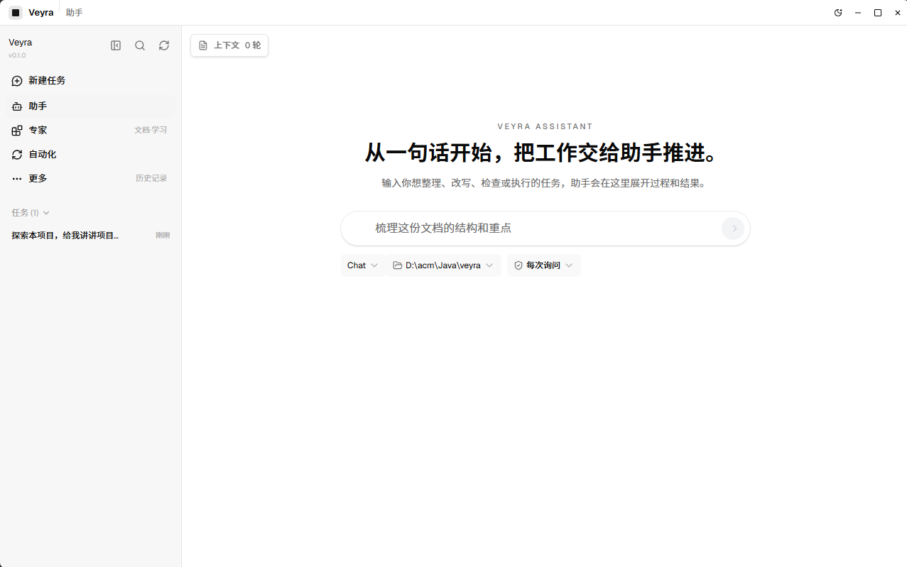
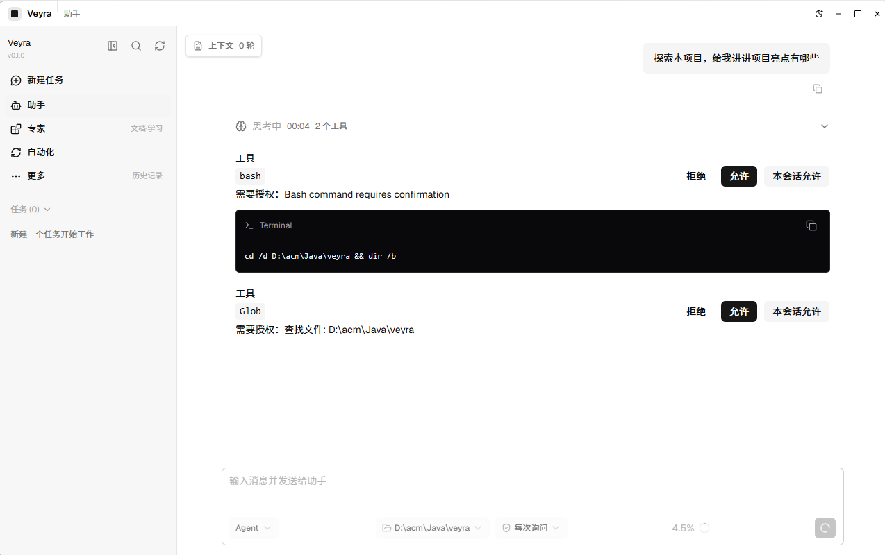
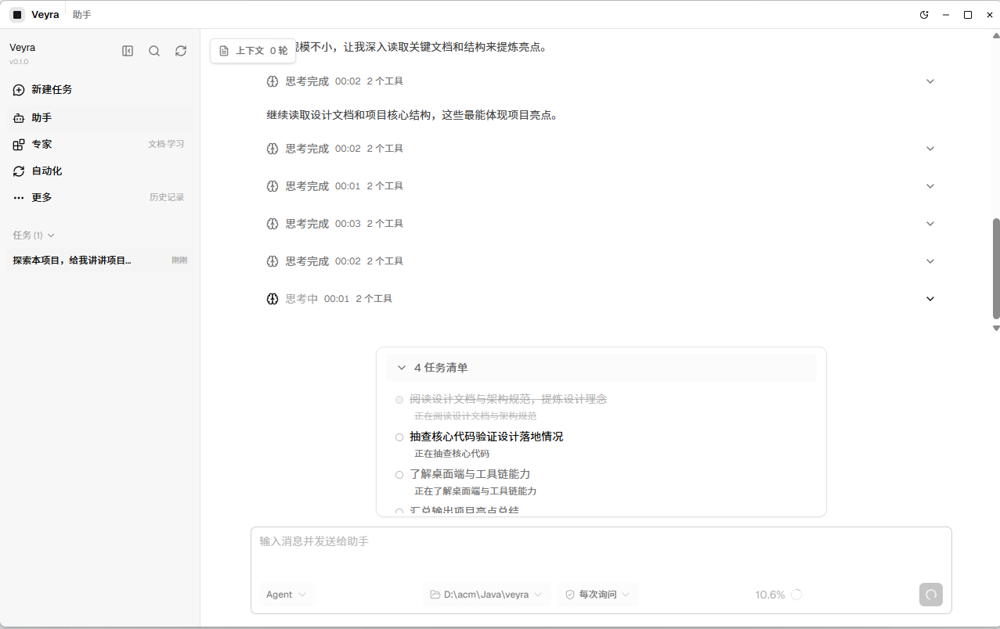
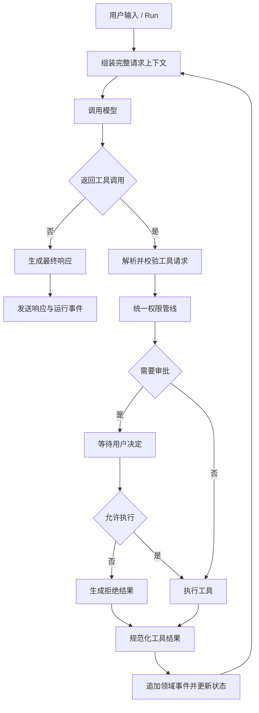
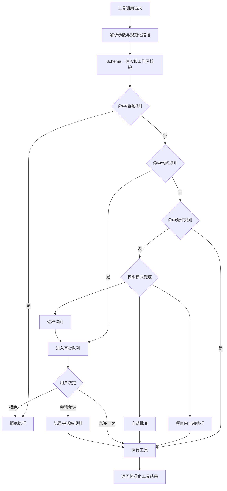
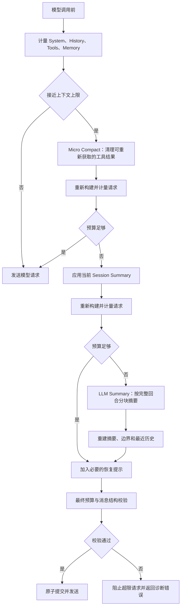
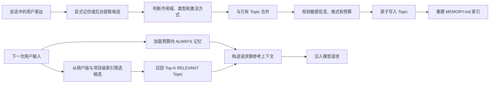
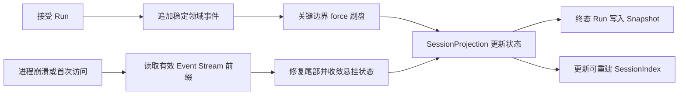
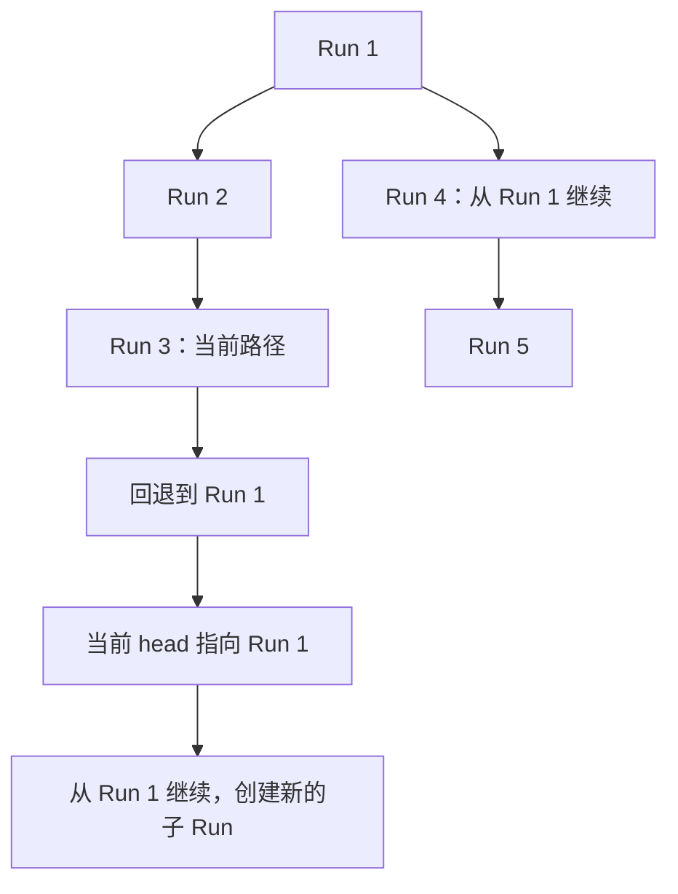

# My Claude Code

> 一个面向本地工作区的可恢复 Agent Harness：让大模型能够安全地使用工具、持续执行任务，并在进程中断后恢复可解释的会话状态。

My Claude Code 参考 Claude Code 等 Agent 产品的 Harness 设计，使用 Java 实现模型调用、工具编排、权限审批、上下文管理、会话持久化和恢复机制，并提供 React + Tauri 桌面客户端。

它不是某个垂直领域的业务应用，而是一套可以被桌面端、CLI 或其他客户端复用的本地 Agent 运行时。项目重点放在运行时边界、状态一致性和故障恢复，而不只是完成一次模型请求。

## 项目亮点

| 方向 | 能力 |
| --- | --- |
| Agent Runtime | 支持模型调用、工具调用、结果回填、继续决策和停止控制 |
| 工具安全 | 统一完成参数校验、路径约束、权限判断和用户审批 |
| 上下文工程 | 支持 Micro Compact、Session Summary 和 LLM Summary 三级压缩 |
| 会话恢复 | 使用 append-only JSONL Event Stream、Run Snapshot 和可重建 SessionIndex |
| 时间旅行 | 通过检查点回退和 `parentRunId` 创建自然分支 |
| 长期记忆 | 支持用户级/项目级 Memory Topic、索引和相关记忆召回 |
| 服务协议 | REST 提交任务，SSE 推送模型、工具、审批和运行状态 |
| 客户端 | React 19、TypeScript、Vite、Tauri 2 桌面端 |

## 技术栈

| 层次 | 技术 |
| --- | --- |
| 运行时 | Java 17、Spring Boot 3.5 |
| 模型接入 | LangChain4j 1.2、OpenAI-compatible Chat API |
| 后端协议 | REST、Server-Sent Events（SSE） |
| 持久化 | 本地 JSONL Event Stream、JSON Snapshot、JSON Index |
| 长期记忆 | Markdown Topic、`MEMORY.md` 派生索引 |
| 桌面客户端 | React 19、TypeScript、Vite、Tauri 2 |
| 测试与约束 | JUnit 5、ArchUnit、Node Test Runner |

## 功能概览

- **Agent / Chat 双模式**：Chat 模式用于普通对话，Agent 模式允许模型调用工作区工具完成任务。
- **本地工作区工具**：文件读取、写入与编辑、Glob、Grep、Bash、Todo、子 Agent 和后台任务。
- **可控的权限模型**：支持逐次询问、项目内自动执行和自动批准，并支持单次或会话级授权。
- **事件驱动的运行时**：Run 通过 `202 Accepted` 进入会话队列，过程通过 SSE 实时反馈。
- **崩溃安全的会话**：稳定事实先写入 Journal，再更新内存状态和发布稳定事件。
- **检查点与分支**：可以回退到稳定 Run，也可以从任意检查点继续并创建新的子 Run。
- **长期记忆**：按用户和项目隔离记忆，支持显式记住、后台提取、Topic 合并和相关召回。
- **长上下文续航**：在请求接近预算上限时自动清理旧工具结果、复用摘要或生成新摘要。
- **客户端无关**：桌面端只是一个客户端，其他 HTTP/SSE 客户端也可以接入后端。

## 界面预览

<p align="center">
  
  
</p>

<p align="center">
  
</p>

## 快速开始

### 环境要求

- JDK 17+
- Maven 3.9+
- 支持工具调用的 OpenAI-compatible 模型服务
- 构建桌面端还需要 Node.js 20+、Rust stable 和 Tauri 2 系统依赖

### 获取项目

```powershell
git clone https://github.com/codingayice/my-claude-code.git
cd my-claude-code
```

### 配置模型

默认配置位于 [`src/main/resources/config.yaml`](src/main/resources/config.yaml)，默认使用 DeepSeek 的 OpenAI-compatible API。启动前设置 API Key：

```powershell
$env:DEEPSEEK_API_KEY = "your-api-key"
```

如需使用其他兼容服务，可以复制一份本地配置并覆盖模型配置：

```yaml
model:
  name: your-model-name
  baseUrl: https://your-provider.example/v1
  apiKey: ${YOUR_API_KEY}
  temperature: 0.7
  maxTokens: 8192
  timeoutSeconds: 120
```

### 构建并启动后端

```powershell
mvn test
mvn package
java -Dfile.encoding=UTF-8 -jar target/veyra-1.0-SNAPSHOT.jar --port 17361
```

使用外部配置文件：

```powershell
java -Dfile.encoding=UTF-8 -jar target/veyra-1.0-SNAPSHOT.jar `
  --config config.local.yaml `
  --port 17361
```

检查服务状态：

```powershell
curl.exe http://127.0.0.1:17361/v1/health
```

### 启动桌面端

桌面端开发启动器会使用 `target/classes` 和 `target/classpath.txt` 启动本地 Agent 服务：

```powershell
mvn compile
mvn dependency:build-classpath "-Dmdep.outputFile=target/classpath.txt"

cd veyra-desktop
npm ci
npm test
npm run typecheck
npm run tauri dev
```

## 使用示例

### 1. 创建会话并订阅事件

```powershell
curl.exe -X POST http://127.0.0.1:17361/v1/sessions
curl.exe -N http://127.0.0.1:17361/v1/sessions/<sessionId>/events
```

SSE 连接建立后会收到 `session.ready` 和完整的 `session.view`，随后接收当前运行产生的模型、工具、审批和状态事件。

### 2. 提交 Chat 或 Agent Run

```powershell
curl.exe -X POST http://127.0.0.1:17361/v1/sessions/<sessionId>/runs `
  -H "Content-Type: application/json" `
  -d '{"input":"分析当前项目并给出改进建议","mode":"agent"}'
```

`mode` 支持：

| 模式 | 行为 |
| --- | --- |
| `chat` | 只进行模型对话，不执行工作区工具 |
| `agent` | 允许模型根据权限策略调用工具完成任务 |

Run 创建成功后立即返回 `202 Accepted`，最终结果和过程事件通过 SSE 发送。

### 3. 查询检查点并从历史继续

```powershell
curl.exe http://127.0.0.1:17361/v1/sessions/<sessionId>/checkpoints

curl.exe -X POST http://127.0.0.1:17361/v1/sessions/<sessionId>/runs `
  -H "Content-Type: application/json" `
  -d '{"input":"换一种方案实现","mode":"agent","parentRunId":"run-1"}'
```

`parentRunId` 指定后，新的 Run 会从选中的历史检查点继续。若要直接回退当前路径，则调用：

```powershell
curl.exe -X POST http://127.0.0.1:17361/v1/sessions/<sessionId>/checkpoint-restorations `
  -H "Content-Type: application/json" `
  -d '{"runId":"run-1","expectedRevision":7}'
```

## 核心设计与技术亮点

这一节是 My Claude Code 的核心：项目不把 Agent 看成一次“请求模型并返回文本”的函数，而是把它设计成一个拥有明确状态、事件边界、恢复语义和权限边界的本地运行时。

### 1. Agent Loop：把模型调用组织成可观察状态机

Agent Loop 负责把用户输入、上下文组装、模型调用、工具执行和结果回填组织为一个可停止、可恢复、可观察的循环。



关键不变量：

- 每次模型请求都基于当前完整工作历史，而不是孤立的最后一条消息。
- Tool Use 和 Tool Result 必须一一配对，并按照稳定顺序回填。
- 同一 Session 的 Run 串行执行，不同 Session 可以并行。
- 工具本身不能绕过统一的权限和审批管线。
- partial token 属于临时体验事件，稳定状态必须先落盘再对外发布。

### 2. 权限模型：把“模型想做什么”和“系统允许做什么”分开

所有工具调用都经过解析、输入校验、工作区边界校验、拒绝规则、询问规则和允许规则。权限决策不散落在具体工具内部，因此新增工具不会改变系统的安全边界。



权限模式：

| 模式 | 默认行为 |
| --- | --- |
| `ask_every_time` | 未命中允许规则时请求审批，适合首次运行 |
| `project_auto` | 工作区允许目录内自动执行，越界操作仍需审批 |
| `auto_approve` | 自动批准工具调用，仅适合受控环境 |

### 3. 上下文压缩：在预算内保持可恢复的模型历史

上下文压缩不是简单删除旧消息，而是每次策略变化后重新构建并计量完整请求，确保工具调用结构、用户约束和恢复边界不被破坏。



三级策略由低成本到高成本依次为：

1. **Micro Compact**：不调用模型，只处理可以从工作区重新读取的旧工具结果。
2. **Session Summary**：复用当前会话已经生成的摘要快照。
3. **LLM Summary**：按完整回合生成新的摘要和覆盖边界。

### 4. 长期记忆：把跨会话事实与当前任务状态分离

长期记忆只保存用户偏好、协作反馈和稳定项目背景。临时调试过程、当前任务状态和 Session Summary 不写入长期记忆。



设计要点：

- 用户级和项目级是两个隔离的 Memory Namespace。
- Topic 文件是事实来源，`MEMORY.md` 是可重建的派生索引。
- `ALWAYS` 只用于少量稳定偏好，其他内容默认按当前输入以 `RELEVANT` 方式召回。
- 记忆以低优先级参考消息注入请求，不覆盖系统规则和用户当前指令。

### 5. 持久化与崩溃恢复：事件是事实，投影可以重建

My Claude Code 使用单一、append-only 的 JSONL Event Stream 保存 Session 稳定事实。`SessionState`、Run 树、稳定历史和桌面端 `SessionView` 都由事件投影得到。

终态 Run 会额外生成结构化 `RunSnapshot` 加速恢复，`SessionIndex` 用于加速 Run 树查询。Snapshot 和 Index 都是派生数据，删除、损坏或版本不匹配后可以从 Event Stream 重建。



默认持久化布局：

```text
~/.veyra/
├── sessions/
│   └── projects/<workspace-key>/
│       └── <session-id>/
│           ├── events.jsonl
│           ├── session-index.json
│           └── snapshots/<run-id>.snapshot.json
├── memory/                         # 用户级与项目级长期记忆
├── logs/                           # 桌面端日志
└── preferences.json                # UI 偏好
```

持久化边界：

- Run、完整模型消息、工具开始/结果、Task 状态、设置和 Run 终态在关键边界先落盘并刷盘，再更新运行时和发布稳定事件。
- 首次访问 Session 时惰性恢复，不恢复旧进程的线程、Future、SSE 连接或内存队列。
- JSONL 尾部半行会被截断到最后一个完整记录；中间行损坏不会被静默跳过。
- 工具已经开始但没有结果时恢复为 `UNKNOWN`，系统不会自动重试可能产生副作用的工具。
- 悬挂的模型调用、审批、Task 和 Run 会追加可解释的中断终态，用户可以在新的 Run 中检查现场后继续。

这套设计的关键取舍是：恢复“已经确认发生的事实”，而不是假装恢复旧进程的执行现场。

### 6. 检查点回退与分支：用 Run 树实现时间旅行

每个满足稳定条件的终态 Run 都可以成为用户检查点。Run 通过不可变的 `parentRunId` 组成树，`headRunId` 表示当前有效路径。



两种操作的语义不同：

- **回退到此处**：追加 `checkpoint.restored`，加载目标 Run Snapshot 并原子替换当前运行状态；Snapshot 不可用时沿父链查找有效 Snapshot，必要时完整重放事件。
- **从此处继续**：带着选中的 `parentRunId` 创建新的 Run。原来的路径仍然保留，多个子 Run 自然形成分支，新的 Run 终态后成为当前 head。
- 系统不创建独立的 Branch 实体，不复制事件，也不删除回退前的历史。
- 只有稳定终态、没有未决审批/未闭合 Tool 或 Task、且不存在 `UNKNOWN` 工具结果的 Run 才能作为可操作检查点。
- 回退只改变 Agent 的消息、上下文、Todo、Task 和工具投影；已经发生的文件修改、命令执行和网络请求等外部副作用不会撤销。

### 7. REST + SSE：冷加载与实时事件分离

后端把稳定状态和临时体验事件分开：

- 冷加载时先恢复 Session，再返回完整 `SessionView`。
- SSE 只负责当前进程的增量事件、token 流和状态变化。
- 前端不读取或重放持久化 UI 事件，避免历史游标与实时连接之间出现空窗。
- 重连后以完整视图校正客户端状态，临时 token 丢失不会破坏稳定会话。

## 权限与运行模式配置

默认配置：

```yaml
permission:
  mode: ask_every_time

context:
  maxContextTokens: 128000
  autoCompactEnabled: true

storage:
  root: ~/.veyra
```

权限模式说明：

| 模式 | 适用场景 | 行为 |
| --- | --- | --- |
| `ask_every_time` | 首次运行、调试和高风险环境 | 未命中允许规则时请求用户审批 |
| `project_auto` | 受控项目工作区 | 工作区允许目录内自动执行，越界操作仍需审批 |
| `auto_approve` | 完全受控环境 | 自动批准工具调用，风险最高 |

## 项目结构

```text
.
├── src/main/java/cn/ayice
│   ├── Main.java                 # CLI 入口
│   └── veyra
│       ├── boot                 # 运行时对象装配与生命周期
│       ├── control              # HTTP API、DTO、SSE 和错误边界
│       ├── runtime              # Run 编排与 Session Runtime
│       ├── context              # Prompt、项目指令和请求上下文
│       ├── compaction           # 上下文预算、压缩与摘要快照
│       ├── memory               # 长期记忆、索引、召回和自动提取
│       ├── tool                 # 工具目录、执行和权限模型
│       ├── session              # Event Stream、SessionState 和恢复
│       ├── subagent             # 子 Agent 与后台任务
│       └── llm                  # LangChain4j 模型调用
├── src/test/java                 # 单元、集成、恢复和架构约束测试
├── veyra-desktop                 # React + Tauri 桌面客户端
└── docs                          # 架构规范与设计文档
```

模块依赖方向由 ArchUnit 约束：Controller 只处理协议边界，Runtime 负责编排，Session 负责状态与事件，Tool 负责工具能力，持久化与恢复不依赖 HTTP 层。

## 测试与工程质量

后端完整测试：

```powershell
mvn test
```

桌面端测试与类型检查：

```powershell
cd veyra-desktop
npm test
npm run typecheck
```

测试覆盖的重点包括：

- Agent / Chat 循环和工具调用协议；
- 同一 Session 串行执行与跨 Session 并发；
- 权限规则、审批挂起和恢复；
- 上下文压缩和摘要提交边界；
- JSONL 追加、尾部修复、崩溃恢复和重放等价；
- Snapshot、SessionIndex、检查点回退和分支路径；
- ArchUnit 包依赖方向和模块职责约束；
- 桌面端 API 客户端、SessionView 和检查点交互。

## 设计文档

- [架构与开发规范](docs/veyra-architecture-development-guidelines.md)：模块边界、依赖方向、并发和测试约束。
- [事件流、Snapshot 与分支设计](docs/design/veyra-event-sourced-session-runtime-design.md)：Session Event Stream、Run 树、检查点回退和从检查点继续。
- [中断运行恢复设计](docs/design/veyra-interrupted-run-recovery-design.md)：JSONL Journal、悬挂状态收敛和故障边界。
- [上下文压缩设计](docs/design/veyra-context-compaction-enhancement-design.md)：预算、Micro Compact、摘要和恢复提示。
- [长期记忆设计](docs/design/veyra-memory-system-design.md)：Topic、索引、命名空间和召回。
- [LangChain4j 架构设计](docs/design/veyra-langchain4j-architecture-design.md)：模型接入和请求边界。

## 开发与贡献

欢迎通过 Issue、Pull Request 和设计讨论参与 My Claude Code 的改进。修改代码前建议：

1. 阅读架构规范和相关设计文档。
2. 保持模块依赖方向和事件边界不被绕过。
3. 为状态、恢复、并发或权限相关修改补充测试。
4. 至少运行受影响的后端测试；涉及桌面端时同时运行 `npm test` 和 `npm run typecheck`。

项目当前处于持续开发阶段。内部 API、事件 Schema、持久化格式和文件布局可能随设计演进发生变化，不提供废弃格式的兼容读取或迁移层。

### 提交 Issue

- 使用清晰、具体的标题描述问题或建议。
- 提供复现步骤、预期行为和实际行为。
- 涉及 UI 或交互问题时，附上截图或录屏。

### 提交 Pull Request

- 一个 Pull Request 聚焦一个问题或一组相关改动。
- 为新增行为补充单元测试、集成测试或桌面端测试。
- 在描述中说明设计动机、实现方式和验证结果。
- 提交前运行受影响的测试，并在描述中列出结果。

## 许可证

许可证信息以仓库根目录的 `LICENSE` 文件为准。

## 致谢

本项目参考了 [Claude Code](https://docs.anthropic.com/en/docs/claude-code/overview)、[learn-claude-code](https://github.com/shareAI-lab/learn-claude-code)、[Pi](https://github.com/badlogic/pi-mono)、[Mem0](https://github.com/mem0ai/mem0) 和 [LangGraph](https://github.com/langchain-ai/langgraph) 等项目的设计理念，并使用 [Spring Boot](https://spring.io/projects/spring-boot)、[LangChain4j](https://github.com/langchain4j/langchain4j) 与 [Tauri](https://tauri.app/) 构建。

My Claude Code 是独立实现，与 Anthropic 不存在隶属、授权或背书关系。
