# Veyra 上下文压缩机制增强设计

## 1. 文档状态

- 日期：2026-07-30
- 状态：第一版已实施并完成回归验证
- 范围：`cn.ayice.veyra.conversation.context.compaction`、`ContextBuilder`、`AgentTurnPreparer`、`AgentLoop`、`SubagentRuntime` 及相关配置、事件和测试
- 技术约束：继续使用 Java、Spring Boot、LangChain4j、本地文件和现有 Controller/Service MVC 模式
- 架构约束：不引入 DDD 套路化分层，不引入用于切换固定技术栈的 Adapter、Repository 或 Gateway 层，不修改 Agent 核心业务决策、并行工具批次和终止条件

## 2. 设计结论

Veyra 的上下文压缩采用严格的三级策略：

```text
Micro Compact
    ↓ 仍超过自动压缩阈值
Session Summary Compact
    ↓ 摘要快照不存在或压缩后仍超过阈值
LLM Summary Compact
```

三级策略之外，系统必须同时具备完整请求输入 token 预算、稳定压缩边界、会话级摘要快照、压缩后修改文件路径提示、响应式重试、失败阻塞、并发控制、运行期原子提交和结构化事件，形成闭环。

本设计中的 `Session Summary` 是当前会话的滚动摘要快照，不是执行断点，也不是跨会话长期记忆。长期记忆仍由 `conversation.memory` 管理，只保存用户偏好、协作反馈和长期项目背景。

术语修订：早期版本曾将该摘要称为 Compaction Checkpoint。当前代码和设计统一使用 `SessionSummarySnapshot`；`ExecutionCheckpoint` 保留给未来真正能够恢复执行位置的机制。

## 3. 设计原则

1. transcript 保存当前格式能够记录的追加式审计事实，压缩不得删除 transcript 中的记录；完整工具调用链和重启恢复不属于本阶段。
2. `AgentLoop` 是 `process` 之间 Working History 的唯一持有者。每次 `process` 开始时把当前上下文交给 `LoopState`；交接完成后，`LoopState` 在该次 `process` 内成为唯一可变上下文来源。`process` 结束时只把最终上下文交回 `AgentLoop`，不得同时保留两份可变 history。
3. Session Summary 只服务当前会话续航，不得写入长期记忆。
4. Long-term Memory 只负责跨会话信息，不得承担当前任务恢复。
5. 压缩只能发生在稳定同步点，不能在并行工具批次执行过程中修改历史。
6. 所有压缩都必须保持工具请求与工具结果配对。
7. 自动压缩必须从低成本、低损失策略逐级升级。
8. 压缩结果必须重新构造完整模型请求后再校验 token，不能只估算 history。
9. 摘要失败不能静默删除用户历史；无法安全压缩时必须阻塞模型调用并返回可诊断错误。
10. 压缩摘要属于参考上下文，不具有系统指令优先级。
11. 同一会话的摘要生成和检查点提交必须 single-flight、单调推进，并通过运行期内存状态原子提交。
12. 主 Agent、子 Agent 和普通 Chat 是不同执行策略，共享稳定的预算和压缩组件，但不强行合并循环。
13. 新增异常分支、状态、配置或抽象前，必须有当前代码证据、稳定复现步骤或明确外部契约；不为仅理论存在、实际几乎不可复现的问题增加机制。
14. 优先扩展现有类、方法和 LangChain4j 类型。只有在逻辑被多处复用，或者对象具有独立生命周期、并发边界、状态转换或必须统一维护的不变量时，才新增类型或组件。
15. 不为简单表达式创建同义变量，不为单次调用的一段直线逻辑新增公共抽象。一次使用但包含多个分支、资源边界或独立测试价值的复杂逻辑可以保留为私有方法。
16. 新类型必须能用一句话说明其独立职责；如果删除该类型后只是把少量字段或直线代码放回唯一调用者，则默认不引入。

## 4. 现状问题与设计依据

| 症状 | 来源 | 后果 | 设计修复 |
| --- | --- | --- | --- |
| 压缩阈值只基于消息历史估算 | `CompactService.estimateTokens` 只处理 `history` | 系统提示词、工具 Schema、工具参数和动态记忆可能使实际请求先于估算超限 | 由 `ContextBudgetService` 统一计量最终 `ChatRequest` |
| 会话摘要按项目共用一个目录 | `SessionMemoryStore` 构造参数没有 `sessionId` | 同项目不同会话可能读取或覆盖同一摘要 | 删除旧文件读写，改为每个 Session Runtime 独占的 checkpoint 状态 |
| 摘要正文和 marker 分开写入 | `summary.md` 与 `summary.marker` 独立覆盖 | 正文和覆盖位置可能不一致 | 在提交锁内发布单个不可变 `CompactionCheckpoint` 对象 |
| 后台摘要没有 single-flight | `fireMemoryExtraction` 直接提交异步任务 | 慢任务可能晚于新任务完成并覆盖较新摘要 | 每会话单飞、保留最新待处理稳定快照、版本比较后提交 |
| 摘要可能在工具结果尚未返回时触发 | 当前在收到 `AiMessage` 后立即尝试提取 | 摘要只知道工具请求，不知道工具结果 | 只在最终回复后或整个工具批次汇合后提取 |
| `maxTotalTokens` 配置未真正限制摘要 | `SessionMemoryConfig.maxTotalTokens` 没有进入生成和校验 | Session Summary 自身可能持续膨胀 | 摘要输入、输出和已提交 checkpoint 都执行硬预算 |
| LLM 摘要超限时裁掉旧回合重试 | `summarizeWithRetry` 通过删除最旧轮次缩短输入 | 最早且可能最关键的用户约束被永久丢失 | 改为按完整回合分块摘要再合并 |
| 连续摘要失败后直接保留 recent | `CompactService.compact` 的降级分支 | 旧历史可能无明确错误地从工作上下文消失 | 使用最后有效检查点；仍不可用则阻塞，不静默丢失 |
| 文件恢复同时维护正文、mtime 和 Read 视图 | `PostCompactRestorer` 与 `FileStateCache` 需要同步多份文件状态 | Edit / Write 后旧 Read 正文容易被误判为有效，恢复流程难以验证 | 删除独立恢复器；保留 FileStateCache 的工具安全职责，恢复阶段只读取最近修改路径，不读取或注入缓存正文 |
| 摘要提示词要求输出分析过程 | `CompactPrompts` 使用 `<analysis>` | 增加无效 token，也不应依赖模型暴露内部推理 | 只要求结构化最终摘要，不请求思考过程 |
| `MANUAL` 只有枚举和服务分支 | Slash Command 尚未注册 `/compact` | 用户无法实际主动压缩 | 增加明确的 `/compact` 应用入口 |

这些问题的共同根因是压缩决策、摘要生成、运行期状态、恢复和预算计算集中在少数有状态类中，职责边界不够清晰。增强设计通过同包内具体组件拆分职责，不增加无业务价值的抽象层。

## 5. 目标与非目标

### 5.1 目标

1. 长时间、多工具、多轮 Agent 任务在上下文窗口内稳定运行。
2. 自动压缩遵循 `Micro → Session Summary → LLM Summary` 的固定顺序。
3. 用户目标、约束、技术决策、当前状态和未完成事项能够跨压缩继续生效。
4. 并行工具批次必须整体完成后才能进入下一轮或生成摘要。
5. Session Summary 可以提前后台生成，真正压缩时无需等待额外模型调用。
6. 所有检查点按 Session Runtime 隔离并在内存中原子提交；Session 关闭后释放，不进行独立持久化。
7. 压缩、恢复参考消息和最终请求共享同一个 token 计算口径。
8. 压缩失败、旧 candidate 被跳过、恢复消息省略和模型调用被阻止都能通过事件和日志定位。
9. 新成员能够从类名和依赖规则判断新逻辑应该放置的位置。

### 5.2 非目标

- 不修改 Agent 如何决定是否调用工具。
- 不修改工具并行执行、权限确认和结果汇合语义。
- 不重构 Controller、SSE 协议和前端消息协议。
- 不实现 checkpoint 独立持久化或重启复用；后续由会话持久化设计把 transcript 与 checkpoint 纳入同一恢复协议。
- 不把 Session Summary 写入长期记忆 topic 或 `MEMORY.md`。
- 不引入数据库、消息队列、向量数据库或新的模型框架。
- 不允许摘要模型执行任何工具。
- 不保证摘要能够替代完整 transcript 进行审计或逐字恢复。

## 6. 核心术语

| 术语 | 含义 |
| --- | --- |
| Transcript | 完整追加式会话记录，是审计事实来源；当前持久化格式还不足以恢复完整工具调用链 |
| Working History | `AgentLoop` 当前持有的 `List<WorkingMessage>`；原始消息带进程内 sequence，合成消息不带 sequence |
| Request Context | 实际发送给模型的系统提示词、动态记忆、历史、工具 Schema 等完整输入 |
| Stable Point | 没有正在执行的工具批次，消息历史中的工具请求和结果已经完整汇合的位置 |
| coveredSequence | 摘要实际覆盖的最后一条原始消息序号；后续只允许用摘要替换 `sequence <= coveredSequence` 的历史 |
| Micro Compact | 不调用模型，只处理可重新获取的旧工具结果 |
| Session Summary | 当前会话后台维护的固定结构 Markdown 摘要 |
| Compaction Checkpoint | Session Summary 与其覆盖边界和运行期版本组成的不可变快照 |
| Session Summary Compact | 用有效检查点替代其已覆盖历史的第二级压缩 |
| LLM Summary Compact | 在压缩当下调用模型，对旧历史分块总结并替换的第三级压缩 |
| Full Boundary | 表示边界之前历史已被摘要替代的逻辑边界；复用现有 `CompactBoundary`，在 Working History 中编码为固定 `[]` 格式的内部 System 消息 |
| Micro Boundary | 记录工具结果清理行为的审计边界，不截断全部历史 |
| Long-term Memory | 跨会话用户偏好和长期背景，与 Session Summary 无关 |

## 7. 数据所有权

| 数据 | 所有者 | 生命周期 | 是否允许被压缩 | 是否持久化 |
| --- | --- | --- | --- | --- |
| Transcript | `conversation.transcript` | 会话生命周期及审计 | 否 | 是，现有格式仍不完整 |
| Working History | `AgentLoop`（process 之间）→ `LoopState`（process 内临时接管） | 活跃 Session | 是 | 当前阶段不承诺完整重启恢复 |
| Compaction Checkpoint | `conversation.context.compaction` | 活跃 Session Runtime | 可被新版本覆盖 | 否 |
| Todo/任务状态 | `tooling.state` / Kernel | 当前 Session | 由 Session Summary 保留必要状态 | 由各自组件负责 |
| 文件工具状态 | `tooling.state` | 当前 Session | 现有 `FileStateCache` 继续保存工具安全检查所需内容，并额外记录最近成功修改的规范化路径 | 由运行时维护 |
| Long-term Memory | `conversation.memory` | 跨 Session | 不属于压缩对象 | 是 |

必须遵守：

1. `conversation.context.compaction` 不读取长期记忆 topic。
2. `conversation.memory` 不读取或写入 Compaction Checkpoint。
3. `AgentLoop` 只负责在 `process` 开始和结束时交接 Working History，并持有下一次 `process` 所需的唯一上下文；它不直接读取或修改 checkpoint 状态。
4. `LoopState` 只在一次 `process` 内临时接管 Working History、sequence 和 Stable Point；交接期间其他组件不得保存或修改当前上下文副本。`process` 返回后以回交给 `AgentLoop` 的结果为准。
5. `ContextBuilder` 负责组装完整 Request Context，但不决定采用哪一级压缩。
6. 每个新建 Session Runtime 都创建空的 `SessionCheckpointState`；Session 关闭时清理，当前阶段没有跨进程加载入口。

## 8. 目标模块与依赖

### 8.1 依赖图

```mermaid
graph TD
    subgraph Kernel
        AgentLoop
        AgentTurnPreparer["AgentTurnPreparer (fan-out: 8)"]
        SubagentRuntime
    end

    subgraph Context
        ContextBuilder
        FinalRequestValidator
        ContextBudgetService
    end

    subgraph Compaction
        MicroCompactor
        SessionSummaryCoordinator
        SessionSummaryGenerator
        SessionCheckpointState
        LlmSummaryCompactor
        ConversationChunker
        CompactPrompts
        CompactBoundary
    end

    subgraph Runtime
        AIService
        TranscriptStore
        FileStateCache
        EventSink
    end

    AgentLoop --> AgentTurnPreparer
    AgentLoop --> SessionSummaryCoordinator
    AgentLoop --> TranscriptStore
    AgentLoop --> EventSink
    AgentTurnPreparer --> ContextBuilder
    AgentTurnPreparer --> ContextBudgetService
    AgentTurnPreparer --> FinalRequestValidator
    AgentTurnPreparer --> CompactBoundary
    AgentTurnPreparer --> FileStateCache
    AgentTurnPreparer --> SessionCheckpointState
    AgentTurnPreparer --> MicroCompactor
    AgentTurnPreparer --> LlmSummaryCompactor
    AgentTurnPreparer --> EventSink
    SessionSummaryCoordinator --> SessionSummaryGenerator
    SessionSummaryCoordinator --> SessionCheckpointState
    SessionSummaryCoordinator --> EventSink
    SessionSummaryGenerator --> ConversationChunker
    SessionSummaryGenerator --> CompactPrompts
    SessionSummaryGenerator --> AIService
    LlmSummaryCompactor --> ConversationChunker
    LlmSummaryCompactor --> CompactPrompts
    LlmSummaryCompactor --> MicroCompactor
    LlmSummaryCompactor --> AIService
    SubagentRuntime --> AgentTurnPreparer

    classDef critical fill:#ff6b6b,stroke:#c92a2a,color:#fff
    classDef warning fill:#ffd43b,stroke:#e67700
    classDef clean fill:#51cf66,stroke:#2b8a3e,color:#fff

    class AgentTurnPreparer,ContextBudgetService,SessionSummaryCoordinator warning
    class AgentLoop,SubagentRuntime,ContextBuilder,FinalRequestValidator,MicroCompactor,SessionSummaryGenerator,SessionCheckpointState,LlmSummaryCompactor,ConversationChunker,CompactPrompts,CompactBoundary,AIService,TranscriptStore,FileStateCache,EventSink clean
```



黄色节点属于高扇出或状态一致性关键点，需要重点测试，但不表示引入新的架构层。依赖方向保持为 `Kernel → Conversation/Tooling/LLM`，Conversation 不反向依赖 Kernel；Kernel 和 Conversation 只共同依赖中性的现有事件接口。

### 8.2 目标包结构

```text
cn.ayice.veyra
|-- kernel
|   |-- agent
|   |   |-- AgentLoop.java
|   |   |-- AgentTurnPreparer.java
|   |   `-- LoopState.java
|   `-- subagent
|       `-- SubagentRuntime.java
|-- event
|   `-- AgentEventSink.java
|-- conversation
|   `-- context
|       |-- ContextBuilder.java
|       |-- ContextBudgetService.java
|       |-- WorkingMessage.java
|       |-- FinalRequestValidator.java
|       `-- compaction
|           |-- CompactionResult.java
|           |-- CompactTrigger.java
|           |-- CompactStrategy.java
|           |-- CompactBoundary.java
|           |-- MicroCompactor.java
|           |-- SessionSummaryCoordinator.java
|           |-- SessionSummaryGenerator.java
|           |-- CheckpointCandidate.java
|           |-- CompactionCheckpoint.java
|           |-- SessionCheckpointState.java
|           |-- ConversationChunker.java
|           |-- LlmSummaryCompactor.java
|           |-- CompactPrompts.java
|           `-- CompactionConfig.java
`-- tooling
    `-- state
        `-- FileStateCache.java
```

目标结构优先复用现有 `ChatRequest`、`CompactBoundary`、`CompactPrompts`、`FileStateCache`、`AIService`、`AgentEventSink` 和 `CompactTrigger`。明确不创建 `RequestDraft`、`ContextBudgetSnapshot`、`CompactionDecision`、`CompactionCoordinator`、`FullCompactBoundary`、`PostCompactRestorer` 或 `ModifiedFileSnapshot`。保留的新类型必须承担重要语义：`WorkingMessage` 保存稳定序号，`CompactStrategy` 统一结果、事件和指标中的三级策略语义，`CompactionResult` 表达一次 pass 的完整结果，candidate/checkpoint 区分提交前后状态，`SessionCheckpointState` 维护并发提交不变量，`ConversationChunker` 被两种摘要流程复用，`FinalRequestValidator` 集中验证发送边界。

不创建 `adapter`、`port`、`repository`、`gateway` 或通用 `manager` 包。checkpoint 由 Session Runtime 持有明确命名的 `SessionCheckpointState`，模型调用继续注入现有 `AIService`。

## 9. 组件职责

### 9.1 AgentLoop

只负责 Agent 回合状态机：持有跨 `process` 的 Working History，在进入 `process` 时将其交给 `LoopState`，接收输入、通过 `LoopState` 为原始消息分配 sequence、汇合通知、调用 Turn Preparer、调用模型、并行执行工具批次、写 transcript，并在结束时接回最终 Working History。

它只能：

- 在稳定同步点向 `SessionSummaryCoordinator` 提交不可变快照。
- 使用 `AgentTurnPreparer` 返回的最终消息和预算状态。
- 根据阻塞结果终止本轮。

它不得：

- 计算压缩阈值。
- 生成摘要提示词。
- 直接读取或修改 checkpoint 状态。
- 自行裁剪消息。

### 9.2 AgentTurnPreparer

负责一次模型调用前的公共管线，并且是前台压缩和压缩后恢复的唯一编排者。不同触发方式只在压缩策略入口不同，最终请求构建、恢复、预算计算、结构验证和 candidate 提交共用同一套收尾流程：

```text
prepare(AUTO)
  → build initial request
  → Micro Compact
  → rebuild and measure
  → apply current Session Summary checkpoint when needed
  → rebuild and measure
  → run LLM Summary Compact when needed

prepare(MANUAL)
  → directly run LLM Summary Compact

prepare(REACTIVE)
  → directly run LLM Summary Compact with stricter target budget

all modes
  → add modified-file reference if it fits
  → build final request
  → retry one stricter LLM summary if final request is still too large
  → validate final budget
  → validate final request structure once
```

它不实现具体压缩算法，直接调用现有 `CompactBoundary`、`ContextBuilder`、`ContextBudgetService`、`MicroCompactor`、可选的 `SessionCheckpointState`、`LlmSummaryCompactor` 和 `FinalRequestValidator`。AUTO 的三级策略只有这一个调用者，因此不再增加 `CompactionCoordinator` 转发同一套顺序；MANUAL 和 REACTIVE 不执行 AUTO 的 Micro/Session Summary 分支。每次构建请求前复用 `CompactBoundary.afterLastBoundary(...)` 切出可见 Working History 并排除边界标记，再交给 `ContextBuilder`。完整压缩后，它直接从当前运行时文件工具实际使用的 `FileStateCache` 取得最近成功修改的路径，使用固定模板和 `joining` 生成一条参考消息，不为这段单次直线逻辑增加恢复器类或快照类型。第一次 LLM Summary 后最终请求仍超限时固定只允许一次更短重生成。只有某个前台 LLM Summary 结果同时通过最终预算和只读结构验证，并且当前 Preparer 持有 `SessionCheckpointState` 时，它才把该结果携带的 `CheckpointCandidate` 交给 State 提交。

现有 `PreparedTurn` 保留压缩后的不可变 `List<WorkingMessage>`，并增加最终 `ChatRequest`、本次请求已经计算出的 `inputTokens` 和 `CapacityState`。这些值必须作为一次成功准备的整体跨越 `AgentTurnPreparer → AgentLoop` 边界，因此放入已有返回类型，不再增加平行结果或预算快照。只有最终状态为 `NORMAL` 或 `WARNING` 且结构验证通过时才返回 `PreparedTurn`；仍为 `COMPACT_REQUIRED` 或结构非法时走明确失败结果。

`LoopState` 收到成功的 `PreparedTurn` 后，必须先用其中的 Working History 替换当前 process 内的上下文，再基于替换后的历史创建稳定快照、调用 `onPreparedCapacity(...)` 并发送该 `ChatRequest`。准备失败时不应用失败的压缩结果，`LoopState` 继续保留本次 process 已经形成的当前上下文。无论 process 正常结束还是返回错误，最终都把 `LoopState` 的当前上下文回交给 `AgentLoop`，保证本轮已经接收的用户消息和已经完成的工具结果不会丢失。`ChatRequest` 内容变化后必须重新准备，不能复用旧 `PreparedTurn` 中的请求或容量结果。

`AgentTurnPreparer` 使用 `Optional<SessionCheckpointState>` 明确 checkpoint 能力是否存在，不使用 `null` 或 No-op State。主 Agent 传入当前 Session Runtime 独占的 State；短生命周期子 Agent 在 `sessionSummary.enabled=false` 时传入 `Optional.empty()`，因此第二级直接跳过，成功的 LLM Summary 仍用于当前 Working History，但不读取或提交任何 checkpoint。

### 9.3 ContextBudgetService

负责复用现有 `TokenEstimator` 统一计算完整 Request Context 的 `inputTokens`，并根据启动时已经校验的固定阈值把该值分类为 `CapacityState`。`AgentTurnPreparer` 每次构建 `ChatRequest` 后只计量一次，把 `inputTokens` 和分类结果保存为当前准备流程的局部变量，供压缩判断、日志和事件使用；不为这两个立即使用的值增加快照类型。容量状态只比较 `inputTokens`；输出预留只用于推导 `effectiveWindow`。

`WorkingMessage` 只是 Working History 的不可变数据载体，不包含压缩算法。Kernel、ContextBuilder 和压缩组件共享该具体类型，避免通过列表下标、对象引用或消息正文推断原始消息位置。

### 9.4 CompactionResult

`CompactionResult` 只表示一次压缩 pass 成功产生的历史，不承载预算计量、事件字段或失败状态：

```java
public record CompactionResult(
        List<WorkingMessage> messages,
        CompactStrategy strategy,
        Optional<CheckpointCandidate> checkpointCandidate
) {}
```

`messages` 是供下一次 Request Context 构建使用的不可变列表；`strategy` 是实际生效的 `NONE`、`MICRO`、`SESSION_SUMMARY` 或 `LLM_SUMMARY`。只有 `LLM_SUMMARY` 可以携带尚未提交的 candidate，其他策略必须使用 `Optional.empty()`。压缩前后 token、耗时和事件字段由 `AgentTurnPreparer` 使用已有局部变量计算；Session Summary 使用的版本直接读取现有 checkpoint，持有 State 的 LLM Summary 在提交成功后直接读取 `SessionCheckpointState.commit(...)` 返回的版本。失败通过第 23 章的明确错误路径返回，不向该 record 增加错误码或更多可空字段。

### 9.5 MicroCompactor

只处理允许压缩的旧工具结果，返回新消息列表和释放 token 信息。工具结果的 `2,000 / 250 / 250` 字符截断实现由它统一维护，并提供包内方法给 `LlmSummaryCompactor` 的摘要预处理复用，不新增单独的截断器类型。它不得修改输入列表，不得访问 LLM、文件系统、长期记忆或 Kernel 状态。

### 9.6 SessionSummaryCoordinator

只负责后台摘要触发、single-flight、待处理稳定快照合并和异步结果提交。它与 `SessionCheckpointState` 一起由当前 Session Runtime 创建并独占，内部只维护当前会话的一份运行状态，不接收 `sessionId` 参数，也不维护跨会话 Map。后台摘要成功后构造 `CheckpointCandidate` 并交给 State；checkpoint 的读取和覆盖游标比较由 `SessionCheckpointState` 负责，前台第二级压缩由 `AgentTurnPreparer` 直接编排。它使用注入的 Executor 和现有 `AgentEventSink`，不自行创建线程或事件接口。

### 9.7 SessionSummaryGenerator

负责把旧 checkpoint 和新增稳定消息转换为新的结构化 Session Summary。它与 `LlmSummaryCompactor` 共用现有 `CompactPrompts` 和 `ConversationChunker`：摘要输入超过预算时按完整回合分块并合并。它不执行工具，不决定何时提交。

### 9.8 SessionCheckpointState

是当前 Session Runtime 内 checkpoint 的唯一提交和读取边界，负责关闭状态检查、覆盖游标比较、运行期版本分配和不可变对象的原子发布。它不重复保存或校验 `sessionId`，因为 State 已由当前 Session Runtime 独占。它不访问文件系统，也不依赖 Agent、Spring MVC、长期记忆或工具执行；Session 关闭后随运行时一起释放。

### 9.9 ConversationChunker

供 `SessionSummaryGenerator` 和 `LlmSummaryCompactor` 共用，按完整用户回合和完整工具批次切分待摘要历史，使每个摘要请求不超过输入预算。它只负责确定分块边界，不调用模型，也不能从工具调用和结果之间切开。

### 9.10 LlmSummaryCompactor

负责第三级分块摘要、局部摘要合并和摘要结果检查。它复用现有 `CompactPrompts` 构造提示词，不决定三级升级顺序，不直接修改 AgentLoop history，而是返回 `CompactionResult`。

### 9.11 CompactPrompts

复用现有类，集中保存 Session Summary、分块摘要和合并摘要使用的固定提示词模板。它只构造文本，不调用模型、不解析结果、不保存状态；同时被 `SessionSummaryGenerator` 和 `LlmSummaryCompactor` 使用，因此保留独立类。

### 9.12 FinalRequestValidator

只在最终 `ChatRequest` 构造完成后检查发送边界的不变量：工具调用 ID 唯一、每个 tool-use 恰好对应一个 tool-result、不存在孤立 tool-result，并且结果顺序与调用批次一致。它不修改消息，不合并角色，不删除或去重调用，也不补造工具结果；验证失败时返回明确的内部错误并阻止模型调用。

## 10. 完整请求输入 token 预算

### 10.1 预算组成

```text
inputTokens =
    systemPromptTokens
  + projectInstructionTokens
  + longTermMemoryReferenceTokens
  + conversationMessageTokens
  + toolSchemaTokens
  + toolArgumentTokens
  + imageAndPdfTokens
  + providerProtocolOverheadTokens
```

`inputTokens` 表示本次完整输入实际占用的上下文，只包含发送给模型的输入内容，不包含模型输出预留。预算必须基于最终 `ChatRequest` 的全部输入计算。`ContextBuilder` 直接构造 LangChain4j `ChatRequest`，`ContextBudgetService` 对该对象计量；消息或工具 Schema 变化后重新构造即可，不增加只用于中转一次的 `RequestDraft`。

当模型供应商无法提供精确 tokenizer 时，继续使用本地估算器，但必须：

- 对中文、英文、代码、JSON、工具参数分别估算。
- 统计 `AiMessage.toolExecutionRequests` 的名称和参数。
- 统计工具 Schema 的名称、描述和 JSON Schema。
- 对图片、PDF 使用明确的固定或供应商配置成本。
- 加入可配置安全系数。
- 在模型返回真实 usage 时记录估算误差，用于后续校准。

### 10.2 阈值

保留现有基础公式：

```text
reservedOutputTokens = min(maxOutputTokens, 20000)
effectiveWindow = maxContextTokens - reservedOutputTokens

autoCompactBuffer =
  50000, effectiveWindow >= 800000
  30000, effectiveWindow >= 400000
  13000, 其他情况

compactThreshold = effectiveWindow - autoCompactBuffer
warningThreshold = compactThreshold - warningBufferTokens
```

`reservedOutputTokens` 只负责从模型物理窗口中预留回复空间，不加入 `inputTokens`，也不作为独立的运行时容量指标。物理可发送条件为 `inputTokens <= effectiveWindow`，等价于 `inputTokens + reservedOutputTokens <= maxContextTokens`；文档和实现不再定义额外的“输入加输出总量”字段。

默认配置示例：

```text
maxContextTokens = 128000
maxOutputTokens = 4096
effectiveWindow = 123904
warningThreshold = 90904
compactThreshold = 110904
```

### 10.3 状态

```java
public enum CapacityState {
    NORMAL,
    WARNING,
    COMPACT_REQUIRED
}
```

`CapacityState` 作为 `ContextBudgetService` 的嵌套枚举存在，不新增独立 Java 文件。三种状态被预算器、压缩选择和前端事件共同使用，具有稳定业务含义，因此保留枚举而不退化为多组布尔变量。压缩执行失败后的“阻止本次模型调用”是执行结果，不是第四种输入容量状态。

| 状态 | 条件 | 行为 |
| --- | --- | --- |
| `NORMAL` | `inputTokens < warningThreshold` | 正常调用 |
| `WARNING` | `inputTokens >= warningThreshold` 且 `< compactThreshold` | 发送容量事件，不压缩 |
| `COMPACT_REQUIRED` | `inputTokens >= compactThreshold` | 执行三级 AUTO；压缩失败则禁止本次模型调用 |

固定的 `reservedOutputTokens`、`effectiveWindow`、`warningThreshold` 和 `compactThreshold` 由 `ContextBudgetService` 从当前模型配置计算并持有，不复制到每次计量结果中。一次请求构建完成后按以下方式使用局部变量：

```java
int inputTokens = contextBudgetService.measure(chatRequest);
CapacityState capacityState = contextBudgetService.classify(inputTokens);
```

同一次准备流程中的压缩判断、日志和事件必须复用这两个局部值，不得各自重新计量。`ChatRequest` 内容变化后重新执行上述两步。

## 11. 触发方式

### 11.1 AUTO

每次模型调用前执行。它严格遵循：

```text
Micro Compact
  → 重新计量
  → Session Summary Compact
  → 重新计量
  → LLM Summary Compact
  → 恢复
  → 最终计量
```

### 11.2 MANUAL

用户通过 `/compact` 主动执行。MANUAL 由 `AgentTurnPreparer` 接收，忽略自动阈值并直接进入 LLM Summary Compact，原因是用户明确要求生成新的压缩边界。摘要先形成 candidate，最终请求通过预算和结构验证后再同步提交 checkpoint。

若没有可压缩的旧回合，应返回“当前没有可压缩内容”，不能制造空边界。

### 11.3 REACTIVE

模型供应商明确返回以下错误时触发：

- `context_length_exceeded`
- `maximum context length`
- `too many tokens`
- `prompt too long`
- `token limit`

REACTIVE 由 `AgentLoop` 重新进入 `AgentTurnPreparer`，直接执行更严格目标预算的 LLM Summary Compact。每次用户请求最多允许一次 REACTIVE 重试，防止模型错误识别或估算偏差造成无限循环。

普通网络错误、鉴权错误、模型超时和 5xx 不能触发上下文压缩。

## 12. 稳定同步点与工具批次

上下文压缩和 Session Summary 提取只能发生在 `Stable Point`：

1. 用户消息刚加入、尚未发起模型调用。
2. 模型返回最终文本且没有工具请求。
3. 模型返回一批工具请求，所有允许并行的工具全部完成并已按原请求顺序汇合结果。
4. 工具批次被取消或部分失败，但每个工具请求都已经有成功、失败、拒绝或中断结果。

禁止：

- 工具仍在执行时压缩历史。
- 只保存并行批次中部分完成结果。
- 把一次工具批次拆到 Full Boundary 两侧。
- Session Summary 覆盖到只有 tool-use、没有 tool-result 的位置。

因此工具可以并行执行，但 `AgentToolCoordinator.execute` 必须等待整批结果完成后才能返回，下一轮压缩和模型调用只能发生在它返回之后。

Working History 使用以下最小包装类型，不修改 LangChain4j 的 `ChatMessage`：

```java
public record WorkingMessage(
        OptionalLong sequence,
        ChatMessage message
) {}
```

规则如下：

1. `AgentLoop` 在 process 之间保存 `List<WorkingMessage>`、`nextSequence` 和 `currentStableSequence`；进入 process 后这些状态整体交给 `LoopState`，由它临时接管，不再由 AgentLoop 和 LoopState 同时维护。
2. 用户消息、Assistant 消息和每个工具结果进入 Working History 时，由当前持有上下文的 `LoopState` 使用 `++nextSequence` 分配原始消息序号。
3. Full Boundary、摘要参考和恢复参考使用 `OptionalLong.empty()`，不占用原始消息序号。Full Boundary 复用现有 `CompactBoundary` 编码为 `[CompactBoundary] ...` 格式的内部 `SystemMessage`。
4. `AgentTurnPreparer` 根据空 sequence 和保留前缀定位最后一个 Full Boundary，只保留其后的消息并排除 Boundary 本身；`ContextBuilder` 接收已经切好的 `List<WorkingMessage>`，先通过“sequence 存在且 message 为 `UserMessage`”定位最近真实用户输入，完成长期记忆召回和插入后，才提取 `WorkingMessage.message()` 构造 `ChatRequest`。sequence 和 Boundary 标记都不发送给模型。
5. 完整压缩删除旧原始消息后，`nextSequence` 不回退、不重排，后续消息继续递增。
6. `currentStableSequence` 只在 Stable Point 更新为当时最后一个原始消息序号。
7. 创建后台摘要快照时，把当时的 `currentStableSequence` 直接写入快照的 `endSequence` 字段，并同时保存 `List.copyOf(workingHistory)`。Session Runtime 不维护另一份同义游标。
8. 新建 Session Runtime 的 checkpoint 状态为空，并按当前消息顺序分配进程内 sequence；sequence 不作为跨重启标识。

## 13. 第一级：Micro Compact

### 13.1 目的

优先清理体积大、可重新获取、信息密度低的旧工具结果，不调用模型，不改变用户意图和 Agent 决策。

### 13.2 默认策略

允许处理的工具：

```text
Read, Bash, Grep, Glob, Edit, Write
```

默认规则：

- 保留最近 5 个可压缩工具结果原文。
- 对最近 5 个之前的工具结果，若结果超过 2,000 字符，则保留前 250 字符和后 250 字符，并追加显式截断标记：

  ```text
  [前 250 字符]
  ...[工具结果过长，已截断，中间内容已省略]...
  [后 250 字符]
  ```

- 每完成 50 个主 Agent 模型回合，执行一次旧结果清理，把最近 5 个之前的可压缩工具结果替换为 `[旧工具结果已清除]`。
- 第 50 个回合触发清理时，清理优先于普通截断；已经截断的旧结果也直接替换为清除占位符。
- “模型回合”按主 Agent Loop 的模型回合计算；并行工具属于同一回合，必须等待整批工具结果汇合后才能进入下一回合。网络重试、子 Agent 和独立摘要调用不计入当前 Session 的回合计数。
- 微压缩使用字符数决定截断，不使用 token 决定单条结果的截断范围。压缩前 token、释放 token、工具调用 ID 和发生时间只作为观测指标记录，不参与截断或清理决策。
- 输入消息列表不得原地修改；同一个工具调用 ID 的替换结果必须幂等，后续回合不得重复追加截断标记。

配置应集中在 `CompactionConfig.micro`，不继续散落为 `CompactService` 常量。回合计数和上次清理位置必须按 `sessionId` 隔离。

### 13.3 不可压缩内容

- 用户消息和附件语义描述。
- Assistant 的普通文本结论。
- Todo、权限决定和任务通知。
- 工具名称、调用 ID 和关键参数。
- 最近 5 个工具结果。
- 尚未形成完整结果的工具调用。

### 13.4 输出不变量

```text
输入消息列表不被原地修改
消息顺序不变
每个 tool-use 仍有唯一对应 tool-result
Micro Boundary 不会让 ContextBuilder 截掉之前的普通历史
释放 token <= 压缩前工具结果 token
```

## 14. Session Summary 后台生成

### 14.1 触发条件

默认触发规则：

- 普通增量触发：工具批次汇合或最终回复进入 Working History 后，`AgentLoop` 提交稳定历史；Coordinator 按首次 10,000 token、工具型增量 5,000 token 且至少 3 个工具调用、无工具增量 10,000 token 的现有规则判断是否生成。
- WARNING 提前触发：`AgentTurnPreparer` 返回 `PreparedTurn` 后、主模型调用前，`AgentLoop` 调用 Coordinator 的 `onPreparedCapacity(stableSnapshot, preparedTurn.capacityState())`。Coordinator 在 `NORMAL` 时重置 WARNING 区间标记，在 `WARNING` 且 checkpoint 不存在或落后时提交同一 Stable Point 的不可变历史；WARNING 提交忽略普通增量条件。`PreparedTurn` 不会携带 `COMPACT_REQUIRED`。

触发只表示“请求后台生成”，不能阻塞 Agent 主循环。

WARNING 提前生成直接复用 `PreparedTurn.capacityState`，不在工具结果汇合或最终回复后使用上一轮容量结果，也不为了后台触发额外构建 `ChatRequest`：

```text
capacityState == WARNING
  && (checkpoint 不存在
      || checkpoint.coveredSequence < stableSnapshot.endSequence())
  && !warningRefreshSubmitted
```

每个 Session 的同一 WARNING 区间只允许通过该规则触发一次。请求被启动或合并到正在运行的 single-flight 任务后，设置 `warningRefreshSubmitted=true`；Micro Compact、Session Summary Compact 或 LLM Summary Compact 使完整请求重新回到 `NORMAL` 后重置为 `false`。WARNING 区间内的后续更新继续使用普通增量条件。若完整请求直接进入 `COMPACT_REQUIRED`，不等待后台摘要，直接按三级压缩流程处理。

最终回复使上下文进入 WARNING 时，不在回复结束后额外重建请求；下一次用户消息进入 `AgentTurnPreparer` 后会在主模型调用前完成上述判断。普通增量摘要仍可在最终回复后立即生成。这个时点差异只影响后台预生成早晚，不改变任何一次主模型调用的容量判断。

### 14.2 Single-flight

每个 Session Runtime 独占的 `SessionSummaryCoordinator` 实例维护以下一份状态：

```text
IDLE
RUNNING(runningSnapshot.endSequence=N)
RUNNING_WITH_DIRTY_SNAPSHOT(
  runningSnapshot.endSequence=N,
  dirtySnapshot.endSequence=M
)
```

规则：

1. `IDLE` 收到请求后把传入的不可变稳定历史快照保存为 `runningSnapshot` 并启动任务。
2. `RUNNING` 收到 `endSequence` 更大的快照时，把完整的传入快照保存为 `dirtySnapshot`；后续再收到更新快照时只保留 `endSequence` 最大的一份，不启动并发任务。
3. 当前任务成功提交后，如果 `dirtySnapshot` 存在且 `dirtySnapshot.endSequence()` 大于当前 checkpoint 的 `coveredSequence`，直接把该快照转为新的 `runningSnapshot` 并再运行一次。
4. 任务提交 checkpoint 时只提交 candidate，由 `SessionCheckpointState.commit(...)` 在锁内比较 `coveredSequence` 并分配版本；旧覆盖范围不得覆盖新结果。
5. Session 关闭时停止接受新任务；正在运行的任务可以取消或在超时内完成，但不得访问已经释放的运行时状态。
6. 当前任务失败时结束本次 single-flight，不根据 `dirtySnapshot` 自动再次启动；后续只有新的触发条件成立时才能重新提交。

`runningSnapshot` 和 `dirtySnapshot` 都直接复用第 12 章定义的不可变稳定历史快照，其中已经包含 `endSequence` 和 `List.copyOf(workingHistory)`。任务运行期间 `currentStableSequence` 可以继续增长，但本次摘要输入和候选 checkpoint 都不得越过 `runningSnapshot.endSequence()`。Coordinator 不再维护 `snapshotEnd`、`dirtyEnd` 等同义游标；需要比较或发送事件时直接读取对应快照的 `endSequence()`。

WARNING 提前生成不绕过 single-flight。已有任务运行时只把当前不可变稳定历史快照合并为 `dirtySnapshot`，不取消当前任务，也不并发启动第二个摘要任务。任务失败后不重置当前 WARNING 区间的 `warningRefreshSubmitted`，避免同一规则反复提交；后续仍可由普通增量条件或前台压缩处理。

Coordinator 不注册为跨 Session 单例，不包含 `Map<sessionId, ...>`。Session Runtime 关闭时先关闭 Coordinator，再关闭 `SessionCheckpointState`；不同会话的并行由不同 Coordinator 实例承担。

### 14.3 增量输入

生成器输入为：

```text
previousSummary
messages(previousCoveredSequence + 1 ... runningSnapshot.endSequence())
summaryTemplate
```

不得每次重新发送完整历史。若增量输入超过单次摘要请求预算，`SessionSummaryGenerator` 使用 `ConversationChunker` 按完整回合切分后生成局部摘要并合并。若 checkpoint 不存在，则后台任务从当前稳定快照生成；输入超过预算时必须使用同一分块算法，不得直接丢弃最旧消息。

### 14.4 摘要内容

必须保留：

- 当前用户目标和成功标准。
- 用户明确约束、禁止事项和输出要求。
- 已确认的架构或实现决策及理由。
- 当前执行状态和已经完成的事项。
- 未完成事项、阻塞因素和下一步。
- 操作过且继续工作仍需要的文件、符号和关键代码模式。
- 工具结果中不可轻易重新获取的结论。
- 错误类别、原因、修复结果和仍待验证的风险。
- 用户对 Agent 当前任务行为的即时纠正。

不得保存：

- 系统提示词原文或内部规则原文。
- 长期记忆 topic 内容。
- 可以重新执行得到的大段工具原始输出。
- 与当前任务无关的闲聊。
- 模型分析过程或隐藏推理。

### 14.5 摘要格式

模型只返回固定标题的 Markdown 正文，不生成 JSON、不把整个响应包在代码围栏中，也不输出分析过程：

```markdown
## 当前目标

## 用户约束

## 已确认决策

## 已完成事项

## 当前状态

## 未完成事项

## 关键文件与符号

## 工具结论

## 错误与风险

## 下一步
```

这些标题服务于模型后续阅读和摘要合并，不映射为 Java 领域字段。提示词严格要求模型遵守固定 Markdown 标题和输出方式，但 Java 不检查标题是否齐全、标题顺序或整体代码围栏，也不把摘要正文反序列化为对象。章节中确有必要的短代码片段可以保留。格式偏差不触发重新生成，也不增加单独的格式修复调用。Java 只检查结果非空和 token 不超过硬上限；超过预算时使用 `sessionSummary.retrySummaryTokens` 作为输出上限重生成一次。

Session Summary 输出硬上限默认 3,000 token，并且必须小于或等于当前摘要模型允许的最大输出 token。超过上限时使用更低输出上限有限重生成，不按字符截断正文，也不由 Java 解析或删除所谓“低价值章节”。

## 15. Session Summary Snapshot

### 15.1 数据模型

```java
public record SummaryCandidate(
        long coveredSequence,
        String summaryText
) {}

public record SummarySnapshot(
        long summaryVersion,
        long coveredSequence,
        String summaryText
) {}
```

摘要生成任务只构造 `SummaryCandidate`。`SessionSummaryState` 提交成功后才补充分配的运行期 `summaryVersion`，返回正式 `SummarySnapshot`。摘要输入 token、输出 token 和生成耗时直接写入现有事件，不复制进 `CompactionResult` 或长期无人读取的摘要字段。

`coveredSequence` 表示 `summaryText` 实际覆盖的最后一条原始消息序号，必须取自摘要输入边界上的真实 sequence，不能由消息数量、当前列表下标或摘要模型输出推导，并且不能超过任务快照的 `endSequence`。后台 `SessionSummaryGenerator` 把快照上界之前的全部稳定增量合并进摘要，因此直接使用 `snapshot.endSequence()`；前台 `LlmSummaryCompactor` 会保留 recent 原文，因此只能使用 old history 最后一条原始消息的 sequence。该序号只在当前活跃进程中有效，不承诺在进程重启后仍可定位相同消息。

模型只提供 `summaryText`，不能生成或控制覆盖边界和版本。

### 15.2 运行期状态

```text
SessionRuntime
`-- SessionSummaryState
    `-- current: SummarySnapshot | empty
```

`SessionSummaryState` 由 Session Runtime 创建并独占，不注册为跨 Session 单例。Session Summary 不再写入项目共享的 `session-memory/summary.md`，旧路径不迁移、不兼容读取。Session 关闭后清空当前摘要快照；新进程自然从空状态开始。

### 15.3 运行期原子提交

```text
SessionSummaryState.commit(candidate)
  → 在 Session 提交锁内读取关闭状态和当前摘要快照
  → State 已关闭时拒绝提交
  → 验证 candidate.coveredSequence > current.coveredSequence
  → 在锁内分配 summaryVersion
  → 构造新的不可变 SummarySnapshot
  → 原子替换 current 摘要快照
```

AUTO 后台摘要由 `SessionSummaryCoordinator` 提交；前台 AUTO、MANUAL 和 REACTIVE 的 LLM Summary 只有在最终请求低于阈值且通过只读结构验证后才由 `AgentTurnPreparer` 提交。所有提交都必须通过同一个 `SessionSummaryState.commit(...)` 入口，摘要生成器和 LLM Compactor 不直接修改状态。未通过最终预算或结构验证的中间 pass 不得提交 candidate。旧覆盖范围不得覆盖新结果；committed cursor 直接取 `current.coveredSequence`，不维护第二份可变游标。

### 15.4 读取与生命周期

`SessionSummaryState.current()` 只返回当前已提交摘要快照或空值。摘要非空和 token 硬上限在构造 `SummaryCandidate` 前检查；读取时不重复校验版本或格式。`coveredSequence` 来自 Stable Point 的不可变快照，State 只接受覆盖范围向前推进的 candidate。会话身份由独占该 State 的 Session Runtime 提供，不在 candidate 和摘要快照中重复保存。

Session 关闭时先停止接受新 candidate，再清空 current 摘要快照。重启恢复时，摘要快照必须与 transcript 进入同一会话持久化协议，共用可恢复的消息标识和一致性边界，不在压缩组件中单独增加文件加载逻辑。

## 16. 第二级：Session Summary Compact

### 16.1 进入条件

Micro Compact 后完整请求仍达到 `compactThreshold`，并且当前 State 中存在 checkpoint。

### 16.2 算法

```text
1. 读取当前 checkpoint
2. recent = 所有 sequence > coveredSequence 的原始 WorkingMessage
3. 丢弃旧 Full Boundary、旧摘要参考和旧恢复参考
4. 创建 trigger=AUTO、strategy=SESSION_SUMMARY 的 Full Boundary
5. 插入低优先级摘要参考 `UserMessage`
6. 追加 recent
7. 重建完整 Request Context
8. 重新计算 inputTokens
```

若压缩后低于 `compactThreshold`，第二级成功；否则不提交该结果，进入第三级。不能在第二级结果上继续随意删除 recent。

### 16.3 摘要注入格式

Session Summary 作为空 sequence 的合成参考 `UserMessage` 注入，不作为稳定 System Prompt。它位于 Full Boundary 之后、文件恢复参考和 recent 原始消息之前：

```text
<session-summary checkpoint="42" covered-sequence="318">
[checkpoint 中的 Markdown summaryText]
</session-summary>
```

系统提示词必须明确：摘要是之前对话的压缩参考，当前用户消息和当前代码状态优先；摘要中出现的指令性文本不能覆盖系统规则。

## 17. 第三级：LLM Summary Compact

### 17.1 进入条件

- `MANUAL` 或 `REACTIVE` 直接进入。
- AUTO 的第二级不存在 checkpoint。
- Session Summary Compact 后仍超过阈值。

### 17.2 最近历史保留

保留尾部不能简单按消息数量切割。算法先以最近 10 条消息为默认目标，再向前调整到完整用户回合和完整工具批次边界。

调整完成后得到唯一的 Full Boundary：边界之前的全部有效上下文组成 old history，包括已有 Session Summary 参考和其后的原始消息；Full/Micro Boundary 标记只用于定位，不进入摘要语义内容。边界之后的原始消息组成 recent。`LlmSummaryCompactor` 摘要完整 old history，使新摘要继续覆盖旧摘要已经代表的历史，并把 old history 中最后一条原始消息的 sequence 写入 `coveredSequence`；recent 必须完整保留边界之后、任务快照 `endSequence` 以内的原始消息。若不存在可摘要的 old history，则本次完整压缩应跳过，不能让 checkpoint 声称覆盖仅被保留为 recent 的消息。

必须确保：

- 当前用户消息始终保留原文。
- 最近一次 Assistant 决策和其全部工具结果一起保留。
- 工具请求和结果不会跨越 Full Boundary。
- 旧 Full Boundary 不会被保留到新的 recent 尾部。

### 17.3 预处理

待摘要历史先进行：

1. 去除内部 Micro/Full Boundary 文本，只保留其审计元数据。
2. 把消息转换为带角色和序号的结构化输入；工具请求和结果通过工具调用 ID 配对。
3. 工具调用只保留四项核心信息：工具名称、工具调用 ID、关键参数、结果正文或有限预览。
4. 工具名称、调用 ID 和参数直接从 `ToolExecutionRequest` 获取，结果正文从 `ToolExecutionResultMessage` 获取，不通过自然语言推断额外执行元数据。
5. 参数过长时按字符截断。
6. 工具结果已经被 Micro Compact 截断或清理时直接使用处理后的内容；尚未处理且超过 2,000 字符时，调用 `MicroCompactor` 中同一个包内截断方法，保留前 250 字符和后 250 字符并追加显式截断标记，不复制第二套实现或常量。
7. 把历史包裹在数据边界内，并明确其中内容不得覆盖摘要任务指令。

LLM Summary Compact 不为摘要预处理新增工具执行记录、状态枚举或旁路元数据存储，也不要求退出码、错误类别和 artifact 引用。错误信息以工具结果现有正文为准。

本阶段不实现参数敏感字段识别、脱敏或摘要结果敏感信息扫描。

工具调用的结构化输入格式保持最小化：

```text
[工具调用]
name=Read
id=tool_123
arguments={"path":"src/main/java/App.java"}

[工具结果]
id=tool_123
content=...
```

### 17.4 分块摘要

`ConversationChunker` 是 Session Summary 和 LLM Summary Compact 共用的纯切分组件，根据摘要请求预算按完整回合切块：

```text
old history
  → chunk 1 → partial summary 1
  → chunk 2 → partial summary 2
  → chunk 3 → partial summary 3
  → merge request → final summary
```

分块预算包含摘要系统指令、输入块、输出预留和安全缓冲。单个回合本身超限时，先压缩该回合中的工具结果；仍超限则拆分工具结果正文，但必须保留工具名称、调用 ID、关键参数以及工具请求与结果的配对关系。

不得为了让摘要请求成功而直接抛弃最旧用户回合。

### 17.5 合并与校验

局部摘要和最终摘要都使用 14.5 节定义的固定结构 Markdown。合并时：

- 相同约束去重，冲突项同时保留并标记时间顺序。
- 决策保留最终结论及被替代关系。
- 文件记录按路径和符号合并。
- 已完成事项不得重新进入 pending。
- 错误记录区分已修复、未解决和待验证。
- “下一步”章节只能保留一个最直接的行动。

最终结果不做 JSON 反序列化或格式校验，只检查非空和 token 上限。模型即使遗漏标题、改变标题顺序或使用其他可读 Markdown 结构，也直接接受。通过功能性检查后，由 Java 把 Markdown 正文写入 `CheckpointCandidate.summaryText`，提交成功后再由 State 生成正式 `CompactionCheckpoint`。

分块和合并调用不在 `LlmSummaryCompactor` 或 `SessionSummaryGenerator` 内增加通用重试循环。网络超时、限流和临时服务不可用等传输失败统一遵循现有 `AIService` 的模型调用策略；压缩组件收到最终失败后立即终止本次摘要并按第 23 章处理。摘要非空但超过硬上限时使用更低输出上限重新生成一次，这是有不同请求参数的预算收缩流程，不属于对相同失败的传输重试。格式偏差不重试。

### 17.6 应用结果

`LlmSummaryCompactor` 只返回以下压缩结果，不接触恢复项：

```text
Full Boundary
  + final summary reference message
  + recent original messages
```

`AgentTurnPreparer` 只对产生 Full Boundary 的 Session Summary 或 LLM Summary 结果执行恢复，然后重建完整 Request Context。若最终请求仍达到 `compactThreshold`，按以下固定顺序处理：

1. 移除整条文件恢复参考消息并重新计量。
2. 仍超限时，直接调用 `LlmSummaryCompactor`，使用 `llmSummary.retryOutputTokens` 作为更低输出上限重新生成一次摘要。
3. 第二次结果仍达到 `compactThreshold` 时返回 `COMPACTION_INSUFFICIENT`，不调用主模型。

严格重生成后不重新加入已经移除的文件恢复参考消息。Java 不对自由 Markdown 执行字段级裁剪，也不修改 recent。最近工具结果继续遵守 Micro Compact 的“最近 5 个保持完整”规则。`AgentTurnPreparer` 固定执行“首次摘要加一次更短重生成”，不再为这个固定流程增加 `maxPasses` 变量或配置。

## 18. 压缩边界

### 18.1 Full Boundary

直接复用现有 `CompactBoundary` 的 `BOUNDARY_PREFIX`、`create`、`isFullBoundary`、`findLastIndex` 和 `afterLastBoundary`，不引入新的边界类型或编码方法。Working History 改为 `WorkingMessage` 后，现有查找和截取方法直接迁移为接收 `List<WorkingMessage>`，内部同时检查空 sequence、`SystemMessage` 和现有前缀，不并存第二套 helper。完整边界继续使用现有 `create(trigger, preTokens, messagesSummarized)` 生成内部标记消息：

```text
[CompactBoundary] trigger=AUTO preTokens=110904 summarized=90
```

对应的 Working History 条目为：

```java
new WorkingMessage(
        OptionalLong.empty(),
        CompactBoundary.create("AUTO", 110904, 90)
)
```

Full Boundary 的识别必须同时满足：

```text
sequence 为空
message 是 SystemMessage
正文以 "[CompactBoundary]" 开头
```

真实用户输入只能形成带 sequence 的 `UserMessage`。即使用户输入相同的 `[]` 文本，也不能被识别为内部边界。摘要参考和恢复参考虽然同样没有 sequence，但不是带该前缀的 `SystemMessage`。

`AgentTurnPreparer` 直接复用 `CompactBoundary.afterLastBoundary(...)`，只把最后一个 Full Boundary 之后的摘要参考、恢复参考和原始消息交给 `ContextBuilder`。标记文本只负责定位边界，不得反向解析并参与压缩选择、checkpoint 提交或覆盖范围计算；现有 trigger、preTokens 和 summarized 字段只保留诊断用途，不继续扩展。strategy 由 `CompactionResult` 承载，coveredSequence 由 candidate/checkpoint 承载，postTokens 由 `AgentTurnPreparer` 的局部计量结果进入事件，checkpointVersion 直接读取提交后的 checkpoint。

Session Summary 复用已提交 checkpoint 时，事件直接读取该 checkpoint 的版本。前台 LLM Summary 提交 candidate 后，事件读取 State 返回的正式 checkpoint；candidate 因覆盖范围较旧而未提交时不发送 checkpointVersion。`CompactionResult` 不保存或回填版本，Boundary 标记也不因版本变化重新生成。

### 18.2 Micro Boundary

Micro Boundary 记录：

- 触发原因。
- 压缩前后 token。
- 被处理工具调用 ID。
- 截断或清理策略。

它只用于诊断和 transcript 元数据，不截断之前的普通历史。

### 18.3 幂等性

相同输入和相同 checkpoint 重复执行第二级，应得到相同边界覆盖范围。已经存在有效 Full Boundary 时，下一次压缩只处理该边界之后的新历史，不重新展开旧历史。

## 19. 压缩后恢复

### 19.1 恢复原则

压缩摘要保存任务目标、决策和工具结论；recent 保存最近的完整交互。压缩后只补充一个容易在摘要中遗漏但可以可靠记录的事实：当前 Session 最近修改过哪些文件。不恢复 Read 视图、文件正文、mtime 或文件内容结论。

需要继续操作某个文件时，Agent 必须重新 Read 当前磁盘内容。多执行一次 Read 的成本低于维护缓存正文与磁盘状态一致性的复杂度。

### 19.2 修改文件状态

复用现有 `FileStateCache`。其文件正文、mtime 和 Read 范围继续服务 Edit / Write 的旧状态校验和文件工具缓存，不能因恢复简化而删除。在同一个缓存中增加最近修改路径记录，不再创建 `ModifiedFileSnapshot`：

- `FileEditTool` 和 `FileWriteTool` 成功后调用 `recordModified(path)`；失败时不记录。
- `FileReadTool` 继续更新原有文件状态，但不调用 `recordModified`。
- 相对路径先基于工具工作目录解析，再转换为规范化绝对路径。
- 同一路径再次修改时只更新其最近顺序，不增加重复记录。
- `recentModifiedPaths(limit)` 直接返回最近优先的不可变 `List<Path>`。

这些方法属于现有缓存状态的一致性边界，同时被 Edit 和 Write 使用，因此放在 `FileStateCache` 中具有独立意义。文件工具可以并行执行，现有缓存读写、修改路径更新和快照读取必须一起保证线程安全。该状态随 Session 关闭或进程退出清空，不增加独立持久化。

### 19.3 恢复流程

1. 完整压缩成功后，`AgentTurnPreparer` 使用具有明确业务含义的固定常量 `MAX_MODIFIED_FILE_HINTS = 5` 调用 `FileStateCache.recentModifiedPaths(MAX_MODIFIED_FILE_HINTS)`。
2. 路径非空时，`AgentTurnPreparer` 直接使用固定模板和 `joining` 生成一条参考型 `UserMessage`，放在摘要参考之后、recent 原始消息之前；不增加 `PostCompactRestorer`、恢复结果对象或单独快照类型。
3. 该逻辑不接收 recent，不判断 Read 结果是否仍然存在，也不访问文件系统。
4. `ContextBuilder` 加入恢复消息后重建完整请求，`ContextBudgetService` 再根据该 `ChatRequest` 重新计算 `inputTokens` 并得到当前 `CapacityState`。
5. 如果加入该消息后最终请求达到 `compactThreshold`，整条恢复消息直接省略，不进行逐路径裁剪，也不触发额外恢复 pass。
6. 没有修改文件时不生成恢复消息。

恢复消息由 Java 按固定模板生成，不由模型自由组织：

```text
<context-restoration>
以下文件在当前 Session 中修改过。继续操作前请按需重新 Read 当前磁盘内容：

- D:\project\src\main\java\cn\ayice\veyra\kernel\agent\AgentLoop.java
- D:\project\src\main\java\cn\ayice\veyra\conversation\context\ContextBuilder.java
</context-restoration>
```

恢复内容不得使用 `SystemMessage`，不得包含文件正文或把路径列表解释为新的任务指令。Read 过但没有修改的文件不恢复；其中仍有价值的结论由 Session Summary 保存，需要具体正文时重新执行 Read。

## 20. 最终请求构建与验证

每次模型调用前都执行最终请求构建；如果本轮发生完整压缩，则使用压缩产生的 Full Boundary、摘要和文件恢复参考消息作为输入：

1. `AgentTurnPreparer` 存在 Full Boundary 时取其后的 Working History 并排除标记本身；不存在时使用当前 Working History。
2. 本轮发生完整压缩时，保留唯一一份摘要参考 `UserMessage`；存在修改文件时，把唯一一份 `<context-restoration>` `UserMessage` 放在摘要参考之后、recent 原始消息之前。
3. `ContextBuilder` 接收仍带 sequence 的可见 `List<WorkingMessage>`，重新生成系统提示词和项目指令。
4. `ContextBuilder` 通过非空 sequence 定位最近真实用户输入，根据该输入召回长期记忆，并把长期记忆参考插入该用户消息之前；合成的摘要和恢复 `UserMessage` 不参与召回查询。
5. `ContextBuilder` 提取 `WorkingMessage.message()`，附加当前工具 Schema，构造最终 `ChatRequest`；sequence 和内部边界不进入请求。
6. 对包含系统提示词、长期记忆、历史、文件恢复参考消息和工具 Schema 的完整请求重新计算 `inputTokens`；输出预留不加入计量结果，已体现在 `effectiveWindow` 中。
7. 若仍达到 `compactThreshold`，执行 17.6 节的有限收缩和最多一次严格摘要重生成，然后重新构建并计量。
8. 只有最终预算低于 `compactThreshold` 后，`FinalRequestValidator` 才对实际准备发送的请求执行一次只读结构验证。

最终结构验证只检查：

1. 工具调用 ID 不重复。
2. 每个 tool-use 恰好对应一个 tool-result。
3. 不存在没有对应 tool-use 的孤立 tool-result。
4. tool-result 的顺序与对应工具调用批次一致。

`FinalRequestValidator` 不承担自动修复职责。连续同角色消息不在这里强制合并；重复工具调用、孤立结果或缺失结果都视为上游编排错误。被取消或中断的工具调用必须由 `AgentToolCoordinator` 在工具批次汇合时生成真实的终态结果，不能在发送前补造 `[工具执行被中断]`。验证失败时记录 Session、压缩边界和工具调用 ID，阻止本次模型调用并返回可诊断的系统错误。

Stable Point 验证和最终请求验证职责不同：前者只保证压缩边界没有切断正在执行的工具批次，后者只保证所有构建步骤结束后真正发送的 `ChatRequest` 合法。因此不再单独验证 Session Summary Compact 的 recent 工具配对，避免重复检查。

如果最终请求达到 `compactThreshold`，按 17.6 节的固定顺序移除整条文件恢复参考消息并有限重生成摘要。所有 pass 完成后仍达到 `compactThreshold` 就返回 `COMPACTION_INSUFFICIENT` 并禁止调用模型。被预算拒绝的中间请求不执行结构验证；结构验证只针对最后实际准备发送的 `ChatRequest` 执行一次。

## 21. AUTO 完整时序

```mermaid
sequenceDiagram
    participant User
    participant Loop as AgentLoop
    participant Tools as AgentToolCoordinator
    participant Prepare as AgentTurnPreparer
    participant Context as ContextBuilder
    participant Budget as ContextBudgetService
    participant Validate as FinalRequestValidator
    participant Micro as MicroCompactor
    participant Summary as LlmSummaryCompactor
    participant Session as SessionSummaryCoordinator
    participant State as SessionCheckpointState
    participant FileState as FileStateCache
    participant LLM as AIService

    User->>Loop: 用户消息
    Loop->>Loop: 追加 Working History / Transcript
    Loop->>Prepare: prepare(history)
    Prepare->>Context: build(history)
    Context-->>Prepare: ChatRequest
    Prepare->>Budget: measure(ChatRequest)
    Budget-->>Prepare: inputTokens
    Prepare->>Budget: classify(inputTokens)
    Budget-->>Prepare: CapacityState
    Prepare->>Micro: compact(history)
    Micro-->>Prepare: Micro CompactionResult
    Prepare->>Context: rebuild(history)
    Context-->>Prepare: ChatRequest
    Prepare->>Budget: measure(ChatRequest)
    Budget-->>Prepare: inputTokens
    Prepare->>Budget: classify(inputTokens)
    Budget-->>Prepare: CapacityState
    alt 低于压缩阈值
        Prepare->>Prepare: 接受 MICRO/NONE 结果
    else 仍达到压缩阈值
        Prepare->>State: current()
        alt checkpoint 有效
            State-->>Prepare: checkpoint
            Prepare->>Prepare: Session Summary Compact
            Prepare->>Context: rebuild(history)
            Context-->>Prepare: ChatRequest
            Prepare->>Budget: measure(ChatRequest)
            Budget-->>Prepare: inputTokens
            Prepare->>Budget: classify(inputTokens)
            Budget-->>Prepare: CapacityState
        else checkpoint 不存在
            State-->>Prepare: MISSING
        end
        alt Session Summary 结果低于压缩阈值
            Prepare->>Prepare: 接受 Session Summary 结果
        else checkpoint 不存在或 Session Summary 仍超阈值
            Prepare->>Summary: compact(history, outputTokens)
            Summary->>LLM: 分块摘要与合并
            LLM-->>Summary: 固定结构 Markdown 摘要
            Summary-->>Prepare: LLM CompactionResult（包含 candidate）
        end
    end
    opt 结果包含 Full Boundary
        Prepare->>FileState: recentModifiedPaths(MAX_MODIFIED_FILE_HINTS)
        FileState-->>Prepare: List<Path>
        Prepare->>Prepare: 在 recent 前生成 restoration UserMessage
    end
    Prepare->>Context: buildFinalRequest
    Context-->>Prepare: ChatRequest
    Prepare->>Budget: measure(ChatRequest)
    Budget-->>Prepare: inputTokens
    Prepare->>Budget: classify(inputTokens)
    Budget-->>Prepare: CapacityState
    alt 最终请求仍达到压缩阈值
        Prepare->>Prepare: 移除整条文件恢复参考消息
        Prepare->>Context: rebuildFinalRequest
        Context-->>Prepare: ChatRequest
        Prepare->>Budget: measure(ChatRequest)
        Budget-->>Prepare: inputTokens
        Prepare->>Budget: classify(inputTokens)
        Budget-->>Prepare: CapacityState
        opt 首次 LLM Summary 收缩后仍达到压缩阈值
            Prepare->>Summary: compact(history, retryOutputTokens)
            Summary->>LLM: 以更低输出上限重新摘要
            LLM-->>Summary: 更短 Markdown 摘要
            Summary-->>Prepare: strict CompactionResult
            Prepare->>Context: rebuildFinalRequest without file hint
            Context-->>Prepare: ChatRequest
            Prepare->>Budget: measure(ChatRequest)
            Budget-->>Prepare: inputTokens
            Prepare->>Budget: classify(inputTokens)
            Budget-->>Prepare: CapacityState
        end
    end
    alt 最终请求低于压缩阈值
        Prepare->>Validate: validate(final ChatRequest)
        alt 结构合法
            Validate-->>Prepare: VALID
            opt candidate present and SessionCheckpointState present
                Prepare->>State: commit(acceptedCandidate)
                State-->>Prepare: committed checkpoint
            end
            Prepare-->>Loop: PreparedTurn(Working History, ChatRequest, inputTokens, CapacityState)
        else 结构非法
            Validate-->>Prepare: INVALID
            Prepare-->>Loop: FINAL_REQUEST_INVALID
        end
    else 两次 pass 后仍达到压缩阈值
        Prepare-->>Loop: COMPACTION_INSUFFICIENT
    end
    opt PreparedTurn returned
        Loop->>Loop: 使用 PreparedTurn.history 替换 process 内上下文
        Loop->>Session: 基于新 Working History 创建快照并调用 onPreparedCapacity
        Loop->>LLM: 模型调用
        alt 返回工具请求
            LLM-->>Loop: tool-use batch
            Loop->>Tools: 并行执行整批工具
            Tools-->>Loop: 全部工具结果汇合
            Loop->>Session: submitStableSnapshot
            Loop->>Loop: 进入下一轮
        else 返回最终回复
            LLM-->>Loop: final answer
            Loop->>Session: submitStableSnapshot
            Loop-->>User: 最终回复
        end
    end
```

## 22. REACTIVE 时序

```text
模型调用
  → provider 返回明确 PTL
  → 检查本次用户请求是否已尝试 REACTIVE
  → 未尝试：AgentLoop 调用 AgentTurnPreparer.prepare(REACTIVE)
  → AgentTurnPreparer 直接选择 LLM Summary Compact，使用更严格目标预算
  → 在预算允许时加入最近修改文件路径提示
  → 重建、计量并只读校验最终请求
  → 最终请求被接受后提交本次 CheckpointCandidate
  → 只重试一次
  → 再次 PTL：终止并返回上下文压缩失败错误
```

REACTIVE 与 AUTO、MANUAL 共用 `AgentTurnPreparer` 的前台管线，不允许 `AgentLoop` 或异常处理器直接调用 `LlmSummaryCompactor`、生成文件恢复参考消息或提交 checkpoint。REACTIVE 不得吞掉原始异常。日志保留异常链和供应商错误码，对前端只返回安全错误信息。

## 23. 失败语义

| 失败 | 主流程行为 | 记录 |
| --- | --- | --- |
| 本地 token 估算失败 | 使用保守上限；无法估算则阻塞 | `CONTEXT_BUDGET_FAILED` |
| Micro Compact 单条处理失败 | 保留原消息，继续其他项 | `MICRO_ITEM_SKIPPED` |
| checkpoint 不存在 | 跳过第二级，进入第三级 | `CHECKPOINT_MISSING` |
| 后台 Session Summary 失败 | 不影响当前 Agent，保留旧 checkpoint | `SESSION_SUMMARY_FAILED` |
| LLM 分块摘要单块调用最终失败 | 不在压缩器重复重试，终止本次摘要并保留原历史 | `SUMMARY_CHUNK_FAILED` |
| LLM 合并或摘要整体失败 | 尝试当前 checkpoint 并重新构建、计量；仍不满足发送条件则阻塞 | `SUMMARY_FAILED` |
| 两次摘要后完整请求仍达到 compactThreshold | 保留 transcript 和 Working History，阻止主模型调用 | `COMPACTION_INSUFFICIENT` |
| 最终请求结构非法 | 不提交前台 candidate，阻止模型调用 | `FINAL_REQUEST_INVALID` |
| REACTIVE 重试后仍 PTL | 当前用户请求失败，不再循环 | `REACTIVE_COMPACT_EXHAUSTED` |

禁止返回 `null` 表达多种失败原因。成功的压缩 pass 返回第 9.4 节定义的最小 `CompactionResult`；预算不足、请求结构非法和摘要调用失败分别通过 `AgentTurnPreparer` 的明确失败结果或现有类型化异常处理，不把状态、预算和错误码继续堆入 `CompactionResult`。异常日志必须包含 stack trace，但不能记录敏感上下文正文。

## 24. 并发与一致性

### 24.1 会话内串行

同一 Session 的 Agent 主循环继续由 Host 串行执行。Working History 只由主循环线程替换，后台摘要任务只读取不可变快照，不能直接修改 history。

### 24.2 跨会话并行

不同 Session 可以并行运行和生成摘要。隔离边界是 Session Runtime 各自持有的 Coordinator 和 State 实例，不再设计 `sessionId` single-flight key；不得把任一实例注册为所有 Session 共用的单例状态。

### 24.3 活跃运行期版本单调性

`SessionCheckpointState.commit(candidate)` 是唯一提交入口。提交锁内执行：

```text
state 未关闭
current == null || candidate.coveredSequence > current.coveredSequence
assignedVersion = current == null ? 1 : current.checkpointVersion + 1
```

candidate 不携带自行分配的版本号。State 完成覆盖游标比较后分配 `assignedVersion`，构造新的不可变 checkpoint 并原子替换当前引用。旧任务完成得更晚也不能覆盖新检查点。单调性只覆盖当前进程中的活跃 Session Runtime；新建 Runtime 的首次成功提交从版本 1 开始，不能把该版本号当成跨重启序列。

`commit` 返回明确结果：`COMMITTED`、`SKIPPED_OLDER_COVERAGE` 或 `SKIPPED_CLOSED`。相同或更小覆盖游标属于正常的异步竞争结果，不影响当前前台请求继续使用已经通过预算验证的摘要；关闭后的晚到任务只记录跳过事件，不重新打开 State。

### 24.4 取消和关闭

- Session 取消后，不再启动新摘要任务。
- 摘要模型调用设置独立超时。
- 关闭时等待有限时间，超时后取消任务。
- 被取消任务不得更新 `SessionCheckpointState`。
- Session Runtime 关闭后清空 checkpoint，并释放 single-flight 状态。

## 25. 配置设计

建议把压缩配置收敛在 `context.compaction`，避免散落：

```yaml
context:
  maxContextTokens: 128000
  maxOutputTokens: 4096
  maxRounds: 0
  compaction:
    autoEnabled: true
    windowOverride:
    warningBufferTokens: 20000
    reactiveTargetBufferTokens: 5000
    micro:
      enabled: true
      trimThresholdChars: 2000
      trimHeadChars: 250
      trimTailChars: 250
      keepRecentResults: 5
      clearIntervalRounds: 50
    sessionSummary:
      enabled: true
      initialTokens: 10000
      updateGrowthTokens: 5000
      toolCallsBetweenUpdates: 3
      toolFreeUpdateGrowthTokens: 10000
      maxSummaryTokens: 3000
      retrySummaryTokens: 1800
      timeoutSeconds: 60
    llmSummary:
      maxChunkInputTokens: 100000
      keepRecentMessages: 10
      maxOutputTokens: 3000
      retryOutputTokens: 1800
```

配置加载必须校验正数、上限关系和模型窗口兼容性。至少满足：

```text
warningThreshold < compactThreshold < effectiveWindow
sessionSummary.maxSummaryTokens <= maxOutputTokens
sessionSummary.retrySummaryTokens < sessionSummary.maxSummaryTokens
llmSummary.retryOutputTokens < llmSummary.maxOutputTokens <= maxOutputTokens
```

AUTO 第一次 LLM Summary 以 `inputTokens < warningThreshold` 为目标；REACTIVE 以 `inputTokens < warningThreshold - reactiveTargetBufferTokens` 为目标。非法配置启动时失败，不能在运行中悄悄回退到危险值。若模型窗口过小导致固定 buffer 无法满足阈值顺序，必须显式配置 `windowOverride` 或拒绝启动。

“首次摘要加一次更短重生成”“每个用户请求最多一次 REACTIVE”和“最多提示最近 5 个修改文件”是固定流程，不伪装成可调配置。实现使用 `MAX_MODIFIED_FILE_HINTS` 这一有明确业务含义的常量和直接控制流，不再引入 `maxPasses`、`reactiveRetryLimit` 或 `restoration` 配置对象。

## 26. 事件、指标与日志

### 26.1 事件

复用现有 `AgentEventSink` 和 `AgentEvent` 信封，不创建压缩专用事件接口。为避免 Conversation 反向依赖 Kernel，只把现有接口从 `kernel.event` 移到中性的 `cn.ayice.veyra.event` 包；`SessionAgentEventSink` 继续实现同一个接口。`AgentEvent` 信封已经提供 `sessionId`、`runId`、`seq` 和 `timestampMs`，压缩 payload 不重复这些字段。前台事件由 `AgentTurnPreparer` 发布，后台摘要事件由 `SessionSummaryCoordinator` 发布。

```text
context.usage
compaction.started
compaction.level.completed
compaction.completed
compaction.skipped
compaction.failed
session_summary.started
session_summary.completed
session_summary.coalesced
session_checkpoint.skipped
context.blocked
```

各事件只携带当前事件实际存在的字段，不建立一组大量可空的“公共字段”：

| 事件 | payload |
| --- | --- |
| `context.usage` | `inputTokens`、`effectiveWindow`、`capacityState` |
| `compaction.started` | `trigger`、`preInputTokens` |
| `compaction.level.completed` | `trigger`、`strategy`、`preInputTokens`、`postInputTokens`、`tokensSaved`、`durationMs` |
| `compaction.completed` | `trigger`、`strategy`、`postInputTokens`、`coveredMessages`、可选的 `checkpointVersion` |
| `compaction.skipped` | `trigger`、`reason` |
| `compaction.failed` | `trigger`、`strategy`、`errorCode`、`durationMs` |
| `session_summary.started` | `endSequence` |
| `session_summary.completed` | `coveredSequence`、`checkpointVersion`、`sourceTokens`、`summaryTokens`、`durationMs` |
| `session_summary.coalesced` | `runningEndSequence`、`dirtyEndSequence`，两者分别从 `runningSnapshot` 和 `dirtySnapshot` 读取 |
| `session_checkpoint.skipped` | `reason`、`candidateCoveredSequence`、`currentCoveredSequence` |
| `context.blocked` | `inputTokens`、`errorCode` |

### 26.2 指标

- 各级压缩触发次数和成功率。
- Session Summary Compact 命中率。
- LLM Summary 平均耗时和失败率。
- 压缩前后 token 比率。
- checkpoint 命中率和旧 candidate 跳过次数。
- REACTIVE 触发次数及二次失败率。
- 本地估算与供应商真实 usage 的误差分布。

### 26.3 日志安全

日志不得包含完整用户消息、完整摘要、工具原始输出、系统提示词、Token、Cookie、密码和私钥。失败日志从现有事件信封取得 `sessionId` 和 `runId`，并记录 `coveredSequence` 或 `checkpointVersion`、错误码、异常链和有限安全摘要；不引入未定义的“边界 ID”。

## 27. `/compact` 命令

### 27.1 命令语义

| 命令 | 行为 |
| --- | --- |
| `/compact` | 立即执行 MANUAL LLM Summary Compact |
| `/compact status` | 查看容量、最近边界和当前 Session Runtime 的活跃 checkpoint 状态 |

`/compact` 是会话级控制命令，不属于长期记忆命令。它调用 Session Runtime 提供的应用服务入口，并复用 `AgentTurnPreparer` 的 MANUAL 管线；不允许 Slash Command 直接操作具体压缩器、旧 `CompactService` 或修改 `SessionCheckpointState`。

### 27.2 输出

成功输出至少包含：

```text
压缩策略
压缩前 inputTokens
压缩后 inputTokens
覆盖消息数
保留最近消息数
checkpointCommit = COMMITTED | SKIPPED_OLDER_COVERAGE
checkpointVersion = 仅 COMMITTED 时返回
```

`SKIPPED_OLDER_COVERAGE` 表示并发产生的当前 checkpoint 已经覆盖到相同或更后位置，属于压缩成功后的正常提交结果，不把当前 checkpoint 的版本冒充为本次 candidate 的版本，也不把命令判定为失败。Session 已关闭导致的 `SKIPPED_CLOSED` 不属于成功输出，命令返回明确的会话已关闭错误。其他失败输出使用稳定错误码和用户可执行建议，不暴露模型原始错误或文件路径中的敏感信息。

## 28. 主 Agent、子 Agent 与 Chat

### 28.1 主 Agent

使用完整三级机制、会话级 checkpoint、压缩后恢复和 REACTIVE 重试。

### 28.2 子 Agent

短生命周期子 Agent 默认不持久化主 Session Summary，因此自动策略实际为：

```text
Micro Compact → LLM Summary Compact
```

子 Agent 同样通过 `AgentTurnPreparer` 构造和验证最终请求，使用 `sessionSummary.enabled=false` 且不传入 `SessionCheckpointState`，因此只启用上述两级策略，LLM Summary candidate 不提交，也不会读写主 Agent checkpoint。它继续复用当前子 Agent 文件工具实际使用的 `FileStateCache`：没有成功 Edit / Write 时自然不生成修改文件提示，发生修改并触发完整压缩时执行与主 Agent 相同的路径提示。`SubagentRuntime` 不得绕过 `AgentTurnPreparer` 直接调用具体压缩器。若以后支持长生命周期子 Agent，再为其创建独立的 Session Runtime 级 State，不得读写主 Agent checkpoint。

### 28.3 Chat

无工具 Chat 可以复用预算器、分块器和 LLM Summary，但保留独立 ChatLoop 策略，不通过大量 mode 条件塞入 AgentLoop。

## 29. 测试策略

### 29.1 ContextBudgetService

- 中文、英文、代码和 JSON 估算。
- 工具名称、描述、Schema 和参数计入预算。
- 图片和 PDF 成本。
- 系统提示词、项目指令和长期记忆计入预算。
- 输出预留只减少 `effectiveWindow`，不计入 `inputTokens`。
- 容量状态只比较 `inputTokens`，不会重复扣除输出预留。
- `inputTokens <= effectiveWindow` 与物理窗口约束的等价边界。
- warning、compact 和物理窗口边界值。
- 估算安全系数和整数溢出。

### 29.2 MicroCompactor

- 最近 5 个结果保持完整。
- 更早且超过 2,000 字符的结果保留前后各 250 字符，并追加截断标记。
- 每 50 个主 Agent 模型回合把最近 5 个之前的结果替换为 `[旧工具结果已清除]`。
- 第 50 个回合的清理优先于普通字符截断。
- 并行工具批次全部完成后才允许执行微压缩。
- 不处理不可压缩工具。
- 工具请求和结果配对。
- 输入列表不被修改。
- 重复执行幂等。
- 返回的 `CompactionResult.messages` 不可变，strategy 只能是 `NONE` 或 `MICRO`，candidate 必须为空。

### 29.3 SessionSummaryCoordinator

- 首次阈值和增量阈值。
- `PreparedTurn` 中的容量状态与本次最终 `ChatRequest` 对应，不使用工具执行前的旧值。
- `onPreparedCapacity(...)` 在 WARNING 时提交提前生成，在 NORMAL 时重置区间标记；成功的 `PreparedTurn` 不会携带 COMPACT_REQUIRED。
- 最终回复进入 WARNING 时不额外构建请求，下一次 `PreparedTurn` 在主模型调用前触发判断。
- 首次进入 WARNING 且 checkpoint 落后时忽略普通增量条件提交一次后台生成。
- 同一 WARNING 区间不重复走提前生成规则，回到 NORMAL 后允许下一次触发。
- WARNING 提前生成遇到运行中任务时保留最新不可变稳定快照，不并发启动第二个任务。
- Stable Point 限制。
- single-flight。
- 运行中连续收到多个稳定快照时只保留 `endSequence` 最大的完整 `dirtySnapshot`，当前任务成功后可以直接使用其中的消息正文继续摘要。
- 旧任务晚完成不能覆盖新 checkpoint。
- 取消、关闭和超时。
- 后台失败不影响 AgentLoop。
- 后台失败不根据 `dirtySnapshot` 自动连跑，只能等待后续正常触发。
- 摘要超过 3,000 token 时以 1,800 token 输出上限重生成一次，格式偏差不重试。
- 每个 Session Runtime 创建一个 Coordinator，内部没有 `sessionId` Map；关闭一个 Session 不影响其他实例。

### 29.4 SessionCheckpointState

- 每个 Session Runtime 持有独立状态，不同 Session 不串摘要。
- candidate 不自行分配版本，State 在提交锁内分配单调版本。
- candidate 和 checkpoint 只保存摘要提交所需字段，不保存 Session 身份、token 指标或生成时间。
- 版本只在当前活跃 Session Runtime 内单调；新建 Runtime 首次提交从版本 1 开始。
- 覆盖游标较小的 candidate 被跳过，已关闭 State 拒绝晚到 candidate。
- 相同或更小覆盖游标返回 `SKIPPED_OLDER_COVERAGE`，不覆盖当前 checkpoint。
- committed cursor 直接从当前 checkpoint 的 `coveredSequence` 读取，不维护第二份可变状态。
- 不读取旧项目共享 summary 路径。
- Session Runtime 关闭后状态被清理。

### 29.5 Session Summary Compact

- 当前 checkpoint 成功替换已覆盖历史。
- checkpoint 后消息全部保留。
- checkpoint 不存在时跳过第二级。
- 压缩后仍超限进入第三级。
- 工具批次不跨边界。
- 摘要只注入一次。
- 返回结果的 strategy 为 `SESSION_SUMMARY`、candidate 为空；事件版本直接取被复用的 checkpoint。

### 29.6 LLM Summary Compact

- 单块摘要。
- 多块摘要和最终合并。
- 工具输入只保留工具名称、调用 ID、关键参数和结果正文或有限预览。
- 超过 2,000 字符且尚未经过 Micro Compact 的工具结果，保留前后各 250 字符。
- LLM 摘要预处理与 Micro Compact 调用同一个包内截断实现，相同输入产生相同占位结果。
- 不要求退出码、错误类别、artifact 引用或额外工具执行元数据。
- 超大单回合工具结果预压缩后仍保持工具请求与结果配对。
- 提示词严格要求固定 Markdown 标题，但模型输出不执行标题、顺序或代码围栏校验。
- 格式偏差不触发重新生成，不执行 JSON 解析或格式修复调用。
- 摘要硬预算。
- 模型传输失败只执行 `AIService` 已有策略，压缩器不重复重试。
- 不因 PTL 丢弃最旧用户回合。
- 第一次完整请求仍超阈值时先移除整条文件恢复参考消息，再以更低输出上限重生成一次。
- 首次但未通过最终预算或结构验证的 candidate 不提交，只有被接受的最后一次 pass 可以提交。
- 两次摘要都不足时返回 `COMPACTION_INSUFFICIENT`，不修改 recent，也不解析或裁剪摘要字段。
- 成功结果的 strategy 为 `LLM_SUMMARY` 且只携带一个 `CheckpointCandidate`；token、耗时、错误码和 checkpointVersion 不进入 `CompactionResult`。
- 无有效摘要时阻止本次模型调用并返回明确错误。

### 29.7 修改文件提示

- 只有成功的 Edit / Write 更新 `FileStateCache`，Read 不写入恢复状态。
- `FileStateCache` 原有正文、mtime 和 Read 范围仍可供文件工具安全检查使用。
- 相对路径基于工具工作目录解析后转换为规范化绝对路径。
- 同一路径重复修改只更新最近访问顺序，不产生重复项。
- 并行文件工具更新、修改路径记录和快照读取线程安全，返回 `List<Path>` 不可变。
- `AgentTurnPreparer` 使用 `MAX_MODIFIED_FILE_HINTS` 固定选择最近 5 个修改路径并直接构造消息，不经过独立恢复器或结果类型。
- 生成提示时不接收 recent、不读取磁盘、不注入正文、不比较 mtime。
- 恢复结果是单个 `<context-restoration>` User 消息，不包含文件正文、Session Summary，也不生成 System 消息。
- 没有修改文件时不生成消息。
- 加入恢复消息后请求达到压缩阈值时，整条消息被省略，不执行逐项裁剪。

### 29.8 FinalRequestValidator

- 合法工具批次验证通过且输入消息不被修改。
- 重复工具调用 ID 返回明确错误。
- 缺少 tool-result 返回明确错误，不自动补造结果。
- 孤立 tool-result 返回明确错误，不自动删除结果。
- tool-result 顺序与调用批次不一致时返回明确错误。
- 验证失败时阻止模型调用并记录 Session、压缩边界和相关工具调用 ID。
- 被预算拒绝的中间请求不验证，只有实际准备发送的最终请求验证一次。

### 29.9 AgentLoop 集成

- 原始消息 sequence 在同一活跃 Session 内严格递增。
- `AgentLoop` 在进入 `process` 时把自身持有的 Working History 整体交给 `LoopState`；AUTO、MANUAL 或 REACTIVE 准备成功后，由 `LoopState` 在 process 内替换当前上下文。无论 process 正常结束还是返回错误，最终都把 `LoopState` 当前上下文整体回交给 `AgentLoop`；准备失败只是不应用失败的压缩结果，不能回滚本轮已经接收的用户消息或已经完成的工具结果。
- WARNING 稳定快照从已经替换完成的 Working History 创建，不从压缩前列表创建。
- Full Boundary、摘要参考和恢复参考的 sequence 为空。
- 摘要和恢复参考 `UserMessage` 位于 recent 原始消息之前；`ContextBuilder` 仍能通过非空 sequence 选中最近真实用户输入进行长期记忆召回。
- `ContextBuilder` 完成真实用户定位后才去除 sequence，合成 `UserMessage` 不会成为记忆查询文本。
- Full Boundary 复用现有 `[CompactBoundary] ...` System 消息编码，只有空 sequence、SystemMessage 和保留前缀同时满足时才识别。
- 用户输入与 Boundary 标记正文完全相同时仍作为普通用户消息处理。
- 存在多个 Full Boundary 时只使用最后一个；该标记及其之前的历史不会进入最终 `ChatRequest`。
- Boundary 文本字段不反向解析为业务状态，覆盖范围和 checkpoint 提交继续使用结构化对象。
- 完整压缩后 `nextSequence` 不回退，列表下标变化不影响 sequence。
- 用户消息加入、最终 Assistant 回复加入或完整工具批次汇合后，`currentStableSequence` 更新到最后一个原始消息。
- 异步摘要快照的 `endSequence` 直接保存创建时的 `currentStableSequence`；任务运行期间新增消息不会改变 `runningSnapshot`，更新后的完整历史只保存在最新 `dirtySnapshot` 中。
- 后台 Session Summary 覆盖整个稳定快照时，`coveredSequence == snapshot.endSequence()`。
- 前台 LLM Summary 保留 recent 时，`coveredSequence` 等于 old history 的最后序号，并且 recent 中所有消息都满足 `sequence > coveredSequence`。
- Session Summary Compact 只保留 `sequence > coveredSequence` 的原始消息。
- AUTO 三级顺序。
- AUTO、MANUAL 和 REACTIVE 的前台压缩都经过 `AgentTurnPreparer`。
- 子 Agent 经过 `AgentTurnPreparer`，只启用 Micro 和 LLM Summary，不持有 `SessionCheckpointState`，成功 candidate 不提交主 checkpoint；文件工具存在成功修改时仍执行同一文件路径恢复。
- 并行工具全部完成后才进入下一轮。
- 工具失败、拒绝和取消仍形成完整结果。
- WARNING 事件。
- 压缩失败结果会阻止本次模型调用。
- REACTIVE 只重试一次。
- 模型普通失败不触发压缩。
- 压缩不会修改或删除已经写入 transcript 的原始条目。
- 压缩后最终回复行为不变。

### 29.10 生命周期与并发

- 新建 Session Runtime 的 checkpoint 状态为空。
- 同项目不同 Session 不串摘要。
- 多 Session 并行提交互不影响。
- AUTO 后台任务与 MANUAL/REACTIVE 同时提交时，只有覆盖游标更大的 candidate 成功。
- `/compact` candidate 提交成功时返回 `COMMITTED` 和版本；因更新 checkpoint 已先提交而跳过时返回 `SKIPPED_OLDER_COVERAGE` 且不返回本次版本，Working History 仍使用已经通过验证的 MANUAL 结果。
- `/compact` 遇到 `SKIPPED_CLOSED` 时返回会话已关闭错误，不把它当作成功压缩。
- Session 关闭与后台任务完成并发时，被取消或过期任务不能重新写入已关闭状态。
- 前台压缩和后台摘要都通过现有 `AgentEventSink` 发布事件，payload 不重复事件信封中的 `sessionId`、`runId`、`seq` 或时间。
- checkpoint 跳过事件使用 `coveredSequence` 和原因，不引用不存在的边界 ID。

摘要和并发测试使用 fake `AIService` 与受控 Executor，不依赖真实网络。修改文件提示测试只验证现有缓存中的路径状态和消息构造，不读取真实文件内容。

## 30. 验收场景

### 30.1 Micro 足够

历史因多次 `Read` 结果达到阈值。Micro Compact 清理旧结果后回到安全区，不调用摘要模型，最近工具结果和用户消息保持完整。

### 30.2 Session Summary 命中

后台 checkpoint 已覆盖第 1 至 100 条消息，当前历史到第 130 条。第二级用摘要替换 1 至 100，完整保留 101 至 130，不调用现场摘要模型。

### 30.3 Session Summary 不存在

当前 Session Runtime 尚未生成 checkpoint。系统记录 `CHECKPOINT_MISSING`，跳过第二级并进入 LLM Summary Compact。

### 30.4 大历史分块

待摘要历史本身超过摘要模型窗口。系统按完整回合分块总结并合并，不直接删除最旧用户要求。

### 30.5 并行工具批次

模型一次请求 5 个工具。工具并行执行，但压缩和下一轮必须等待 5 个结果全部成功、失败、拒绝或中断后才开始。

### 30.6 压缩后恢复

摘要保留任务状态，`AgentTurnPreparer` 直接从现有 `FileStateCache` 取得最近修改路径，生成一条只包含两个规范化路径的 `<context-restoration>` User 消息，并提示继续操作前按需重新 Read 当前磁盘内容。该逻辑不经过独立恢复器，不注入正文，也不检查 recent 或磁盘状态；加入消息后完整请求仍低于阈值。

### 30.7 摘要压缩不足

第一次 LLM Summary 后完整请求仍达到阈值。系统先移除整条文件恢复参考消息，再使用更低输出上限重生成一次摘要；第二次仍达到阈值后返回 `COMPACTION_INSUFFICIENT`，保留 Working History 并阻止主模型调用。

### 30.8 摘要模型不可用

后台 checkpoint 不存在，LLM Summary 连续失败。系统保留 transcript 和 Working History，阻止主模型调用，并返回可重试错误，不静默丢历史。

### 30.9 REACTIVE

本地预算判断安全，但供应商返回 PTL。`AgentLoop` 调用 `AgentTurnPreparer` 的 REACTIVE 管线执行一次严格 LLM Summary、重建并验证请求后重试；再次 PTL 后终止，不进入无限循环。

### 30.10 长期记忆隔离

压缩摘要包含当前文件和 Todo，但长期记忆目录没有新增内容。下一新会话只召回真正的长期偏好，不继承旧会话临时进度。

## 31. 现有类迁移

| 现有类 | 处理方式 |
| --- | --- |
| `AutoCompactConfig` | 收敛为 `CompactionConfig`，保留现有阈值公式并加入分级子配置 |
| `CompactService` | 删除；算法拆分为 `MicroCompactor` 和 `LlmSummaryCompactor`，固定三级顺序直接移入现有 `AgentTurnPreparer` |
| `CompactPrompts` | 改为固定结构 Markdown 摘要提示词，不再要求 `<analysis>` 或 JSON 输出 |
| `CompactBoundary` | 保留现有类、`[CompactBoundary] ...` System 消息格式以及查找和截取方法；方法签名随 Working History 迁移为 `WorkingMessage`，不新增平行 helper；覆盖序号和版本继续由结果、checkpoint 和事件承载 |
| `SessionMemoryService` | 拆分为 `SessionSummaryCoordinator` 和 `SessionSummaryGenerator` |
| `SessionMemoryStore` | 删除旧文件读写，替换为 Session Runtime 独占的 `SessionCheckpointState` |
| `SessionMemoryConfig` | 合入 `CompactionConfig.sessionSummary`，实际执行 max token 限制 |
| `PostCompactRestorer` | 删除；简化后的路径提示是 `AgentTurnPreparer` 中一次使用的直线逻辑，不再保留独立组件 |
| `FileStateCache` | 保留现有正文、mtime 和 Read 状态供文件工具安全检查使用，在同一类中增加最近成功修改路径记录和 `recentModifiedPaths(limit)` |
| `TokenEstimator` | 由 `ContextBudgetService` 统一使用并扩展完整请求输入计量 |
| `ContextBuilder` | 改为接收可见 `List<WorkingMessage>`，完成真实用户定位和长期记忆插入后再提取 `ChatMessage` 构造 LangChain4j `ChatRequest` |
| `AgentTurnPreparer` | 保留并改为 `public final`，只公开构造、`prepare` 和现有 `PreparedTurn` 返回类型供主 Agent、子 Agent 复用；`PreparedTurn` 保留压缩后的 Working History，并增加最终 `ChatRequest`、`inputTokens` 和 `CapacityState`，内部阶段保持私有。它直接调用具体压缩组件、重建和计量请求、生成修改文件参考消息、验证最终 Request；仅在持有可选 `SessionCheckpointState` 时提交最终被接受的 candidate |
| `AgentLoop` / `LoopState` | `AgentLoop` 在 process 之间持有 `List<WorkingMessage>`、`nextSequence` 和 `currentStableSequence`；`LoopState` 在单次 process 内临时接管并更新这组状态 |
| `AgentLoop.fireMemoryExtraction` | 改为在工具批次汇合和最终回复后的 Stable Point 提交普通增量快照；模型调用前复用 `PreparedTurn.capacityState` 调用 Session 专属 Coordinator 的 `onPreparedCapacity(...)` |
| `MessageNormalizer` | 删除自动合并和工具配对修复职责，替换为只读的 `FinalRequestValidator` |
| `kernel.event.AgentEventSink` | 移到中性的 `cn.ayice.veyra.event` 包，保留接口和现有实现，不创建压缩专用事件抽象 |

迁移过程中删除旧 `summary.md` 和 marker 的读写代码，不做兼容读取或数据迁移。新机制只使用当前 Session Runtime 内的 checkpoint，避免把项目共享摘要继续带入会话级设计。

## 32. 实施顺序

### 阶段一：特征测试和预算统一

1. 补齐当前三级策略、REACTIVE、工具配对和恢复行为的特征测试。
2. 引入 `WorkingMessage`，让 process 内当前持有上下文的 `LoopState` 统一分配原始消息 sequence，并补充 Stable Point 测试。
3. 引入 `ContextBudgetService`，统一计量完整 `ChatRequest`，并使用局部 `inputTokens` 和 `CapacityState` 完成容量判断。
4. 引入只读的 `FinalRequestValidator`，验证最终 `ChatRequest` 而不修改消息。
5. 让前端容量事件和 AUTO 决策共用预算结果。
6. 暂不改变压缩输出，先证明 sequence、预算口径和最终请求不变量正确。

### 阶段二：拆分三级组件

1. 从 `CompactService` 提取 `MicroCompactor`。
2. 提取 `ConversationChunker`，由 `LlmSummaryCompactor` 使用，并为阶段三的 `SessionSummaryGenerator` 预留同一依赖。
3. 让现有 `AgentTurnPreparer` 直接编排三级流程，保持外部行为不变。
4. 删除旧 `CompactService`、重复状态和散落常量。

### 阶段三：会话级 checkpoint

1. 引入 `CheckpointCandidate`、`CompactionCheckpoint` 和 `SessionCheckpointState`。
2. 让每个 Session Runtime 创建并持有独立的 `SessionSummaryCoordinator` 和 `SessionCheckpointState`，两者都不维护 `sessionId` Map，关闭时按 Coordinator、State 的顺序清理。
3. 实现由 State 在提交锁内完成的关闭状态检查、覆盖游标比较、版本分配和不可变 checkpoint 原子发布。
4. 在该 Session 专属 `SessionSummaryCoordinator` 中实现一份 single-flight 状态。
5. 让 `SessionSummaryGenerator` 复用 `ConversationChunker`，处理超过单次摘要请求预算的增量输入和全量重建。
6. 把摘要触发移动到 Stable Point。

### 阶段四：固定格式和分块摘要

1. 定义提示词严格要求的固定 Markdown 摘要模板；消费端不实现标题或格式校验。
2. 移除 `<analysis>` 输出要求。
3. 实现完整回合分块、局部摘要和合并。
4. 实施摘要输入、输出和 checkpoint 硬预算。
5. 删除通过丢弃最旧回合解决 PTL 的逻辑。
6. 实现“移除整条文件恢复参考消息 → 更低输出上限重生成一次 → 仍超限则返回 `COMPACTION_INSUFFICIENT`”的固定闭环。

### 阶段五：恢复和失败闭环

1. 保留 `FileStateCache` 原有文件工具安全缓存，在其中增加 Edit / Write 共用的最近修改路径记录。
2. 让 `FileStateCache.recentModifiedPaths(limit)` 直接返回不可变 `List<Path>`，不引入快照类型。
3. 删除 `PostCompactRestorer`，由 `AgentTurnPreparer` 直接生成一条 `<context-restoration>` User 消息。
4. 删除恢复阶段的正文注入、Read 视图、mtime 校验、recent 扫描、P0/P1 和逐文件预算代码。
5. 实现恢复消息超预算时整体省略，不进行逐项裁剪或额外恢复 pass。
6. 摘要失败时改用当前 checkpoint；仍不能满足预算时阻止本次模型调用，并完善结构化事件和安全日志。

### 阶段六：操作入口与回归

1. 注册 `/compact` 和 `/compact status`，明确区分压缩结果与 checkpoint 提交结果。
2. 完成主 Agent、子 Agent、checkpoint 生命周期隔离和并发提交测试。
3. 删除旧 Session Summary 共享路径代码。
4. 更新架构规范和运行配置说明。
5. 运行全量 Maven 测试和前后端回归。

每个阶段单独提交。不得在同一提交中同时大规模移动类和修改压缩算法，避免无法判断行为变化来自结构还是策略。

## 33. 开发规范

1. `conversation.context.compaction` 只能依赖 `conversation.context`、`llm`、中性的 `event.AgentEventSink` 和明确的不可变数据类型，不能依赖 Controller、Host Session map、长期记忆存储、可变 `FileStateCache` 或具体文件工具。最近修改路径由 Kernel 中的 `AgentTurnPreparer` 从现有 `FileStateCache` 读取。
2. `AgentLoop` 只编排，不包含 token 公式、摘要提示词和文件操作。
3. 所有消息转换返回新列表，不原地修改共享 history。
4. 原始消息 sequence 只能由 process 内当前持有上下文的 `LoopState` 分配；`AgentLoop` 只在 process 交接时保存和接回状态，压缩不得重排、复用或根据列表下标推导 sequence。
5. 所有压缩边界必须位于 Stable Point。
6. Full Boundary 只能由现有 `CompactBoundary` 生成固定 `[]` 标记；识别必须同时检查空 sequence、SystemMessage 和保留前缀，不能仅根据用户可控正文判断，也不能反向解析标记驱动业务状态。
7. 最终请求验证只检查不变量，不得修改消息或补造工具结果。
8. 所有摘要和恢复内容必须有 token 上限。
9. 所有异步任务必须由 Boot 注入 Executor，并具有取消和超时语义。
10. transcript、长期记忆等确需持久化的文件使用 UTF-8 和原子替换；Compaction Checkpoint 当前阶段不得独立落盘。
11. 不使用 `null` 区分成功、跳过、过期和失败，使用明确结果类型。
12. 摘要提示词、阈值、边界语义、恢复模板和最近修改文件数量上限属于业务行为，修改时必须单独评审并补测试。
13. 不新增 Adapter、Repository、Gateway、Manager 或通用 Utils 层来包装固定技术栈。
14. 长文本使用 text block、`formatted` 或 `joining`，禁止连续 `StringBuilder.append()` 拼装模板。
15. 日志记录错误上下文和异常链，但不得记录系统提示词、摘要正文和敏感数据。
16. 防御性设计必须在评审中给出稳定复现条件或外部契约依据；无法证明的问题先记录观察项，不增加运行时状态、配置、重试或抽象层。
17. 新增类型、状态、配置或方法必须满足第 3 章第 14 至 16 条；评审必须说明为什么不能直接扩展现有概念或留在唯一调用者中。

## 34. Definition of Done

- AUTO 严格按三级顺序执行，并有测试证明各级选择条件。
- 固定三级前台流程只由 `AgentTurnPreparer` 编排，不存在 `CompactionCoordinator` 或第二套策略选择入口。
- `inputTokens` 包含系统提示词、项目指令、长期记忆、工具 Schema、工具参数和历史，不包含输出预留；输出预留只用于计算 `effectiveWindow`。
- 容量状态只有 `NORMAL`、`WARNING` 和 `COMPACT_REQUIRED`；压缩失败通过结果错误码阻止模型调用，不引入重复的 `BLOCKING` 容量状态或 `blockingLimit`。
- `PreparedTurn` 携带压缩后的 Working History、最终 `ChatRequest`、`inputTokens` 和 `CapacityState`；process 内的 `LoopState` 在成功后替换当前上下文，`process` 结束时再回交给 `AgentLoop`，WARNING 后台触发从回交后的新历史创建快照，不使用旧容量结果或压缩前列表。
- 每个 Session Runtime 独占一个 `SessionSummaryCoordinator` 和一个 `SessionCheckpointState`，Coordinator 内不存在 `sessionId` Map 或跨会话 single-flight key。
- `CompactionResult` 只包含不可变消息、实际策略和可选 candidate；预算、耗时、错误和 checkpointVersion 不进入该类型。
- 最终 `ChatRequest` 只执行一次只读结构验证，非法工具配对会阻止模型调用且不会被静默修复。
- 同一并行工具批次不会跨压缩边界。
- Working History 使用 `WorkingMessage` 保存进程内 sequence，完整压缩不会使 sequence 回退或因列表下标变化而失效。
- `ContextBuilder` 在定位最近真实用户输入并完成长期记忆召回前保留 `WorkingMessage.sequence`；摘要和恢复 `UserMessage` 不会成为记忆查询文本。
- Full Boundary 以空 sequence 的固定 `[]` System 消息存在于 Working History，但不会进入最终模型请求；用户同名文本不会被误识别。
- 异步任务直接使用快照自身的 `endSequence`，Session Runtime 不维护含义相同的第二个游标。
- `coveredSequence` 与实际摘要输入边界一致；前台压缩保留为 recent 的原始消息不会被 checkpoint 标记为已覆盖。
- Session Summary 只在 Stable Point 生成。
- checkpoint 按 Session Runtime 隔离、在活跃运行期内版本单调、原子提交并可验证。
- candidate 和 checkpoint 不重复保存 `sessionId`、token 指标或生成时间；这些观测数据只进入现有事件体系。
- Session 关闭后 checkpoint 被清理；新建 Runtime 从空状态和版本 1 开始。
- 旧项目共享 `summary.md` 不再读取。
- 大历史通过完整回合分块摘要，不再删除最旧消息以规避 PTL。
- 摘要模型失败不会静默丢失历史。
- 摘要压缩器不重复实现传输重试，超时、限流和临时服务错误统一遵循 `AIService` 的调用策略。
- 两次 LLM Summary 后仍达到压缩阈值会返回 `COMPACTION_INSUFFICIENT` 并阻止本次模型调用，不修改 recent 或语义裁剪摘要。
- 恢复内容是只包含最近修改文件路径的单个参考型 User 消息，不会获得系统指令优先级；加入后超出压缩阈值时整条省略。
- `FileStateCache` 保留文件工具安全检查所需的 Read 状态、正文和 mtime，并额外记录成功 Edit / Write 的规范化路径和最近顺序；全部状态通过并发测试。
- 实现复用现有 `ChatRequest`、`CompactBoundary`、`CompactPrompts`、`FileStateCache` 和 `AgentEventSink`，不新增 `RequestDraft`、`CompactionDecision`、`CompactionCoordinator`、`FullCompactBoundary`、`PostCompactRestorer`、`ModifiedFileSnapshot` 或压缩专用事件接口。
- AUTO、MANUAL、REACTIVE 和子 Agent 前台压缩统一经过 `AgentTurnPreparer`，没有旁路提交或恢复。
- 子 Agent 使用 `sessionSummary.enabled=false` 和空的可选 `SessionCheckpointState`，不会读取或提交主 Agent checkpoint；发生文件修改时复用同一文件路径恢复逻辑。
- REACTIVE 每次用户请求最多一次。
- transcript、Session Summary 和 Long-term Memory 边界清晰且互不写入。
- `/compact` 和 `/compact status` 可用；`checkpointVersion` 只在本次 candidate 为 `COMMITTED` 时返回，`SKIPPED_OLDER_COVERAGE` 不伪造版本也不误报压缩失败。
- 结构化事件能够定位每次压缩的触发、策略、耗时、token 变化和失败原因。
- 单元、集成、并发、生命周期边界和异常测试全部通过。
- `VeyraArchitectureTest` 和全量 Maven 测试通过。

## 35. 最终效果

增强完成后，一次超长 Agent 任务首先通过无模型成本的 Micro Compact 清理旧工具噪声；仍接近窗口时，优先使用活跃 Session 内提前生成的 Session Summary Checkpoint 快速替换旧历史；只有检查点不存在或压缩不足时，才现场调用 LLM 进行完整回合分块摘要。checkpoint 仅在当前 Session Runtime 内原子提交，Session 关闭后释放。

完整压缩后，`AgentTurnPreparer` 直接复用现有 `FileStateCache`，把最近成功修改的文件路径合并成一条参考型 User 消息，提示 Agent 继续操作前按需重新 Read 当前磁盘内容，再重新构造包含系统提示词、长期记忆和工具 Schema 的完整请求。不再保留独立恢复器或文件快照类型；加入恢复消息后达到压缩阈值时整条省略。首次摘要仍不足时最多用更低输出上限重生成一次；仍无法回到压缩阈值以下就停止模型调用。任何摘要或估算失败都有明确状态和事件，不静默删除上下文。

最终形成以下稳定边界：

```text
Transcript          保存追加式审计记录；完整重启恢复留待会话持久化
Session Checkpoint  保存活跃 Session 的压缩摘要和运行期覆盖边界
Long-term Memory    保存跨会话偏好和长期背景
Working History     保存当前模型继续工作所需的有限上下文
```

开发者只需要遵守组件职责、Stable Point、三级顺序、完整预算和失败不丢历史五条核心规则，就能在后续扩展更多工具、子 Agent 和更大模型窗口时保持上下文机制可理解、可测试和可演进。
