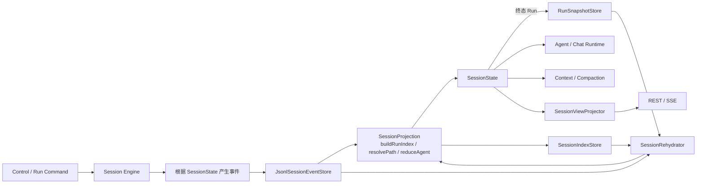
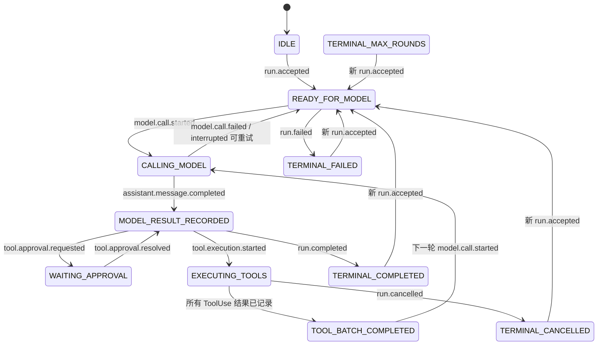

# Veyra Event Stream、Run Snapshot 与 Session Index 持久化恢复设计

## 1. 文档状态

- 日期：2026-08-11
- 状态：设计提案，待实施
- 适用范围：`cn.ayice.veyra.session`、`runtime.session`、`runtime.agent`、`compaction`、`control` 与桌面端会话恢复
- 目标：以单一 Session Event Stream 作为事实来源，以终态 Run Snapshot 和可重建 SessionIndex 加速路径切换、查询与恢复
- 存储约束：继续使用本地 append-only JSONL，不引入数据库、消息队列或第三方事件存储

本文定义 Veyra 下一版会话持久化与恢复协议。设计实施后，它将取代
`veyra-interrupted-run-recovery-design.md` 中“Journal 扫描 + 特殊恢复投影 + UI 稳定事件重放”的实现。
项目当前处于开发阶段，落地本设计时允许同步破坏内部接口和外部 `/v1` 契约，不为旧设计保留兼容层。

在切换完成前，现有实现仍是事实；本文描述的是目标架构，不表示当前代码已经具备这些能力。

## 2. 设计结论

Veyra 的 Session 持久化采用 Event Sourcing，并为每个终态 Run 生成可重建的 AgentState Snapshot：

```text
Session Event Stream + Run Snapshots + SessionIndex
    -> SessionProjection 加载或确定性重放
    -> 唯一 SessionState
    -> Agent Runtime / Context / SessionView
```

每个 Session 只有一条事实事件流和一个长期递增的 `revision`。系统不持久化 ExecutionCheckpoint、UI History
或 Java 运行时对象；系统按终态 Run 持久化 `RunSnapshot`，但 Snapshot 不是事实来源。

事件流任意前缀都可以确定性重放；产品层只把满足稳定条件的 Run 终态暴露为用户检查点：

```text
SessionState(N) = rehydrate(Event[1..N])

rehydrate
    = projectRunGraph
    -> resolvePath(headRunId)
    -> reduceVisibleEvents
```

同一 Session 的 Run 通过 `parentRunId` 组成树，`headRunId` 决定当前有效路径。回退只追加
`checkpoint.restored` 并切换到对应 RunSnapshot，不删除事件、不复制事件、不创建 Branch 实体。

事件完整且 Projection 确定时，即使全部 Snapshot 和 SessionIndex 丢失也必须能够恢复。Snapshot 减少 AgentState 重放量，
SessionIndex 避免为 Run 树查询反复扫描完整事件流；两者都不得改变事件语义或成为恢复正确性的必要条件。

UI 不再重放持久化 UI 事件。后端从 `SessionState` 生成完整 `SessionView`，桌面端只消费
`SessionView` 和非持久化的流式体验事件。

## 3. 背景与现状问题

当前实现已经具备 append-only JSONL、严格 Journal sequence、尾部半行修复、消息和工具结果持久化、
悬挂 Tool/Task/Run 收敛等基础能力，但恢复模型逐渐形成多套并行语义：

1. `SessionJournalEntry.sequence` 表示长期事实顺序。
2. `WorkingMessage.sequence` 表示模型消息顺序。
3. `SessionEventStream.seq` 表示当前进程 SSE 顺序。
4. `SessionSummaryState.summaryVersion` 表示摘要版本。
5. `SessionRecovery` 同时负责协议修复、模型历史重建、设置恢复和 UI 事件投影。
6. `SessionJournalRecorder.recordStableEvent` 将部分 UI 展示事件直接写入事实日志。
7. UI 冷加载先读取 History，再创建 EventSource，存在历史游标与实时连接之间的空窗。
8. `LoopState.state` 只有 `ACTIVE` 与终态，无法表示模型调用、审批等待和工具执行等恢复阶段。

这些机制分别解决了局部问题，但缺少一个统一的状态来源。最终表现为同一 Session 同时存在“模型历史状态”、
“恢复扫描状态”、“UI reducer 状态”和“AgentLoop 内存状态”，需要用顺序约定保持一致。

本设计把这些状态收敛为一个 `SessionState`，所有持久化事实只通过 `SessionEvent` 改变它。

## 4. 目标与非目标

### 4.1 目标

1. 一个 Session 只有一条事件流和一个长期 `revision`。
2. `SessionState` 可以完全由事件从空状态重建。
3. Agent 当前阶段、消息、工具批次、审批、待处理输入、Todo、任务和上下文摘要均可恢复。
4. 正常执行和恢复使用同一个 `SessionProjection`。
5. 恢复修复通过追加新事件完成，不直接修改状态或生成隐式历史。
6. Runtime 和 UI 都从同一个 `SessionState` 获取状态。
7. UI 展示结构不进入持久化协议，前端改版不要求迁移领域事件。
8. 外部副作用遵循“开始事件先落盘，结果事件后落盘”的显式不确定性协议。
9. 开发阶段只接受当前事件 Schema，不为旧格式提供兼容读取。
10. 保持本地单进程、同 Session 单写者和 JSONL 技术约束。
11. 同一 Session 内的 Run 形成不可变父子图，回退只移动当前 head，原路径仍可重新选择。

### 4.2 非目标

- 不恢复 Java 调用栈、线程、Future、Executor、SSE 连接或 HTTP 请求对象。
- 不保证外部工具 exactly-once。
- 不自动重试无法证明幂等的中断工具。
- 不持久化 partial token、临时 thinking、动画状态、展开状态和连接提示。
- 不引入 Kafka、EventStoreDB、Axon Server、关系数据库或分布式共识。
- 不把跨 Session 长期记忆合并进 Session Event Stream。
- 不在本阶段实现日志裁剪、命名 Branch、分支合并或跨 Session 分支。
- 不把普通 Chat、主 Agent 和 Subagent 合并成同一个执行循环。

## 5. 核心原则

### 5.1 Event Stream 是唯一事实来源

磁盘上只有事件是事实。`SessionState`、模型 Working History、会话列表、Transcript 和 UI View 都是事件投影。
任何投影丢失后都必须能从事件重新生成。

### 5.2 只有一个长期顺序

Session 内唯一持久化顺序为 `revision`。其他标识只表示身份或关联关系，不承担全局排序：

| 字段 | 语义 |
| --- | --- |
| `revision` | Session 事件流中严格递增的长期位置 |
| `eventId` | 单个事件的幂等标识 |
| `runId` | 一次 Run 的关联标识 |
| `messageId` | 一条消息的稳定身份 |
| `toolUseId` | 一次 ToolUse 的稳定身份 |
| `approvalId` | 一次审批的稳定身份 |
| `taskId` | 一次任务的稳定身份 |

不再创建独立 SSE sequence、消息 sequence 或摘要 version。需要比较消息和摘要覆盖位置时，使用事件 `revision`。

### 5.3 事件描述事实，不描述组件操作

事件命名应表达已经发生的业务事实，例如 `assistant.message.completed` 和 `tool.execution.started`，
而不是 `ui.tool.card.opened`、`loop.method.returned` 或 `state.changed`。

Agent phase 由语义事件推导，不持久化通用的 `phase.changed` 事件。这样事件历史保留原因，Reducer 负责得到结果状态。

### 5.4 Projection 是唯一状态构造入口

事件落盘后只能通过纯 `SessionProjection` 构造 `SessionState`。它内部统一执行 Run 索引构建、当前路径解析和
`reduceAgent`；正常执行、回退、重启恢复和测试不得各自实现状态拼接逻辑。

### 5.5 先落盘，再发布结果

所有稳定事实遵循：

```text
decide event
  -> append + force
  -> projection.apply / reproject
  -> replace in-memory state
  -> publish stable view / continue execution
```

写入失败时不得更新内存状态，不得发布已经完成的 SSE 事件，也不得继续依赖该事件的下一步副作用。

### 5.6 外部副作用显式保持不确定

工具执行开始事件与结果事件之间发生崩溃时，系统只能证明“尝试已经开始”，不能证明副作用是否完成。
恢复必须保留 `UNCERTAIN`，不得将其伪装成确定失败或自动重试。

## 6. 总体架构



职责划分：

| 组件 | 职责 | 禁止 |
| --- | --- | --- |
| `SessionEventStore` | 分配 revision、校验 expectedRevision、追加、force、读取、尾部修复 | 业务状态判断、UI 投影 |
| `RunSnapshotStore` | 原子写入、读取、校验和删除终态 RunSnapshot | 分配事件 revision、成为事实来源 |
| `SessionIndexStore` | 原子保存 Run 节点、current/active 指针和 appliedRevision | 接受命令、成为事实来源、脱离事件自行推进 |
| `SessionProjection` | 从事件前缀确定性构造 RunGraph、当前路径和 SessionState | IO、模型、工具、时间、随机数、SSE |
| `SessionRehydrator` | 读取并重放事件，识别需要追加的恢复事件 | 直接修改状态、执行工具 |
| `SessionState` | 保存可恢复的当前会话状态 | Spring、Future、Executor、第三方对象 |
| `Session Engine` | 根据状态决定事件和下一项外部动作 | 绕过 Event Store 直接改稳定状态 |
| `SessionViewProjector` | 从 SessionState 构造前端展示模型 | 持久化 UI 事件、决定 Agent 行为 |

## 7. Session Event 模型

```java
public record SessionEvent(
        int schemaVersion,
        String eventId,
        String sessionId,
        long revision,
        String runId,
        long occurredAtMs,
        String type,
        Map<String, Object> data
) {
}
```

字段约束：

- `schemaVersion`：当前事件类型 payload 的版本，正整数。
- `eventId`：写入前生成的 UUID；同一个逻辑事件重试必须复用同一 ID。
- `sessionId`：事件所属 Session，不允许为空。
- `revision`：由 Store 在成功追加时分配，从 1 开始严格连续。
- `runId`：Session 级事件可为空；Run 级事件必须存在。
- `occurredAtMs`：事件发生时间，由产生事件的执行边界传入；Reducer 不读取系统时间。
- `type`：受控的小写点分事件名。
- `data`：只包含恢复该事实所需的稳定 JSON 数据。

不在事件中保存：

- Java 类名和序列化对象图；
- LangChain4j 内部 JSON；
- API Key、token、cookie、完整 header；
- `ChatRequest`、Future、线程和 Executor；
- UI 组件类型、折叠状态和动画状态。

## 8. 事件类型

### 8.1 Session 与设置

| 事件 | 关键字段 | Reducer 结果 |
| --- | --- | --- |
| `session.created` | `workingDir`、`permissionMode`、`runMode` | 创建 SessionState |
| `session.settings.changed` | 完整设置快照 | 替换当前设置 |
| `checkpoint.restored` | `previousRunId`、`checkpointRunId`、`reason` | 将当前路径切换到指定 Run 检查点 |

设置事件保存完整快照而不是字段 patch，避免重放依赖历史默认值。

### 8.2 Run 与模型

| 事件 | 关键字段 | Reducer 结果 |
| --- | --- | --- |
| `run.accepted` | `parentRunId`、`input`、`mode`、`messageId` | 在当前 head 后创建 Run，加入 User Message，phase=`READY_FOR_MODEL` |
| `model.call.started` | `modelCallId`、`round` | phase=`CALLING_MODEL` |
| `model.call.failed` | `modelCallId`、`errorCode`、`retryable` | 增加失败次数，按策略回到 `READY_FOR_MODEL` 或终态 |
| `model.call.interrupted` | `modelCallId`、`reason` | 收敛悬挂调用，回到可恢复状态 |
| `assistant.message.completed` | `messageId`、`text`、`thinking`、`toolCalls` | 加入 Assistant Message，phase=`MODEL_RESULT_RECORDED` |
| `run.completed` | `content`、`reason` | phase=`TERMINAL_COMPLETED` |
| `run.failed` | `errorCode`、`content` | phase=`TERMINAL_FAILED` |
| `run.cancelled` | `reason` | phase=`TERMINAL_CANCELLED` |
| `run.max-rounds-reached` | `maxRounds` | phase=`TERMINAL_MAX_ROUNDS` |

`assistant.message.completed.toolCalls` 保存 `toolUseId`、名称和完整参数。Assistant 已经声明工具，因此不再持久化
`tool.call.started` 这种重复 UI 事实。

`parentRunId` 在 Run 创建后不可修改。根 Run 的 `parentRunId=null`；正常继续时取当前 `headRunId`；
“从检查点继续”时直接取用户选中的历史 Run。多个 Run 可以具有相同 `parentRunId`，由此自然形成多条路径，
但系统不持久化 Branch 对象。

### 8.3 审批与工具

| 事件 | 关键字段 | Reducer 结果 |
| --- | --- | --- |
| `tool.approval.requested` | `approvalId`、`toolUseId`、`reason` | Tool=`WAITING_APPROVAL`，Run=`WAITING_APPROVAL` |
| `tool.approval.resolved` | `approvalId`、`decision` | 更新审批和 Tool 状态 |
| `tool.rejected` | `toolUseId`、`reason` | Tool=`RESULT_RECORDED/REJECTED` |
| `tool.execution.started` | `toolUseId`、`name`、`recoveryPolicy` | Tool=`EXECUTION_STARTED`，Run=`EXECUTING_TOOLS` |
| `tool.execution.completed` | `toolUseId`、`content` | Tool=`RESULT_RECORDED/COMPLETED` |
| `tool.execution.failed` | `toolUseId`、`errorCode`、`content` | Tool=`RESULT_RECORDED/FAILED` |
| `tool.execution.uncertain` | `toolUseId`、`content` | Tool=`RESULT_RECORDED/UNCERTAIN` |

每个 Assistant ToolUse 必须最终对应且只对应一个结果事件：completed、failed、rejected 或 uncertain。
Reducer 在工具批次全部获得结果后设置 Run phase=`TOOL_BATCH_COMPLETED`。

### 8.4 Pending Input 与 Todo

| 事件 | 关键字段 |
| --- | --- |
| `input.queued` | `messageId`、`text`、`mode` |
| `input.mode.changed` | `messageId`、`mode` |
| `input.consumed` | `messageId` |
| `input.cancelled` | `messageId`、`reason` |
| `todo.list.replaced` | 完整 Todo items |

`input.consumed` 只从 pending 集合移除输入；实际加入模型历史时必须同时由一个具有稳定 `messageId` 的用户消息事实表达。
第一版可以由 `input.consumed` 携带消费后的用户消息正文，避免多事件原子批次问题。

### 8.5 Task

| 事件 | 关键字段 |
| --- | --- |
| `task.started` | `taskId`、`taskType`、`description` |
| `task.progress.recorded` | `taskId`、稳定且需要跨重启展示的进度 |
| `task.completed` | `taskId`、`content` |
| `task.failed` | `taskId`、`errorCode`、`content` |
| `task.killed` | `taskId`、`reason` |
| `task.interrupted` | `taskId`、`reason` |

只有产品要求重启后继续展示的 Task 进度才进入 `task.progress.recorded`。partial token、动画步骤和高频内部日志不持久化。

### 8.6 Context Summary

| 事件 | 关键字段 |
| --- | --- |
| `context.summary.updated` | `summaryText`、`coveredThroughRevision` |

该事件是模型上下文压缩事实，不是 Snapshot 或 Execution Checkpoint。事件自身的 `revision` 就是摘要版本，
不再维护 `summaryVersion`。

`coveredThroughRevision` 表示摘要覆盖该 revision 及以前产生的可总结模型消息。非消息事件形成的 revision 间隙不影响比较。

## 9. SessionState

```java
public record SessionState(
        String sessionId,
        long revision,
        SessionSettingsState settings,
        String headRunId,
        String activeRunId,
        Map<String, RunNodeState> runs,
        AgentState agent
) {
}
```

全局 `revision` 始终向前增长；回退不会把它改成目标 Run 的 terminal revision。`headRunId` 表示当前选中的稳定路径末端，
`activeRunId` 表示正在执行的 Run，没有运行时为 `null`。

### 9.1 RunNodeState

```java
public record RunNodeState(
        String runId,
        String parentRunId,
        long startedRevision,
        Long terminalRevision,
        RunTerminalStatus terminalStatus
) {
}
```

Run 只持久化 `parentRunId`，不持久化 children；子节点通过 `parentRunId` 反向查询。终态 Run 的
`terminalRevision` 是用户检查点位置。该终态事件落盘后生成对应 RunSnapshot；Snapshot 是事件投影，不是独立业务事实。

### 9.2 AgentState

```java
public record AgentState(
        RunState run,
        List<MessageState> messages,
        ToolBatchState toolBatch,
        List<ApprovalState> approvals,
        List<PendingInputState> pendingInputs,
        List<TodoItemState> todos,
        List<TaskState> tasks,
        ContextSummaryState contextSummary
) {
}
```

`AgentState` 只表示当前 `headRunId` 路径上的 Agent 事实。移动 head 后必须从该路径重新投影，不能只修改指针并沿用旧的
messages、Tool、Todo、Task 或 Context Summary。

### 9.3 RunState

```java
public record RunState(
        String runId,
        AgentPhase phase,
        int turnCount,
        int modelFailureCount,
        String transitionReason,
        String finalResponse
) {
}
```

### 9.4 AgentPhase

```java
public enum AgentPhase {
    IDLE,
    READY_FOR_MODEL,
    CALLING_MODEL,
    MODEL_RESULT_RECORDED,
    WAITING_APPROVAL,
    EXECUTING_TOOLS,
    TOOL_BATCH_COMPLETED,
    TERMINAL_COMPLETED,
    TERMINAL_MAX_ROUNDS,
    TERMINAL_FAILED,
    TERMINAL_CANCELLED
}
```

这里只保存具有恢复意义的阶段。上下文构建、Micro Compact、权限规则计算等可安全重做的短暂操作不单独持久化 phase：

- 崩溃在上下文构建中：最后状态仍为 `READY_FOR_MODEL`，恢复后重新构建。
- 崩溃在权限规则计算中：最后状态仍为 `MODEL_RESULT_RECORDED`，恢复后重新计算。
- 崩溃在流式输出中：最后状态为 `CALLING_MODEL`，通过 `model.call.interrupted` 收敛。

### 9.5 MessageState

```java
public record MessageState(
        String messageId,
        long sourceRevision,
        MessageRole role,
        String text,
        String thinking,
        List<ToolCallState> toolCalls
) {
}
```

消息顺序由 `sourceRevision` 决定。模型请求中的 Compact Boundary、Summary 包装和 Restoration 提示是构建期合成消息，
不进入 SessionState.agent.messages，也不占用独立 sequence。

### 9.6 ToolCallState

```java
public record ToolCallState(
        String toolUseId,
        String name,
        String arguments,
        ToolCallPhase phase,
        String approvalId,
        ToolOutcome outcome,
        String resultContent,
        RecoveryPolicy recoveryPolicy
) {
}
```

```java
public enum ToolCallPhase {
    DECLARED,
    WAITING_APPROVAL,
    AUTHORIZED,
    EXECUTION_STARTED,
    RESULT_RECORDED
}
```

拒绝也是一个稳定 ToolResult，使用 `phase=RESULT_RECORDED`、`outcome=REJECTED`，保证模型协议闭合。

## 10. SessionProjection

```java
public final class SessionProjection {

    public SessionState project(List<SessionEvent> events) {
        RunGraph graph = buildRunIndex(events);
        Set<String> visibleRuns = resolveVisibleRuns(graph);
        AgentState agent = reduceAgent(selectVisible(events, visibleRuns));
        return assemble(graph, agent);
    }

    public AgentState resume(RunSnapshot snapshot, List<SessionEvent> tail) {
        return reduceAgent(snapshot.agentState(), tail);
    }
}
```

Projection 与 Reducer 必须遵守以下不变量：

1. `event.revision == state.revision + 1`。
2. 除 `session.created` 外，事件 `sessionId` 必须等于 state.sessionId。
3. Run 级事件必须关联已存在的 `activeRunId`；终态 Run 不接受新的执行事件。
4. Assistant 声明的 toolUseId 在当前 Run 内唯一。
5. 每个 ToolUse 只能从 DECLARED 单调推进到 RESULT_RECORDED。
6. 每个审批只解决一次。
7. 每个 ToolUse 最终只有一个 ToolResult。
8. ToolBatch 全部有结果前不得进入下一模型轮次。
9. `coveredThroughRevision` 不得超过摘要事件之前的 state.revision。
10. Projection 和 Reducer 不执行 IO、不生成 ID、不读取当前时间、不发布事件。
11. `run.accepted.parentRunId` 必须是已终态 Run；正常继续取当前 head，从检查点继续可显式选择当前 head 的祖先。
12. `checkpoint.restored` 只能在 `activeRunId=null` 时应用，目标必须是终态 Run。
13. 第一版回退目标只能是当前 head 的祖先；允许任意终态 Run 前必须增加显式路径切换产品语义。

Projection 发生未知事件类型、非法 revision、Run 图环路或非法状态迁移时必须阻止恢复，不能跳过后继续构造看似可用的状态。

## 11. Agent 状态机使用方式

Session Engine 根据当前 phase 决定下一动作，动作完成后只通过事件推进状态：



状态机不需要持久化 `nextAction`。下一动作由 phase 和 ToolBatch 推导：

| Phase | 下一动作 |
| --- | --- |
| `READY_FOR_MODEL` | 构建上下文并开始模型调用 |
| `CALLING_MODEL` | 等待当前进程结果；恢复时执行模型中断策略 |
| `MODEL_RESULT_RECORDED` | 无工具则结束；有工具则完成授权和执行计划 |
| `WAITING_APPROVAL` | 等待或重新展示审批 |
| `EXECUTING_TOOLS` | 等待当前进程工具结果；恢复时处理 uncertain |
| `TOOL_BATCH_COMPLETED` | 开始下一轮模型调用 |
| `TERMINAL_*` | 不再执行 |

## 12. 正常写入协议

### 12.1 Command 处理

```text
读取当前 SessionState
  -> 校验 Command
  -> 产生一个语义完整的 NewSessionEvent
  -> append(expectedRevision=state.revision)
  -> force
  -> reducer.apply
  -> 原子替换 SessionRuntime.currentState
  -> 发布 SessionView
```

第一版优先让一次 Command 产生一个语义完整事件，避免 JSONL 多行提交的原子性问题。确实需要同时改变多个字段时，
由一个事件携带完整语义数据，例如 `run.accepted` 同时表达 Run 创建和首条 User Message。

### 12.2 模型调用

```text
append + force model.call.started
  -> apply，phase=CALLING_MODEL
  -> 调用模型并流式发送非持久化 token
  -> 得到完整 AiMessage
  -> append + force assistant.message.completed
  -> apply，phase=MODEL_RESULT_RECORDED
  -> 发布稳定 SessionView
```

模型调用失败追加 `model.call.failed`。是否重试由事件中的 `retryable` 和当前失败计数决定，不把供应商异常对象写入事件。

### 12.3 审批

```text
append + force tool.approval.requested
  -> apply，phase=WAITING_APPROVAL
  -> UI 展示 PendingApproval
  -> 用户提交决定
  -> append + force tool.approval.resolved
  -> apply
```

审批不再以无法持久化的 Future 作为唯一事实。Future 可以继续作为当前进程唤醒机制，但恢复后的等待状态来自 SessionState。

### 12.4 工具执行

```text
append + force tool.execution.started
  -> apply，Tool=EXECUTION_STARTED
  -> 执行真实工具
  -> append + force tool.execution.completed / failed
  -> apply
  -> 工具批次全部闭合后 phase=TOOL_BATCH_COMPLETED
```

拒绝工具不写 `tool.execution.started`，直接写 `tool.rejected`。

### 12.5 Run 终态

最终 Assistant Message 或 ToolResult 必须先落盘，再追加唯一 Run 终态。Reducer 拒绝同一 Run 的第二个终态。

Run 终态落盘后同时令 `activeRunId=null`、`headRunId=runId`。终态必须是该 Run 的封口事件；不得在终态后继续追加
属于该 Run 的 Message、Tool、Todo、Task 或 Context Summary 事件。

终态事件 append、force 并应用成功后，`RunSnapshotStore` 原子写入该 Run 的 AgentState。写入顺序必须是：

```text
append + force run terminal
  -> SessionProjection.reduceAgent
  -> atomic write RunSnapshot
  -> replace Runtime state
  -> publish SessionView
```

终态事件是真相。Snapshot 写入失败不得撤销已经完成的 Run，也不得追加伪造的失败终态；系统记录指标并允许稍后从事件重建缺失 Snapshot。

### 12.6 检查点回退与从检查点继续

用户检查点由稳定 Run 终态投影得到：

```java
public record RunCheckpoint(
        String runId,
        String parentRunId,
        long terminalRevision,
        RunTerminalStatus status
) {
}
```

检查点不单独持久化。一个 Run 只有在已终态、没有未决审批、没有未闭合 Tool/Task、没有
`tool.execution.uncertain` 时才能作为可操作检查点。

“回退到这里”追加：

```json
{
  "type": "checkpoint.restored",
  "data": {
    "previousRunId": "run-3",
    "checkpointRunId": "run-1",
    "reason": "checkpoint_restore"
  }
}
```

落盘并 force 后，后端优先加载并校验 `run-1` 的 RunSnapshot，原子替换 Runtime 状态并发布完整 SessionView。
Snapshot 缺失或无效时，从最近的有效祖先 Snapshot 加上后续事件重放；没有任何可用 Snapshot 时完整重放事件。
原 Run2、Run3 及其事件仍在同一个事件文件中，但不进入当前路径投影。

“从这里继续”如果同时携带用户输入，则不需要先写 `checkpoint.restored`，直接追加带目标父节点的 `run.accepted`：

```json
{
  "type": "run.accepted",
  "runId": "run-4",
  "data": {
    "parentRunId": "run-1",
    "input": "换一种方案实现"
  }
}
```

运行期间通过 `activeRunId=run-4` 投影 `run-1 -> run-4`；Run4 终态后令 `headRunId=run-4`。此时 Run1 同时拥有
Run2 和 Run4 两个子节点，这就是隐式路径分叉。系统不创建 Branch，不复制事件，也不维护第二个 sequence。

## 13. 事件存储协议

```java
public interface SessionEventStore {

    List<SessionEvent> readAll(String sessionId);

    List<SessionEvent> readAfter(String sessionId, long revision);

    SessionEvent append(
            String sessionId,
            long expectedRevision,
            NewSessionEvent event
    );
}
```

### 13.1 revision 与并发

Store 在 Session 级同步边界内：

1. 读取当前文件最后 revision。
2. 验证它等于 `expectedRevision`。
3. 分配 `revision=expectedRevision+1`。
4. 检查 eventId 未重复。
5. 追加完整 JSON 行并 `force(false)`。
6. 更新进程内 next revision 缓存。

revision 不匹配时返回明确的 `SESSION_REVISION_CONFLICT`，调用方重新加载状态，不允许覆盖或跳号。

### 13.2 JSONL 崩溃安全

继续保留当前策略：

- 完整但缺少换行的最后一行：补换行并 force。
- 损坏的尾部半行：截断到最后完整换行并 force。
- 中间行损坏：阻止恢复。
- revision 不从 1 严格连续：阻止恢复。
- schemaVersion 与当前唯一版本不一致：阻止恢复。

### 13.3 eventId 幂等

调用方在写入前生成 eventId。网络或调用栈重试同一个逻辑事件时必须复用 eventId：

- 已存在相同 eventId 且内容一致：返回已有事件。
- 已存在相同 eventId 但内容不同：报告幂等冲突。
- eventId 不存在但 expectedRevision 落后：报告 revision 冲突。

### 13.4 RunSnapshotStore

```java
public interface RunSnapshotStore {

    Optional<RunSnapshot> read(String sessionId, String runId);

    void writeAtomically(RunSnapshot snapshot);

    void delete(String sessionId, String runId);
}
```

Snapshot 不写入 Session Event Stream，也不分配事件 revision。写入使用同目录临时文件、文件 force 和原子重命名；
目标文件名由系统生成的 runId 确定，不接受用户路径片段。

### 13.5 SessionIndexStore

```java
public record SessionIndex(
        int schemaVersion,
        String sessionId,
        long appliedRevision,
        String currentRunId,
        String activeRunId,
        Map<String, RunIndexEntry> runs
) {
}

public record RunIndexEntry(
        String runId,
        String parentRunId,
        long startedRevision,
        Long terminalRevision,
        RunTerminalStatus status,
        boolean snapshotAvailable
) {
}
```

SessionIndex 是持久化物化投影，不是第二事实来源。每次稳定事件 append 并 force 后，同步 apply 到内存 Index，随后通过临时文件、
force 和原子重命名替换 Index 文件。启动时比较 `appliedRevision` 与事件流 head：

- 相等：直接使用 Index；
- 落后：从 `appliedRevision + 1` 增量应用事件并重写；
- 超前、损坏、Schema 不匹配或图结构非法：删除并从完整 Event Stream 重建；
- Index 写入失败：事件仍然有效，本次命令结果不回滚，记录错误并在下次访问修复。

## 14. 恢复协议

### 14.1 基础重放

```text
readAll(sessionId)
  -> 按全局 revision 构建 RunGraph 并计算最终 headRunId / activeRunId
  -> 确定需要恢复的目标 Run 和基准 Snapshot
  -> 校验并加载最近的有效祖先 RunSnapshot
  -> 只选择 Snapshot 之后当前路径的 Run 级事件
  -> SessionProjection.reduceAgent 正向重放剩余事件
  -> 得到唯一 SessionState
```

具体规则：

- 空闲且 `headRunId` 已终态：优先直接加载该 RunSnapshot。
- 存在 `activeRunId`：加载其 `parentRunId` 的 Snapshot，再重放活动 Run 已落盘事件。
- 最新事件为 `checkpoint.restored`：加载 `checkpointRunId` 的 Snapshot。
- 目标 Snapshot 缺失、损坏或版本不匹配：沿 `parentRunId` 查找最近有效祖先 Snapshot并重放差额。
- 没有有效祖先 Snapshot：从 Session 起点完整重放，成功后补建缺失的终态 RunSnapshot。

`checkpoint.restored` 不为各字段执行反向撤销。恢复器优先加载目标 RunSnapshot；降级重放时仍通过路径解析和
`reduceAgent` 正向推进，避免为 Message、Tool、Todo、Task 分别维护容易遗漏的 undo 逻辑。

活动 Session 不重复 rehydrate。首次打开、读取或继续 Session 时通过 `RuntimeSessionRegistry.computeIfAbsent`
完成惰性重放。

### 14.2 悬挂状态收敛

完整重放后，`SessionRehydrator` 根据最终 state 决定是否需要追加恢复事件：

| 最终状态 | 恢复事件 | 行为 |
| --- | --- | --- |
| `CALLING_MODEL` | `model.call.interrupted` | 收敛未完成模型调用；按配置回到 READY 或等待用户 |
| Tool=`EXECUTION_STARTED` | `tool.execution.uncertain` | 不自动重试，生成可供模型和用户判断的 UNKNOWN 结果 |
| `WAITING_APPROVAL` | 无 | 保持等待，UI 重新展示原审批 |
| Task=STARTED | `task.interrupted` | 第一版不自动重建后台任务 |
| `READY_FOR_MODEL` | 无 | 可以安全继续 |
| `TOOL_BATCH_COMPLETED` | 无 | 可以安全进入下一模型轮次 |
| `TERMINAL_*` | 无 | 不继续执行 |

恢复事件通过普通 `SessionEventStore.append` 写入，再由同一个 SessionProjection 重放。不得像当前扫描逻辑一样在投影外直接拼接特殊状态。

### 14.3 自动继续边界

第一版只自动继续能明确证明安全的阶段：

- `READY_FOR_MODEL`；
- `MODEL_RESULT_RECORDED` 且尚无工具副作用；
- `TOOL_BATCH_COMPLETED`。

`WAITING_APPROVAL` 继续等待用户。中断工具先写 uncertain 结果，再由下一模型轮次根据现场决定。是否自动重试中断模型调用使用独立配置，默认最多一次。

## 15. Context 与 Summary

### 15.1 Working History

`ContextService` 从 `SessionState.agent.messages` 构建请求，按 `sourceRevision` 保持消息顺序。ToolUse 与 ToolResult 的完整性由 Reducer 不变量保证，
不再由恢复器重新扫描和修补消息列表。

### 15.2 Context Summary

摘要生成成功并通过预算与结构校验后追加 `context.summary.updated`。Reducer 更新当前摘要状态：

```java
public record ContextSummaryState(
        String summaryText,
        long coveredThroughRevision,
        long sourceEventRevision
) {
}
```

模型请求构建时使用：

```text
Context Summary
  + sourceRevision > coveredThroughRevision 的原始消息
```

摘要事件不删除 Event Stream 中的旧消息事件。完整事件仍用于审计、恢复和重新生成摘要。

### 15.3 Micro Compact

Micro Compact 是单次请求构建优化，不改变 Session 事实，不写事件。它只在本次 `ChatRequest` 中替换可重新读取的旧工具输出。

## 16. UI 与 SSE

### 16.1 UI 不参与恢复正确性

新增纯投影：

```java
public final class SessionViewProjector {
    public SessionView project(SessionState state) {
        // 只做展示映射。
    }
}
```

```java
public record SessionView(
        String sessionId,
        long revision,
        String headRunId,
        String activeRunId,
        String runStatus,
        List<ChatView> messages,
        List<RunCheckpointView> checkpoints,
        List<ApprovalView> pendingApprovals,
        List<TaskView> tasks,
        List<TodoView> todos
) {
}
```

`SessionView` 不持久化。UI 结构变化只修改 Projector 和前端 DTO，不修改历史事件。

### 16.2 冷加载

桌面端不再调用 History 并逐个重放 UI 事件。打开 Session 时后端先 rehydrate，再返回完整 SessionView：

```text
GET /v1/sessions/{sessionId}/state
  -> SessionView(revision=N)
```

Transcript 导出可以继续保留，但由 `SessionState.agent.messages` 或 Event Stream 查询生成，不作为 UI 恢复来源。

### 16.3 实时更新

第一版采用完整稳定视图推送，优先保证简单和幂等：

```text
event: session.state
id: <revision>
data: <完整 SessionView>
```

每个稳定事件 apply 后发送最新 SessionView。前端只接受 `revision >= currentRevision` 的视图；相同 revision 重复到达时直接替换或忽略，结果一致。

流式体验事件继续存在但不持久化：

```text
assistant.token
assistant.thinking.token
context.warning
session.ready
```

这些事件不设置长期 revision。最终 `assistant.message.completed` 落盘后产生新的完整 SessionView，覆盖临时流式显示。

### 16.4 断线与刷新

SSE 建连后服务端首先发送当前完整 SessionView。断线重连不补发 UI delta，只重新发送最新状态：

```text
客户端 last revision=N
  -> 服务端 current revision=M
  -> M>N 时发送 SessionView(M)
```

这消除了“先获取 History、再连接 SSE”之间的事件丢失空窗，也不要求前端理解 Event Store 的全部领域事件。

如果未来完整 SessionView 体积成为问题，可以在不改变持久化协议的前提下增加分页或 View Delta；不得因此重新持久化 UI 事件。

### 16.5 检查点 UI

桌面端检查点交互统一使用 AI Elements 的 Checkpoint 组件。在 `veyra-desktop` 目录执行：

```powershell
npx shadcn@latest add @ai-elements/checkpoint
```

生成的组件代码进入项目并按 Veyra 主题适配；不得把组件内部展示状态写入 Event Store。后端接口提供：

```http
GET  /v1/sessions/{sessionId}/checkpoints
POST /v1/sessions/{sessionId}/head
POST /v1/sessions/{sessionId}/runs
```

检查点展示所需的稳定 DTO：

```java
public record RunCheckpointView(
        String runId,
        String parentRunId,
        long terminalRevision,
        String status,
        String title,
        boolean current,
        boolean restorable
) {
}
```

交互语义：

1. 每个可恢复 Run 终态在对应消息位置展示 Checkpoint。
2. “回退到这里”调用 `POST /head`，成功后用返回的完整 SessionView 替换当前界面。
3. “从这里继续”携带目标 `parentRunId` 和新用户输入调用创建 Run 接口，不创建 Branch 实体。
4. 回退确认框明确提示：Agent 消息、上下文、Todo、Task 和工具投影会回退，但已经发生的文件修改、命令、网络请求等外部副作用不会撤销。
5. 有活动 Run、未决审批、未闭合工具或 uncertain 工具结果时禁用回退，并展示后端返回的不可恢复原因。
6. 回退成功后 SSE revision 继续使用最新全局 revision；前端不得把 revision 设置成检查点的 terminalRevision。

本设计不提供“创建空分支”动作。用户只选择检查点但不提交新输入时执行的是移动 head；只有新
`run.accepted(parentRunId=目标Run)` 落盘后，Run 树才真正出现新的子节点。

## 17. 事件 Schema 演进

项目处于开发阶段时，事件 Schema 采用直接替换策略：

1. 事件字段、类型或语义变化时，直接修改当前 Schema 和 Reducer。
2. 删除旧事件文件并由新版本重新生成测试及开发数据。
3. 不实现 upcaster、旧版本反序列化、回退解析或多版本 Reducer 分支。
4. `schemaVersion` 保留为格式标识和诊断字段，但当前只接受代码声明的唯一版本；版本不匹配时明确失败。
5. 不得为了读取开发期历史而延长旧 Schema 的生命周期。

进入需要保留用户数据的生产阶段后，必须先通过新的 ADR 修改本政策，再设计 Schema 演进和数据迁移机制；不得提前引入兼容复杂度。

## 18. 存储布局与生命周期

```text
~/.veyra/sessions/<project-key>/
└── <session-id>/
    ├── events.jsonl
    ├── session-index.json
    └── snapshots/
        ├── <run-id-1>.snapshot.json
        ├── <run-id-2>.snapshot.json
        └── <run-id-n>.snapshot.json
```

Session 列表通过事件文件元数据和首个 `session.created`/`run.accepted` 投影生成。空 Session 是否立即持久化由产品语义决定，
但一旦返回可跨重启访问的 sessionId，就应写入 `session.created`，不再依赖“首个 Run 才存在”的隐式规则。

第一版不裁剪事件、不归档旧段。删除 Session 时删除整个 Session 目录；删除接口必须拒绝运行中的 Session，并在删除前关闭对应 Runtime。
删除单个 Snapshot 或 session-index.json 只影响性能，不影响事件事实或恢复正确性。

长期记忆继续位于 `~/.veyra/memory`，不进入 Session Event Stream。桌面日志继续位于 `~/.veyra/logs`，不作为恢复来源。

## 19. 与现有实现的映射

| 当前实现 | 目标实现 |
| --- | --- |
| `SessionJournalEntry` | `SessionEvent` |
| `SessionJournalStore` | `JsonlSessionEventStore` |
| 无 | `JsonRunSnapshotStore` |
| 无 | `JsonSessionIndexStore` |
| `SessionJournalTypes` | 受控的 Session Event Types |
| `SessionJournalRecorder` | Session Engine/Event Appender 的具体写入方法 |
| `SessionRecovery` | `SessionRehydrator + SessionProjection` |
| `RecoveryResult` | `SessionState` |
| `LoopState.state` 字符串 | `SessionState.agent.run.phase` 枚举 |
| `WorkingMessage.sequence` | `MessageState.sourceRevision` |
| `SessionSummaryState` 持久化回调 | `context.summary.updated` 事件 |
| `summaryVersion` | Summary 事件 revision |
| `SessionEventStream.seq` | 删除；稳定视图使用 Session revision |
| `recordStableEvent` | 删除 |
| `stableHistory` | 删除 |
| `projectStableEvent` | 删除 |
| 前端 History reducer | 完整 `SessionView` |

现有 `AgentEventSink` 可以继续作为运行期通知边界，但不得再决定哪些 UI 事件写入 Event Store。稳定写入由 Session Engine 显式完成，
SSE 只在写入并 apply 成功后发布 View。

## 20. 破坏性切换策略

### 20.1 禁止双写与兼容读取

新旧协议不得双写，也不得在正常运行路径中识别或读取旧 Journal。切换后只有新 Event Stream 是有效格式。

### 20.2 切换步骤

1. 实现新的 Event 模型、Reducer 和 Rehydrator。
2. 使用纯新格式 Fixture 验证状态机、恢复和 UI 投影语义。
3. 一次性切换写入与读取路径，只接受新 Event Stream。
4. 删除开发环境中的旧 Journal、Session 数据和测试 Fixture，不转换、不备份、不保留只读入口。
5. 同步删除旧 History/UI 事件恢复代码、废弃字段、适配器及相关测试。
6. 更新设计文档和架构约束，确保仓库中不存在旧协议仍受支持的表述。

## 21. 实施阶段

### 21.0 当前落地状态

本设计的开发阶段实现已经完成：存储布局为 `events.jsonl + session-index.json + snapshots/`；Run 通过不可变
`parentRunId` 形成树；事件具有 `schemaVersion`、`eventId`、全局连续 revision、expectedRevision 和幂等追加语义；
`AgentPhase`、`AgentState` 与纯 `SessionProjection` 统一表达模型、消息、Tool、Approval、Pending Input、Todo、Task 和 Summary 状态；
终态 Snapshot 直接保存结构化 `AgentState` 并使用 checksum 校验，缺失或损坏时从事件重建。

`checkpoint.restored` 持久化当前路径选择并原子替换 Runtime；恢复会收敛悬挂 Model Call、Tool、Approval、Task 和 Run；
HTTP/SSE 使用完整 `SessionView` 冷加载与重连，桌面端不再请求或重放持久化 UI History；实时 token 只作为非持久化体验事件。
桌面端 `@ai-elements/checkpoint` 已支持“恢复到此处”和“从此处继续”。旧开发数据不兼容读取。

### 阶段一：状态模型与 Reducer

1. 定义 `SessionEvent`、唯一 revision 和事件类型。
2. 定义 `SessionState`、`RunNodeState`、`headRunId`、`activeRunId`、`AgentState` 和 AgentPhase。
3. 在单个 `SessionProjection` 中实现无 IO 的 Run 索引、路径解析与 `reduceAgent`。
4. 用纯内存事件序列覆盖线性 Run、回退、同父 Run 多子节点以及非法迁移测试。

### 阶段二：Event Store

1. 将现有 JSONL 尾部修复能力收敛到 `JsonlSessionEventStore`。
2. 实现 expectedRevision、eventId 幂等和严格连续校验。
3. 实现 append 后 force、写入失败不推进内存 revision。
4. 实现按 runId 原子读写并严格校验的 `JsonRunSnapshotStore`。
5. 实现可增量修复、可完整重建的 `JsonSessionIndexStore`。

### 阶段三：Agent 状态机接入

1. 将 `LoopState` 稳定字段迁入 `SessionState.agent.run/toolBatch`。
2. 模型、审批、工具和 Run 通过显式事件推进。
3. 保留 Agent、Chat、Subagent 三种执行策略，不合并循环。

### 阶段四：恢复与不确定性

1. 使用 Snapshot-first、事件完整重放兜底的统一投影替换特殊恢复逻辑。
2. 通过恢复事件收敛 Model、Tool、Task 悬挂状态。
3. 恢复 Pending Approval、Pending Input 和 Todo。
4. 实现 `checkpoint.restored` 后的 RunSnapshot 加载、降级重放和 AgentState 原子替换。
5. 在 Run 终态后生成 Snapshot，并能从事件补建缺失 Snapshot。

### 阶段五：UI 投影

1. 新增 SessionViewProjector 和完整状态接口。
2. SSE 首帧及稳定更新发送完整 SessionView。
3. 删除前端 History replay 和后端 UI 稳定事件持久化。
4. 安装并接入 `@ai-elements/checkpoint`，实现回退和从检查点继续交互。

### 阶段六：收尾

1. 删除多余 sequence、summaryVersion 和旧恢复类型。
2. 更新 README、架构规范和 API 文档。
3. 记录事件数量、事件文件大小、Snapshot 数量/大小、命中率和降级重放耗时。

## 22. 测试策略

### 22.1 Reducer 测试

- 相同事件序列产生相同 SessionState。
- revision 跳号、重复或倒退时失败。
- 非法 phase 迁移失败。
- ToolUse 与 ToolResult 严格一一对应。
- 重复审批解决和重复 Run 终态失败。
- Summary 覆盖位置不能越过当前 revision。
- Run 的 parentRunId 创建后不可修改。
- head 只能移动到合法终态 Run，活动 Run 期间拒绝移动。
- 同一父 Run 可以创建多个子 Run，当前路径由 head 唯一决定。

### 22.2 Event Store 测试

- expectedRevision 正确时追加成功。
- revision 冲突不写入。
- 相同 eventId 重试幂等。
- 尾部半行被截断。
- 完整尾行缺少换行时修复。
- 中间行损坏阻止恢复。
- force 或序列化失败时内存 revision 不推进。

### 22.3 Snapshot Store 测试

- Run 终态事件 force 前不得生成 Snapshot。
- Snapshot 使用临时文件、force 和原子重命名完成写入。
- Snapshot 缺失、截断、checksum 错误、terminalRevision/eventId 不匹配时降级重放。
- schemaVersion 不匹配时删除并按当前格式重建，不兼容读取旧 Snapshot。
- Snapshot 写入失败不改变 Run 终态事实。
- 从事件完整重放得到的 AgentState 与 Snapshot 内容一致。

### 22.4 SessionIndex Store 测试

- appliedRevision 与事件 head 相等时直接加载。
- Index 落后时只应用事件尾部并原子替换。
- Index 超前、损坏、Schema 不匹配或 parentRunId 成环时完整重建。
- Index 写入失败不影响已经落盘的领域事件。
- 删除 Index 后完整重建结果与原 Index 一致。

### 22.5 崩溃矩阵

在以下边界注入进程退出并重新加载：

```text
run.accepted 写入前/后
model.call.started 写入前/后
assistant.message.completed 写入前/后
tool.approval.requested/resolved 写入前/后
tool.execution.started 写入前/后
真实工具返回后、结果事件写入前
tool.execution.completed 写入后
run terminal 写入前/后
run terminal 已 force、Snapshot 写入前/后
Event 已 force、SessionIndex 替换前/后
checkpoint.restored 写入前/后
从历史 Run 创建新 run.accepted 写入前/后
```

每个恢复结果必须具有合法 phase、闭合模型协议和明确的下一动作。

### 22.6 重放等价测试

对同一事件序列验证：

```text
实时追加后通过 SessionProjection 得到的 SessionState
    ==
进程重启后完整 replay 的 SessionState
```

### 22.7 UI 测试

- 冷加载 SessionView 与重启前稳定 View 相同。
- 运行中刷新不会丢失 Tool、Approval、Todo 和 Task 状态。
- 重复接收相同 revision 的 SessionView 幂等。
- 流式 token 丢失后，最终稳定 SessionView 能正确覆盖。
- UI 改版不要求修改历史事件 Fixture。
- Checkpoint 正确标记 current/restorable 状态。
- 回退后完整 SessionView 只包含目标 Run 祖先路径。
- 从检查点继续后出现同父 Run 的新子节点，原路径仍可重新选择。
- 回退后前端保持最新全局 revision，不使用 terminalRevision 覆盖它。

## 23. 可观察性

日志和指标至少包含：

- `sessionId`、`runId`、`eventId`、`revision`、`eventType`；
- Event append 耗时与 force 耗时；
- Session 事件数量和文件大小；
- 完整重放耗时与 Reducer 事件数；
- RunSnapshot 写入耗时、数量、总大小、命中率、校验失败和补建次数；
- SessionIndex 命中、尾部增量修复、完整重建、写入失败和文件大小；
- revision conflict、幂等命中、尾部修复和恢复补偿事件数；
- SessionView 投影与序列化耗时。

不得记录 API Key、权限凭证或不受控的大段工具原始输出。工具结果正文已经属于持久化事件时，运行日志只记录 ID、大小和结果类型。

## 24. Snapshot 决策

本设计持久化终态 RunSnapshot。原因不是取代事件恢复，而是 Run 树允许从任意祖先 Run 创建新子节点；若只保留最新
Session 状态，重启后每次选择历史路径都需要重复重放。每个终态 Run 的 Snapshot 为该节点提供稳定、可复用的 AgentState 基线。

```java
public record RunSnapshot(
        int schemaVersion,
        String sessionId,
        String runId,
        String parentRunId,
        long terminalRevision,
        String terminalEventId,
        AgentState agentState,
        String checksum
) {
}
```

Snapshot 只包含路径相关的 AgentState，不包含全局 `headRunId`、`activeRunId`、当前事件 head 或 UI View。这些值仍由事件流投影，
避免历史 Snapshot 冻结可变的 Session 导航状态。

必须满足：

1. Event Stream 始终是唯一事实来源。
2. Snapshot 不可用时完整重放结果完全相同。
3. 每个 Run 只在唯一终态事件落盘并应用后生成 Snapshot。
4. `terminalRevision` 必须指向同 sessionId、runId 和 terminalEventId 的真实终态事件。
5. checksum、Schema 或事件关联校验失败时丢弃 Snapshot 并重建，不尝试兼容旧格式。
6. Snapshot 写入失败不修改事件、不生成补偿业务事件、不改变用户可见 Run 结果。
7. Snapshot 加载后继续使用同一个 `SessionProjection.reduceAgent` 应用后续事件，不引入第二套状态迁移逻辑。
8. UI、Runtime 和 API 的业务语义不因 Snapshot 命中或降级重放而改变。
9. 删除 Session 时删除全部 RunSnapshot；孤儿 Snapshot 在启动维护阶段安全清理。

为控制空间，第一版保留所有终态 RunSnapshot，因为每个终态 Run 都可能成为新路径的父节点。不得只保留“最新 Snapshot”，
否则历史检查点仍需从更早位置重放。日志裁剪和 Snapshot 垃圾回收留待后续单独设计。

## 25. Definition of Done

- Session 只有一个长期 revision。
- Session 只有一个事实事件文件，不复制事件、不创建 Branch 实体；RunSnapshot 位于独立派生目录。
- SessionIndex 可持久化但可删除重建，currentRunId 的每次变化都能在事件流中找到对应事实。
- Run 通过不可变 parentRunId 形成树，headRunId 唯一决定当前路径。
- 所有稳定状态都能由事件完整重放。
- 正常执行、回退和恢复使用同一个 SessionProjection。
- Agent phase、ToolBatch、Approval、Pending Input、Todo、Task 和 Context Summary 均进入 SessionState。
- 恢复修复只通过追加事件完成。
- UI 不读取或重放持久化 UI 事件。
- SSE 重连通过完整 SessionView 恢复稳定界面。
- 回退通过 `checkpoint.restored` 加载目标 RunSnapshot；Snapshot 无效时通过正向重放恢复，不存在字段级 undo。
- 桌面端检查点采用 `@ai-elements/checkpoint`，并明确提示外部副作用不会撤销。
- partial token 等临时体验事件不进入 Event Store。
- 不存在 `recordStableEvent`、`stableHistory`、`projectStableEvent` 和独立 SSE sequence。
- 不存在持久化 ExecutionCheckpoint 或全局 SessionSnapshot；每个终态 Run 都有可校验、可重建的 RunSnapshot。
- 崩溃矩阵、重放等价、架构约束和全量测试全部通过。
- README、架构规范和相关设计文档完成术语同步。

## 26. 工程参考

- [Microsoft Event Sourcing pattern](https://learn.microsoft.com/en-us/azure/architecture/patterns/event-sourcing)：事件流作为事实来源、状态重放、乐观并发与投影。
- [Microsoft CQRS pattern](https://learn.microsoft.com/en-us/azure/architecture/patterns/cqrs)：从事件构建可重建的查询视图。
- [Axon Framework Snapshotting](https://docs.axoniq.io/axon-framework-reference/5.1/snapshotting/)：Snapshot 只是性能优化，不替代事件。
- [LangGraph Persistence](https://docs.langchain.com/oss/python/langgraph/persistence)：稳定步骤、线程状态、待处理任务与恢复边界。
- [MDN Server-Sent Events](https://developer.mozilla.org/en-US/docs/Web/API/Server-sent_events/Using_server-sent_events)：SSE `id` 与断线重连语义。

这些参考用于验证事件、状态、投影和恢复边界的工程惯例。本项目不引入对应框架，也不复制其分布式基础设施。
