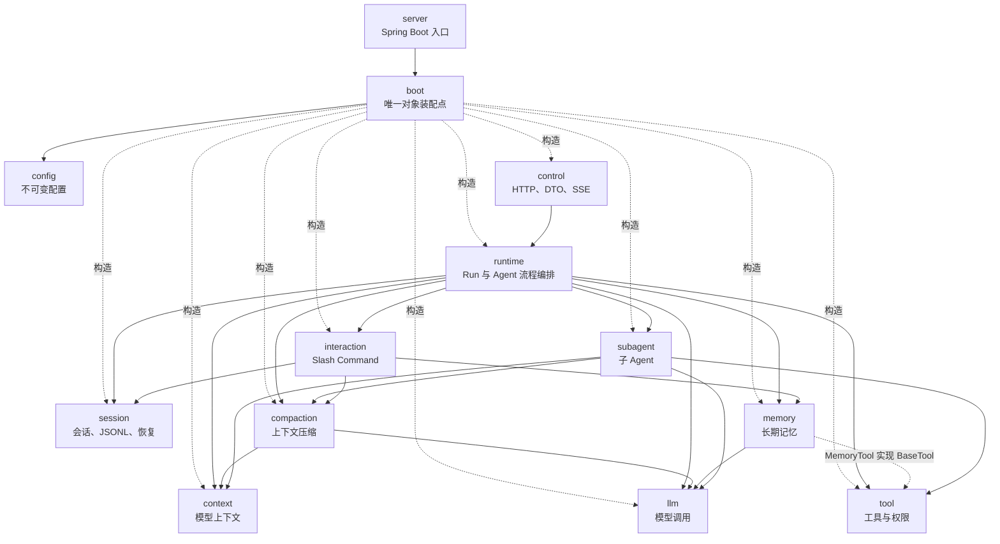
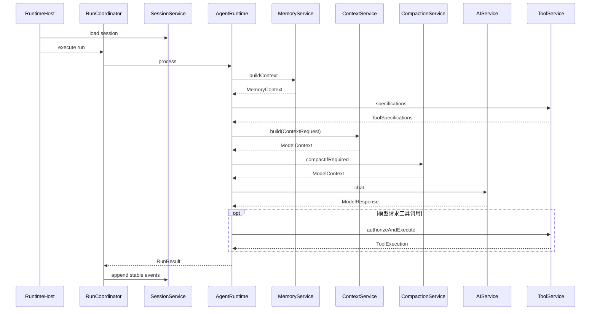
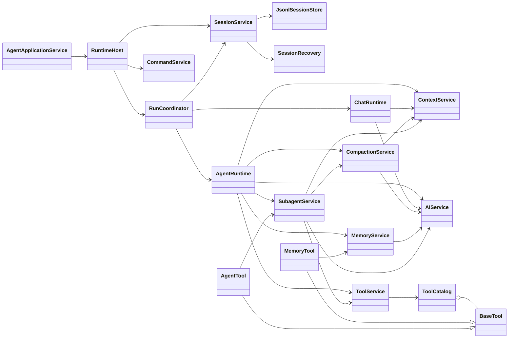

# Veyra Harness 能力模块化重构设计

## 1. 文档状态

- 日期：2026-08-01
- 状态：实施中
- 适用项目：Veyra Agent Harness
- 适用范围：后端 `cn.ayice.veyra` 包结构、模块职责、公开 API 和依赖规则
- 设计性质：技术架构设计，不包含迁移排期、任务拆分和实施步骤
- 外部约束：保持现有 HTTP、SSE、模型调用、工具权限和 Agent 行为契约
- 内部约束：不保留旧 Java 包名兼容层，不增加同义 Adapter、Gateway 或 Repository 抽象

## 2. 设计结论

Veyra 后端由当前的“按技术层分包”调整为“外部入口 + 运行编排 + Harness 能力模块”的结构。

重构后取消含义过宽且分类维度不一致的顶层 `conversation`、`kernel`、`host` 和 `tooling`：

```text
conversation.context             -> context
conversation.context.compaction  -> compaction
conversation.memory              -> memory
conversation.transcript          -> session.persistence

kernel.agent                     -> runtime.agent
kernel.chat                      -> runtime.chat
kernel.memory                    -> memory.extraction
kernel.subagent                  -> subagent

host                             -> runtime + session
tooling                          -> tool + subagent + memory.tool
```

最终形成以下稳定能力边界：

```text
runtime      Run 与 Agent/Chat 流程编排
session      会话状态、事件、JSONL 持久化和恢复
context      模型请求上下文组装
compaction   上下文压缩与检查点
memory       跨会话长期记忆
tool         工具目录、权限和执行生命周期
subagent     子 Agent 执行与任务管理
interaction  Slash Command 等用户交互命令
llm          LangChain4j 模型调用
```

每个 Harness 模块只提供一个主要服务入口。一个服务可以包含该能力生命周期内的多项操作，不按“一个方法一个 Service”拆分类。

## 3. 背景与现状问题

当前包结构的宏观依赖方向清楚，但顶层包使用了不同的分类维度：

| 当前顶层包 | 实际分类维度 |
| --- | --- |
| `kernel` | 执行层 |
| `conversation` | 数据用途 |
| `tooling` | 完整 Harness 能力 |
| `host` | 生命周期与状态所有权 |
| `control` | 外部协议边界 |

这种混合分类导致一个能力分散在多个包中。

### 3.1 上下文压缩被执行层拆开

压缩算法、检查点和摘要状态位于 `conversation.context.compaction`，但压缩触发、结果应用和恢复分支又位于 `kernel.agent.AgentTurnPreparer`、`LoopState` 和 `SubagentRuntime`。

修改完整压缩行为时，必须同时进入 Conversation 和 Kernel 两个顶层模块。

### 3.2 记忆系统缺少统一能力边界

长期记忆存储位于 `conversation.memory`，自动提取编排位于 `kernel.memory`，模型工具位于 `tooling.builtin.MemoryTool`，动态注入又进入 `conversation.context`。

从 Harness 角度，这些代码共同组成 Memory 能力，不应由技术调用位置决定归属。

### 3.3 会话持久化被归类为 Conversation 子功能

JSONL transcript 位于 `conversation.transcript`，活跃会话状态和重建位于 `host`。恢复一次 Session 必须跨越两个顶层模块，而 Session 本身没有清晰的服务入口。

### 3.4 工具能力存在重复装配

`boot.SessionRuntimeFactory` 和 `kernel.subagent.SubagentRuntime` 分别创建工具注册表、分发器和内置工具。工具构造、可见性和执行集合的知识没有集中在唯一装配边界。

### 3.5 类粒度存在双向失衡

- Control 层存在多个只依赖 `RuntimeHost` 的薄 Application Service；
- 部分公开 record 和回调类型具有真实跨包语义，应继续独立；
- `AgentLoop`、`SubagentRuntime` 和多个内置工具类仍承担较大算法复杂度；
- 继续机械拆分 Service 不能解决能力边界问题。

## 4. 目标与非目标

### 4.1 目标

1. 顶层包直接表达 Agent Harness 的核心能力。
2. 每个能力拥有明确的主要服务、状态模型和内部实现。
3. `runtime` 只编排能力，不实现压缩、记忆、持久化或工具策略。
4. `boot` 是唯一完整对象图装配点。
5. 能力模块不得依赖 `runtime`、`control`、`boot` 或 Spring MVC。
6. 通过窄命令、结果、快照和事件传递跨模块数据。
7. 减少只做转发的 Service，同时保留真实策略、并发和协议边界。
8. 新成员能够通过包名判断功能位置和允许依赖方向。
9. 为会话恢复、上下文压缩、记忆、工具和 Subagent 后续增强提供稳定落点。

### 4.2 非目标

- 不拆分 Maven 多模块。
- 不拆分微服务或独立进程。
- 不引入数据库、消息队列或工作流引擎。
- 不使用传统 CRUD 的 Controller/Service/Entity/Repository 套路覆盖所有模块。
- 不为固定技术栈增加无实际替换需求的接口与实现类组合。
- 不修改 Agent、Chat 和 Subagent 的业务决策、终止条件和工具顺序。
- 不把所有小 record 合并到一个大类中。
- 不在本设计中规定代码迁移顺序和发布策略。

## 5. 核心设计原则

### 5.1 顶层按能力，模块内部按职责

顶层包用于表达 Harness 能力，例如 `memory`、`tool`、`session`。模块内部可以使用 `model`、`persistence`、`policy`、`checkpoint` 等子包表达局部职责。

禁止重新建立全局技术层：

```text
service/
entity/
repository/
manager/
```

允许在能力内部建立必要的局部结构：

```text
session.persistence
session.recovery
tool.permission
compaction.checkpoint
memory.extraction
```

### 5.2 主服务放在模块根包

主要服务直接放在能力根包：

```text
session.SessionService
context.ContextService
compaction.CompactionService
memory.MemoryService
tool.ToolService
subagent.SubagentService
```

不增加没有信息增量的包层级：

```text
memory.service.MemoryService       不采用
memory.MemoryService               采用
```

### 5.3 一个服务负责一个完整能力生命周期

单一职责表示“只有一个主要变化原因”，不表示“只有一个方法”。

`SessionService` 可以同时负责创建、加载、追加事件、列出、恢复和关闭会话，因为这些操作共同构成 Session 生命周期。

只有当内部对象拥有独立算法、状态、并发、资源释放或扩展协议时，才继续拆分协作者。

### 5.4 数据类型按语义命名

Veyra 不使用 JPA，因此不统一建立 `entity` 包。根据真实语义选择：

| 数据语义 | 包名示例 |
| --- | --- |
| 服务输入输出和值对象 | `model` |
| 追加式事实 | `event` |
| 持久化行模型与编码 | `persistence` |
| 压缩提交状态 | `checkpoint` |
| 决策规则 | `policy` |
| 外部框架实现 | `langchain4j` |

### 5.5 跨模块只依赖服务和公开模型

例如 Runtime 允许依赖：

```text
memory.MemoryService
memory.model.MemoryContext
memory.model.MemoryRecallResult
```

Runtime 禁止直接依赖：

```text
memory.store.MemoryFileStore
memory.extraction.ExtractionCoordinator
memory.recall.MemoryContextProvider
```

### 5.6 避免由子包迫使类型公开

Java 父包和子包没有可见性继承。`memory` 中的类不能访问 `memory.store` 的包级私有类型。

创建子包必须满足至少一项：

- 存在三个以上相关类型；
- 形成明确子能力；
- 需要独立依赖约束；
- 具有独立测试边界；
- 具有稳定扩展方向。

少量只被主服务使用的协作者应留在根包并保持 package-private，而不是为了目录对称强制建立子包。

## 6. 总体分层

重构后的系统分为四类模块。

### 6.1 启动与装配

- `server`：Spring Boot 启动类；
- `boot`：Bean、Executor、工具目录和完整对象图装配；
- `config`：不可变配置值。

### 6.2 外部控制面

- `control`：HTTP、DTO、异常和 SSE 序列化；
- Control 只能通过 `RuntimeHost` 进入运行时。

### 6.3 运行编排

- `runtime`：Run 路由、Agent/Chat 状态机和能力调用顺序；
- Runtime 不拥有能力模块的内部实现知识。

### 6.4 Harness 能力模块

- `session`
- `context`
- `compaction`
- `memory`
- `tool`
- `subagent`
- `interaction`
- `llm`

## 7. 目标包结构

```text
cn.ayice.veyra
|
+-- server
|   `-- AgentServerApplication.java
|
+-- boot
|   +-- HarnessConfiguration.java
|   +-- RuntimeConfiguration.java
|   `-- SessionRuntimeFactory.java
|
+-- config
|   +-- AppConfig.java
|   +-- ModelConfig.java
|   +-- SessionConfig.java
|   +-- CompactionConfig.java
|   `-- MemoryConfig.java
|
+-- control
|   +-- api
|   +-- dto
|   |   +-- session
|   |   +-- run
|   |   +-- approval
|   |   `-- command
|   +-- exception
|   +-- sse
|   `-- AgentApplicationService.java
|
+-- runtime
|   +-- RuntimeHost.java
|   +-- RunCoordinator.java
|   +-- model
|   +-- agent
|   `-- chat
|
+-- session
|   +-- SessionService.java
|   +-- SessionRegistry.java
|   +-- SessionRuntime.java
|   +-- SessionRunQueue.java
|   +-- model
|   +-- event
|   +-- persistence
|   `-- recovery
|
+-- context
|   +-- ContextService.java
|   +-- TokenEstimator.java
|   +-- model
|   +-- prompt
|   |   `-- section
|   `-- instruction
|
+-- compaction
|   +-- CompactionService.java
|   +-- model
|   +-- policy
|   +-- summary
|   `-- checkpoint
|
+-- memory
|   +-- MemoryService.java
|   +-- model
|   +-- store
|   +-- recall
|   +-- extraction
|   `-- tool
|
+-- tool
|   +-- ToolService.java
|   +-- BaseTool.java
|   +-- ToolCatalog.java
|   +-- model
|   +-- execution
|   +-- permission
|   +-- builtin
|   `-- background
|
+-- subagent
|   +-- SubagentService.java
|   +-- SubagentRuntime.java
|   +-- AgentTaskManager.java
|   +-- model
|   `-- tool
|
+-- interaction
|   `-- command
|
`-- llm
    +-- AIService.java
    +-- ChatStreamer.java
    +-- model
    `-- langchain4j
```

该结构是目标上限，不要求为只有一个类型的职责预先创建空子包。子包随真实代码规模建立。

## 8. 包级依赖

### 8.1 依赖图



### 8.2 依赖规则

1. `server` 只依赖 `boot` 和 Spring Boot 启动契约。
2. `boot` 可以依赖所有模块，但只能进行构造和资源生命周期管理，不承载业务决策。
3. `control` 只依赖 `runtime` 公开入口和 Control 自有 DTO。
4. `runtime` 可以依赖所有 Harness 服务，但不得直接依赖其内部存储、策略和算法实现。
5. Harness 能力模块不得依赖 `runtime`、`control`、`boot` 或 Spring MVC。
6. `session` 不依赖 `context`、`compaction`、`memory` 或 `subagent`；Runtime 将执行结果转换为标准 Session Event。
7. `context` 不主动调用 `memory` 或 `tool`；Runtime 先获取 Memory Context 和 Tool Specification，再通过 `ContextRequest` 传入。
8. `compaction` 只依赖 Context 的公开快照模型和 LLM 服务。
9. `tool` 不依赖 `memory` 或 `subagent`；`MemoryTool` 和 `AgentTool` 分别由所属模块实现，由 Boot 注册为 `BaseTool`。
10. `subagent` 可以复用 Context、Compaction、Tool 和 LLM 服务，但不得创建另一套工具目录。
11. `interaction` 只能通过各能力 Service 执行命令，不直接访问内部状态和存储。
12. 模块配置由 Boot 从 `AppConfig` 拆成窄配置对象后注入，避免所有类依赖全局配置。

## 9. 模块详细设计

### 9.1 Control

#### 主要入口

```text
control.AgentApplicationService
```

它负责 Agent HTTP 控制面的用例编排和 DTO 转换，包括：

- 会话创建、查询和设置；
- Run 提交；
- Slash Command 查询和执行；
- 审批查询和处理；
- Runtime 模型到 HTTP Response DTO 的转换。

Control 不再为 Session、Run、Approval 和 Command 各建立一个只有少量转发方法的 Application Service。

Document Export 因为依赖 Apache POI、具有独立二进制响应和失败边界，可以保留独立服务。

#### 禁止

- 直接依赖 `SessionService`、`ToolService`、`MemoryService`；
- 持有 AgentLoop 或 SessionRuntime；
- 解析 JSONL 或 LangChain4j 原始响应；
- 决定工具权限和 Agent 执行路径。

### 9.2 Runtime

#### 主要入口

```text
runtime.RuntimeHost
```

Runtime 负责：

- 接收 Control 提交的请求；
- 获取并绑定 Session；
- 按 RunMode 路由 AgentRuntime 或 ChatRuntime；
- 编排 Memory、Context、Compaction、LLM 和 Tool；
- 将稳定执行事实提交给 SessionService；
- 发出会话事件。

Runtime 不负责：

- JSONL 编解码；
- 记忆文件格式；
- 压缩策略算法；
- 工具注册和权限规则实现；
- Subagent 工具集合构造。

#### Agent 主流程



### 9.3 Session

#### 主要入口

```java
public final class SessionService {

    public SessionRuntime create(SessionSettings settings);

    public SessionRuntime load(String sessionId);

    public void append(String sessionId, SessionEvent event);

    public List<SessionSummary> list();

    public RecoveryResult recover(String sessionId);

    public void close(String sessionId);
}
```

Session 模块拥有：

- 活跃 Session 注册和生命周期；
- 同 Session Run 串行队列；
- Session Event Stream；
- JSONL Session Journal；
- 会话索引与摘要；
- L1 会话重建；
- L2 悬挂状态收敛。

`SessionService` 是能力入口；`JsonlSessionStore` 和 `SessionRecovery` 是具有独立 IO/状态机边界的内部协作者，不需要各自再包装一层同名 Service。

#### 子包

| 子包 | 职责 |
| --- | --- |
| `session.model` | Session 设置、状态、摘要和展示模型 |
| `session.event` | 追加式会话事实和运行期事件流 |
| `session.persistence` | JSONL 编码、追加、读取和索引 |
| `session.recovery` | 历史重建和悬挂对象收敛 |

### 9.4 Context

#### 主要入口

```java
public final class ContextService {

    public ModelContext build(ContextRequest request);

    public int estimateTokens(ModelContext context);

    public void invalidatePromptCache();
}
```

Context 模块只负责“模型看到什么”：

- System Prompt；
- Project Instruction；
- 动态 Memory Context；
- Working History；
- Tool Specification；
- 完整请求 token 估算。

Memory 内容和 Tool Specification 由 Runtime 获取后放入 `ContextRequest`。Context 不持有 `MemoryService` 或 `ToolService`。

#### 子包

| 子包 | 职责 |
| --- | --- |
| `context.model` | ContextRequest、ModelContext、WorkingMessage、ContextSnapshot |
| `context.prompt` | Prompt 注册、构建和缓存 |
| `context.prompt.section` | 具有独立动态计算或缓存行为的 Prompt Section |
| `context.instruction` | 项目指令加载与合并 |

### 9.5 Compaction

#### 主要入口

```java
public final class CompactionService {

    public CompactionResult compactIfRequired(ContextSnapshot snapshot);

    public CompactionResult compact(ContextSnapshot snapshot, CompactionTrigger trigger);

    public Optional<CompactionCheckpoint> checkpoint();
}
```

Compaction 模块拥有：

- 压缩触发策略；
- Micro Compact；
- Session Summary；
- LLM Summary；
- Stable Point 校验；
- Checkpoint 候选和提交；
- 压缩结果与边界。

Runtime 只调用 `compactIfRequired` 并应用结果，不理解三级压缩的内部升级逻辑。

#### 子包

| 子包 | 职责 |
| --- | --- |
| `compaction.model` | 输入快照、触发、策略和结果值 |
| `compaction.policy` | 阈值、稳定点和升级决策 |
| `compaction.summary` | Micro 与 LLM 摘要算法 |
| `compaction.checkpoint` | Candidate、Checkpoint 和原子提交状态 |

### 9.6 Memory

#### 主要入口

```java
public final class MemoryService {

    public MemoryRecallResult recall(MemoryQuery query);

    public MemoryOperationResult remember(RememberMemoryCommand command);

    public MemoryOperationResult forget(ForgetMemoryCommand command);

    public void extract(SessionSnapshot snapshot);

    public MemoryContext buildContext(String projectId, String input);
}
```

Memory 模块统一拥有：

- 长期记忆 topic 和索引；
- remember、forget 和 recall；
- 自动提取协调；
- 动态 Memory Context；
- 模型可调用的 MemoryTool。

`MemoryTool` 放在 `memory.tool`，依赖 `MemoryService` 并实现 Tool 模块的 `BaseTool`。Tool 模块只持有 `BaseTool`，不反向依赖 Memory。

#### 子包

| 子包 | 职责 |
| --- | --- |
| `memory.model` | MemoryEntry、Query、Context 和结果 |
| `memory.store` | 文件格式、路径和索引维护 |
| `memory.recall` | 召回、过滤和上下文预算 |
| `memory.extraction` | 后台提取、single-flight 和游标 |
| `memory.tool` | Memory 能力向 Tool Harness 的集成 |

### 9.7 Tool

#### 主要入口

```java
public final class ToolService {

    public List<ToolSpecification> specifications(ToolProfile profile);

    public ToolAuthorization authorize(
            ToolRequest request,
            PermissionContext permissionContext,
            ToolExecutionPolicy policy
    );

    public ToolExecution execute(ToolAuthorization authorization);
}
```

Tool 模块拥有固定生命周期：

```text
lookup -> parse -> validate -> permission -> approval -> execute -> normalize
```

ToolService 组合工具目录、权限和执行器。主 Agent 与 Subagent 传入不同的 Profile 和 Policy，但使用同一套工具目录构造规则。

#### 子包

| 子包 | 职责 |
| --- | --- |
| `tool.model` | 请求、结果、授权和执行快照 |
| `tool.execution` | 生命周期执行和观察回调 |
| `tool.permission` | PermissionContext、Rule、Decision 和 Policy |
| `tool.builtin` | 文件、Shell 和搜索等内置工具 |
| `tool.background` | 后台进程、后台工具和任务查询 |

### 9.8 Subagent

#### 主要入口

```java
public final class SubagentService {

    public AgentRunResult execute(AgentProfile profile, String input);

    public String submit(AgentProfile profile, String input);

    public Optional<AgentRunResult> result(String taskId);
}
```

Subagent 模块拥有：

- Agent Profile；
- 子 Agent 顺序循环；
- 子 Agent 任务生命周期；
- AgentTool 集成。

Subagent 可以调用 Context、Compaction、Tool 和 LLM，但不得直接创建内置工具、ToolRegistry 或 ToolDispatcher。

`AgentTool` 放在 `subagent.tool`，依赖 `SubagentService`，由 Boot 注册到 ToolCatalog。

### 9.9 Interaction

Interaction 模块负责用户显式命令，不实现被调用能力：

```text
/compact -> CompactionService
/memory  -> MemoryService
/session -> SessionService
```

`CommandService` 负责注册、补全和分发，具体 Command 只调用对应能力 Service。

### 9.10 LLM

LLM 模块隔离 LangChain4j 具体调用：

```text
llm.AIService
llm.ChatStreamer
llm.langchain4j.LangChain4jAIService
```

Context、Compaction、Memory 和 Subagent 只能依赖 `AIService`，不能直接构造 LangChain4j Client。

### 9.11 Boot 与 Config

Boot 负责：

- Executor 创建和关闭；
- AIService 创建；
- Harness 服务创建；
- ToolCatalog 构造；
- MemoryTool 和 AgentTool 注册；
- SessionRuntime 创建；
- Spring Bean 暴露。

Boot 不负责：

- 权限判断；
- 压缩阈值决定；
- 记忆召回；
- 会话恢复规则；
- Agent 终止条件。

`AppConfig` 只在 Boot 聚合。业务模块接收窄配置，例如：

```text
ContextService      <- ContextConfig
CompactionService   <- CompactionConfig
MemoryService       <- MemoryConfig
SessionService      <- SessionConfig
AIService           <- ModelConfig
```

## 10. 类依赖图



## 11. 状态与所有权

| 状态 | 所有模块 | 生命周期 | 并发约束 |
| --- | --- | --- | --- |
| Run 路由和执行阶段 | `runtime` | 单次 Run | 同 Session 串行 |
| 活跃 Session、设置和事件流 | `session` | Session | SessionService 唯一所有者 |
| JSONL Session Journal | `session.persistence` | 跨进程 | 单 Session 追加有序 |
| 恢复扫描和收敛结果 | `session.recovery` | 启动或按需恢复 | 单 Session 恢复互斥 |
| Working Context | `context` 模型，Runtime 持有 | 单次模型调用/Run | 不跨线程共享可变副本 |
| Compaction Checkpoint | `compaction` | 活跃 Session | 单调版本、原子提交 |
| Long-term Memory | `memory` | 跨 Session | 文件更新原子化、提取 single-flight |
| Permission Context | `tool` | Session | 由 Runtime 传入，ToolService 原子返回新快照 |
| Subagent Task | `subagent` | 父 Run 或后台任务 | 任务 ID 唯一、终态单向转换 |

状态所有权不得因为类移动而改变。能力服务可以接收状态快照，但不得保留另一份可变事实来源。

## 12. 模块集成方式

### 12.1 MemoryTool

```text
memory.MemoryService
        ^
        |
memory.tool.MemoryTool --implements--> tool.BaseTool
        |
        `-- Boot 注册到 ToolCatalog
```

Tool 模块不引用 MemoryTool 的具体类型。

### 12.2 AgentTool

```text
subagent.SubagentService
        ^
        |
subagent.tool.AgentTool --implements--> tool.BaseTool
        |
        `-- Boot 注册到 ToolCatalog
```

Tool 模块不引用 SubagentService。

### 12.3 Context 输入

Runtime 先分别查询模块，再组装 ContextRequest：

```java
MemoryContext memory = memoryService.buildContext(projectId, input);
List<ToolSpecification> tools = toolService.specifications(profile);

ModelContext context = contextService.build(new ContextRequest(
        systemInput,
        history,
        memory.asPromptContribution(),
        tools,
        workingDirectory
));
```

ContextService 不回调 MemoryService 或 ToolService，避免 Context 成为新的中央依赖点。

### 12.4 Session Event

能力服务返回稳定结果，由 Runtime 转换为 Session Event：

```text
ToolExecution / ModelResponse / CompactionResult
                    |
                    v
                 Runtime
                    |
                    v
              SessionEvent
                    |
                    v
         SessionService.append()
```

Session 模块不需要理解 ToolService、MemoryService 或 CompactionService 的内部状态。

## 13. 公开 API 与可见性

### 13.1 允许公开的类型

- 模块主要 Service；
- 跨模块使用的 Command、Result、Snapshot 和 Event；
- 真实策略扩展点；
- 真实执行回调；
- Boot 需要创建或注册的集成类型。

### 13.2 默认不公开的类型

- 只被一个 Service 使用的算法协作者；
- 文件格式解析器；
- 中间构建器；
- 单次计算过程 record；
- 没有跨模块语义的枚举；
- 仅用于测试绕过主入口的类。

这些类型优先使用：

```java
final class MemoryIndexParser {
}

record ParsedTopic(...) {
}

private record PendingBatch(...) {
}
```

### 13.3 接口使用条件

只有满足以下条件之一才引入接口：

1. 存在两个真实生产实现；
2. 是跨模块行为回调；
3. 是工具、Prompt Section 等明确插件协议；
4. 需要隔离外部副作用以稳定测试；
5. 是不可避免的框架契约。

固定文件存储不自动建立 `SessionStore` 接口加 `JsonlSessionStore` 实现。可以直接注入具体 `JsonlSessionStore`，待真实第二实现出现后再提取接口。

## 14. 当前代码到目标模块的映射

| 当前代码 | 目标模块 |
| --- | --- |
| `control.service.SessionApplicationService` | 合并至 `control.AgentApplicationService` |
| `control.service.RunApplicationService` | 合并至 `control.AgentApplicationService` |
| `control.service.ApprovalApplicationService` | 合并至 `control.AgentApplicationService` |
| `control.service.SlashCommandApplicationService` | 合并至 `control.AgentApplicationService` |
| `host.RuntimeHost` | `runtime.RuntimeHost` |
| `host.SessionRegistry` | `session.SessionRegistry` |
| `host.SessionRuntime` | `session.SessionRuntime` |
| `host.SessionRunQueue` | `session.SessionRunQueue` |
| `host.event.*` | `session.event.*` |
| `kernel.RunCoordinator` | `runtime.RunCoordinator` |
| `kernel.agent.*` | `runtime.agent.*` |
| `kernel.chat.*` | `runtime.chat.*` |
| `conversation.context.*` | `context.*` |
| `conversation.context.systemprompt.*` | `context.prompt.*` |
| `conversation.context.instruction.*` | `context.instruction.*` |
| `conversation.context.compaction.*` | `compaction.*` |
| `conversation.memory.*` | `memory.*` |
| `kernel.memory.*` | `memory.extraction.*` 或 `memory.*` |
| `conversation.transcript.*` | `session.persistence.*` |
| `tooling.permission.*` | `tool.permission.*` |
| `tooling.builtin.*` | `tool.builtin.*` |
| `tooling.state.*` | 按状态语义进入 `tool` 或 `session` |
| `tooling.task.AgentTaskManager` | `subagent.AgentTaskManager` |
| `tooling.task.BackgroundManager` | `tool.background.BackgroundManager` |
| `kernel.subagent.*` | `subagent.*` |
| `tooling.builtin.MemoryTool` | `memory.tool.MemoryTool` |
| `tooling.builtin.AgentTool` | `subagent.tool.AgentTool` |
| `interaction.command.*` | 保持 `interaction.command.*` |
| `llm.*` | 保持 `llm.*`，具体实现进入 `llm.langchain4j` |

## 15. 架构约束测试

重构后 ArchUnit 至少覆盖以下规则。

### 15.1 Control 边界

```text
control.. 只能依赖 runtime..、control..、Java/Spring HTTP 类型
```

### 15.2 Runtime 编排边界

```text
runtime.. 可以依赖能力模块的根 Service 和公开 model
runtime.. 不得依赖 *.store..、*.persistence..、*.checkpoint.. 的内部实现
```

例外：Runtime 可以依赖 `session.event.SessionEvent`，因为它是 Session 模块的公开追加协议。

### 15.3 能力模块反向依赖

```text
session/context/compaction/memory/tool/subagent/interaction/llm
不得依赖 runtime/control/boot/server
```

### 15.4 内部包封装

```text
memory.store..      只能被 memory.. 和 boot.. 依赖
memory.extraction.. 只能被 memory.. 和 boot.. 依赖
session.persistence.. 只能被 session.. 和 boot.. 依赖
session.recovery..    只能被 session.. 和 boot.. 依赖
tool.permission..     只能被 tool..、runtime.. 和 subagent.. 通过公开类型依赖
compaction.checkpoint.. 只能被 compaction.. 依赖
```

### 15.5 完整装配限制

除 `boot` 外，禁止业务类同时创建：

```text
ToolCatalog/ToolRegistry
ToolExecutor/ToolDispatcher
多个 Builtin Tool
AgentRuntime/ChatRuntime/SessionRuntime 完整对象图
```

该规则用于防止 Subagent 再次形成独立工具装配路径。

### 15.6 移除旧包

```text
conversation..
kernel..
host..
tooling..
```

目标结构完成后，上述旧包不得重新出现，也不建立桥接类或旧包兼容门面。

## 16. 测试边界

| 模块 | 主要测试内容 |
| --- | --- |
| `runtime` | 调用顺序、RunMode 路由、失败传播、事件提交 |
| `session` | 同 Session 串行、JSONL、重建、L2 收敛、关闭 |
| `context` | Prompt 顺序、Memory/Tool 注入、token 估算 |
| `compaction` | 阈值、三级压缩、稳定点、检查点单调性 |
| `memory` | 文件存储、召回、提取 single-flight、MemoryTool |
| `tool` | 注册、Profile 过滤、权限、审批、执行和空结果 |
| `subagent` | Profile、顺序工具调用、任务终态、AgentTool |
| `interaction` | 命令解析、补全和 Service 路由 |
| `llm` | 请求转换、流式回调和异常规范化 |
| `control` | HTTP 校验、状态码、DTO 和 SSE 协议 |

跨模块集成测试从 `RuntimeHost` 或 `SessionService` 公开入口进入，不通过反射或直接构造内部 Store 绕过服务边界。

## 17. 设计权衡

### 17.1 优点

- 包名直接展示 Harness 能力；
- 同一功能修改集中在同一顶层模块；
- Runtime 变成清晰的执行状态机和编排层；
- Session 持久化与恢复形成完整闭环；
- Memory、Compaction、Tool 和 Subagent 可以独立测试；
- Boot 集中管理工具注册和对象生命周期；
- 避免一个操作一个 Service；
- 能通过 ArchUnit 明确保护边界。

### 17.2 代价

- 现有大量 Java 包名和 import 会变化；
- 原有按技术层理解代码的成员需要适应能力式结构；
- 子包封装主要依赖 ArchUnit，因为 Java 不提供父子包内部可见性；
- Runtime 作为编排层会具有较高合理 fan-out；
- 某些集成类型，例如 MemoryTool，会同时涉及两个模块契约，需要严格保持单向依赖。

### 17.3 不采用 Maven 多模块的原因

当前项目体量、构建方式和团队规模不需要多个 Maven Artifact。单 Maven 模块配合包级边界和 ArchUnit 已能提供足够约束，避免构建复杂度超过收益。

## 18. 验收标准

设计落地后的结构必须满足：

1. 顶层不再存在 `conversation`、`kernel`、`host` 和 `tooling`。
2. Control 只通过一个 AgentApplicationService 和 RuntimeHost 进入运行时。
3. Session、Context、Compaction、Memory、Tool、Subagent 分别具有唯一主要服务入口。
4. Runtime 不直接访问任何能力模块的 Store、文件格式或内部协调器。
5. Session JSONL 和恢复代码全部位于 Session 模块。
6. 压缩策略和检查点全部位于 Compaction 模块。
7. 长期记忆存储、召回、提取和 MemoryTool 全部位于 Memory 模块。
8. 主 Agent 与 Subagent 复用 Boot 装配的同一 ToolCatalog 规则。
9. Tool 模块不依赖 Memory 或 Subagent 的具体类型。
10. 不存在一个 HTTP 用例对应一个薄 Application Service 的机械拆分。
11. 不为只有一两个类型的职责创建空洞子包。
12. 所有新依赖规则由 ArchUnit 保护。
13. HTTP、SSE、Agent、Chat、Subagent、工具权限和 JSONL 外部契约具有回归测试。
14. 全量测试通过，且没有通过放宽架构测试掩盖反向依赖。

## 19. 最终决策摘要

1. 顶层包采用能力式结构，不采用全局技术层。
2. `runtime` 只负责编排，是唯一允许同时调用多个 Harness 能力的业务层。
3. `session` 统一活跃会话、JSONL 和恢复。
4. `context` 与 `compaction` 分成两个独立能力模块。
5. `memory` 统一存储、召回、自动提取、上下文贡献和 MemoryTool。
6. `tool` 统一目录、Profile、权限、审批和执行生命周期。
7. `subagent` 统一子 Agent 循环、任务管理和 AgentTool。
8. 每个模块只设一个主要 Service，内部按真实子能力选择性细分。
9. 不建立统一 `entity` 包，数据按 model、event、persistence、checkpoint 等真实语义归类。
10. Boot 是唯一完整装配点，不保留旧包兼容层。
