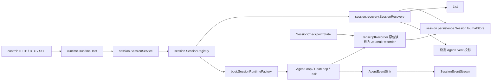
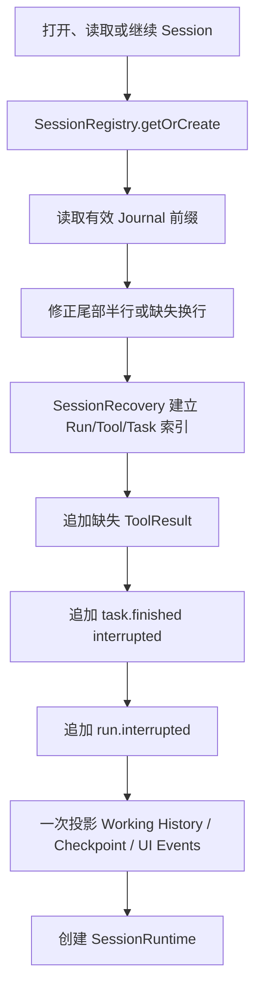

# Veyra 中断恢复机制设计

## 1. 文档状态

- 日期：2026-08-02
- 状态：技术方案，尚未实施
- 适用项目：Veyra Agent Harness
- 本阶段目标：L1 会话可恢复、L2 悬挂状态可收敛
- 不兼容策略：不读取、不迁移、不双写旧 transcript 格式
- 设计原则：针对本地单进程 Coding Agent，只补齐恢复闭环，不引入 L3/L4 工作流基础设施

参考资料：

- [Agent 崩溃恢复机制：从 Checkpoint 到副作用一致性](https://juejin.cn/post/7664806921777791039)

## 2. 背景与问题

Veyra 当前能够将部分消息写入 JSONL，并在进程重启后重新创建 `SessionRuntime`，但现有 transcript 只保存了有限文本，不能完整回答：

- Assistant 是否已经生成 ToolUse；
- 工具是否真正进入执行；
- ToolUse 是否存在对应 ToolResult；
- Run 是否已经到达终态；
- 子 Agent 或后台任务是否仍然悬挂；
- 上下文压缩使用的是哪个已提交 checkpoint；
- 如何用磁盘状态重建模型 history 和桌面端稳定 UI。

本设计不恢复 Java 调用栈，也不继续原 `process()`。进程异常退出后，系统读取已落盘事实，补齐最少的中断终态，然后创建新的 `SessionRuntime`。用户后续发送消息时创建新的 Run。

## 3. Agent 恢复能力的四个层级

### 3.1 L1：会话可恢复

L1 保存模型能够再次使用的会话历史，包括：

- UserMessage；
- AssistantMessage；
- Assistant ToolUse；
- 对应 ToolResult；
- Context Summary 和压缩 checkpoint；
- Session 基本设置与消息顺序。

进程重启后，用户可以重新打开 Session，模型能够基于合法消息序列处理新请求。

L1 回答：

> 进程退出前，哪些会话内容已经被稳定保存？

只恢复 UI 文本、却无法重新构造模型请求，不属于完整 L1。

### 3.2 L2：悬挂状态可收敛

L2 在 L1 基础上识别旧进程未完成的状态，并持久化为稳定结果：

- 没有终态的 Run 收敛为 `INTERRUPTED`；
- 已声明 ToolUse、但工具尚未执行的调用收敛为 `NOT_EXECUTED`；
- 工具已经开始、但没有稳定结果的调用收敛为 `UNKNOWN`；
- 未完成子 Agent 或后台任务收敛为 `INTERRUPTED`；
- 未完成模型流式响应直接丢弃。

L2 回答：

> 原进程已经不存在，哪些状态必须被修正，才能避免永久悬挂或形成非法模型协议？

L2 不自动继续旧 Run，也不确认未知工具副作用是否已经发生。

### 3.3 L3：执行可续跑

L3 将 Run 建模为持久化状态机，从 checkpoint 安全边界继续同一个 Run。它需要执行节点、pending writes、durable queue、执行所有权和可重入调度。

L3 回答：

> 如何在不从头执行的前提下，自动继续同一个 Run？

### 3.4 L4：副作用可恢复

L4 处理工具已经影响外部世界、但本地没有保存可靠结果的情况。它通常需要 operation ID、外部幂等键、结果查询、对账和 fencing。

L4 回答：

> 外部操作是否已经生效，系统能否在不重复副作用的前提下恢复？

### 3.5 层级边界

```text
L1：记住会话
  ↓
L2：修正悬挂状态
  ↓
L3：自动继续执行
  ↓
L4：确认外部副作用
```

Veyra 本阶段只承诺 L1 + L2，路线与 OpenCode、Codex、Pi 等交互式 Coding Agent 相同：恢复历史和中断状态，由用户发起新的 Run 继续任务。

## 4. 本阶段范围

### 4.1 实现内容

- 使用结构化 JSONL 保存 Session 稳定事实；
- 完整保存 Assistant ToolUse 和 ToolResult；
- 保存已提交的 `CompactionCheckpoint`；
- 恢复 Session 基本设置和空 Session；
- 首次访问 Session 时执行惰性恢复；
- 为悬挂 Tool、Task 和 Run 追加最少终态；
- 重建模型 `WorkingMessage` history；
- 从 Journal 投影桌面端稳定事件；
- 截断 JSONL 尾部半行，并处理完整但缺少换行的最后一行；
- 使用真实 Java 子进程强制终止验证恢复。

### 4.2 不实现内容

- 不自动继续旧 Run；
- 不保存 Runtime 调用栈或执行节点 checkpoint；
- 不自动重试中断工具；
- 不对 Shell、文件、浏览器或外部 API 做副作用对账；
- 不引入 durable queue、operation store、lease、heartbeat、fencing token 或 outbox；
- 不恢复旧审批 Future、线程、子 Agent 或后台进程；
- 不保存每个 token；
- 不读取、不迁移、不双写旧 transcript。

## 5. 场景约束

### 5.1 本地单进程

Veyra 同一 workspace 只有一个后端进程。进程重新启动时，旧进程已经死亡，因此不需要多 Worker lease、heartbeat 或 fencing。

### 5.2 单 Session 单未终止 Run

一个 Session 同时最多存在一个没有终态的 Run。桌面端在 `running` 时禁止再次提交；后端也必须原子检查并拒绝第二个 Run。

该约束符合当前交互式 Agent 使用方式，并避免为了排队 Run 引入：

- `RUN_ACCEPTED` 与 `RUN_STARTED` 两阶段；
- 跨 Run 消息重排；
- durable queue；
- 额外的逻辑消息序号字段。

现有 `SessionRunQueue` 可以保留，作为同 Session 串行执行的最后保障。第二个未终止 Run 使用现有 `RunSubmission.rejected()` 返回，不增加结果类型。

### 5.3 恢复按 Session 惰性执行

应用启动时不扫描全部历史 Session。用户打开、读取或继续某个 Session 时，复用 `SessionRegistry.getOrCreate()` 执行恢复：

```text
请求进入
  -> SessionService.getOrCreate(sessionId)
  -> SessionRegistry 未命中
  -> SessionRecovery.recover(sessionId)
  -> 追加缺失终态
  -> 使用恢复结果创建 SessionRuntime
  -> 注册并返回
```

不引入 `recoverAll()`、启动恢复批处理和应用就绪屏障。

## 6. 总体架构



Journal 和 SSE 是两条不同语义的通道：

- Journal sequence 是长期业务序号，用于恢复和审计；
- `AgentEvent.seq` 是当前进程的传输序号，用于实时 SSE；
- 稳定事实先写 Journal，再发布对应 SSE；
- token、thinking token 等临时 SSE 不进入 Journal。

两者可以复用事件名称和 payload 构造逻辑，但不能共用序号语义，也不能把所有 SSE 事件直接落盘。

## 7. 类型与职责

### 7.1 复用现有类型

| 需求 | 复用或演进的现有类型 |
| --- | --- |
| Run 请求 | `RunCommand` |
| Run 受理结果 | `RunSubmission` |
| 会话入口 | `SessionService` |
| 活动会话注册 | `SessionRegistry` |
| 会话设置 | `SessionState` |
| Runtime 持久化端口 | `TranscriptRecorder` 原位演进 |
| JSONL 读写 | `TranscriptStore` 原位演进 |
| history 消息 | `WorkingMessage` |
| 实时和 UI 稳定事件形状 | `AgentEvent` |
| 上下文压缩 | `CompactionCheckpoint`、`SessionCheckpointState` |
| 任务状态 | `TaskStatus`、`TaskNotification` |

`TaskStatus` 增加 `INTERRUPTED` 枚举值，不创建第二套任务状态模型。

### 7.2 最小新增类型

只新增两个核心类型：

```text
SessionJournalEntry
SessionRecovery
```

不新增：

- `SessionJournalEntryType`：第一版沿用稳定字符串类型；
- `SessionRunRequest`、`RunAcceptance`；
- `SessionFact`、`SessionFactSink`；
- `PersistentMessage` 继承体系；
- `SessionJournalReader`；
- `InterruptedRunRepairer`；
- `SessionProjection`、`RecoverySummary`、`RecoveryBatchResult`。

`SessionRecovery` 的返回值使用内部 record：

```java
final class SessionRecovery {
    RecoveryResult recover(String sessionId);

    record RecoveryResult(
            List<WorkingMessage> agentHistory,
            List<AgentEvent> stableEvents,
            Optional<CompactionCheckpoint> checkpoint,
            String lastRunStatus) {
    }
}
```

四个字段分别供 Agent history、桌面端重建、压缩状态恢复和 Session 状态展示使用，不再创建多个结果类。

### 7.3 模块职责

- `runtime`：判断稳定写入边界，不解析 JSONL；
- `session`：创建、查找、受理 Run，并在激活前触发恢复；
- `session.persistence`：定义 Journal 行，负责追加、读取和尾部修正；
- `session.recovery`：识别悬挂状态、追加最少终态并重建投影；
- `compaction`：决定稳定压缩边界并提交 checkpoint；
- `tool`、`subagent`：保持现有执行职责，不读取 Journal；
- `boot`：装配恢复后的 history 和 checkpoint，不扫描全部会话。

## 8. Session Journal

### 8.1 为什么使用 JSONL

- Veyra 是本地单进程 Harness；
- L1/L2 只需要顺序追加和重放；
- 当前已有 JSONL 路径和存储代码；
- 文件便于检查、调试和校招展示；
- 不需要为本阶段增加数据库依赖。

JSONL 不提供跨资源事务、exactly-once 或副作用恢复，不能被描述为工作流数据库。

### 8.2 记录格式

```java
record SessionJournalEntry(
        long sequence,
        String sessionId,
        String runId,
        String type,
        long timestampMs,
        Map<String, Object> payload) {
}
```

示例：

```json
{
  "sequence": 12,
  "sessionId": "session-1",
  "runId": "run-1",
  "type": "tool.execution.started",
  "timestampMs": 1785556800000,
  "payload": {
    "toolUseId": "call-1",
    "name": "FileEdit"
  }
}
```

第一版不增加 `entryId` 和 `schemaVersion`：

- sequence 已经提供 Session 内的稳定顺序；
- 修复幂等性使用 runId、toolCallId 和 taskId；
- 本阶段明确不兼容旧格式，不实现 schema 迁移。

### 8.3 稳定类型

第一版只保存以下稳定类型：

```text
session.created
session.settings.updated

run.started
run.completed
run.failed
run.cancelled
run.interrupted

user.message.recorded
assistant.message.recorded
context.summary.recorded

tool.execution.started
tool.result.recorded

task.started
task.finished
```

设计说明：

- `run.started` 表示 Run 已持久化受理；
- `run.interrupted` 只由恢复过程追加；
- Assistant 事件必须保存完整 ToolUse；
- `tool.execution.started` 只表示真正进入工具执行；
- `tool.result.recorded` 同时承载真实、拒绝和合成 ToolResult；
- `task.finished.status` 可以是 completed、failed、killed 或 interrupted；
- 审批不单独持久化；
- 恢复说明从 `run.interrupted` 和合成 ToolResult 投影，不增加恢复说明事件。

### 8.4 关键 payload

| 类型 | 必需数据 |
| --- | --- |
| `session.created` | workingDir、permissionMode、创建时间 |
| `session.settings.updated` | 完整设置快照 |
| `run.started` | mode、受理时间 |
| `user.message.recorded` | 完整用户输入 |
| `assistant.message.recorded` | text、thinking、完整 toolCalls |
| `context.summary.recorded` | `CompactionCheckpoint` 三个现有字段 |
| `tool.execution.started` | toolUseId、name |
| `tool.result.recorded` | toolUseId、name、success、content |
| `task.started` | taskId、taskType、描述 |
| `task.finished` | taskId、status、结果或中断摘要 |
| Run 终态 | reason、完成时间 |

payload 继续使用 `Map<String, Object>`，不为每种事件创建 payload 类。

## 9. 正常写入协议

### 9.1 Session 创建与设置

```text
1. 生成 sessionId
2. 创建尚未注册的 SessionRuntime
3. 追加并刷盘 session.created
4. 注册 SessionRuntime
5. 返回 SessionState
```

空 Session 通过 `session.created` 成为稳定事实，因此重启后仍可列出和打开。

设置更新采用完整快照：先追加并刷盘 `session.settings.updated`，成功后再替换当前 `PermissionContext`。恢复采用 sequence 最大的设置快照，不引入 patch 合并协议。

### 9.2 Run 受理

继续使用 `RunCommand` 和 `RunSubmission`：

```text
1. SessionRuntime 原子检查当前没有未终止 Run
2. RuntimeHost 创建 RunCommand
3. 追加 run.started
4. 追加 user.message.recorded
5. 强制刷盘
6. 加入 SessionRunQueue
7. 返回 RunSubmission.accepted(runId)
```

只有 Run 和 UserMessage 都已稳定写入并成功入队，才返回 accepted。

如果写入失败，不入队、不返回 accepted。如果刷盘后入队失败，追加 `run.failed(reason=enqueue_failed)` 并释放运行标记。进程在刷盘后、入队前直接退出时，恢复将其收敛为 interrupted，不自动执行。

AgentLoop 使用已经持久化的首条 UserMessage，不重复写入。

### 9.3 模型输出

- token 和 thinking token 只发 SSE；
- 得到完整 AiMessage 后才追加 `assistant.message.recorded`；
- ToolUse 必须完整保存 toolCallId、名称和参数；
- Journal 写入成功后，消息才进入稳定 Working History；
- 进程在流式期间退出时，未完成响应直接丢弃。

### 9.4 工具调用与实际执行

现有 `tool.call.started` 是 UI 事件，表示模型已经声明工具调用或进入授权阶段，不能作为实际执行事实。

真正工具执行顺序必须是：

```text
1. assistant.message.recorded 已落盘
2. 权限判断和用户审批完成
3. 追加并刷盘 tool.execution.started
4. 调用 ToolService.execute
5. 追加并刷盘 tool.result.recorded
6. ToolResultMessage 加入稳定 Working History
```

`tool.execution.started` 必须紧邻实际调用之前，不能在权限判断完成时提前写入。

### 9.5 Task 生命周期

子 Agent 和后台任务共用：

```text
task.started
task.finished
```

任务创建成功并获得 taskId 后写 `task.started`；正常完成、失败或停止时写 `task.finished`。内部子 Agent step、partial token 和线程状态不进入 Journal。

### 9.6 压缩 checkpoint

`SessionCheckpointState` 是现有唯一 checkpoint 提交边界。它使用 Java `Consumer<CompactionCheckpoint>` 接收持久化回调：

```text
生成 CheckpointCandidate
  -> 构造下一个 CompactionCheckpoint
  -> 追加并刷盘 context.summary.recorded
  -> 更新 SessionCheckpointState.current
```

持久化失败时不得更新 current。前台压缩和后台 `SessionSummaryCoordinator` 都通过同一个 commit 边界，不重复编写持久化逻辑。

### 9.7 Run 终态

```text
1. 最终稳定消息或错误结果落盘
2. 追加并刷盘一个 Run 终态
3. 发布对应 SSE
4. 释放 Session 未终止 Run 标记
```

每个 Run 只能有一个终态。AgentLoop 和 ChatLoop 应通过统一终态出口选择 completed、failed 或 cancelled，不能先发送 failed 再发送 completed。

## 10. 恢复与最小写回

### 10.1 为什么写回

纯读时投影可以得到稳定视图，但原始 Journal 永远保留悬挂状态，每次冷加载都要再次修复。Veyra 选择 Open Managed Agents/Codex 风格的最小写回，使会话恢复一次后持久收敛。

恢复写回不是 L3 续跑，只是补充已经能够从现有事实确定的终态。

### 10.2 恢复流程



具体步骤：

1. 读取并校验 Journal；
2. 找到没有 ToolResult 的 Assistant ToolUse；
3. 根据 `tool.execution.started` 是否存在追加合成 ToolResult；
4. 为 started 但无 finished 的任务追加 interrupted 终态；
5. 为没有终态的 Run 追加 `run.interrupted`；
6. 将新追加记录直接加入本次内存记录列表，不进行第二次磁盘全量读取；
7. 从最终记录列表重建 Working History、checkpoint、lastRunStatus 和稳定 UI 事件；
8. 创建并注册 SessionRuntime。

恢复只在 Session 尚未激活时执行。`GET transcript/history` 必须先调用 `getOrCreate`，不能绕过恢复直接读取原始 Store；活动 Session 则直接读取稳定记录，不把当前正在运行的 Run 错误修复为 interrupted。

### 10.3 修复幂等性

不增加 repairKey 或 entryId，直接使用自然业务标识：

```text
runId 已存在任一 Run 终态
  -> 不追加 run.interrupted

toolCallId 已存在 tool.result.recorded
  -> 不追加合成结果

taskId 已存在 task.finished
  -> 不追加 interrupted 结果
```

如果恢复写到一半再次崩溃，下次只补仍缺失的终态。例如合成 ToolResult 已写、Run 终态未写时，下一次只追加 `run.interrupted`。

## 11. 工具、审批和任务的中断语义

### 11.1 工具尚未开始：NOT_EXECUTED

存在 Assistant ToolUse，但不存在对应 `tool.execution.started`：

```xml
<tool-interrupted outcome="NOT_EXECUTED">
上一次运行在工具开始执行前中断，该工具没有执行。
</tool-interrupted>
```

恢复追加 `tool.result.recorded(success=false)`，content 使用上述稳定文本。这也覆盖等待审批时崩溃的情况。

审批对象和 Future 不持久化。新进程没有 pending approval，合成 ToolResult 会关闭旧工具协议和 UI 工具卡片。

### 11.2 工具已经开始：UNKNOWN

存在 `tool.execution.started`，但不存在 `tool.result.recorded`：

```xml
<tool-interrupted outcome="UNKNOWN">
工具在上一次运行期间中断，可能已经产生副作用，也可能没有完成。
系统没有自动重试。继续任务前请检查工作区和外部状态。
</tool-interrupted>
```

该结果只用于修复模型协议，不能伪装成真实成功或确定性失败，也不能触发自动重试。

### 11.3 已有真实 ToolResult

只要 `tool.result.recorded` 已经存在，就恢复真实结果，不生成占位结果。ToolResult 已落盘只能证明该工具结果可靠，不能把尚无 Run 终态的 Run 推断为 completed。

### 11.4 子 Agent 与后台任务

存在 `task.started`、但没有 `task.finished` 时，追加：

```text
task.finished
status = interrupted
content = 因后端进程退出而中断，未自动重新创建
```

本阶段不恢复任务线程、子进程、父子等待和 callback。恢复说明会把中断任务列给模型和 UI，用户可以在新 Run 中决定是否重新创建。

## 12. Working History 与上下文压缩

### 12.1 两种 sequence

系统明确区分：

- Journal sequence：每一条稳定事实的业务顺序；
- `WorkingMessage.sequence`：只计算进入模型原始 history 的消息顺序。

第一版不新增 messageSequence 字段。由于单 Session 只有一个未终止 Run，并且所有 `WorkingMessage.original` 都按加入顺序持久化，恢复时可以按消息记录顺序从 1 重新编号。

必须保证：

> 每一条 `WorkingMessage.original` 都对应一条稳定消息记录；`WorkingMessage.synthetic` 不占原始消息序号，也不单独持久化。

因此以下当前会加入 original history 的消息也必须通过统一 helper 记录：

- 用户输入；
- 完整 AssistantMessage；
- ToolResultMessage；
- 已注入主模型的 TaskNotification；
- Todo reminder 等稳定 UserMessage。

不得继续在 AgentLoop 多处分散执行“append history”和“record message”。应由一个现有 Recorder 边界保证二者顺序一致。

### 12.2 恢复 checkpoint

现有 `CompactionCheckpoint` 已包含：

```text
summaryText
coveredSequence
checkpointVersion
```

`coveredSequence` 指向 `WorkingMessage.sequence`，不是 Journal sequence。

恢复时：

1. 按消息记录顺序重建 `List<WorkingMessage>`；
2. 读取 checkpointVersion 最大的完整 `context.summary.recorded`；
3. 用恢复的 `CompactionCheckpoint` 初始化 `SessionCheckpointState`；
4. AgentLoop 继续使用原有压缩算法；
5. ChatLoop 使用 `WorkingMessage.unwrap()` 得到普通消息列表。

稳定压缩边界仍由 compaction 模块负责。`SessionRecovery` 只读取已提交 checkpoint，不重新判断压缩边界。

不增加 `summaryId`、`committed`、`firstRetainedSequence` 或第二套压缩状态类。`context.summary.recorded` 成功刷盘本身就是 checkpoint 已提交。

## 13. JSONL 崩溃安全

### 13.1 读取与尾部修正

- 每行必须是独立完整 JSON；
- 所有完整前缀行有效；
- 最后一段无法解析时，截断到最后一个完整换行；
- 最后一段是完整 JSON 但没有换行时，保留该记录并在继续追加前补换行；
- 中间行损坏时，当前 Session 加载失败并返回现有错误响应；
- 不引入 `RECOVERY_FAILED` 状态、只读模式或专用导出流程。

尾部必须物理修正。只在读取时忽略损坏内容、随后直接追加，会使新 JSON 连接到旧字节后面。

### 13.2 写入与同步

- 使用 UTF-8 无 BOM；
- 单次 append 写入完整 JSON 和换行；
- Store 内部分配递增 Journal sequence；
- 复用现有 Store 的全局 `synchronized`，不增加每 Session 锁表；
- 关键边界使用 `FileChannel.force(false)`；
- 普通稳定文本允许正常 flush；
- token 和临时 UI 事件不写 Journal。

关键强制刷盘边界：

- Session 创建和设置；
- Run 与首条 UserMessage 受理；
- 包含 ToolUse 的 AssistantMessage；
- `tool.execution.started`；
- `tool.result.recorded`；
- Task started/finished；
- CompactionCheckpoint；
- Run 终态和恢复终态。

## 14. 桌面端恢复

### 14.1 恢复目标

重启后恢复稳定 UI：

- User 和 Assistant 消息；
- 工具名称、参数和结果；
- 子 Agent/后台任务卡片及最终状态；
- Run completed、failed、cancelled 或 interrupted 状态；
- Session 工作目录和权限模式。

不恢复：

- partial token 动画；
- 未完成 thinking；
- 子 Agent 内部每一步动画；
- 已失效审批按钮；
- 旧 SSE 连接和传输游标。

### 14.2 复用稳定 AgentEvent 形状

现有 `TranscriptItem` 字段不足以表达 runId、工具参数和任务状态。为避免给它增加大量专用字段，历史接口返回从 Journal 投影的稳定事件，并复用 `AgentEvent` 的形状：

```text
seq
sessionId
runId
type
timestampMs
payload
```

这里的 seq 来自 Journal business sequence；实时 SSE 的 seq 仍是当前进程 transport sequence。前端在冷加载阶段只按数组顺序重建，不把两种 seq 混成同一个断线游标。

canonical Journal 类型在投影时一对一转换为现有前端事件类型：

| Journal 类型 | 稳定 AgentEvent 类型 |
| --- | --- |
| `run.started` | `run.started` |
| `user.message.recorded` | `user.message` |
| `assistant.message.recorded` | `assistant.message.completed` |
| `tool.result.recorded(success=true)` | `tool.call.completed` |
| `tool.result.recorded` 的 NOT_EXECUTED 内容 | `tool.call.rejected` |
| `tool.result.recorded` 的 UNKNOWN 或执行异常内容 | `tool.call.failed` |
| `task.started` | `task.started` |
| `task.finished(status=completed)` | `task.completed` |
| `task.finished(status=failed/interrupted)` | `task.failed` |
| `task.finished(status=killed)` | `task.killed` |
| Run completed/failed/cancelled/interrupted | 对应 Run 事件 |

一个 Journal 条目最多产生一个稳定 AgentEvent，因此可以沿用原 Journal sequence，不需要 projection sequence。

`assistant.message.completed` 的稳定 payload 必须包含完整 `toolCalls`。前端 reducer 在冷加载时根据 toolCalls 创建工具卡片；实时运行仍可使用已有 `tool.call.started` 更新动画。这样即使进程在 AssistantMessage 落盘后、授权事件发出前退出，恢复 UI 仍然拥有工具名称和参数。

`context.summary.recorded`、`tool.execution.started` 等仅用于模型恢复和中断判断的内部事实不返回给 UI。已持久化但只供模型使用的 `<task_notifications>`、`<system-reminder>` UserMessage 也不渲染为普通用户气泡。

控制层现有 transcript response 可以原位演进为稳定事件响应，不新增一组 Tool、Task、Run 专用 DTO。前端只需让现有 reducer 支持 `run.interrupted` 和 Assistant payload 中的 toolCalls。

### 14.3 UI 重建流程

```text
1. 桌面端请求 Session
2. 后端 getOrCreate，完成惰性恢复和最小写回
3. 桌面端请求稳定事件历史
4. 前端复用现有事件 reducer 重建消息、工具和任务状态
5. lastRunStatus=interrupted 时显示中断提示
6. 稳定历史渲染完成后订阅当前进程 SSE
```

`SessionState` 只增加：

```text
lastRunStatus
```

不增加：

- `hasInterruptedRun`：由 lastRunStatus 推导；
- `interruptedAt`：需要时取 Run 终态事件时间；
- `interruptionSummary`：由 interrupted 事件和 ToolResult 内容生成；
- `recoveryStatus/recoveryError`：恢复失败使用现有错误响应。

用户继续会话时创建新的 runId，不复用旧 Run。

## 15. 恢复不变量

实现必须保证：

1. 一个 Session 同时最多有一个未终止 Run。
2. 返回 accepted 的 Run 已存在 `run.started` 和首条 UserMessage。
3. 每个 Run 最多一个终态，终态不会倒退为 running。
4. 没有终态的旧 Run 在首次恢复后持久化为 interrupted。
5. 每个 Assistant ToolUse 在恢复 history 中有且只有一个 ToolResult。
6. 已有真实 ToolResult 时不得生成合成结果。
7. 无 execution started 的缺失结果只能修复为 NOT_EXECUTED。
8. 有 execution started、无结果时只能修复为 UNKNOWN，且不得自动执行工具。
9. 每个悬挂 taskId 最多追加一个 interrupted 终态。
10. 恢复过程自身崩溃后，下一次只补缺失终态。
11. 未完成模型流式响应不进入稳定 history。
12. 每个 `WorkingMessage.original` 都有对应稳定消息记录。
13. `CompactionCheckpoint.coveredSequence` 始终引用 WorkingMessage sequence。
14. 只有 compaction 模块提交的稳定 checkpoint 可以进入 Journal。
15. JSONL 尾部半行不会导致完整前缀丢失，继续追加前尾部已经物理修正。
16. Journal sequence 与 SSE transport sequence 不混用。
17. 用户继续始终创建新的 runId。

## 16. 故障验证

普通异常测试会执行 finally 和 graceful shutdown，不能证明崩溃恢复。测试必须启动独立 Java 子进程，在指定边界强制终止，再使用同一 Journal 重启。

### 16.1 最小 failpoint

```text
after_session_created
after_run_accepted
during_model_stream
after_assistant_tool_use_recorded
after_tool_execution_started
after_tool_result_recorded
while_task_running
after_checkpoint_recorded
after_final_message_before_run_terminal
while_recovery_writing_tool_result
while_appending_journal_line
```

### 16.2 最小测试矩阵

| 崩溃位置 | 重启后的预期结果 |
| --- | --- |
| Session 创建后 | 空 Session 和设置可恢复 |
| Run 受理后、执行前 | Run 写入 interrupted，不自动执行 |
| 模型流式过程中 | partial token 丢弃 |
| Assistant ToolUse 后、工具开始前 | 写入 NOT_EXECUTED ToolResult |
| Tool execution started 后 | 不重跑工具，写入 UNKNOWN ToolResult |
| ToolResult 后、Run 终态前 | 保留真实结果，Run 写入 interrupted |
| Task 运行中 | Task 和所属 Run 收敛为 interrupted |
| Checkpoint 落盘后 | 恢复 summary、coveredSequence、version |
| 最终消息后、Run 终态前 | 保留消息，Run 写入 interrupted |
| 恢复写入 ToolResult 后再次崩溃 | 下次只补 Run/Task 剩余终态 |
| JSONL 半行 | 截断半行并继续追加 |
| 完整 JSON 无换行 | 保留记录、补换行并继续追加 |
| 第二次重启 | 不产生重复 ToolResult、Task 或 Run 终态 |
| Run 正在执行时再次提交 | 后端稳定 rejected，Journal 不产生第二个 running Run |

测试同时检查：

- Journal 稳定事件序列；
- LangChain4j 消息顺序；
- ToolUse/ToolResult 一一对应；
- 工具没有被重复执行；
- WorkingMessage sequence 和 checkpoint 覆盖边界；
- 桌面端可只用 SessionState、稳定事件历史和新 SSE 重建 UI。

## 17. 关键取舍与设计目的

### 17.1 为什么不自动续跑

工具开始但结果未落盘时，Harness 无法证明副作用是否发生。自动续跑可能重复修改文件或调用外部 API。Veyra 将其记录为 UNKNOWN，由用户或新 Run 检查现场。

### 17.2 为什么恢复写回最少终态

读时投影虽然简单，但 Journal 永远悬挂，每次冷加载都要重复修复。写回 ToolResult、Task terminal 和 Run terminal 后，历史自解释，第二次恢复自然 no-op。

写回只使用已有业务标识做存在性判断，不引入通用 Repairer 框架。

### 17.3 为什么不持久化审批

审批 Future 不能跨进程恢复。ToolUse 已落盘而 execution started 不存在，已经足以证明工具未执行。补一个 NOT_EXECUTED ToolResult 就能同时关闭模型协议和旧 UI 状态。

### 17.4 为什么 Journal 与 SSE 分离

Journal 保存长期业务事实，SSE 传输当前进程实时增量。把 token、thinking 和临时状态全部写入 canonical history 会增加写放大，也会让模型 history 与 UI 动画混为一体。

### 17.5 为什么限制一个未终止 Run

当前桌面交互不需要用户在同一 Session 连续排队多个 Agent Run。后端明确限制后，可以直接按磁盘顺序恢复消息，不需要 durable queue、跨 Run 重排和额外受理状态机。

### 17.6 为什么惰性恢复

Session 只有在被打开或继续时才需要 Runtime 和模型 history。惰性恢复复用当前 Registry 生命周期，不扫描全部历史文件，也不会让所有历史 Session 常驻内存。

### 17.7 为什么只增加两个核心类型

当前项目已经存在 Run、Session、事件、存储、WorkingMessage、任务状态和压缩 checkpoint。新设计只增加现有类型无法表达的长期 Journal 行和恢复算法，不建立第二套领域模型。

## 18. 最终结论

Veyra 本阶段恢复机制为：

```text
独立业务序号的 JSONL Journal
  + 完整 ToolUse / ToolResult
  + 已提交 CompactionCheckpoint
  + 单 Session 单未终止 Run
  + 按 Session 惰性恢复
  + Tool / Task / Run 最小终态写回
  + Working History 与稳定 UI 重建
  + JSONL 尾部修正
  + SIGKILL 故障验证
```

它不恢复原 `process()`，不自动重试工具，也不引入工作流状态机和生产级分布式协调。

设计目的可以归纳为：

> 保存已经确认的会话事实；进程重启后，用最少且幂等的终态写回关闭悬挂协议，恢复模型上下文和桌面端稳定状态；对无法确认的副作用保持 UNKNOWN，由用户通过新的 Run 安全继续。
