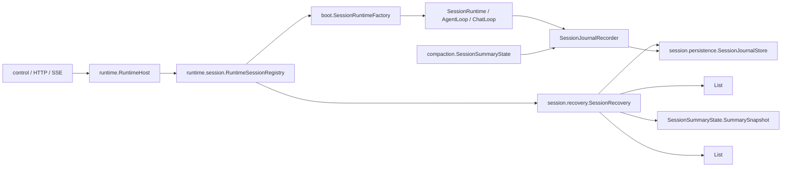
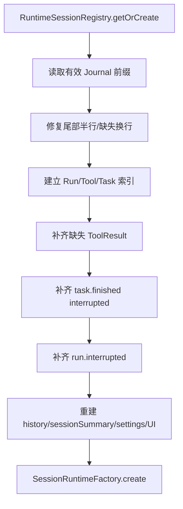

# Veyra 会话持久化与中断恢复实现设计

## 1. 文档状态

- 日期：2026-08-08
- 状态：实施规范
- 目标版本：Session Recovery L1 + L2
- 适用范围：本地单进程 Veyra Agent Harness
- 兼容策略：新 Journal 不读取、不迁移、不双写旧 transcript 行格式

本文是实现约束，不是远期架构设想。实现必须满足本文的不变量和故障测试；如代码与本文冲突，以本文描述的稳定事实、写入顺序和恢复语义为准。

## 2. 目标与边界

### 2.1 本期实现

1. 使用 append-only JSONL Journal 保存 Session 稳定事实。
2. 完整保存 User、Assistant ToolUse、ToolResult 和会话摘要快照。
3. 保存 Session 设置、Run 终态和任务终态。
4. 首次访问 Session 时惰性恢复，不在应用启动时扫描全部会话。
5. 将悬挂 Tool、Task、Run 幂等收敛为稳定终态。
6. 重建合法的 `WorkingMessage` history、`SessionSummaryState`、Session 设置和稳定 UI 事件。
7. 修复 JSONL 尾部半行，关键边界使用 `FileChannel.force(false)`。

### 2.2 明确不实现

- 不恢复 Java 调用栈、线程、Future、SSE 连接和内存队列。
- 不自动继续旧 Run，不复用旧 runId。
- 不自动重试中断工具。
- 不对文件、Shell、浏览器和外部 API 做副作用对账。
- 不实现 durable queue、lease、heartbeat、fencing、outbox 或 exactly-once。
- 不持久化 token、partial thinking、审批 Future 和临时 UI 动画。

本期恢复能力是：

```text
L1：恢复会话事实和合法模型历史
  +
L2：把旧进程遗留的悬挂协议收敛为终态
```

不是 L3 自动续跑，也不是 L4 副作用一致性。

### 2.3 术语约束

- `SessionSummarySnapshot`：摘要正文、覆盖消息序号和摘要版本组成的上下文压缩快照；它不能恢复执行位置。
- `Session Journal`：持久化 Session 稳定事实，用于重放和中断收敛。
- `Execution Checkpoint`：保留给未来能够描述执行节点、pending writes 和可续跑状态的真正执行断点；本期不实现。

本文不再把会话摘要称为 checkpoint，避免与未来的 `ExecutionCheckpoint` 混淆。

## 3. 核心原则

### 3.1 Journal 保存事实，不保存对象快照

`SessionRuntime`、Agent、工具、线程池和锁均由新进程重新创建。Journal 只保存已经确认发生的业务事实，并通过顺序重放得到恢复投影。

### 3.2 稳定事实先落盘

所有可被用户或模型观察的稳定状态遵循：

```text
append Journal
  -> 必要时 force
  -> 更新内存状态或执行副作用
  -> 发布 SSE
```

不得先发布“已完成”事件，再尝试持久化对应事实。

### 3.3 不确定副作用保持 UNKNOWN

工具已经开始、结果尚未落盘时，系统无法证明副作用是否完成。恢复只能生成 `UNKNOWN` ToolResult，并要求新的 Run 检查现场；不得自动重试。

### 3.4 单 Session 单未终止 Run

同一 Session 同时最多有一个未终止 Run。后端原子拒绝第二个 Run；现有 `SessionRunQueue` 继续作为串行执行兜底，而不是持久化队列。

## 4. 总体结构



职责边界：

| 模块 | 职责 |
| --- | --- |
| `runtime` | 决定 Run、消息、工具和任务的稳定写入时机 |
| `session.persistence` | Journal 行模型、递增序号、追加、force、读取和尾部修复 |
| `session.recovery` | 扫描事实、补最小终态、重建 history/sessionSummary/settings/UI 投影 |
| `compaction` | 产生和提交 Session Summary Snapshot；不知道 JSONL 细节 |
| `boot` | 使用恢复结果装配新的 Session Runtime |
| `control` | 返回稳定历史并订阅当前进程 SSE，不参与恢复判断 |

## 5. Journal 数据模型

```java
public record SessionJournalEntry(
        long sequence,
        String sessionId,
        String runId,
        String type,
        long timestampMs,
        Map<String, Object> payload
) {}
```

- `sequence`：Session 内严格递增的长期业务序号。
- `runId`：Session 级事实允许为空。
- `type`：第一版使用受控稳定字符串，不增加事件继承体系。
- `payload`：保存恢复该事实所需的完整数据。

稳定类型：

```text
session.created
session.settings.updated

run.started
run.completed
run.failed
run.cancelled
run.interrupted

user.message.recorded
assistant.message.recorded
context.summary.recorded

tool.execution.started
tool.result.recorded

task.started
task.finished
```

关键 payload：

| 类型 | 必需字段 |
| --- | --- |
| `session.created` | `workingDir`、`permissionMode`、`runMode` |
| `session.settings.updated` | 完整设置快照 |
| `run.started` | `mode`、`input` |
| `user.message.recorded` | `text`、`visible` |
| `assistant.message.recorded` | `text`、`thinking`、完整 `toolCalls` |
| `context.summary.recorded` | `summaryText`、`coveredSequence`、`summaryVersion` |
| `tool.execution.started` | `toolUseId`、`name` |
| `tool.result.recorded` | `toolUseId`、`name`、`success`、`outcome`、`content` |
| `task.started` | `taskId`、`taskType`、`description` |
| `task.finished` | `taskId`、`status`、`content` |
| Run 终态 | `reason`、可选 `content` |

Assistant 的 `toolCalls` 必须保存 ID、名称和完整参数，不能只保存文本。Journal 是模型历史的事实来源，不能暴露 LangChain4j 内部序列化格式。

## 6. 正常写入协议

### 6.1 创建 Session

```text
生成 sessionId
  -> 创建并注册仅存在于内存的 Runtime
  -> 返回 SessionState
```

创建接口本身不写 Journal。未发起过 Run 的空 Session 不进入历史列表，进程退出后直接消失。
`session.created` 延迟到首个 Run 被接受时写入，并保存当时最新的完整设置快照。

### 6.2 更新设置

```text
校验完整设置
  -> 未持久化 Session：只更新 PermissionContextStore
  -> 已持久化 Session：append + force session.settings.updated
  -> 更新 PermissionContextStore
```

首个 Run 之前的多次设置修改只保留最终内存值，由 `session.created` 一次性保存；首个 Run
之后继续追加完整的 `session.settings.updated`。恢复选择 sequence 最大的完整设置快照。

### 6.3 受理 Run

```text
原子检查 activeRunId 为空
  -> 生成 runId
  -> 若 Session 尚未持久化，append + force session.created
  -> append run.started
  -> append user.message.recorded
  -> force
  -> 设置 activeRunId
  -> enqueue
  -> 返回 accepted
```

写入失败则不入队。刷盘后入队失败时追加 `run.failed(reason=enqueue_failed)` 并释放 activeRunId。进程在刷盘后、入队前死亡，恢复将该 Run 收敛为 interrupted，不自动执行。

`AgentLoop` 和 `ChatLoop` 接收已持久化的首条输入，不能再次记录同一 UserMessage。

### 6.4 完整模型输出

- partial token/thinking 只发 SSE。
- 得到完整 `AiMessage` 后写 `assistant.message.recorded`。
- 包含 ToolUse 时强制刷盘。
- 写入成功后才能加入稳定 Working History并发布完成事件。

### 6.5 工具调用

```text
assistant.message.recorded 已落盘
  -> 权限判断和审批完成
  -> append + force tool.execution.started
  -> ToolService.execute
  -> append + force tool.result.recorded
  -> ToolResultMessage 加入稳定 history
  -> 发布完成/失败 SSE
```

`tool.execution.started` 必须紧邻真正执行之前；“模型声明工具”和“等待审批”不等于工具已开始。

拒绝执行也保存 `tool.result.recorded(outcome=REJECTED)`，但不保存 `tool.execution.started`。

### 6.6 Task 生命周期

子 Agent 和后台任务统一保存：

```text
task.started
task.finished(status=completed|failed|killed|interrupted)
```

内部 step、partial token 和线程状态不持久化。

### 6.7 Session Summary Snapshot 提交

`SessionSummaryState` 是唯一提交边界：

```text
生成 Candidate
  -> 在锁内验证 coveredSequence 单调推进
  -> 构造下一版本 SummarySnapshot
  -> append + force context.summary.recorded
  -> 更新 current
```

持久化失败时不得更新 `current`。前台 LLM Summary 和后台 Session Summary 均经过同一个提交方法。

`coveredSequence` 引用 `WorkingMessage.sequence`，不是 Journal sequence。

### 6.8 Run 终态

```text
最终稳定消息或错误结果已落盘
  -> append + force 唯一 Run 终态
  -> 发布 SSE
  -> 清除 activeRunId
```

## 7. 惰性恢复

首次打开、读取或继续 Session 时：



活动 Session 不运行 recovery。历史接口必须先激活/恢复 Session，不能直接读取可能仍悬挂的原始文件。

恢复结果：

```java
record RecoveryResult(
        List<WorkingMessage> agentHistory,
        List<AgentEvent> stableEvents,
        Optional<SessionSummaryState.SummarySnapshot> sessionSummary,
        SessionSettings settings,
        String lastRunStatus
) {}
```

## 8. 悬挂状态修复语义

### 8.1 Tool 尚未开始

存在 Assistant ToolUse，且不存在对应 `tool.execution.started` 和 ToolResult：

```xml
<tool-interrupted outcome="NOT_EXECUTED">
上一次运行在工具开始执行前中断，该工具没有执行。
</tool-interrupted>
```

恢复追加失败 ToolResult，关闭模型协议和旧 UI 工具卡片。

### 8.2 Tool 已开始但没有结果

存在 `tool.execution.started`，不存在 ToolResult：

```xml
<tool-interrupted outcome="UNKNOWN">
工具在上一次运行期间中断，可能已经产生副作用，也可能没有完成。
系统没有自动重试。继续任务前请检查工作区和外部状态。
</tool-interrupted>
```

该结果不表示确定失败，更不能触发自动执行。

### 8.3 Task 悬挂

存在 `task.started`、不存在 `task.finished` 时追加：

```text
task.finished
status = interrupted
content = 因后端进程退出而中断，未自动重新创建
```

### 8.4 Run 悬挂

存在 `run.started`、不存在 Run 终态时，在 Tool/Task 修复完成后追加：

```text
run.interrupted
reason = process_terminated
```

修复使用 `runId`、`toolUseId` 和 `taskId` 判断是否已有终态。恢复过程再次崩溃后，下次只补仍缺失的记录。

## 9. Working History 与 Session Summary 恢复

系统区分三种 sequence：

- Journal sequence：稳定事实的长期顺序。
- `WorkingMessage.sequence`：进入模型的原始消息顺序。
- SSE sequence：当前进程传输顺序。

恢复按 Journal 顺序把稳定消息重新编号为连续 `WorkingMessage.original`。每条 ToolUse 在恢复 history 中必须有且只有一个 ToolResult；synthetic boundary 不占原始序号，也不单独持久化。

读取 `summaryVersion` 最大的完整 `context.summary.recorded` 初始化 `SessionSummaryState`。恢复器不重新生成摘要、不重新判断压缩边界。

## 10. JSONL 崩溃安全

- 所有会话持久化内容位于 `~/.veyra/sessions/projects/{workspace-key}/`；不得写入工作区、进程当前目录或其他用户数据目录。
- UTF-8，无 BOM，每条记录独占一行。
- 新格式使用 `{sessionId}.journal.jsonl`，与旧 `{sessionId}.jsonl` transcript 物理隔离。
- Store 在单进程内串行分配 Session sequence 并追加。
- 尾部无法解析：物理截断至最后一个完整换行。
- 最后一段是完整 JSON 但无换行：保留并在继续追加前补换行。
- 中间行损坏：加载当前 Session 失败，不能跳过后继续。
- 关键事实使用 `FileChannel.force(false)`。

必须 force 的边界：Session 创建/设置、Run 受理、含 ToolUse 的 Assistant、工具 started/result、Task started/finished、会话摘要快照、Run 终态和恢复终态。

当前本地单进程使用 JSONL 足够；未来若支持多进程并发写，同一协议迁移到 SQLite/WAL。

## 11. Journal 与 SSE

Journal 保存长期事实，SSE 传输当前进程增量。两者序号不得混用。

冷加载顺序：

```text
激活 Session 并完成 recovery
  -> 获取 Journal 投影的稳定历史事件
  -> 前端 reducer 重建 UI
  -> 订阅当前进程 SSE
```

`context.summary.recorded`、`tool.execution.started` 等内部事实不投影为普通 UI 消息。

## 12. 现有代码改造映射

| 当前类型 | 改造 |
| --- | --- |
| `TranscriptEntry` | 替换为 `SessionJournalEntry` |
| `TranscriptStore` | 演进为崩溃安全的 `SessionJournalStore` |
| `TranscriptRecorder` | 演进为稳定事实记录端口 |
| `TranscriptRestorer` | 替换为 `SessionRecovery` |
| `RuntimeSessionRegistry` | 未激活时先 recovery，再创建 Runtime |
| `RuntimeHost` | Session 创建/设置/Run 受理先落盘 |
| `RunCoordinator` | 统一写唯一 Run 终态 |
| `AgentLoop`/`ChatLoop` | 使用已持久化输入，完整输出先落盘后进 history |
| `AgentToolCoordinator` | 在真实调用前写 started，结果先落盘后进 history |
| `SessionSummaryState` | 构造时接收恢复值和持久化回调 |
| `SessionRuntimeFactory` | 接收恢复 history/sessionSummary/settings/lastRunStatus |

## 13. 恢复不变量

1. 一个 Session 同时最多一个未终止 Run。
2. 返回 accepted 的 Run 已稳定保存 `run.started` 和首条 UserMessage。
3. 每个 Run 最多一个终态。
4. 旧进程无终态 Run 首次恢复后持久收敛为 interrupted。
5. 每个 Assistant ToolUse 在恢复 history 中恰好一个 ToolResult。
6. 已有真实 ToolResult 时不生成合成结果。
7. 无 started 的缺失结果只能是 NOT_EXECUTED。
8. 有 started、无结果时只能是 UNKNOWN，且不得自动执行。
9. 悬挂 Task 最多追加一个 interrupted 终态。
10. 恢复重复执行不会产生重复修复记录。
11. partial 模型输出不进入稳定 history。
12. 每个 `WorkingMessage.original` 对应一条稳定消息事实。
13. Session Summary Snapshot 的覆盖位置引用 WorkingMessage sequence。
14. Session Summary Snapshot 只有 force 成功后才对运行时可见。
15. Journal sequence 与 SSE sequence 不混用。
16. 用户继续任务始终创建新的 runId。

## 14. 实施与验收顺序

### 阶段 A：Journal 基础

- 行模型、序号、追加、force、读取和尾部修复。
- 完整 Assistant ToolUse/ToolResult 编解码。
- Session 列表和稳定历史投影。

### 阶段 B：生命周期接入

- Session 创建/设置。
- Run 原子受理和唯一终态。
- Tool/Task 稳定写入边界。

### 阶段 C：恢复与 Session Summary

- `SessionRecovery` 幂等修复。
- history、settings、lastRunStatus 和 Session Summary Snapshot 重建。
- `SessionSummaryState` 先持久化后发布。

### 阶段 D：故障验证

真实 Java 子进程在以下 failpoint 强制终止：

```text
after_session_created
after_run_accepted
during_model_stream
after_assistant_tool_use_recorded
after_tool_execution_started
after_tool_result_recorded
while_task_running
after_session_summary_recorded
after_final_message_before_run_terminal
while_recovery_writing_tool_result
while_appending_journal_line
```

测试同时验证 Journal 顺序、ToolUse/ToolResult 一一对应、无工具重复执行、摘要覆盖位置、第二次恢复 no-op 和桌面端稳定状态重建。

## 15. 最终语义

Veyra 恢复的是已确认会话事实，而不是旧进程执行现场：

```text
Durable Session Journal
  + 完整模型协议
  + 持久化 Session Summary Snapshot
  + 惰性重放
  + 悬挂 Tool/Task/Run 最小终态写回
  + 新 Run 检查并继续
```

无法确认的副作用保持 UNKNOWN。这个边界比自动续跑更保守，但能保证恢复后的模型历史合法、状态可解释且不会因为重试而重复产生副作用。
