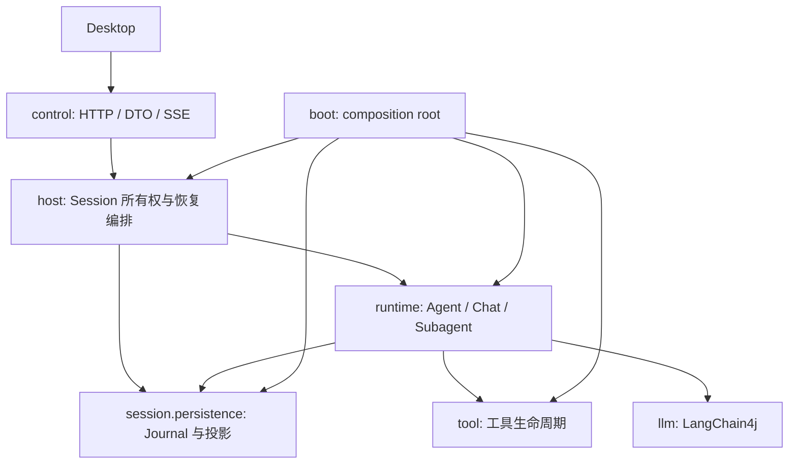
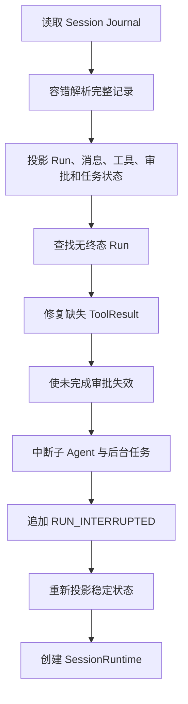

# Veyra 中断恢复机制设计

## 1. 文档状态

- 适用项目：Veyra Agent Harness
- 适用范围：后端 `cn.ayice.veyra` 运行时与桌面端恢复交互
- 目标能力：L1 会话可恢复、L2 悬挂状态可收敛
- 不兼容策略：不读取、不迁移、不双写旧 transcript 格式
- 架构约束：恢复能力归属 `session`，由 `control -> runtime -> session` 单向进入，不反向依赖运行编排层

## 2. 背景

Veyra 当前能够持久化部分会话消息，并在后端重启后重新创建 SessionRuntime。现有恢复更接近“重新打开历史会话”，还不能完整表达一次 Agent Run 在异常退出前的执行事实：

- Assistant 可能已经生成工具调用，但持久化记录只保留正文；
- 工具可能已经开始执行，但还没有保存结果；
- 用户可能正在处理工具审批；
- 子 Agent 或后台任务可能仍被标记为运行中；
- SSE 客户端可能已经看到部分内容，但 Session 中没有对应的稳定终态；
- Run 可能永久停留在逻辑上的运行状态。

完整的自动续跑需要 checkpoint、工具幂等、外部对账、执行所有权和副作用恢复等机制。对于本地单实例、面向校招展示的 Veyra，这会显著扩大系统边界，并把项目演变成小型工作流平台。

本设计采用更符合当前体量的恢复目标：后端异常退出后，系统不恢复原 Java 调用栈，也不自动继续原 `process()`；系统只负责保存会话事实、修复模型消息协议，并使悬挂的 Run、工具、审批和任务收敛到稳定状态。

## 3. Agent 恢复能力的四个层级

Agent 崩溃恢复不是一个单独的开关。按照系统在重启后能够回答的问题，可以分为四个层级。

### 3.1 L1：会话可恢复

L1 保存模型能够再次使用的会话历史，包括：

- UserMessage；
- AssistantMessage；
- Assistant 发起的 ToolUse；
- 与 ToolUse 对应的 ToolResult；
- Context Summary 和压缩边界；
- Session 的基本设置与消息顺序。

进程重启后，用户可以重新打开 Session，模型能够基于恢复后的合法消息序列处理新的请求。

L1 回答的是：

> 进程退出前，哪些会话内容已经被稳定保存？

仅恢复 Assistant 文本而丢失 ToolUse，或者只展示 UI 历史却无法重新构造模型请求，都不能视为完整 L1。

### 3.2 L2：悬挂状态可收敛

L2 在 L1 之上识别进程退出时仍处于运行状态的对象，并将它们转换成稳定、可解释的终态，包括：

- 没有终态的 Run；
- 已经声明 ToolUse 但缺少 ToolResult 的工具调用；
- 已创建但没有完成决定的工具审批；
- 仍标记为 running 的子 Agent；
- 仍标记为 running 的后台任务；
- 只存在部分流式输出的模型调用。

这些对象在重启后不能继续显示为 running，也不能假装正常完成。系统应根据已有事实将它们收敛为 `INTERRUPTED`、`EXPIRED`、`UNKNOWN` 或 `NOT_EXECUTED`。

L2 回答的是：

> 进程已经不存在，哪些内存状态必须被修正，才能避免永久悬挂或形成非法协议？

L2 不要求自动继续原 Run，也不要求确认工具副作用是否已经发生。

### 3.3 L3：执行可续跑

L3 将一次 Run 建模为可持久化状态机，通过 checkpoint、pending writes 和可重入调度从安全边界继续原 Run。

它需要处理：

- 当前执行节点和下一步路由；
- checkpoint 与工具结果的应用关系；
- 重复派发和执行所有权；
- 父子 Agent 的持久化等待关系；
- 已完成步骤复用与未完成步骤重新调度。

L3 回答的是：

> 如何在不从头执行的前提下，自动继续同一个 Run？

### 3.4 L4：副作用可恢复

L4 进一步处理工具已经影响外部世界、但本地没有保存可靠结果的情况，例如：

- 邮件已经发送但响应丢失；
- Bash 已经修改外部系统但进程退出；
- 文件写入完成但 ToolResult 尚未持久化；
- 远端 Job 已创建但本地没有保存 Job ID。

L4 通常需要稳定 operation ID、外部幂等键、结果查询、对账、执行 fencing 和人工确认。

L4 回答的是：

> 外部操作究竟有没有生效，系统能否在不重复副作用的前提下恢复？

通用 Harness 无法默认保证所有工具的 L4，因为 Shell、浏览器和许多外部 API 不与本地状态共享事务。

### 3.5 层级之间的边界

```text
L1：记住会话
  ↓
L2：修正悬挂状态
  ↓
L3：自动继续执行
  ↓
L4：确认外部副作用
```

较高层级依赖较低层级提供的事实，但每升一级都会显著增加状态、并发、持久化和测试复杂度。项目应明确当前承诺的最高层级，不能把“重新打开会话”描述为自动续跑，也不能把“补充失败消息”描述为副作用恢复。

## 4. 本阶段范围：只实现 L1 + L2

Veyra 当前阶段只实现：

```text
L1：会话可恢复
+
L2：悬挂状态可收敛
```

### 4.1 L1 交付能力

- 使用结构化 Session Journal 保存完整消息；
- 保存 Assistant ToolUse 的名称、参数和稳定 toolCallId；
- 保存真实 ToolResult，并在恢复时重新建立一一对应关系；
- 恢复 Context Summary、消息顺序和 Session 基本设置；
- 将稳定持久化消息重新映射为 LangChain4j ChatMessage；
- 忽略崩溃产生的 JSONL 截断尾行，同时保留完整前缀。

### 4.2 L2 交付能力

- 无终态 Run 收敛为 `INTERRUPTED`；
- 有 ToolUse、无 ToolResult 的工具调用补充合成结果；
- 已写执行开始事实的工具标记为 `UNKNOWN`，不自动重试；
- 尚未获得执行许可的工具标记为 `NOT_EXECUTED`；
- 未完成审批收敛为 `EXPIRED`；
- 未完成子 Agent 和后台任务收敛为 `INTERRUPTED`；
- 未完成模型流式响应直接丢弃，不进入稳定 history；
- Repairer 重复执行不会生成重复修复记录。

### 4.3 本阶段不包含

- 不自动恢复或继续旧 Run；
- 不提供专用的 continuation/resume 执行协议；
- 不保存 Kernel 执行节点或调用栈 checkpoint；
- 不自动重试中断工具；
- 不对 Bash、外部 API 或远端任务执行副作用对账；
- 不引入 operation store、lease、heartbeat、fencing token 和 durable outbox；
- 不恢复正在运行的 Shell、浏览器、子 Agent 或后台进程；
- 不读取、不迁移、不双写旧 transcript。

恢复完成后，用户仍可像普通会话一样提交一条新消息，但这是一个新的 Run，属于正常交互，不属于 L3 自动续跑。

## 5. 设计目标

### 5.1 功能目标

后端在一次 Run 的任意阶段退出后，重新启动应能够：

1. 重新打开 Session，并恢复完整的 User、Assistant、ToolUse 和 ToolResult 消息。
2. 识别没有稳定终态的 Run，并将其收敛为 `INTERRUPTED`。
3. 识别已经开始但没有稳定结果的工具调用，并标记为 `UNKNOWN`。
4. 为缺失 ToolResult 的 Assistant ToolUse 补充合成结果，保持模型消息协议合法。
5. 使未完成审批自动失效，不保留无法恢复的内存 Future。
6. 将未完成子 Agent 和后台任务收敛为中断状态。
7. 向用户和模型明确说明上次执行被中断，禁止默认重试未知副作用。

### 5.2 安全目标

- 不因恢复而自动重复 Bash、文件修改或其他可能产生副作用的工具。
- 不把结果未知的工具伪装成成功或确定性失败。
- 不把不完整 Assistant 响应写入稳定模型历史。
- 不让已不存在的审批、子 Agent 或后台进程继续显示为运行中。
- 不让损坏的 JSONL 尾行导致整个 Session 无法恢复。

### 5.3 架构目标

- Control 仍然只能通过 RuntimeHost 进入运行时。
- Host 负责 Session 恢复编排，不解析具体模型协议。
- Conversation 负责 Journal、消息投影和中断修复规则。
- Kernel 保留 Agent/Chat/Subagent 三种执行策略，不引入工作流引擎。
- Tooling 负责暴露工具开始和结束事实，不依赖 Host。
- Boot 仍然是完整对象图的唯一装配点。

## 6. 总体架构



新增能力全部落入现有顶层模块，不增加新的顶层 `recovery`、`persistence` 或 `workflow` 包。

### 6.1 Conversation

`session.persistence` 新增：

- `SessionJournalEntry`：Journal 单行稳定协议；
- `SessionJournalEntryType`：事件类型；
- `SessionJournalStore`：append-only JSONL 存储；
- `SessionJournalReader`：容错读取；
- `SessionJournalProjector`：从 Journal 投影 Session/Run/Message 状态；
- `InterruptedRunRepairer`：识别并修复悬空状态；
- `PersistentMessageMapper`：稳定消息模型与 LangChain4j 消息互转；
- `SessionRecoveryResult`：恢复后的历史、Run 状态和修复摘要。

Conversation 负责这些对象，是因为它们决定模型能够看到什么，以及哪些会话事实能够跨进程保留。

### 6.2 Host

Host 新增或扩展：

- `SessionRecoveryService`：协调读取、投影、修复和 Runtime 创建；
- `SessionRegistry`：激活 Session 前调用恢复服务；
- `SessionRuntime`：暴露最近 Run 是否中断及恢复摘要；
- `RuntimeHost`：向 Control 提供恢复后的 Session 和 Run 状态。

Host 不解析 ToolUse，不直接修改 Journal payload，只协调 Conversation 提供的恢复结果。

### 6.3 Kernel

Kernel 保留当前循环实现，不改造成 checkpoint 状态机。它只增加稳定的 Journal 记录点：

- Run 开始；
- UserMessage 已保存；
- AssistantMessage 已完整生成；
- 工具调用准备开始；
- 工具调用完成；
- Run 完成、失败或取消；
- 子 Agent 创建和终止。

### 6.4 Tooling

Tooling 保持现有 `lookup -> validate -> permission -> approval -> execute -> normalize` 生命周期，只提供工具执行事实：

- 工具执行前产生稳定的 `ToolExecutionStarted` 数据；
- 工具执行后产生 `ToolExecutionFinished` 数据；
- 工具使用模型提供的 `toolCallId` 作为同一次调用的稳定标识；
- Tooling 不负责 Session Journal 存储。

Kernel 或 Boot 中的生命周期适配器将 Tooling 事实写入 Conversation Journal，从而避免 Tooling 反向依赖 Conversation。

## 7. Session Journal

### 7.1 选择 append-only JSONL 的原因

本设计仍使用 JSONL，而不引入 SQLite：

- Veyra 是单机单进程桌面 Harness；
- 目标是 L1/L2，不需要复杂事务和并发接管；
- append-only Journal 容易检查、调试和展示；
- 当前已有 JSONL 存储经验和路径隔离能力；
- 每条记录独立解析，尾部损坏可以局部丢弃；
- 不增加新的数据库依赖和运维概念。

JSONL 不承担 exactly-once 或多资源事务，因此不能被描述为完整工作流数据库。

### 7.2 统一记录格式

每一行采用统一 envelope：

```json
{
  "schemaVersion": 1,
  "entryId": "01J...",
  "sessionId": "session-1",
  "runId": "run-1",
  "sequence": 12,
  "type": "tool_execution_started",
  "timestamp": "2026-08-01T12:00:00Z",
  "payload": {}
}
```

字段语义：

| 字段 | 含义 |
| --- | --- |
| `schemaVersion` | 新 Journal 协议版本；不用于兼容旧 transcript |
| `entryId` | 单条记录唯一标识 |
| `sessionId` | Session 标识 |
| `runId` | 所属 Run；Session 级记录可为空 |
| `sequence` | Session 内严格递增序号 |
| `type` | Journal 事件类型 |
| `timestamp` | UTC 时间 |
| `payload` | 类型对应的稳定数据 |

### 7.3 Journal 类型

第一版定义：

```text
SESSION_CREATED
RUN_STARTED
USER_MESSAGE_RECORDED
ASSISTANT_MESSAGE_RECORDED
TOOL_EXECUTION_STARTED
TOOL_EXECUTION_FINISHED
APPROVAL_REQUESTED
APPROVAL_RESOLVED
SUBAGENT_STARTED
SUBAGENT_FINISHED
BACKGROUND_TASK_STARTED
BACKGROUND_TASK_FINISHED
RUN_COMPLETED
RUN_FAILED
RUN_CANCELLED
RUN_INTERRUPTED
RECOVERY_NOTE_RECORDED
```

Journal 类型表达已发生的事实，不使用 `UPDATE` 语义。恢复修复同样通过追加新事实完成，不修改已有行。

## 8. 稳定消息协议

### 8.1 消息类型

Veyra 定义独立于 LangChain4j 的持久化消息：

```text
PersistentMessage
|-- UserMessage
|-- AssistantMessage
|   |-- text
|   |-- thinking
|   `-- toolCalls[]
|-- ToolResultMessage
`-- ContextSummaryMessage
```

Assistant 工具调用必须完整保存：

```json
{
  "role": "assistant",
  "text": "",
  "toolCalls": [
    {
      "id": "call-1",
      "name": "FileEdit",
      "arguments": {
        "path": "README.md",
        "oldText": "old",
        "newText": "new"
      }
    }
  ]
}
```

对应工具结果：

```json
{
  "role": "tool_result",
  "toolCallId": "call-1",
  "toolName": "FileEdit",
  "success": true,
  "synthetic": false,
  "content": "文件修改成功"
}
```

### 8.2 设计目的

- 完整还原 Assistant ToolUse 与 ToolResult 协议链；
- 不把磁盘格式绑定到 LangChain4j 内部类；
- 恢复器可以精确判断哪些工具调用缺少结果；
- 模型不会因为丢失 ToolUse 而误判历史；
- 未来更换模型客户端时不需要修改 Journal 格式。

## 9. Run 状态模型

第一版仅保留五种终态语义：

```text
RUNNING
COMPLETED
FAILED
CANCELLED
INTERRUPTED
```

状态由 Journal 投影产生，而不是单独维护可变状态文件：

- 最近存在 `RUN_STARTED` 且不存在任何终态事件：`RUNNING`；
- 存在 `RUN_COMPLETED`：`COMPLETED`；
- 存在 `RUN_FAILED`：`FAILED`；
- 存在 `RUN_CANCELLED`：`CANCELLED`；
- 存在 `RUN_INTERRUPTED`：`INTERRUPTED`。

启动后不会保留投影得到的 `RUNNING`。所有没有终态的旧 Run 都必须由 Repairer 追加 `RUN_INTERRUPTED`，从而收敛为稳定状态。

### 9.1 设计目的

- 防止后端重启后 Run 永久显示为 running；
- 避免引入 lease、orphan、recovery owner 等分布式状态；
- 让投影可以完全从 append-only Journal 重建；
- 终态不会因内存状态丢失而倒退。

## 10. 正常写入顺序

### 10.1 Run 开始

```text
1. RUN_STARTED
2. USER_MESSAGE_RECORDED
3. AgentLoop 开始处理
```

`RUN_STARTED` 写入成功后才认为请求被当前 Session 接受。

### 10.2 模型返回普通文本

```text
1. 等待完整 AiMessage
2. ASSISTANT_MESSAGE_RECORDED
3. 加入稳定 history
4. RUN_COMPLETED
```

流式 token 只用于 UI，不进入 Journal。进程在流式过程中退出时，未完成响应直接丢弃。

### 10.3 模型返回工具调用

```text
1. 等待完整 AiMessage
2. ASSISTANT_MESSAGE_RECORDED，包含完整 toolCalls
3. 对每个工具执行授权和审批
4. 执行工具生命周期
```

只要工具可能被执行，对应 Assistant ToolUse 就必须先落盘。

### 10.4 工具执行

```text
1. TOOL_EXECUTION_STARTED
2. 调用 ToolService.execute
3. TOOL_EXECUTION_FINISHED
4. ToolResultMessage 加入稳定 history
```

如果在第 2 步或第 3 步之前退出，恢复器可以确定工具结果未知，但不能确定副作用是否发生。

### 10.5 Run 终止

```text
1. 最终稳定消息落盘
2. RUN_COMPLETED / RUN_FAILED / RUN_CANCELLED
3. 发布 SSE 终态事件
```

SSE 发布失败不影响 Session 恢复；桌面端重新打开 Session 时以 Journal 投影为准。

## 11. 启动恢复流程



详细流程：

1. `SessionJournalReader` 读取全部完整 JSONL 行。
2. `SessionJournalProjector` 构造 Session 当前投影。
3. `InterruptedRunRepairer` 查找没有终态的 Run。
4. 为每个缺失结果的 ToolUse 追加合成 `TOOL_EXECUTION_FINISHED`。
5. 为每个未完成审批追加 `APPROVAL_RESOLVED(EXPIRED)`。
6. 为每个未完成子 Agent 或后台任务追加中断结果。
7. 追加 `RUN_INTERRUPTED` 和恢复说明。
8. 再次投影 Journal，确保恢复结果稳定。
9. 将修复后的 PersistentMessage 转为 LangChain4j history。
10. 使用恢复后的 history 创建新的 SessionRuntime。

Repairer 必须幂等：第二次启动时不得重复添加合成 ToolResult 或第二个 `RUN_INTERRUPTED`。

## 12. 工具中断修复

### 12.1 判断规则

如果存在：

```text
ASSISTANT_MESSAGE_RECORDED 中包含 toolCallId
或 TOOL_EXECUTION_STARTED(toolCallId)
```

但不存在：

```text
TOOL_EXECUTION_FINISHED(toolCallId)
```

则恢复器追加合成结果：

```json
{
  "toolCallId": "call-1",
  "toolName": "Bash",
  "success": false,
  "synthetic": true,
  "outcome": "UNKNOWN",
  "content": "工具执行因 Agent 进程中断，最终结果未知，未自动重试。"
}
```

### 12.2 模型可见语义

合成 ToolResult 必须明确：

```xml
<tool-interrupted>
工具在上一次运行期间被中断。
该操作可能已经产生副作用，也可能尚未执行完成。
系统未自动重试。继续任务前请检查当前工作区和外部状态。
</tool-interrupted>
```

### 12.3 设计目的

- 保持每个 ToolUse 都有 ToolResult；
- 不让模型误以为工具从未执行；
- 不把 unknown 错误包装成普通确定性 failure；
- 不实现自动对账的情况下采取 fail-safe 行为；
- 将恢复判断交给新 Run 中的 Agent 和用户。

## 13. 审批恢复

审批状态从 Journal 投影：

```text
APPROVAL_REQUESTED
但不存在对应 APPROVAL_RESOLVED
```

恢复器追加：

```text
APPROVAL_RESOLVED
decision = EXPIRED
reason = BACKEND_RESTARTED
```

审批对应的工具调用补充确定性未执行结果：

```text
工具审批因后端重启失效，工具未获得执行许可，因此未执行。
```

这里可以使用 `NOT_EXECUTED`，而不是 `UNKNOWN`，前提是 `TOOL_EXECUTION_STARTED` 尚未写入。

### 13.1 设计目的

- 清除无法跨进程恢复的 Future；
- 防止桌面端显示永远无法处理的审批；
- 区分“尚未授权，因此未执行”和“已经开始，结果未知”；
- 用户继续任务时可以重新触发新的审批。

## 14. 子 Agent 与后台任务恢复

第一版不恢复正在运行的子 Agent 或后台进程。

如果存在 started 但没有 finished：

- 追加对应的 interrupted/failed 终态记录；
- 生成一次性 TaskNotification；
- Parent Run 收敛为 `INTERRUPTED`；
- 新 Run 根据当前任务状态决定是否重新创建任务。

子 Agent 通知示例：

```xml
<task-notification>
  <task-id>agent-1</task-id>
  <status>interrupted</status>
  <summary>子 Agent 因后端重启而中断，未自动重新创建。</summary>
</task-notification>
```

### 14.1 设计目的

- 避免引入 durable child run、父子事务和自动 join；
- 避免 Parent 恢复时重复创建 Child；
- 明确告知模型子任务没有可靠结果；
- 保持当前多 Agent 架构的复杂度可控。

## 15. 中断后的会话状态

中断恢复完成后，旧 Run 保持 `INTERRUPTED`，永不重新进入 `RUNNING`。

桌面端展示：

```text
上一次运行因后端退出而中断。
已持久化结果已经恢复；未完成工具没有自动重试。
提交新任务前建议检查工作区状态。
```

Repairer 在恢复历史中追加稳定的恢复说明：

```xml
<previous-run-interrupted>
上一次 Agent 运行意外中断。

- 已持久化的工具结果视为已完成；
- 标记 UNKNOWN 的工具可能产生过副作用，不要直接重复执行；
- 后续处理前检查工作区、Todo、Git diff 和相关外部状态；
- 无法确认高风险操作时询问用户。
</previous-run-interrupted>
```

恢复机制到此结束，不自动创建新 Run，也不提供特殊 continuation 协议。用户后续通过现有 Run 提交入口发送普通消息时，系统创建新的 `runId`；旧 Run 的历史和终态保持不变。

### 15.1 设计目的

- 让恢复能力严格停止在 L2，不隐含 L3 自动续跑；
- 后续模型能够看到中断事实和未知工具结果；
- 用户保留对未知副作用的最终决定权；
- 新旧 Run 的审计边界清晰；
- 不会出现同一个 Run 终态倒退的问题。

## 16. JSONL 崩溃安全

### 16.1 读取规则

- 每行必须是独立完整 JSON；
- 所有完整前缀行有效；
- 最后一行解析失败时视为崩溃产生的截断尾行并忽略；
- 中间行损坏时停止自动恢复并报告 Session Journal 损坏；
- sequence 重复、倒退或缺少关键字段时拒绝静默修复；
- 未知 `type` 在当前 schemaVersion 下视为数据错误，不做旧格式兼容。

### 16.2 写入规则

- 使用 UTF-8 无 BOM；
- 一次 append 写入完整 JSON、换行符；
- JournalStore 内部同步分配 sequence；
- 写入后 flush；
- 在关键状态边界调用 `FileChannel.force(false)`。

关键刷盘边界：

- `RUN_STARTED`；
- 包含 ToolUse 的 `ASSISTANT_MESSAGE_RECORDED`；
- `TOOL_EXECUTION_STARTED`；
- `TOOL_EXECUTION_FINISHED`；
- Run 终态；
- Recovery 修复完成。

流式 token、普通状态提示和高频 UI 事件不写 Journal。

### 16.3 设计目的

- 保证关键事实尽可能在进程退出前到达磁盘；
- 避免为每个 token 强制刷盘造成明显性能下降；
- 允许崩溃时最后一条记录部分写入；
- 不掩盖 Journal 中部损坏或协议错误。

## 17. API 与桌面端语义

本设计不要求保留旧 API 兼容性。新的 Session/Run 读模型至少提供：

```text
sessionId
lastRunId
lastRunStatus
interruptedAt
interruptionSummary
hasInterruptedRun
```

本阶段不新增 continuation 或 resume API。用户后续消息仍通过现有 Run 提交入口创建新 Run。

桌面端应区分：

- Run 失败：模型或工具给出了确定性失败；
- Run 取消：用户主动取消且执行已停止；
- Run 中断：后端异常退出，部分事实可能未知。

## 18. 恢复不变量

实现和测试必须保证：

1. 没有终态的旧 Run 在启动后最终变为 `INTERRUPTED`。
2. `COMPLETED`、`FAILED`、`CANCELLED` 和 `INTERRUPTED` 不倒退为 `RUNNING`。
3. 每个 Assistant ToolUse 在恢复历史中都有且只有一个 ToolResult。
4. 已有真实 ToolResult 时不得生成合成 ToolResult。
5. 已写 `TOOL_EXECUTION_STARTED` 但无结果时不得自动执行工具。
6. 未授权工具可以标记 `NOT_EXECUTED`，已开始工具只能标记 `UNKNOWN`。
7. 每个未完成审批最多生成一个 `EXPIRED` 决定。
8. 每个未完成任务最多生成一个中断通知。
9. Repairer 重复运行不会追加重复修复记录。
10. 用户继续始终创建新的 runId。
11. JSONL 截断尾行不会导致完整前缀丢失。
12. 中间数据损坏不会被静默忽略。

## 19. 故障验证

普通异常测试不足以证明中断恢复，因为 finally、close 和 graceful shutdown 仍可能执行。必须增加独立 Java 子进程的强制终止测试。

### 19.1 测试控制方式

测试版运行时支持只在测试环境启用的 failpoint：

```text
after_run_started
during_model_stream
after_assistant_tool_use_recorded
after_tool_execution_started
after_tool_execution_finished
while_waiting_approval
while_subagent_running
after_final_message_before_run_completed
while_appending_journal_line
```

测试控制器等待指定 failpoint 后强制终止子进程，再启动新进程读取相同 Journal。

### 19.2 最小测试矩阵

| 崩溃位置 | 重启后的预期结果 |
| --- | --- |
| `RUN_STARTED` 后 | Run 变为 interrupted，已有 UserMessage 保留 |
| LLM 流式过程中 | partial token 丢弃，不产生 AssistantMessage |
| Assistant ToolUse 后 | 缺失工具得到合成 UNKNOWN ToolResult |
| Tool started 后 | 不自动重跑，结果标记 UNKNOWN |
| Tool finished 后 | 恢复真实结果，不生成合成结果 |
| 等待审批时 | 审批变为 EXPIRED，工具标记 NOT_EXECUTED |
| 子 Agent 运行中 | 子 Agent 和 Parent Run 均收敛为 interrupted |
| 最终消息后、终态前 | 保留最终消息，Run 保守收敛为 interrupted |
| JSONL 最后一行写入一半 | 忽略尾行并恢复完整前缀 |
| Repairer 再次运行 | Journal 不产生重复修复记录 |

### 19.3 验收重点

每个测试不只检查 HTTP 响应，还应直接检查：

- Journal 事件序列；
- 投影后的 Run 状态；
- 恢复后的 LangChain4j 消息顺序；
- ToolUse 和 ToolResult 是否一一对应；
- 是否发生工具重复执行；
- 重复启动是否产生重复修复事件。

## 20. 关键取舍

### 20.1 为什么不自动续跑

自动续跑必须知道工具是否已经产生副作用。对于 Bash、外部 CLI 和未提供幂等键的操作，这个事实通常无法可靠判断。自动恢复会产生重复修改、重复消息和破坏性操作风险。

后续任务由用户按普通会话方式重新发起。这不是恢复旧 Run，也不属于 L3；它把不可判断的副作用风险明确保留给用户和下一次正常执行。

### 20.2 为什么不保存每个 token

partial token 不是稳定模型消息。保存它们会增加磁盘写入和恢复分支，却不能继续原模型流。恢复时直接丢弃不完整响应更简单、确定。

### 20.3 为什么保留 JSONL

L1/L2 只需要可靠的事实追加和顺序重放，不需要跨 Worker 事务、租约和并发接管。JSONL 更符合本地 Harness 的体量，也便于在校招展示中解释和检查。

### 20.4 为什么不用旧 transcript 兼容层

旧格式缺少稳定 Run、ToolUse、审批和任务事实。通过兼容逻辑猜测旧记录会产生大量模糊分支。本设计直接使用新目录或新文件扩展名建立干净协议，旧数据不参与恢复。

### 20.5 为什么不引入工作流框架

Veyra 的核心仍然是 Agent Harness。当前 Agent、Chat 和 Subagent 策略已经明确，L2 恢复不要求把它们转换成通用 DAG 或节点工作流。引入工作流框架会扩大项目概念面，并破坏当前 Kernel 边界。

## 21. 最终结论

Veyra 的中断恢复机制不尝试恢复原进程中的 `AgentLoop.process()`，而是围绕三个问题设计：

1. 已经保存了哪些可靠事实；
2. 哪些运行状态在进程退出后必须收敛；
3. 哪些副作用无法确认，必须被明确标记而不能自动重试。

最终能力是：

```text
结构化 Session Journal
  + 完整 ToolUse / ToolResult 恢复
  + 悬空 Run、审批和任务修复
  + UNKNOWN 副作用显式表达
  + JSONL 截断尾行容错
  + SIGKILL 故障验证
```

本阶段的能力承诺明确停止在 L2，不包含原 Run 自动续跑。它的核心目的不是让 Agent 在重启后“假装从未中断”，而是保证：

> 不丢失已经确认的历史，不保留虚假的运行状态，不自动重复结果未知的副作用，并让用户能够基于可信现场安全地继续任务。
