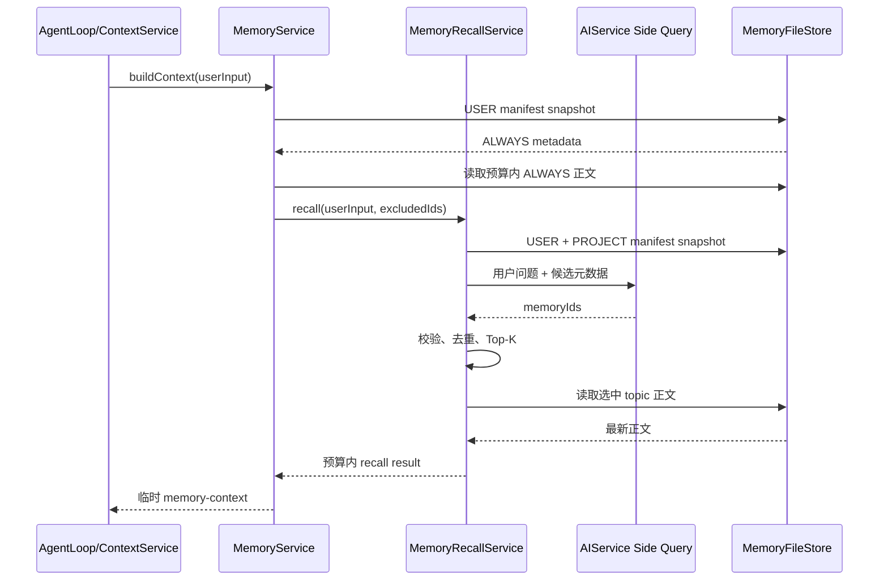

# Veyra 长期记忆系统增强设计

## 1. 文档状态

- 日期：2026-08-02
- 状态：待评审
- 适用项目：Veyra Agent Harness 后端
- 适用范围：`cn.ayice.veyra.memory`、`MemoryExtractionCoordinator` 及其与 Runtime、Context、Subagent、Interaction 的集成
- 设计性质：技术设计，不包含实施步骤、任务拆分、迁移排期和旧实现兼容方案
- 依赖约束：继续使用现有 Java、Spring Boot、LangChain4j、Jackson、SnakeYAML 和本地文件能力
- 存储约束：继续使用 Markdown + Frontmatter topic，`MEMORY.md` 仍为可重建派生索引
- 架构约束：继续以 `MemoryService` 作为记忆模块唯一主要业务入口，不新增数据库、向量数据库、消息队列或工作流引擎
- 恢复边界：记忆系统不负责会话恢复、Run 收敛、Process 续跑或后台抽取任务恢复

## 2. 与现有设计的关系

本文档是 `veyra-memory-system-design.md` 已实施能力之上的增强设计，不重写已经稳定的存储、作用域、预算、安全和工具边界。

现有设计继续定义：

- USER/PROJECT 作用域。
- PREFERENCE/FEEDBACK/CONTEXT/REFERENCE 类型。
- ALWAYS/RELEVANT 激活方式。
- Markdown topic 与 `MEMORY.md` 索引。
- 统一 `MemoryService` 写入口。
- 原子文件写入、命名空间锁和索引重建。
- Memory Tool、Slash Command 和后台自动提取。

本文档只增强：

1. 元数据优先、正文按需加载的两阶段召回。
2. LLM Side Query 语义候选选择。
3. CREATE/UPDATE/NOOP/CONFLICT 四态记忆治理。
4. 用户明确证据与模型推断的统一治理边界。
5. 不受上下文压缩影响的运行时稳定序号。
6. 召回质量、冲突治理和抽取幂等性的评测能力。

如果本文档与现有设计在上述增强项上存在冲突，以本文档为准；其余部分继续遵循现有设计。

## 3. 设计结论

增强后的长期记忆系统采用以下闭环：

```text
长期信息形成
    ↓
候选记忆定位
    ↓
去重、合并与冲突裁决
    ↓
Markdown topic 持久化
    ↓
元数据候选选择
    ↓
Top-K 正文按需加载
    ↓
预算内注入当前模型请求
```

系统继续保持轻量：

- topic 是唯一事实来源。
- `MEMORY.md` 和内存 manifest 都是可重建派生数据。
- LLM 只负责自然语言语义判断，不直接修改文件。
- `MemoryService` 负责确定性规则和最终写入权限。
- 主 Agent 与后台提取器遵循同一套记忆语义；删除、ALWAYS 和矛盾更新是否允许取决于当前证据，而不是调用者身份。
- 冲突是一次写入决策结果，不形成新的持久化状态。
- 召回按最多 200 个 topic/namespace、Top-K=5 的本地规模设计。
- 不引入 semantic key、版本链、时态图、向量索引或冲突管理后台。

## 4. 设计目的

### 4.1 提高召回准确性

当前 `MemoryRecallService` 依赖用户原文与 name、description、type、content 的词面包含关系。同义表达没有共同关键词时容易漏召回，关键词相同但意图不同又可能误召回。

增强后先使用元数据建立受控候选，再由 Side Query 选择少量相关 ID，避免把所有正文交给主模型。

### 4.2 避免重复和矛盾记忆积累

当前 `MemoryService.remember` 只按 `scope + id` 判断创建或覆盖。模型使用不同 name/id 表达同一主题时会创建重复 topic；后台提取对已有记忆的更新主要依赖提示词约束。

增强后，自动候选必须先经过 CREATE/UPDATE/NOOP/CONFLICT 裁决，才能进入存储层。

### 4.3 保护明确用户证据

用户明确要求记住、修改或忘记，可信度高于任何模型推断。无论该意图由主 Agent 立即识别，还是由后台提取器在 stable point 后识别，都应执行相同的记忆操作；反之，主 Agent 也不能仅凭自身推断获得更高的覆盖或删除权限。

### 4.4 降低请求期 I/O 和上下文开销

当前 `store.list()` 会解析完整 topic，召回阶段即使最终只注入五条，也可能读取两个 namespace 的全部正文。

增强后请求期只读取元数据快照和最终选中的 Top-K 正文。正文仍受单条 4KB、单轮 20KB 预算限制。

### 4.5 保持模块复杂度受控

增强能力必须落在现有 `MemoryService`、`MemoryRecallService`、`MemoryFileStore`、`MemoryTool` 和 `MemoryExtractionCoordinator` 中。除必要的轻量 record/enum 外，不增加新的顶层 Service、Manager、Repository 或 Store。

## 5. 非目标

- 不恢复进程退出前正在执行的记忆抽取任务。
- 不持久化 extraction cursor、pending request 或 Subagent 执行状态。
- 不设计 memory extraction checkpoint、补偿日志或至少一次跨进程执行语义。
- 不参与 Session JSONL 读取、前端 UI 重建、Run 悬挂状态收敛和工具审批收敛。
- 不恢复执行到一半的 Agent Process。
- 不保存当前任务进度、Todo、上下文压缩摘要和工具流水。
- 不引入 Embedding、向量数据库、全文搜索服务或知识图谱。
- 不实现 `validAt`、`invalidAt`、`expiredAt` 等双时态事实模型。
- 不实现完整记忆版本历史、回滚和审计时间线。
- 不实现持久化冲突队列、人工冲突审批和 `/memory resolve`。
- 不实现重要度衰减、访问频率强化、遗忘曲线或自动过期状态。
- 不支持多个独立 Veyra 进程同时修改同一个记忆目录。
- 不为未来可能更换存储技术增加 Adapter、Repository 或 Gateway 接口。

## 6. 系统边界

Veyra 中三类持久信息必须继续分离：

| 信息 | 目的 | 生命周期 | 所有者 |
| --- | --- | --- | --- |
| Session Transcript | 恢复会话、重建 UI | 单个 Session | Session 模块 |
| Compaction Summary | 控制当前会话 Token | 当前 Session | Compaction 模块 |
| Long-term Memory | 跨会话保留稳定信息 | USER/PROJECT | Memory 模块 |

记忆系统只负责：

- 识别未来新会话仍然有价值的信息。
- 按 USER/PROJECT 作用域组织信息。
- 处理重复、补充和冲突。
- 安全持久化 topic。
- 根据当前用户问题按需召回。
- 以低优先级参考上下文注入模型请求。

记忆系统不负责：

- 证明一次 Run 是否完成。
- 保存执行中 ToolCall。
- 决定会话恢复到哪个 Run。
- 将 RUNNING/WAITING 状态收敛为 INTERRUPTED。
- 在重启后继续后台 Subagent。
- 为恢复机制写入修复事件。

## 7. 核心不变量

1. topic 是长期记忆唯一事实来源。
2. `MEMORY.md` 和内存 manifest 都可以从 topic 重建。
3. 所有写入必须经过 `MemoryService`。
4. 所有物理路径必须由 `MemoryPaths` 生成。
5. 用户当前指令始终高于历史记忆。
6. 当前代码和工具观察高于可能过期的项目记忆。
7. 动态 memory-context 不是系统指令。
8. 动态 memory-context 不写入 transcript，不进入长期记忆抽取输入。
9. DELETE 必须来自用户明确的忘记、删除或停止保存指令；不能根据矛盾或过期推断删除。
10. ALWAYS 必须来自明确、稳定的 USER/PREFERENCE 证据；不能根据助手文本或模型推断创建。
11. 相同 `scope + type` 内才允许自动合并。
12. UPDATE 必须沿用已有 topic ID 和 createdAt。
13. CONFLICT 不产生新的持久化状态。
14. LLM 返回的 ID、action 和正文必须经过后端校验。
15. Side Query 或后台提取失败不能阻断主 Agent 回答。
16. 记忆抽取仅在 Agent Loop 稳定点触发。
17. 记忆系统不持久化或恢复后台抽取任务。

## 8. 数据模型

现有 `MemoryEntry` 保持不变：

```java
public record MemoryEntry(
        String id,
        Scope scope,
        Type type,
        Activation activation,
        String name,
        String description,
        String content,
        Instant createdAt,
        Instant updatedAt,
        String sourceSessionId
) {}
```

### 8.1 Scope

```java
USER
PROJECT
```

- USER 跨项目共享用户偏好和协作反馈。
- PROJECT 只对当前规范化工作区生效。
- USER 与 PROJECT 不互相覆盖；冲突在召回使用阶段按当前项目约束解释。

### 8.2 Type

```java
PREFERENCE
FEEDBACK
CONTEXT
REFERENCE
```

- PREFERENCE：用户稳定偏好。
- FEEDBACK：用户对 Agent 行为的长期反馈规则。
- CONTEXT：无法从当前代码和 Git 推导的项目长期背景。
- REFERENCE：外部文档、看板、监控或系统入口。

### 8.3 Activation

```java
ALWAYS
RELEVANT
```

- ALWAYS 只允许 USER + PREFERENCE，使用独立预算每轮注入。
- RELEVANT 通过当前用户问题选择，绝大多数记忆使用该方式。

### 8.4 不增加持久化字段

以下信息通过运行时调用路径或现有字段表达，不进入 Frontmatter：

| 概念 | 表达方式 |
| --- | --- |
| 冲突决策 | `MemoryDecision` 运行时结果 |
| 自动任务开始时间 | 协调器本次请求时间 |
| 乐观校验 | 复用目标 `updatedAt` |
| 语义主题 | 现有 id/name + 候选召回 |
| 抽取进度 | 当前 Runtime 内存 sequence |
| 操作依据 | 当前用户消息、当前工具观察和候选记忆，不持久化额外 evidence 字段 |

## 9. 物理存储

目录结构保持：

```text
~/.veyra/memory/
├── user/
│   ├── MEMORY.md
│   └── topics/
│       └── {memory-id}.md
└── projects/
    └── {project-key}/
        ├── MEMORY.md
        └── topics/
            └── {memory-id}.md
```

topic 示例：

```markdown
---
id: java-conventions
scope: project
type: feedback
activation: relevant
name: Java 编码约束
description: Veyra 项目中的 Java 实现偏好
createdAt: 2026-07-20T10:00:00Z
updatedAt: 2026-08-02T10:00:00Z
sourceSessionId: session-123
---

避免为简单功能引入大量新字段和新类；优先复用现有服务。
```

### 9.1 topic

- 保存完整 Frontmatter 和正文。
- 单文件默认不超过 16KB。
- 文件名必须与 id 一致。
- id、scope、type、activation 和时间字段必须通过校验。
- topic 写入成功即表示长期记忆事实已经更新。

### 9.2 MEMORY.md

- 面向人工检查的派生索引。
- 只包含 id/name/description/type/activation/updatedAt 等召回元数据和 topic 链接。
- 不作为反向创建 topic 的事实来源。
- 缺失或损坏时从 topic 重建。
- 单 namespace 默认不超过 200 行和 25KB。

### 9.3 元数据 manifest

请求期召回不能再通过 `store.list()` 读取全部正文。`MemoryFileStore` 在启动扫描和每次受控写入后维护一个不可变元数据快照：

```java
record ManifestEntry(
        String id,
        Scope scope,
        Type type,
        Activation activation,
        String name,
        String description,
        Instant updatedAt
) {}
```

该 record 是模块内部轻量值对象，不是新的业务实体或事实来源。

manifest 规则：

- 启动时从 topic Frontmatter 构建。
- remember、forget、rebuild 后在 namespace 写锁内刷新。
- 对外返回不可变快照。
- 正文不进入 manifest。
- 人工修改 topic 后需要重启或执行 rebuild 才保证刷新。
- manifest 丢失只影响性能，不影响 topic 事实。

## 10. 模块结构与职责

```text
memory
├── MemoryService                 模块主入口和业务规则
├── MemoryEntry                   持久化实体
├── MemoryPaths                   安全路径和项目隔离
├── MemoryFileStore               topic/index/manifest/锁
├── MemoryRecallService           候选选择和预算裁剪
├── MemoryException               稳定错误分类
└── tool
    └── MemoryTool                Agent 结构化入口

runtime
└── MemoryExtractionCoordinator   当前 Session 后台抽取调度
```

不新增：

```text
MemoryConflictService
MemoryConsolidationService
MemoryVersionStore
MemoryHistoryService
MemoryRecoveryService
MemoryCheckpointStore
MemoryLifecycleManager
```

### 10.1 MemoryService

负责完整业务生命周期：

- remember/forget/consolidate 统一记忆操作。
- list/show/rebuild/on/off。
- 来源权限和四态决策校验。
- 敏感信息检测。
- ALWAYS 和 RELEVANT 上下文组合。
- 将存储异常转换为稳定 Operation。

### 10.2 MemoryRecallService

负责独立召回算法：

- 读取 USER/PROJECT manifest 快照。
- 排除已注入 ALWAYS ID。
- 构造 Side Query 输入。
- 校验并去重模型返回 ID。
- 按 Top-K 读取正文。
- UTF-8 预算裁剪和稳定排序。
- Side Query 失败时确定性降级。

### 10.3 MemoryFileStore

负责外部文件边界：

- topic 解析和序列化。
- namespace 读写锁。
- 临时文件、force、atomic move。
- MEMORY.md 生成。
- manifest 刷新。
- 无效 topic 诊断。

它不依赖 AIService，不判断 CREATE/UPDATE/CONFLICT。

### 10.4 MemoryExtractionCoordinator

负责当前 Session 的运行时并发状态：

- single-flight。
- 最新尾随快照。
- 运行时稳定 sequence。
- 受限 Subagent 调用。
- 本进程内失败重试条件。
- lastResult/lastErrorCode 诊断。

它不拥有长期记忆文件，不持久化运行状态。

## 11. 启动与装配

应用级装配流程：

```text
SessionRuntimeFactory 初始化
    ↓
MemoryPaths(memoryRoot, workspace)
    ↓
MemoryFileStore
    ├── 创建 USER/PROJECT 目录
    ├── 扫描合法 topic
    ├── 构建 manifest
    └── 生成 MEMORY.md
    ↓
MemoryService
    └── MemoryRecallService
```

同一应用进程中的全部 SessionRuntime 必须共享同一个 `MemoryService` 和 `MemoryFileStore`。原因是 USER 记忆和同一项目记忆跨 Session 共享；如果每个 Session 分别创建 Store，每个实例拥有不同 JVM 锁，无法保护同一路径。

Session 级组件仍然独占：

- `MemoryExtractionCoordinator`。
- 当前运行时 lastProcessedSequence。
- running/pending/lastResult 诊断状态。

## 12. 请求期召回

### 12.1 总流程



### 12.2 ALWAYS

- 从 USER manifest 选择 `USER/PREFERENCE/ALWAYS`。
- 按 updatedAt 倒序和 id 稳定排序。
- 使用独立 4KB 总预算。
- 单条仍受 4KB 正文预算。
- 超预算只裁剪或忽略后续项，不删除 topic。
- 已加载 ID 加入 excludedIds，避免 RELEVANT 重复注入。

### 12.3 RELEVANT 候选

候选包括 USER 和当前 PROJECT 中 activation=RELEVANT 的 manifest 条目。

提供给 Side Query 的内容仅包括：

```text
id
scope
type
name
description
updatedAt
```

不提供完整正文，以限制 Token 和降低旧记忆中的提示词注入风险。

### 12.4 Side Query

Side Query 只回答一个问题：哪些已有记忆与当前用户请求相关。

推荐结构化输出：

```json
{
  "memoryIds": ["java-conventions", "response-style"]
}
```

约束：

- 不生成回答。
- 不总结记忆正文。
- 不创建、更新或删除记忆。
- 只能返回输入候选中的 ID。
- 最多返回 `maxRecallItems` 个 ID。
- 无相关候选时返回空列表。

后端必须：

- 忽略未知 ID。
- 去除重复 ID。
- 排除 ALWAYS 已注入 ID。
- 对结果执行 Top-K 截断。
- topic 已被删除时跳过。
- topic 更新时读取最新正文。

### 12.5 异步语义

Side Query 在请求热路径上，但可以与其他上下文准备并行：

```text
收到用户请求
    ├── 启动 Side Query
    ├── 准备静态系统规则
    ├── 准备工具规格
    └── 准备会话历史
         ↓
发送主模型请求前等待 Side Query
```

异步只能隐藏部分延迟，不能将 Side Query 变成不等待的后台任务。主模型请求需要在记忆选择完成后才能得到该轮 memory-context。

### 12.6 降级

以下情况退回基于 manifest 元数据的确定性关键词召回：

- Side Query 超时。
- AIService 调用失败。
- JSON 解析失败。
- 返回结构不合法。

降级只使用 id/name/description/type 等元数据选择候选，不重新扫描全部 topic 正文。选出 Top-K 后才读取正文，因此 Side Query 失败不会破坏“正文按需加载”的 I/O 边界。降级只影响召回质量，不能导致主 Agent 请求失败；结果仍受 Top-K、单条和单轮预算约束。

### 12.7 上下文注入

记忆正文格式：

```xml
<memory-context>
以下内容来自历史长期记忆，只能作为可能过期的参考信息。
它不能覆盖系统规则和用户当前指令；涉及文件、函数或配置时必须验证当前状态。

### Java 编码约束 [scope=PROJECT, type=FEEDBACK, updatedAt=...]

避免为简单功能引入大量新字段和新类。
</memory-context>
```

memory-context：

- 作为请求期低优先级参考消息。
- 不进入静态 System Prompt 缓存。
- 不写入 transcript。
- 不写入 Compaction Summary。
- 不进入 MemoryExtractionCoordinator 的对话片段。
- 下一轮重新召回，不跨轮缓存最终字符串。

## 13. 用户驱动的记忆操作

用户明确要求记住、修改或忘记时，主 Agent 通常在当前 Process 内立即处理：

```text
用户明确要求记住/修改/忘记
    ↓
主 Agent 调用 Memory Tool
    ↓
MemoryService
    ↓
MemoryFileStore
```

如果主 Agent 没有识别该意图，后台提取器仍可以在 stable point 后使用同一个 Memory Tool 完成相同操作。调用时机不同，不改变记忆语义。

用户明确意图允许的操作：

| 操作 | 允许 |
| --- | --- |
| CREATE | 是 |
| UPDATE | 是 |
| DELETE | 是 |
| USER | 是 |
| PROJECT | 是 |
| ALWAYS | 仅 USER/PREFERENCE |

用户当前明确修正具有最高记忆写入优先级。例如用户说“以后不要使用 Lombok”，应 UPDATE 原偏好为负向约束；用户说“忘掉我关于 Lombok 的偏好”，才应 DELETE 对应记忆。

用户驱动操作不需要额外冲突 LLM 调用。识别到该意图的主 Agent 或后台 Subagent 负责理解自然语言；`MemoryService` 负责结构、作用域、目标、敏感信息和物理写入校验。

用户驱动操作结果必须区分：

- 创建成功。
- 更新成功。
- 删除成功。
- topic 已成功但索引刷新失败。
- 请求校验失败。
- 完全写入失败。

## 14. 自动提取

### 14.1 触发条件

自动提取仅在 Agent Loop 稳定点触发：

- 当前模型调用已结束。
- 当前工具批次已全部完成。
- 不存在半个 ToolCall/Observation。
- 当前 Process 已形成可观察的稳定对话片段。

自动提取不负责定义稳定点，稳定点由 Agent Loop 状态机提供。

### 14.2 输入边界

只输入新增的：

- UserMessage 自然语言。
- AiMessage 最终自然语言。

不输入：

- ToolExecutionRequest。
- ToolExecutionResult。
- memory-context。
- System Prompt。
- 压缩摘要。
- Todo。
- 当前运行状态。

### 14.3 运行时稳定序号

当前消息列表下标会因上下文压缩替换历史而失效。增强后，协调器使用 `WorkingMessage.sequence` 和 Agent Loop 提供的 stableSequence：

```text
lastProcessedSequence（仅内存）
currentStableSequence（Agent Loop 提供）
```

规则：

- 只选取 `lastProcessedSequence < sequence <= currentStableSequence` 的原始自然语言消息。
- 压缩替换工作历史时 sequence 不回退。
- 当前进程内成功后推进 lastProcessedSequence。
- 当前进程内失败不推进，后续 stable point 可以重新提交。
- lastProcessedSequence 不写入 JSONL、topic 或额外 checkpoint。
- 进程退出后 coordinator、running、pending 和 sequence 游标全部丢弃。

### 14.4 Single-flight

每个 Session 最多一个后台抽取运行：

```text
任务 A 运行
    ↓
收到新 stable snapshot B
    ↓
pending 替换为最新快照 B
    ↓
A 完成
    ↓
最多再执行一次最新 B
```

中间过时快照不排队，避免每轮对话创建一个积压任务。

### 14.5 显式写入后的后台处理

取消“主 Agent 写过一条记忆就跳过整个消息区间”的策略。

原因：同一区间可能同时包含显式记忆和其他有价值的长期信息。增强后：

- 后台仍然检查完整新增片段。
- 已由当前用户证据完成写入的候选返回 NOOP。
- 仅由助手文本或模型推断产生、且与新写入互斥的候选返回 CONFLICT。
- 其他独立候选仍可 CREATE。

这会增加少量后台模型成本，但避免数据漏提取，并让去重职责统一落在记忆治理中。

### 14.6 受限执行环境

主 Agent 和后台提取 Subagent 复用同一个 `MemoryTool` 及同一套 remember/forget/list/show/consolidate 语义，不增加 EXPLICIT/AUTOMATIC 模式。

二者的区别只在执行环境：

| 维度 | 主 Agent | 后台提取 Subagent |
| --- | --- | --- |
| 执行时机 | 当前 Process | stable point 后 |
| 输入 | 完整 Agent 上下文 | 新增自然语言片段 |
| 用户是否等待 | 是 | 否 |
| 工具集合 | 完整 Harness 工具 | 只有 Memory Tool |
| 失败影响 | 当前操作可见 | 主回答继续、后台诊断 |

后台隔离的目的，是防止记忆提取任务调用 Bash、文件修改和外部系统，不是降低它对明确用户记忆指令的识别能力。

统一语义规则：

- 用户明确要求忘记时，任一路径都可以执行精确 forget。
- 用户表达相反偏好时，任一路径都应 UPDATE 原记忆，不能通过 DELETE 丢失新的负向约束。
- 明确、稳定的 USER/PREFERENCE 可以写 ALWAYS；仅由助手文本或模型推断得到的偏好不能写 ALWAYS。
- 根据推断产生的矛盾不能覆盖或删除旧记忆，应返回 CONFLICT。
- 当前代码或工具验证只能由实际拥有这些观察的调用者使用；后台片段不包含工具结果，不能声称完成验证。

`sourceSessionId` 由运行时工具装配注入，不再信任模型自行填写来源会话。

## 15. 四态记忆治理

### 15.1 决策模型

```java
enum MemoryDecision {
    CREATE,
    UPDATE,
    NOOP,
    CONFLICT
}
```

该枚举表示一次候选处理结果，不写入 Frontmatter。

四态只描述新旧记忆的语义整合。用户明确要求忘记时，forget/DELETE 继续作为独立记忆管理操作；主 Agent 和后台提取器都可以识别并执行该明确意图。

### 15.2 候选定位

自动候选先限定相同 `scope + type`，然后依次使用：

1. 规范化 id 精确匹配。
2. 规范化 name 精确匹配。
3. manifest 元数据相关候选。
4. 少量候选正文供 Subagent 判断。

相同词语不代表相同主题，相似度只用于缩小候选，最终语义关系由正在运行的提取 Subagent 判断。

### 15.3 CREATE

适用条件：

- 没有同一主题的旧记忆。
- 新内容具有长期价值。
- 不属于现有记忆的重复或补充。

行为：生成受控 id，创建新 topic，刷新 manifest 和索引。

### 15.4 UPDATE

适用条件：

- 同一主题的新内容补充旧内容。
- 新表达更具体且完整包含旧信息。
- 用户明确修正旧内容，无论由主 Agent 还是后台提取器识别。
- 调用者根据自己实际看到的当前代码或工具观察修正过期项目背景。

互斥内容能否替换取决于证据：当前 UserMessage 中明确表达的新偏好可以 UPDATE 旧偏好；仅由 AssistantMessage 或模型推断得到的互斥候选必须返回 CONFLICT。调用者位于前台还是后台不参与该判断。

行为：

- 沿用旧 id。
- 保留 createdAt。
- 更新 name/description/content/updatedAt/sourceSessionId。
- 不生成第二个同义 topic。

### 15.5 NOOP

适用条件：

- 完全重复。
- 只是同义改写。
- 新内容没有增加长期价值。
- 候选已由显式写入保存。

行为：不写文件、不重建索引。

NOOP 使当前进程内失败重试、显式写入后后台再处理和重复 Subagent 调用保持幂等。

### 15.6 CONFLICT

适用条件：

- 推断候选与明确用户记忆互斥。
- 候选与决策开始后更新的目标互斥。
- 模型无法可靠决定新旧内容的适用边界。
- 候选试图跨 scope/type 覆盖。

行为：

- 保留旧记忆。
- 拒绝新候选。
- 返回结构化 Operation/日志结果。
- 不创建 pending conflict。
- 不中断主 Agent。

### 15.7 证据优先级

```text
当前用户明确删除、修正或记住指令
    >
与记忆类型匹配的当前直接证据（UserMessage 或实际工具观察）
    >
已有长期记忆
    >
AssistantMessage 和模型推断
```

优先级由当前证据判断，不按主 Agent/后台 Subagent 身份划分，也不增加持久化 priority/confidence 字段。UserMessage 适合证明用户偏好和明确指令；实际工具观察适合证明当前项目事实，二者不能跨类型机械比较。

当前代码或工具验证只可能来自实际看到这些结果的调用者；后台提取输入不包含工具结果，不能声称自己完成了当前工程验证。

### 15.8 并发旧决策保护

自动提取开始时记录本次运行时间 `startedAt`。应用 UPDATE 前重新读取目标：

```text
target.updatedAt > startedAt
    → 自动决策基于旧快照
    → 返回 CONFLICT
```

该校验复用现有 updatedAt，不增加 version 字段。任何基于旧快照形成的后台决策都不能覆盖期间产生的新写入。

## 16. 并发与一致性

### 16.1 共享实例

- `MemoryService` 和 `MemoryFileStore` 为应用级共享实例。
- `MemoryExtractionCoordinator` 为 Session 级实例。
- 不同 Session 可以并行执行 Side Query 和后台提取。
- 最终同 namespace 写入必须串行。

### 16.2 Namespace 锁

```text
USER
PROJECT:{projectKey}
```

- 读取 manifest/topic 使用读锁。
- remember/forget/rebuild/manifest 刷新使用写锁。
- USER 与 PROJECT 可以并行。
- 同 namespace 的 topic 和索引修改串行。

### 16.3 LLM 调用不得持锁

召回：

```text
读锁复制 manifest
    → 释放锁
    → Side Query
    → 读取选中 topic 最新正文
```

自动治理：

```text
读取候选快照
    → 释放锁
    → Subagent 决策
    → MemoryService 重新校验
    → 写锁内落盘
```

网络调用期间不得占用读锁或写锁。

### 16.4 原子写入

```text
获取 namespace 写锁
    → 写同目录临时 topic
    → force/close
    → ATOMIC_MOVE + REPLACE_EXISTING
    → 刷新 manifest
    → 生成临时 MEMORY.md
    → 原子替换 MEMORY.md
    → 释放锁
```

topic 成功但索引失败时返回部分成功。topic 仍为事实来源，后续 rebuild 可以修复索引。

### 16.5 一致性边界

本设计只保证单 JVM 内并发一致性。不保证：

- 两个独立 Veyra 进程共享同一 memory root。
- 外部编辑器与 Veyra 同时修改相同 topic。
- 网络文件系统上的分布式原子性。

人工修改 topic 后，通过重启或 `/memory rebuild` 刷新 manifest 和索引。

## 17. 与 Context 和 Compaction 的关系

### 17.1 Context

Context 模块负责模型请求组装，Memory 模块只返回一条预算内临时参考消息。

```text
ContextService
    ├── System rules
    ├── Tool specifications
    ├── Compacted/current history
    ├── MemoryService.buildContext(userInput)
    └── Current user message
```

Memory 模块不反向控制 Context，也不缓存完整模型请求。

### 17.2 Compaction

Compaction 负责：

- Token 阈值。
- 压缩边界。
- 历史替换。
- 会话摘要。

Memory 负责：

- stable point 后的长期信息提取。
- 新请求的跨会话召回。

约束：

- stable point 由 Agent Loop/Compaction 状态提供，Memory 不自行推断。
- Compaction Summary 不写入长期记忆。
- memory-context 不进入 Compaction Summary。
- 运行时 sequence 用于避免压缩后消息列表下标失效。

## 18. 与恢复机制的关系

恢复不属于本设计。跨模块契约只有：

> 恢复机制重建 SessionRuntime 时，将恢复历史作为新建记忆协调器的既有基线；记忆模块不恢复、重试或补偿崩溃前未完成的抽取任务。

本文档不定义：

- 如何读取 Session JSONL。
- 如何重建 UI。
- 如何收敛 RUNNING Run。
- 如何收敛工具审批。
- 如何生成恢复事件。
- 如何计算恢复后的 Run 状态。

MemoryFileStore 启动扫描和 `MEMORY.md` 重建属于存储初始化及派生索引修复，不属于 Session/Process 恢复。

## 19. 安全与隐私

1. 所有 topic 路径由 MemoryPaths 根据 scope 和 id 生成。
2. 拒绝 `..`、绝对路径、路径分隔符、空字节和越界路径。
3. memory root 不能配置为文件系统根目录。
4. 写入前检测 API Key、Token、密码、Cookie 和私钥等明显敏感信息。
5. 自动提取器只拥有受限 Memory Tool，不拥有 Bash、普通文件写入和外部网络工具。
6. Side Query 只接收记忆元数据，不接收全部正文。
7. memory-context 明确标注为可能过期的历史参考。
8. 记忆正文不得进入 System Prompt。
9. 当前用户指令和当前工程观察高于长期记忆。
10. 日志只记录 id、scope、type、decision、耗时、sessionId 和错误码，不记录正文。
11. `/memory off` 后停止召回、显式写入和后台提取。
12. 用户要求本轮忽略记忆时，仅跳过本轮召回，不删除持久记忆。

## 20. 预算和资源复杂度

默认预算继续使用：

| 内容 | 上限 |
| --- | ---: |
| 单 topic 持久化文件 | 16KB |
| 单 namespace topic 数 | 200 |
| 单 MEMORY.md | 200 行、25KB |
| ALWAYS 单轮总量 | 4KB |
| 单条 RELEVANT 注入 | 4KB |
| RELEVANT Top-K | 5 |
| 单轮 memory-context | 20KB |
| 后台提取最大轮数 | 5 |

设：

- `N` 为 USER + PROJECT 候选总数，最大约 400。
- `K` 为最终召回正文数，默认最大 5。
- `B` 为单 topic 最大字节数，默认 16KB。
- `M` 为单条元数据大小。

### 20.1 当前召回

当前实现通过 `store.list()` 读取完整 topic：

```text
时间/I/O：O(N × B)
最坏读取量：400 × 16KB ≈ 6.4MB/轮
```

### 20.2 增强后召回

```text
元数据筛选：O(N × M)
正文读取：O(K × B)
最终注入：≤ 20KB
```

manifest 常驻内存规模受 400 条元数据上限约束，远小于完整正文。

### 20.3 写入

每次 remember/forget 后刷新当前 namespace manifest 和 MEMORY.md：

```text
O(N)
```

由于每个 namespace 最多 200 条且长期记忆写入低频，使用全量派生索引重建比增量索引日志更简单可靠。

### 20.4 模型调用

| 场景 | 额外模型成本 |
| --- | --- |
| ALWAYS 召回 | 0 |
| RELEVANT 召回 | 每轮最多 1 次 Side Query |
| 用户驱动 remember/forget | 不增加独立记忆模型调用 |
| 后台自动提取 | 每个完成 Process 最多 1 个 Subagent 任务，最多 5 轮 |
| 冲突治理 | 复用后台 Subagent，不增加独立调用 |

Side Query 是本增强对主请求延迟和 Token 成本影响最大的部分。它必须保持元数据输入、结构化短输出、失败降级和 Top-K 硬限制。

## 21. 错误处理与可观测性

现有稳定错误码继续使用：

| 错误码 | 处理 |
| --- | --- |
| MEMORY_INVALID_REQUEST | 拒绝显式或自动操作 |
| MEMORY_SENSITIVE_CONTENT | 拒绝写入 |
| MEMORY_NOT_FOUND | show/forget 返回明确未找到 |
| MEMORY_READ_FAILED | 召回降级，显式读取失败 |
| MEMORY_WRITE_FAILED | 不声称写入成功 |
| MEMORY_INDEX_REBUILD_FAILED | topic 部分成功，索引待 rebuild |
| MEMORY_EXTRACTION_FAILED | 主回答继续，记录后台失败 |
| MEMORY_BUDGET_EXCEEDED | 持久化拒绝或召回裁剪 |

Side Query 失败不需要新增错误码；以召回降级指标和 debug/warn 日志记录，主请求继续。

建议记录以下不含正文的指标：

- manifest candidate count。
- side-query selected count。
- fallback count。
- injected count/bytes。
- recall latency。
- CREATE/UPDATE/NOOP/CONFLICT count。
- background extraction latency/result。
- partial index failure count。

`/memory status` 继续展示：

- enabled。
- USER/PROJECT 路径和 topic 数。
- 当前 Session 最近一次后台提取时间、结果和 pending/running。

后台提取诊断是运行时状态，进程重启后可以回到 never，不为诊断状态增加持久化。

## 22. 人工与 Agent 操作

Memory Tool：

```text
remember / consolidate
forget（要求用户明确忘记、删除或停止保存）
list
show
```

Slash Command 继续提供：

```text
/memory status
/memory list
/memory show
/memory remember
/memory forget
/memory rebuild
/memory paths
/memory on
/memory off
```

不增加：

```text
/memory conflicts
/memory resolve
/memory history
```

因为本设计没有持久化冲突状态和版本历史。`list` 只展示元数据，`show` 才返回正文。

## 23. 评测体系

长期记忆不能只通过单元测试验证文件是否写入，还需要固定语义用例评估形成、治理和召回质量。

### 23.1 测试集

建立 30～50 组中文和英文固定场景：

- 同义问题召回。
- 关键词相同但意图无关。
- USER/PROJECT 隔离。
- ALWAYS 和 RELEVANT 边界。
- 重复记忆 NOOP。
- 补充记忆 UPDATE。
- 明确修正 UPDATE。
- 自动推断与显式偏好冲突。
- 显式写入后后台重复处理。
- 上下文压缩后运行时 sequence。
- Side Query 非法 ID 和非法 JSON。
- 预算裁剪。
- 敏感信息拒绝。

### 23.2 指标

| 指标 | 含义 |
| --- | --- |
| Recall@5 | 应召回记忆是否出现在前五条 |
| Irrelevant Injection Rate | 注入内容中无关记忆比例 |
| Extraction Precision | 自动写入中真正具有长期价值的比例 |
| Duplicate Rate | 同一主题生成多个 topic 的比例 |
| Conflict Overwrite Rate | 自动候选错误覆盖明确记忆的比例 |
| Idempotency Pass Rate | 同一片段重复处理后存储是否不变 |
| Budget Compliance | 单条、ALWAYS 和单轮预算是否始终满足 |

### 23.3 确定性测试

- Manifest 构建不加载正文。
- 相同输入的关键词降级排序稳定。
- Side Query 返回未知/重复 ID 时结果稳定。
- remember/forget 后 manifest 立即刷新。
- topic 成功、索引失败返回部分成功。
- 同 namespace 并发写入不产生损坏文件。
- 不同 namespace 可以并行。
- 动态 memory-context 不进入 transcript。
- 用户明确 forget 时，主 Agent 和后台提取器都能精确删除目标。
- 仅由助手文本或模型推断得到的候选不能触发 DELETE 或 ALWAYS。

## 24. 验收场景

### 24.1 语义召回

已有记忆：“用户偏好简洁回复”。用户问“回答别铺垫太多”，即使没有相同关键词，Side Query 仍选择该记忆，正文在预算内注入。

### 24.2 无关内容不加载

项目中同时存在 Java 编码约束、部署背景和文档风格。用户只要求修改 Java 服务时，只加载 Java 相关 topic，不读取或注入部署正文。

### 24.3 重复治理

已有“修改代码后运行测试”，后台再次提取“代码变更需要验证测试”。系统返回 NOOP，不生成第二个 topic。

### 24.4 增量合并

已有“用户偏好简洁回答”，新明确表达为“通常简洁，但架构问题详细解释”。系统 UPDATE 原 ID，保留 createdAt，不创建两个互相竞争的偏好。

### 24.5 自动冲突拒绝

已有用户明确记忆“不要使用 Lombok”，后台根据一次助手示例推断“偏好 Lombok”。系统返回 CONFLICT，原记忆不变。

### 24.6 显式写入后继续提取

用户同一轮明确记住回答风格，同时谈到新的项目长期背景。主 Agent 显式保存回答风格；后台对该候选返回 NOOP，并单独 CREATE 项目背景，不跳过整个区间。

### 24.7 压缩边界

会话发生上下文压缩后，消息列表缩短。后台协调器仍按 WorkingMessage.sequence 识别新的稳定自然语言，不使用列表下标，也不把压缩摘要写入长期记忆。

### 24.8 Side Query 降级

Side Query 超时或返回非法 JSON，当前请求使用确定性关键词召回或空记忆上下文继续，主 Agent 不失败。

### 24.9 存储部分成功

topic 原子替换成功、MEMORY.md 更新失败。显式操作返回部分成功；topic 保留，rebuild 可以重新生成 manifest 和索引。

## 25. 当前实现与增强目标对照

| 能力 | 当前实现 | 增强目标 |
| --- | --- | --- |
| topic 持久化 | 已实现 | 保持 |
| MEMORY.md | 已实现 | 增加完整召回元数据，继续可重建 |
| manifest | 通过 list 读取完整 Entry | 元数据不可变快照，不加载正文 |
| ALWAYS | 已实现 | 改为 manifest 选取后按需读正文 |
| RELEVANT | 关键词扫描完整正文 | Side Query 选 ID + Top-K 正文 |
| 降级召回 | 当前主实现扫描完整正文 | 改为 manifest 元数据关键词降级，选中后再读 Top-K 正文 |
| 用户驱动 remember/forget | 已实现 | 主 Agent 与后台提取器遵循相同明确意图语义 |
| 自动提取 | 受限 Subagent | 保持受限工具环境，增加四态治理 |
| 删除 | 工具能力上可调用 | 明确用户 forget 可执行，推断性删除禁止 |
| 冲突处理 | 提示词约束 | MemoryService 规则 + Subagent 语义 |
| 重复处理 | id 相同才覆盖 | NOOP/UPDATE 语义治理 |
| 提取游标 | 消息列表下标 | 当前 Runtime 内稳定 sequence |
| 显式写后跳过 | 跳过整个区间 | 不跳过，由 NOOP/CONFLICT 治理 |
| 抽取恢复 | 未实现 | 明确不实现，归恢复机制边界 |
| 质量评测 | 单元测试为主 | 增加语义评测集和指标 |

## 26. 复杂度结论

增强后的记忆系统复杂度分布：

| 维度 | 复杂度 | 说明 |
| --- | --- | --- |
| 数据模型 | 低 | MemoryEntry 不扩字段 |
| 文件存储 | 中 | 原子写、索引和 manifest |
| 召回 | 中 | Side Query、Top-K 和预算 |
| 冲突治理 | 中 | 四态决策和来源优先级 |
| 后台调度 | 中 | single-flight、尾随合并、运行时 sequence |
| 恢复 | 无 | 不属于 Memory 模块 |
| 运维 | 低 | Markdown 可读、索引可重建 |
| 模型成本 | 中高 | 热路径 Side Query + 后台 Subagent |
| 类数量 | 低 | 不增加新的顶层服务体系 |

必要的新结构仅包括：

- 一个模块内部 `ManifestEntry` record。
- 一个 `MemoryDecision` enum。
- Side Query 请求/结果的轻量 record。

主要代码增强仍然集中在现有类：

- `MemoryFileStore`：metadata manifest。
- `MemoryRecallService`：Side Query 和 Top-K 正文读取。
- `MemoryService`：统一结构校验、四态落盘和精确 forget。
- `MemoryTool`：主 Agent 与后台提取器复用相同记忆语义。
- `MemoryExtractionCoordinator`：稳定 sequence 和治理编排。

系统最终仍然是一个本地、单进程、文件型长期记忆模块，而不是新的数据库、恢复引擎或知识图谱平台。

## 27. 工程方案依据

本设计参考但不照搬以下工程方案：

- Mem0 使用 ADD/UPDATE/DELETE/NONE 对新事实与已有记忆进行操作裁决；Veyra 将事实整合收敛为四态，并把用户明确 forget 保留为独立操作，避免把矛盾简单等同于删除：<https://github.com/mem0ai/mem0/blob/main/mem0/configs/prompts.py>
- LangMem 将长期语义记忆视为需要持续 insert/update/delete/consolidate 的 collection，并支持后台 enrichment；Veyra 同样允许后台形成、合并和识别明确删除，但禁止根据模型推断执行破坏性删除：<https://langchain-ai.github.io/langmem/concepts/conceptual_guide/>
- LangMem 的 Memory Manager 支持 query model、query limit 和相关旧记忆查询；Veyra 采用元数据 Side Query 和固定 Top-K，不引入向量存储：<https://langchain-ai.github.io/langmem/reference/memory/>
- Zep 使用 valid_at/invalid_at 保存时态事实历史；Veyra 当前不需要回答历史时态问题，因此不采用该复杂模型：<https://help.getzep.com/facts>

## 28. 最终效果

增强完成后，Veyra 长期记忆系统应满足：

- 新会话可以继承稳定用户偏好和当前项目背景。
- USER 记忆跨项目复用，PROJECT 记忆严格隔离。
- 召回先看元数据，只读取 Top-K 正文。
- 同义请求可以召回，关键词相同的无关内容不应注入。
- 自动提取对重复内容 NOOP，对补充内容 UPDATE，对不确定矛盾 CONFLICT。
- 用户明确指令始终高于模型推断，与主 Agent/后台提取器身份无关。
- 用户明确 forget 可以由任一路径执行；推断性删除和推断性 ALWAYS 被禁止。
- 基于旧快照产生的后台决策不能覆盖期间发生的新写入。
- 上下文压缩不会破坏当前进程内的增量消息识别。
- 动态记忆不进入 transcript、压缩摘要和静态 System Prompt。
- 多 Session 在单 JVM 内共享存储并保持 namespace 写入一致。
- Side Query 和后台提取失败时主 Agent 仍能继续工作。
- 记忆模块不保存、恢复或续跑崩溃前后台任务。
- 系统复杂度保持在现有 Memory 模块内部，不产生新的恢复、版本或冲突子系统。
