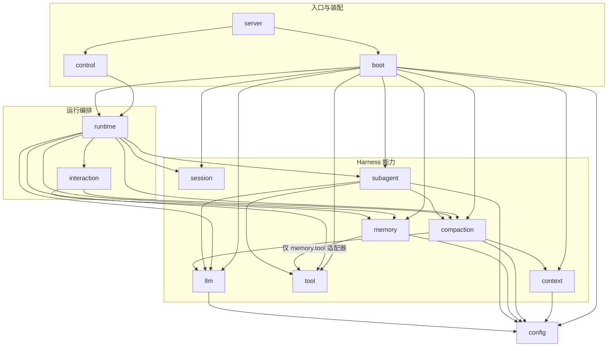
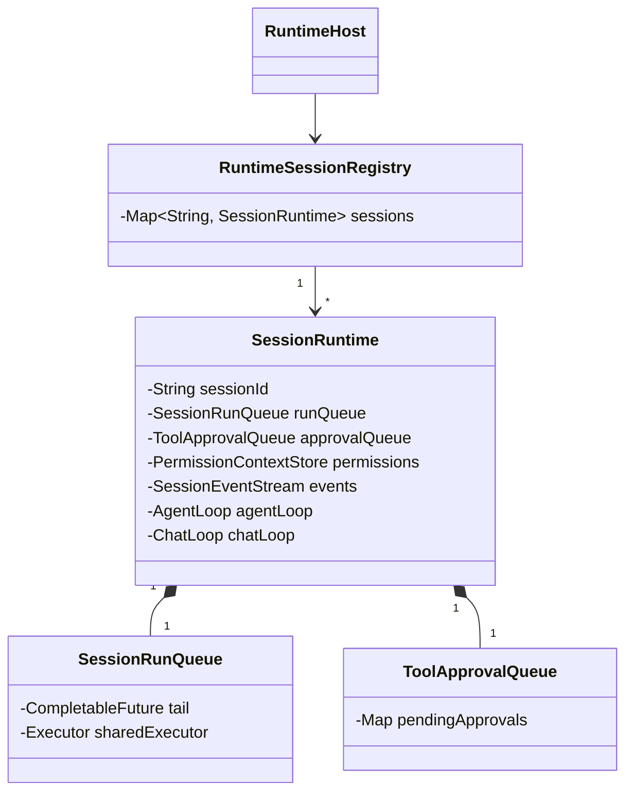
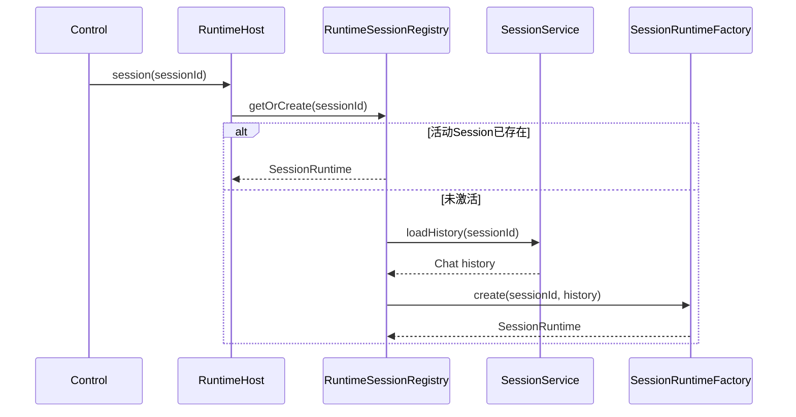
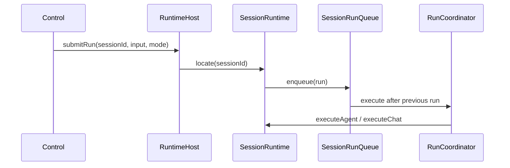
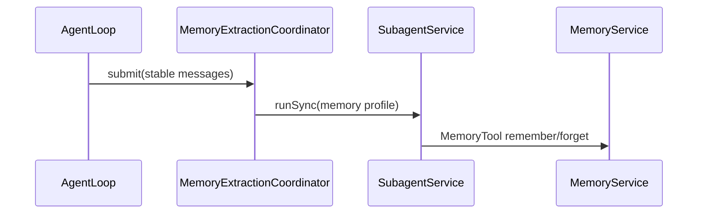
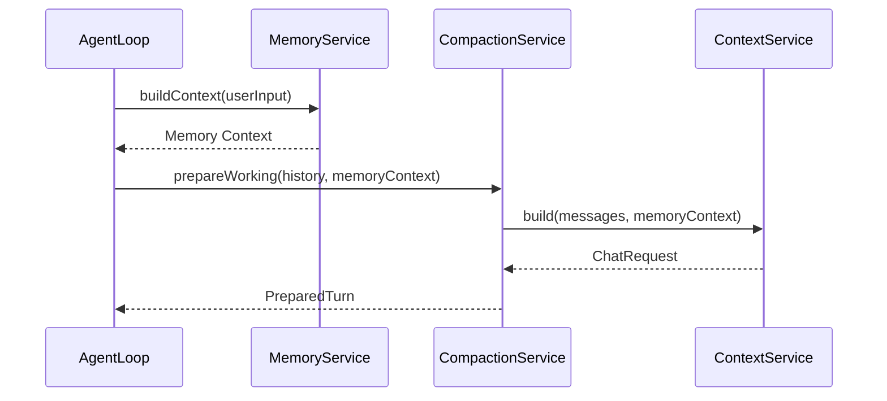

# Veyra 全项目模块收敛设计

## 1. 文档状态

- 日期：2026-08-02
- 状态：待评审
- 适用项目：Veyra Agent Harness 后端
- 适用范围：`cn.ayice.veyra` 全部生产代码
- 设计性质：技术架构设计，不包含实施步骤、任务拆分和迁移排期
- 行为约束：保持现有 HTTP、SSE、Agent、Chat、Subagent、工具、压缩、记忆和 JSONL 语义
- 依赖约束：继续使用现有 Java、Spring Boot、LangChain4j 和本地文件依赖
- 兼容约束：不保留旧 Java 类名、旧包名和旧构造方式兼容层

## 2. 设计结论

Veyra 当前顶层能力划分基本正确，主要问题位于模块内部和模块依赖方向：

1. 188 个生产 Java 文件中有 185 个顶级类型为 `public`，包结构没有形成真实封装。
2. `context <-> compaction` 和 `session <-> runtime` 存在直接循环。
3. Runtime、Session、Interaction、Memory 和 Subagent 形成更大的间接依赖环。
4. Compaction、Memory、Context 和 Tool 把内部步骤、请求、结果和辅助算法提升成了模块级类型。
5. SessionService、SubagentService 等主要服务只做转发，真实状态仍位于另一个同义类中。
6. Boot 同时承担模块装配和模块内部流水线装配，知道过多实现细节。

重构后的总体结构为：

```text
外部入口
    ↓
Runtime 编排
    ↓
Session / Context / Compaction / Memory / Tool / Subagent / Interaction / LLM
    ↓
Config 与外部依赖
```

必须满足：

- 依赖单向且无环；
- 每个 Harness 模块只有一个主要业务入口；
- 模块内部类型默认 package-private；
- 每个活动 Session 独占自己的 Run Queue、Approval Queue、权限和事件流；
- Runtime 管理活动 Session，但不共享 Session 内部队列；
- Session 持久化模块不依赖 Runtime；
- Boot 只组装模块入口，不组装模块内部算法流水线。

## 3. 设计目的

### 3.1 降低认知成本

阅读一个能力时，应先通过一个主服务理解完整生命周期，而不是在多个 Service、Manager、Coordinator、Builder、Registry 和 Result 之间跳转。

### 3.2 建立真实模块边界

包名不只是文件分类。模块外部只能看到主服务和必要协议，不能直接创建内部 Store、Scheduler、Chunker、Checkpoint State 或 Dispatcher。

### 3.3 消除循环依赖

能力模块不得反向依赖 Runtime。Runtime 可以协调多个能力，但能力模块不能为了事件、提取或活动状态再次依赖 Runtime。

### 3.4 保留有价值的独立职责

本设计不以最少文件数为目标。满足以下条件的类型继续独立：

- 拥有独立算法；
- 拥有独立可变状态或并发生命周期；
- 是持久化、模型或工具等外部边界；
- 是存在多个生产实现的扩展协议；
- 是跨模块使用的稳定数据协议。

## 4. 非目标

- 不修改 Agent Loop 和 Subagent Loop 的业务决策。
- 不把主 Agent 和 Subagent 强行抽象成同一个通用循环。
- 不修改工具权限规则和审批语义。
- 不修改 Session JSONL 和 Memory topic/index 格式。
- 不增加数据库、向量数据库、消息队列或工作流引擎。
- 不建立全局 `service/entity/repository` 技术分层。
- 不为每个模块机械创建 `model`、`factory`、`adapter` 或 `gateway` 子包。
- 不为固定实现增加只有一个实现类的接口。
- 不增加业务字段、持久化字段、错误码或恢复事件。
- 不处理桌面端业务组件拆分；桌面端属于另一种“大文件职责集中”问题。

## 5. 核心设计原则

### 5.1 顶层按 Harness 能力划分

```text
runtime      活动运行与跨能力编排
session      Session JSONL 与持久化历史
context      模型请求上下文组装
compaction   上下文压缩
memory       跨会话长期记忆
tool         工具目录、权限和执行
subagent     子 Agent 执行与任务状态
interaction  Slash Command
llm          LangChain4j 模型访问
```

### 5.2 主服务负责完整能力生命周期

一个服务可以拥有多个同一生命周期内的操作：

- `SessionService`：创建标识、读取历史、追加记录、列出会话；
- `CompactionService`：准备请求、手动压缩、后台摘要、Checkpoint 和状态查询；
- `MemoryService`：remember、forget、list、show、recall 和 buildContext；
- `ToolService`：授权、审批和执行；
- `SubagentService`：同步执行、后台提交、查询、取消和通知。

单一职责不等于单一方法。

### 5.3 子包只表达真实子能力

允许的子包示例：

```text
runtime.agent
runtime.chat
runtime.session
runtime.event
session.persistence
context.prompt
tool.permission
tool.builtin
tool.background
subagent.tool
memory.tool
```

少量只被主服务使用的实现类留在根包，以便保持 package-private。

### 5.4 区分实例所有权和代码归属

“Runtime 管理 Run Queue 和 Approval Queue”表示这些对象属于活动运行期代码，不表示全局共享。

实例所有权始终是：

```text
一个 SessionRuntime
    一个 SessionRunQueue
    一个 ToolApprovalQueue
    一个 PermissionContextStore
    一个 SessionEventStream
```

### 5.5 默认不公开

```text
跨模块入口        public
跨模块稳定协议    public
模块内部协作者    package-private
单次计算状态      private nested type
```

## 6. 目标包结构

```text
cn.ayice.veyra
│
├── server
│   └── AgentServerApplication.java
│
├── boot
│   ├── RuntimeConfiguration.java
│   └── SessionRuntimeFactory.java
│
├── config
│   └── AppConfig.java
│
├── control
│   ├── AgentApplicationService.java
│   ├── api
│   │   ├── AgentController.java
│   │   ├── AgentEventController.java
│   │   ├── AgentLogController.java
│   │   └── DocumentController.java
│   ├── dto
│   │   ├── approval
│   │   ├── command
│   │   ├── common
│   │   ├── run
│   │   └── session
│   ├── document
│   │   ├── DocumentExportService.java
│   │   └── WordExportResult.java
│   ├── exception
│   │   ├── AgentApiException.java
│   │   └── AgentExceptionHandler.java
│   ├── sse
│   │   └── StreamingAgentEventSubscriber.java
│   └── config
│       ├── WebConfiguration.java
│       └── AgentRequestLoggingFilter.java
│
├── runtime
│   ├── RuntimeHost.java
│   ├── RunCoordinator.java
│   ├── MemoryExtractionCoordinator.java
│   ├── agent
│   │   ├── AgentLoop.java
│   │   ├── LoopState.java
│   │   ├── AgentLoopEvents.java
│   │   └── AgentToolCoordinator.java
│   ├── chat
│   │   └── ChatLoop.java
│   ├── session
│   │   ├── SessionRuntime.java
│   │   ├── RuntimeSessionRegistry.java
│   │   ├── SessionRunQueue.java
│   │   └── ToolApprovalQueue.java
│   ├── event
│   │   ├── AgentEvent.java
│   │   ├── AgentEventSink.java
│   │   ├── AgentEventSubscriber.java
│   │   └── SessionEventStream.java
│   └── log
│       ├── AgentLogBus.java
│       ├── AgentLogLine.java
│       └── Slf4jLogAppender.java
│
├── session
│   ├── SessionService.java
│   └── persistence
│       ├── TranscriptStore.java
│       ├── TranscriptEntry.java
│       ├── TranscriptRecorder.java
│       └── SessionPathResolver.java
│
├── context
│   ├── ContextService.java
│   ├── WorkingMessage.java
│   ├── TokenEstimator.java
│   ├── instruction
│   │   └── ProjectInstructionLoader.java
│   └── prompt
│       ├── SystemPromptBuilder.java
│       └── PromptTemplates.java
│
├── compaction
│   ├── CompactionService.java
│   ├── CompactionConfig.java
│   ├── SummaryCompactor.java
│   ├── MicroCompactor.java
│   ├── BackgroundSummaryScheduler.java
│   ├── CheckpointState.java
│   └── CompactBoundary.java
│
├── memory
│   ├── MemoryService.java
│   ├── MemoryEntry.java
│   ├── MemoryStore.java
│   ├── MemoryRecall.java
│   ├── MemoryPaths.java
│   ├── MemoryException.java
│   └── tool
│       └── MemoryTool.java
│
├── tool
│   ├── BaseTool.java
│   ├── ToolCatalog.java
│   ├── ToolService.java
│   ├── ToolResult.java
│   ├── ValidationResult.java
│   ├── ToolExecutionPolicy.java
│   ├── ToolExecutionObserver.java
│   ├── ToolExecutionConfirmation.java
│   ├── permission
│   │   ├── PermissionContext.java
│   │   ├── PermissionContextStore.java
│   │   ├── PermissionDecision.java
│   │   ├── PermissionMode.java
│   │   ├── PermissionRule.java
│   │   ├── PermissionSupport.java
│   │   └── PermissionUpdateSuggestions.java
│   ├── builtin
│   │   ├── BashTool.java
│   │   ├── FileReadTool.java
│   │   ├── FileEditTool.java
│   │   ├── FileWriteTool.java
│   │   ├── GlobTool.java
│   │   ├── GrepTool.java
│   │   └── TodoWriteTool.java
│   ├── background
│   │   ├── BackgroundManager.java
│   │   ├── BackgroundRunTool.java
│   │   ├── TaskStatus.java
│   │   └── TaskNotification.java
│   └── state
│       ├── FileStateCache.java
│       └── TodoManager.java
│
├── subagent
│   ├── SubagentService.java
│   ├── SubagentRuntime.java
│   ├── SubagentExecution.java
│   ├── SubagentToolCatalogFactory.java
│   ├── AgentProfile.java
│   ├── AgentRunResult.java
│   └── tool
│       ├── AgentTool.java
│       ├── CheckTaskTool.java
│       └── StopTaskTool.java
│
├── interaction
│   └── command
│       ├── SlashCommand.java
│       ├── SlashCommandDispatcher.java
│       ├── SlashCommandOption.java
│       ├── SlashCommandResult.java
│       ├── MemorySlashCommand.java
│       └── CompactSlashCommand.java
│
└── llm
    ├── AIService.java
    └── ChatStreamer.java
```

## 7. 目标模块依赖



禁止出现：

```text
session     -> runtime
context     -> compaction
memory      -> runtime
memory      -> subagent
subagent    -> runtime
subagent    -> session
tool        -> runtime/session/memory/subagent
harness     -> boot/control/server
```

## 8. Runtime 与 Session 设计

### 8.1 两种 Session 语义

项目中存在两种不同的 Session 概念：

| 概念 | 所属模块 | 生命周期 |
| --- | --- | --- |
| 持久化 Session | `session` | 跨进程，通过 JSONL 保存 |
| 活动 Session Runtime | `runtime.session` | 当前进程内，关闭或崩溃后销毁 |

持久化 Session 包含：

- sessionId；
- transcript；
- 创建和更新时间；
- 历史恢复所需消息事实。

活动 Session Runtime 包含：

- AgentLoop；
- ChatLoop；
- Run Queue；
- Approval Queue；
- Permission Context；
- Event Stream；
- Slash Command Dispatcher。

### 8.2 每个 Session 独占运行状态



RuntimeHost 不持有一个全局 Run Queue 或 Approval Queue。它只通过 Registry 定位活动 Session。

允许共享：

- Run Executor；
- Tool Executor；
- IO Executor；
- AIService；
- 不可变配置；
- 无会话状态的工具定义。

禁止共享：

- Queue tail；
- pending approvals；
- PermissionContextStore；
- Agent/Chat history；
- SessionEventStream；
- TodoManager 和 FileStateCache。

### 8.3 Run 串行语义

```text
Session A: A1 -> A2 -> A3
Session B: B1 -> B2
```

同一 Session 内按照提交顺序串行，不同 Session 可以使用共享 Executor 并行。

### 8.4 Approval 隔离语义

审批通过 `sessionId + approvalId` 定位：

```text
RuntimeHost
    -> RuntimeSessionRegistry.get(sessionId)
    -> SessionRuntime.approvalQueue
    -> resolve(approvalId)
```

一个 Session 不能查询或处理另一个 Session 的 pending approval。

### 8.5 不持久化运行期对象

以下对象不写入 JSONL：

- CompletableFuture；
- Executor 任务；
- Run Queue；
- Approval Queue；
- pending approval Future；
- SSE Subscriber；
- 内存中的 AgentLoop 实例。

崩溃恢复依据持久化事实重建历史并收敛悬挂状态，不恢复原 Java 队列和 Future。

## 9. Session 模块收敛

`session` 只负责持久化会话，不持有 AgentLoop 和 ChatLoop。

目标入口：

```java
public final class SessionService {

    public String createSessionId();

    public List<ChatMessage> loadHistory(String sessionId);

    public List<Summary> list();

    public List<TranscriptItem> transcript(String sessionId);

    public TranscriptRecorder recorder(String sessionId);
}
```

收敛关系：

| 当前类型 | 目标位置 |
| --- | --- |
| `session.SessionRuntime` | `runtime.session.SessionRuntime` |
| `SessionRegistry` | 活动部分进入 `RuntimeSessionRegistry`，持久化部分进入 `SessionService` |
| `SessionRunQueue` | `runtime.session.SessionRunQueue` |
| `ToolApprovalQueue` | `runtime.session.ToolApprovalQueue` |
| `SessionRuntimeCreator` | 使用现有标准函数回调或 Boot 方法引用，不保留专用接口 |
| `session.event.*` | `runtime.event.*` |
| `session.log.*` | `runtime.log.*` |
| `TranscriptRestorer` | `TranscriptStore` 或 `SessionService` 内部实现 |
| `StoreBackedTranscriptRecorder` | `SessionService.recorder` 返回的内部实现 |

`TranscriptRecorder` 继续独立，因为它是 Runtime 与 JSONL 副作用之间的真实测试边界。

## 10. Runtime 模块收敛

Runtime 是唯一允许同时调用多个 Harness 能力的业务模块。

`RuntimeHost` 负责控制面用例入口：

- 创建和获取活动 Session；
- 提交 Run；
- 查询 Session 状态；
- 查询和处理审批；
- 查询 Slash Command；
- 获取事件流和日志流。

`RunCoordinator` 负责单次 Run 生命周期：

- 绑定 sessionId 和 runId；
- 发布 started/completed/failed；
- 选择 Agent 或 Chat；
- 统一未处理异常。

小型协议类型不再各自占用顶级文件：

```text
RunCommand       -> RunCoordinator.Command
RunMode          -> RunCoordinator.Mode
RunSubmission    -> RuntimeHost.RunSubmission
CommandOption    -> RuntimeHost.CommandOption
CommandResult    -> RuntimeHost.CommandResult
SessionState     -> RuntimeHost.SessionState
```

`LoopState`、`AgentLoopEvents` 和 `AgentToolCoordinator` 已经拥有真实内部职责，继续保留为 package-private 协作者，不合并回 AgentLoop。

## 11. Context 模块收敛

Context 只负责“模型最终看到什么”：

- System Prompt；
- Project Instruction；
- 动态 Memory Context；
- Working History；
- Tool Specification；
- ChatRequest 构造。

固定 Prompt Section 不再各占一个类：

```text
IntroSection
ActionsSection
CommunicationStyleSection
SelfDescriptionSection
SubagentSection
TodoPlanningSection
MemoryPolicySection
EnvironmentInfoSection
ToolsSection
TokenBudgetSection
ProjectInstructionSection
SystemPromptRegistry
SystemPromptContext
SystemPromptSection
```

收敛为：

```text
SystemPromptBuilder
PromptTemplates
ProjectInstructionLoader
```

其中：

- 固定文本进入 `PromptTemplates`；
- 动态环境、工具和预算由 `SystemPromptBuilder` 计算；
- 项目指令文件搜索与合并继续由 `ProjectInstructionLoader` 完成。

Context 不导入 `CompactionConfig`。压缩预算以普通输入值传入，消除 `context -> compaction` 反向依赖。

## 12. Compaction 模块收敛

目标结构：

```text
CompactionService            public
CompactionConfig             public
SummaryCompactor             package-private
MicroCompactor               package-private
BackgroundSummaryScheduler   package-private
CheckpointState              package-private
CompactBoundary              package-private
```

核心收敛：

- `LlmSummaryCompactor + SessionSummaryGenerator -> SummaryCompactor`；
- `AutoCompactConfig + SessionSummaryConfig -> CompactionConfig`；
- `CompactPrompts + ConversationChunker -> SummaryCompactor` 内部实现；
- `SessionSummaryCoordinator -> BackgroundSummaryScheduler`；
- `SessionCheckpointState -> CheckpointState`；
- Candidate、Result、Status 和内部枚举使用嵌套类型。

`ContextBudgetService` 和 `FinalRequestValidator` 属于压缩准备流程，进入 `CompactionService` 内部，不再放在 Context。

依赖方向只能是：

```text
compaction -> context
```

## 13. Memory 模块收敛

目标结构：

```text
MemoryService      public
MemoryEntry        public
MemoryException    public
MemoryStore        package-private
MemoryRecall       package-private
MemoryPaths        package-private
MemoryTool         public adapter
```

`MemoryService` 统一负责：

- remember；
- forget；
- list/show；
- enabled；
- ALWAYS 读取；
- RELEVANT 召回；
- 动态 Memory Context 构建。

收敛关系：

| 当前类型 | 目标位置 |
| --- | --- |
| `MemoryContextBuilder` | `MemoryService.buildContext` |
| `MemoryRecallService` | package-private `MemoryRecall` |
| `MemoryFileStore` | package-private `MemoryStore` |
| Recall Query/Result | `MemoryRecall` 内部 record |
| Remember Command/Operation Result/Context | `MemoryService` 嵌套 record |
| Scope/Type/Activation | `MemoryEntry` 嵌套枚举 |
| ErrorCode | `MemoryException.Code` |
| Extraction Request/Status | `runtime.MemoryExtractionCoordinator` 内部类型 |

Memory 自动提取需要同时调用 Memory 和 Subagent，因此属于 Runtime 编排，不属于 Memory 内部算法。

## 14. Tool 模块收敛

当前 `ToolRegistry` 和 `ToolDispatcher` 分别维护同一组 `BaseTool`，`ToolCatalog` 只负责同步两份集合。

目标只保留：

```text
ToolCatalog
- 唯一有序工具表
- ToolSpecification
- description
- profile
- lookup

ToolService
- permission decision
- approval
- execute
- result normalization
```

收敛关系：

| 当前类型 | 目标位置 |
| --- | --- |
| `ToolRegistry` | 合并进 `ToolCatalog` |
| `ToolDispatcher` | lookup 合并进 `ToolCatalog`，异常边界进入 `ToolService` |
| `ToolAuthorization` | `ToolService.Authorization` |
| `ToolExecution` | `ToolService.Execution` |
| `PermissionRuleValue` | `PermissionRule.Value` |
| `PermissionUpdateApplier` | `PermissionContextStore` 内部操作 |
| `PermissionUpdate` | `PermissionContextStore` 嵌套更新类型 |
| `AgentPermissionPolicy` | `AgentProfile.PermissionPolicy` |

以下类型继续独立：

- 每个内置 Tool；
- `PermissionContext`；
- `PermissionDecision`；
- `PermissionSupport`；
- `PermissionUpdateSuggestions`；
- `BackgroundManager`；
- `FileStateCache`；
- `TodoManager`。

## 15. Subagent 模块收敛

`SubagentService` 当前只转发给 `AgentTaskManager`。目标由 `SubagentService` 直接拥有：

- task map；
- Future；
- 状态；
- 通知队列；
- submit/runSync/check/cancel/shutdown。

收敛关系：

```text
SubagentService + AgentTaskManager
    -> SubagentService

AgentProfile + AgentProfiles + AgentPermissionPolicy
    -> AgentProfile
```

继续保留：

- `SubagentRuntime`：子 Agent 模型—工具循环；
- `SubagentExecution`：任务状态与执行循环之间的真实 seam；
- `SubagentToolCatalogFactory`：不同 Profile 工具目录创建回调；
- `AgentRunResult`：跨 Runtime 和 Memory Extraction 使用的稳定结果；
- Agent、CheckTask 和 StopTask 三个工具适配器。

不提取通用 AgentLoop 基类。主 Agent 和 Subagent 的工具并行、事件、稳定点、历史和终止策略不同，强行复用会引入更多策略接口。

## 16. Interaction、Control、LLM、Config 和 Boot

### 16.1 Interaction

Slash Command 是存在多个生产实现的真实插件协议，保留：

```text
SlashCommand
SlashCommandDispatcher
SlashCommandOption
SlashCommandResult
MemorySlashCommand
CompactSlashCommand
```

静态 `SlashCommands` 工厂不保留，由 Boot 或 SessionRuntime 装配命令列表。

### 16.2 Control

Control 的 Request/Response record 是 HTTP 外部协议，不因文件较小而合并。Control 只依赖 `RuntimeHost` 和 Runtime 公开事件协议。

### 16.3 LLM

保留 `AIService` 和 `ChatStreamer`。`ChatStreamer` 是 ChatLoop 的真实测试 seam。

### 16.4 Config

继续使用一个 `AppConfig` 门面，不为每个模块增加顶级 Config 类。`CompactionConfig` 是压缩算法需要的内部配置视图，不新增配置字段。

### 16.5 Boot

Boot 是 Composition Root，可以高 fan-out，但只允许创建模块入口和集成适配器。

Boot 不再直接创建：

```text
ConversationChunker
LlmSummaryCompactor
SessionSummaryGenerator
SessionSummaryCoordinator
SessionCheckpointState
MemoryPaths
MemoryStore
MemoryRecall
MemoryContextBuilder
ToolRegistry
ToolDispatcher
```

## 17. 核心运行流程

### 17.1 创建或恢复活动 Session



SessionService 不认识 AgentLoop、ChatLoop 和 SessionRuntime。

### 17.2 提交 Run



### 17.3 自动记忆提取



Memory 模块不直接创建或调用 SubagentRuntime。

### 17.4 上下文准备



Context 不调用 Compaction，Memory 不调用 Runtime。

## 18. 状态所有权

| 状态 | 唯一所有者 | 是否持久化 |
| --- | --- | --- |
| 活动 Session Map | `RuntimeSessionRegistry` | 否 |
| 单 Session Run Queue | `SessionRuntime` | 否 |
| 单 Session Approval Queue | `SessionRuntime` | 否 |
| 单 Session Permission Context | `SessionRuntime` | 否 |
| Agent/Chat History | 对应 Loop | 通过 Transcript 间接持久化 |
| Session Transcript | `SessionService` / `TranscriptStore` | 是，JSONL |
| Compaction Checkpoint | `CompactionService` | 当前阶段否 |
| Memory topic/index | `MemoryService` / `MemoryStore` | 是 |
| Memory Extraction cursor | `MemoryExtractionCoordinator` | 当前阶段否 |
| Subagent Task Map | `SubagentService` | 否 |
| Background Process Map | `BackgroundManager` | 否 |
| File State Cache | 单个 Session 或 Subagent Tool Catalog | 否 |

同一个可变状态不得由两个 Service 同时持有或复制维护。

## 19. 公开 API

目标主要公开入口：

```text
runtime.RuntimeHost
session.SessionService
context.ContextService
compaction.CompactionService
compaction.CompactionConfig
memory.MemoryService
memory.MemoryEntry
tool.ToolCatalog
tool.ToolService
subagent.SubagentService
interaction.command.SlashCommandDispatcher
llm.AIService
```

此外只公开：

- HTTP DTO；
- SSE 事件协议；
- Tool 插件协议；
- SubagentExecution 等真实测试 seam；
- Boot 必须注册的工具适配器；
- 跨模块稳定结果。

以下类型默认不公开：

- Store、Recall、Scheduler、Checkpoint State；
- Parser、Formatter、Chunker 和 Prompt Helper；
- Candidate、Pending Request 和 Commit Result；
- 单次计算 Query/Result；
- 只被一个 Service 使用的枚举；
- 测试为了绕过主服务而直接访问的实现类。

## 20. 架构约束测试

现有 ArchUnit 规则继续保留，并新增以下约束。

### 20.1 顶层模块无环

```java
slices()
        .matching("cn.ayice.veyra.(*)..")
        .should().beFreeOfCycles();
```

### 20.2 Control 边界

```text
control -> runtime
control -> runtime.event
```

Control 不直接依赖 Session Persistence、Compaction、Memory、Tool 和 Subagent 实现。

### 20.3 Session 边界

Session 不得依赖：

```text
runtime
control
interaction
memory
tool
subagent
Spring
```

### 20.4 Context 与 Compaction

```text
compaction -> context   允许
context -> compaction   禁止
```

### 20.5 Tool 边界

Tool 不得依赖 Runtime、Session、Memory 和 Subagent。

MemoryTool 和 AgentTool 是位于对应能力模块中的适配器，不属于 Tool 核心。

### 20.6 Runtime 反向依赖

Harness 能力模块不得依赖 Runtime。只有 Control 和 Boot 可以直接访问 Runtime 公开入口。

### 20.7 公开类型白名单

完成结构收敛后，对各模块建立允许公开的入口和协议白名单，防止内部实现重新变成 `public`。

## 21. 测试边界

重构不要求一个旧类对应一个新测试类。测试按照能力行为组织：

- Runtime：同 Session 串行、跨 Session 并行、审批隔离；
- Session：JSONL 写入、读取、历史恢复和工作区隔离；
- Context：Prompt、Memory Context、工具 Schema 和请求构造；
- Compaction：三级压缩、Checkpoint、后台摘要和最终预算；
- Memory：CRUD、召回、预算、文件一致性和敏感内容；
- Tool：Profile、授权、审批、执行和异常归一化；
- Subagent：同步、后台、取消、通知和 Profile；
- 架构：无环、依赖方向和公开 API。

以下 seam 必须保留：

```text
ChatStreamer
TranscriptRecorder
SubagentExecution
ToolExecutionPolicy
ToolExecutionObserver
AgentEventSink
```

不为文件 Store 增加 Repository 接口。文件行为使用临时目录测试即可。

## 22. 验收标准

1. 顶层包依赖无环。
2. `context` 不再导入 `compaction`。
3. `session` 不再导入 `runtime`、`interaction`、`tool` 和 `subagent`。
4. `memory` 不再导入 `subagent`。
5. `subagent` 不再导入 `session` 和 `runtime`。
6. 每个活动 Session 独占 Run Queue 和 Approval Queue。
7. 不同 Session 可以通过共享 Executor 并行执行。
8. `ToolRegistry` 和 `ToolDispatcher` 不再独立存在。
9. `SessionService` 和 `SubagentService` 不再是纯转发层。
10. 固定 Prompt 不再一段文本一个顶级类。
11. Compaction 只有一个 LLM 摘要算法实现。
12. Memory 只有一个动态 Context 构建入口。
13. Boot 不创建模块内部算法对象。
14. package-private 成为内部实现的默认可见性。
15. 不新增旧实现兼容层、配置字段和持久化字段。
16. 现有行为测试和新增架构测试全部通过。

## 23. 最终决策摘要

1. 顶层继续按 Harness 能力划分，不推倒现有模块命名。
2. Runtime 是跨能力编排层，拥有活动 Session 管理。
3. 每个 `SessionRuntime` 独占 Run Queue、Approval Queue、权限、事件和 Loop。
4. Session 模块只负责 JSONL 和持久化 Session，不依赖 Runtime。
5. Memory Extraction 属于 Runtime 编排，不属于 Memory 内部算法。
6. Context 与 Compaction 保持两个模块，但依赖只能是 Compaction 指向 Context。
7. Compaction、Memory、Context、Tool 和 Subagent 收敛内部顶级类型。
8. Control DTO、Tool 实现、Slash Command 协议和有效测试 seam 不因文件较小而合并。
9. Boot 只组装模块入口和集成适配器。
10. 最终结构必须通过无环依赖和公开 API 架构约束。
