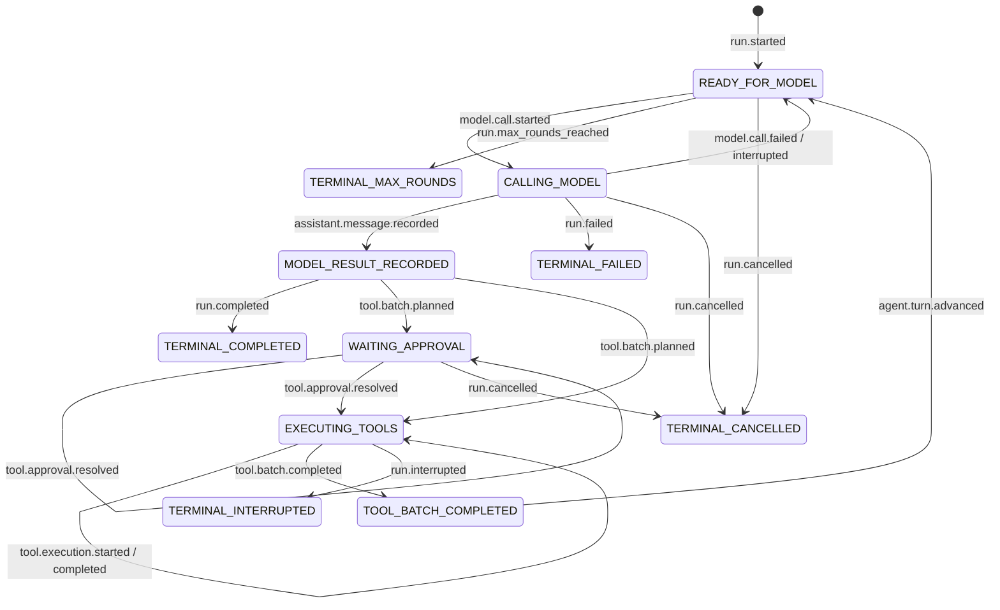
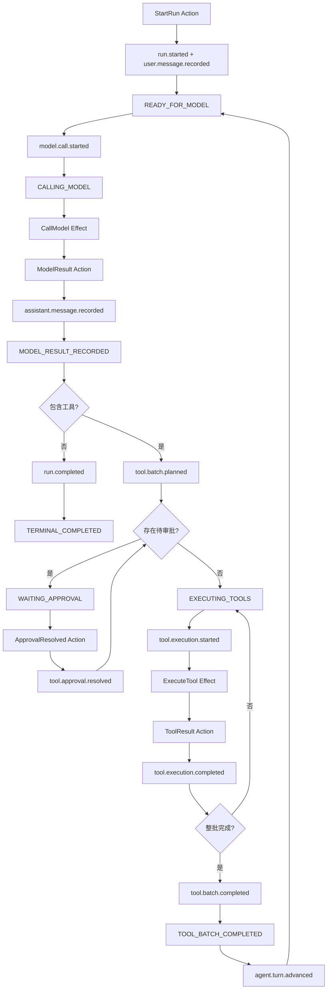

# Veyra 统一 Agent 状态机与事件持久化设计

## 1. 文档状态

- 日期：2026-08-12
- 状态：设计提案，待实施
- 前置基线：`veyra-event-sourced-session-runtime-design.md`、`veyra-durable-approval-suspension-design.md`
- 适用范围：`runtime.agent`、`runtime.session`、`session.state`、`session.persistence`、`control` 与桌面端 SessionView
- 变更性质：开发阶段破坏性改造，不兼容旧事件、旧 Snapshot、旧恢复协议和旧开发数据

本文统一 Agent 在线执行、审批挂起、崩溃恢复和检查点恢复的状态模型。本文实施后，历史设计中关于 `AgentLoop + LoopState` 过程式推进、独立恢复状态和由投影事后推导执行阶段的内容，以本文为准。

本文同时替代以下旧事件语义：

- 独立的持久化 `tool.approval.requested` 被完整 `tool.batch.planned` 替代；
- 当前 `assistant.message.completed` 的持久化语义改名为 `assistant.message.recorded`；
- 审批、模型和工具的实时 SSE 名称可以与领域事件不同，但不能参与状态重建。

实施时直接删除旧事件和旧数据，不提供兼容解析或迁移。

## 2. 设计结论

Veyra 只保留一个可驱动执行的领域状态：`AgentState`。

```text
AgentState + AgentAction
  -> AgentStateMachine.decide
  -> SessionEventDraft[] + AgentEffect[]
  -> 事件原子落盘
  -> AgentReducer.apply
  -> 新 AgentState
  -> 发布 SessionView
  -> 执行 Effect
  -> EffectResult 转成新的 AgentAction
```

必须满足以下结论：

1. 在线执行和重建使用同一个 `AgentState`。
2. 在线提交和重放使用同一个 `AgentReducer`。
3. 只有已经持久化的领域事件可以改变 `AgentState`。
4. 每个 `AgentPhase` 变化都必须由明确的持久化事件产生。
5. Snapshot 直接保存 `AgentState`，只是事件重放的性能优化。
6. `AgentDriver` 只读取 phase 并提交 Action，不直接修改状态。
7. 模型、工具和外部 I/O 只存在于 EffectRunner，不进入 Reducer。
8. 不保留在线 `LoopState` 和恢复 `AgentState` 两套执行状态。
9. 不额外持久化与领域事件重复的 `phase.changed` 事件。
10. SessionView、SessionIndex、Transcript 可以是读模型，但不能反向驱动 Agent。

最终不变量为：

```text
任意 revision 的 AgentState
= AgentState.empty()
  + 按 revision 顺序应用该 Run 可见路径上的全部 SessionEvent
```

以及：

```text
从头重放全部事件
= Snapshot.AgentState + Snapshot revision 之后的 Event Tail
```

## 3. 当前实现的问题

当前实现同时存在两套状态：

| 状态 | 修改者 | 用途 |
| --- | --- | --- |
| `runtime.agent.LoopState` | `AgentLoop` 过程式代码直接修改 | 在线执行 |
| `session.state.AgentState` | `SessionProjection` 根据 Journal 事件构建 | 恢复、审批校验、SessionView |

当前执行流程实际为：

```text
AgentLoop 执行业务代码
  -> 在若干代码位置写 Journal 事件
  -> LoopState 继续在内存中变化
  -> SessionProjection 事后根据事件类型推导 AgentState.phase
```

该模型存在以下结构性问题：

1. `AgentPhase` 不是在线执行的 dispatch key，只是恢复投影标签。
2. `CALLING_MODEL`、`MODEL_RESULT_RECORDED`、`WAITING_APPROVAL` 等阶段主要由投影推导，AgentLoop 本身没有真正进入这些状态。
3. 审批恢复重新创建 `LoopState.initial()`，再走特殊 `resume()` 分支，而不是从恢复后的 phase 继续。
4. Journal Event 与 LoopState 修改由不同代码负责，容易发生遗漏、顺序不一致和崩溃窗口。
5. `AgentToolCoordinator`、`AgentLoop`、`SessionRuntime` 等多个模块都能直接写领域事件，状态机没有唯一提交边界。
6. Snapshot 保存 `AgentState`，在线运行却使用 `LoopState`，Snapshot 不是当前执行状态的直接快照。
7. 新增阶段时需要同时修改过程式控制流和 SessionProjection，编译器无法保证两边一致。
8. 测试可以分别证明两套模型内部成立，却无法证明在线状态与重放状态始终相等。

## 4. 目标与非目标

### 4.1 目标

1. 建立唯一、完整、可重放的 `AgentState`。
2. 让每次状态变化都经过统一 `decide -> append -> reduce` 边界。
3. 让 Agent 在线运行直接使用 Reducer 产生的新状态。
4. 让进程恢复、审批恢复和正常推进调用同一个 Driver。
5. 明确 Action、Event、State、Effect 和 Read Model 的职责。
6. 保证事件先于副作用落盘，消除“副作用已开始但状态仍未记录”的窗口。
7. 支持模型调用、工具批次、审批、取消和中断的确定性恢复。
8. 保持 Session 单写者、revision 乐观并发和 commandId 幂等语义。
9. 删除被统一模型替代的旧状态、适配器、事件和测试。

### 4.2 非目标

- 不恢复 Java 调用栈、线程、Future、Executor Task 或网络连接。
- 不保证外部工具 exactly-once。
- 不把模型 token 增量、UI 展开状态、耗时等体验数据写入领域 Journal。
- 不引入通用工作流 DSL、节点图编辑器或 LangGraph 兼容层。
- 不为每一种 Action、Event 或 Effect 创建独立 Java 类。
- 不兼容旧 `LoopState`、旧 Snapshot 或旧事件文件。
- 不允许 Read Model 成为第二套 Agent 执行状态。

## 5. 核心概念

### 5.1 Action

Action 表示状态机收到的意图或外部结果，尚未成为事实。

```java
public record AgentAction(
        String type,
        String cause,
        Map<String, Object> input,
        String commandId,
        Long expectedRevision
) {
}
```

Action 来源包括：

- 用户提交任务；
- Driver 请求开始模型调用；
- 模型调用成功或失败；
- Driver 请求规划或执行工具批次；
- 工具执行成功或失败；
- 用户批准、拒绝或取消；
- RecoveryCoordinator 报告中断恢复结果。

Action 不落盘。只有 Action 被当前状态接受后产生的 Event 才能落盘。

### 5.2 Event

Event 表示已经被状态机接受、已经发生且不可修改的领域事实。

```java
public record SessionEvent(
        int schemaVersion,
        String eventId,
        long revision,
        String sessionId,
        String runId,
        String type,
        long timestampMs,
        Map<String, Object> payload
) {
}
```

Event 同时承担两个职责：

1. 作为当前状态转换的唯一持久化表达；
2. 作为崩溃后重建同一个状态的输入。

不得再建立一套只供恢复使用的事件语义。也不得为同一次转换同时写领域事件和通用 `phase.changed`，否则两者可能分叉。

### 5.3 State

State 表示应用指定 revision 之前全部可见事件后的确定结果。

State 必须是：

- 可序列化的；
- 可由 Event 重建的；
- 足以决定下一步动作的；
- 不包含进程内句柄的；
- 不依赖历史调用栈的。

### 5.4 Effect

Effect 是状态提交后需要执行的外部副作用描述。

```java
public record AgentEffect(
        String effectId,
        String type,
        Map<String, Object> input
) {
}
```

Effect 可以调用模型、执行工具、生成摘要或触发记忆提取。Effect 本身不修改状态，其结果必须重新包装成 Action 并进入 Dispatcher。

### 5.5 Read Model

以下结构可以保留为查询投影：

- `SessionIndex`；
- Run 树；
- Checkpoint 列表；
- Transcript；
- SessionView；
- 桌面端 ChatEntry。

Read Model 可以从 Event 或 AgentState 生成，但不得作为 AgentDriver 的决策输入。AgentDriver 只读取唯一 `AgentState`。

## 6. 唯一 AgentState

建议的状态结构如下：

```java
public record AgentState(
        long revision,
        String sessionId,
        RunState run,
        List<MessageState> messages,
        ToolBatchState toolBatch,
        Map<String, PendingApprovalState> approvals,
        List<PendingInputState> pendingInputs,
        TodoState todos,
        Map<String, TaskState> tasks,
        ContextState context
) {
}
```

### 6.1 RunState

```java
public record RunState(
        String runId,
        AgentPhase phase,
        int turnCount,
        int modelFailureCount,
        String transitionReason,
        ModelCallState modelCall,
        String finalResponse
) {
}
```

`RunState` 必须包含决定恢复行为所需的信息，不能只保存用于 UI 展示的摘要。

### 6.2 MessageState

MessageState 保存模型上下文所需的稳定消息，不保存 React segment 或 UI 时长。

```java
public record MessageState(
        String messageId,
        long sourceRevision,
        String runId,
        MessageRole role,
        String text,
        List<ToolRequestState> toolRequests,
        boolean visible
) {
}
```

模型内部 reasoning 不属于 Agent 执行状态。若供应商返回该内容，不应将其作为 Agent 模式的可恢复 UI 数据。

### 6.3 ToolBatchState

```java
public record ToolBatchState(
        String batchId,
        String assistantMessageId,
        List<String> orderedToolUseIds,
        Map<String, ToolCallState> tools,
        ToolBatchPhase phase
) {
}
```

工具执行可以并行，但 `orderedToolUseIds` 必须稳定保存模型声明顺序。工具结果进入模型上下文时按声明顺序排列，不能按 Future 完成顺序排列。

### 6.4 不能进入 AgentState 的内容

- `CompletableFuture`；
- Thread、Executor、锁；
- HTTP、SSE、WebSocket 连接；
- LangChain4j streaming handle；
- 当前 Java 调用栈；
- 可从消息和工具目录重新生成的 `ChatRequest`；
- UI 卡片、展开状态、动画状态和计时；
- 仅用于日志关联且不影响恢复的临时对象。

## 7. AgentPhase

```java
public enum AgentPhase {
    READY_FOR_MODEL,
    CALLING_MODEL,
    MODEL_RESULT_RECORDED,
    WAITING_APPROVAL,
    EXECUTING_TOOLS,
    TOOL_BATCH_COMPLETED,
    TERMINAL_COMPLETED,
    TERMINAL_MAX_ROUNDS,
    TERMINAL_FAILED,
    TERMINAL_CANCELLED,
    TERMINAL_INTERRUPTED
}
```

允许的主要流转：



任何未列出的 phase 变化默认非法。Reducer 遇到非法事件顺序时必须报告 Journal corruption 或程序缺陷，不能静默修正。

## 8. 领域事件协议

### 8.1 事件集合

首版统一状态机使用以下稳定事件：

| 事件 | 主要状态变化 |
| --- | --- |
| `run.started` | 创建 Run，进入 `READY_FOR_MODEL` |
| `user.message.recorded` | 追加用户消息 |
| `model.call.started` | `READY_FOR_MODEL -> CALLING_MODEL` |
| `model.call.failed` | 增加失败计数，回到 `READY_FOR_MODEL` |
| `model.call.interrupted` | `CALLING_MODEL -> READY_FOR_MODEL` |
| `assistant.message.recorded` | 保存稳定模型结果，进入 `MODEL_RESULT_RECORDED` |
| `tool.batch.planned` | 保存完整工具计划，进入等待审批或执行阶段 |
| `tool.approval.resolved` | 更新审批和工具授权状态 |
| `tool.execution.started` | 标记真实副作用已经开始 |
| `tool.execution.completed` | 保存稳定工具结果 |
| `tool.batch.completed` | 完成整批并进入 `TOOL_BATCH_COMPLETED` |
| `agent.turn.advanced` | 增加轮次，回到 `READY_FOR_MODEL` |
| `run.completed` | 进入 `TERMINAL_COMPLETED` |
| `run.failed` | 进入 `TERMINAL_FAILED` |
| `run.cancelled` | 进入 `TERMINAL_CANCELLED` |
| `run.interrupted` | 进入 `TERMINAL_INTERRUPTED` |

### 8.2 ToolBatch 必须一次规划完整

`tool.batch.planned` 必须包含整个 Assistant Message 的有序工具计划：

```json
{
  "batchId": "batch-1",
  "assistantMessageId": "message-7",
  "tools": [
    {
      "toolUseId": "tool-1",
      "name": "Read",
      "arguments": "{...}",
      "authorization": "AUTHORIZED",
      "recoveryPolicy": "RETRY_SAFE"
    },
    {
      "toolUseId": "tool-2",
      "name": "Bash",
      "arguments": "{...}",
      "authorization": "WAITING_APPROVAL",
      "approvalId": "approval-2",
      "reason": "需要执行外部命令",
      "recoveryPolicy": "INTERRUPT"
    }
  ]
}
```

Reducer 通过该事件一次建立 ToolBatch、ToolCallState 和 PendingApprovalState。不得先在内存中构造一套计划，再逐项写另一套不完整事件。

因此，旧的持久化 `tool.approval.requested` 事件删除。审批请求不是在 ToolBatch 之外后来发生的第二个事实，而是工具批次规划结果的一部分。提交 `tool.batch.planned` 后，可以根据新 AgentState 发布非持久化 `permission.requested` SSE，供实时 UI 提示；冷加载和恢复只读取 AgentState。

若同一 Action 需要产生多个事件，必须使用 `appendAtomically` 一次提交，重放时保持相同顺序。

### 8.3 不写重复 phase 事件

以下做法禁止：

```text
tool.batch.planned
agent.phase.changed(WAITING_APPROVAL)
```

`tool.batch.planned` 本身就是该状态转换的领域事实。Reducer 必须从它确定进入 `WAITING_APPROVAL` 或 `EXECUTING_TOOLS`。

## 9. AgentReducer

Reducer 是唯一修改 AgentState 的代码：

```java
public final class AgentReducer {

    public AgentState apply(AgentState state, SessionEvent event) {
        return switch (event.type()) {
            case "run.started" -> applyRunStarted(state, event);
            case "user.message.recorded" -> applyUserMessage(state, event);
            case "model.call.started" -> applyModelCallStarted(state, event);
            case "model.call.failed" -> applyModelCallFailed(state, event);
            case "model.call.interrupted" -> applyModelCallInterrupted(state, event);
            case "assistant.message.recorded" -> applyAssistantMessage(state, event);
            case "tool.batch.planned" -> applyToolBatchPlanned(state, event);
            case "tool.approval.resolved" -> applyApprovalResolved(state, event);
            case "tool.execution.started" -> applyToolStarted(state, event);
            case "tool.execution.completed" -> applyToolCompleted(state, event);
            case "tool.batch.completed" -> applyToolBatchCompleted(state, event);
            case "agent.turn.advanced" -> applyTurnAdvanced(state, event);
            case "run.completed", "run.failed", "run.cancelled", "run.interrupted" ->
                    applyRunTerminal(state, event);
            default -> state;
        };
    }
}
```

Reducer 必须满足：

- 纯函数；
- 不访问文件、网络、时钟或随机数；
- 不调用模型和工具；
- 不发送 SSE；
- 相同 state + event 始终得到相同结果；
- 校验 event.revision 单调且连续；
- 校验 phase 与事件匹配；
- 返回新的不可变 State，不修改输入对象。

在线提交：

```java
next = reducer.apply(current, persistedEvent);
```

恢复重放：

```java
restored = reducer.apply(restored, tailEvent);
```

必须调用同一个方法，禁止恢复专用 reducer。

## 10. AgentStateMachine.decide

StateMachine 根据当前状态和 Action 决定是否接受，并产生 EventDraft 和 Effect：

```java
public record Transition(
        List<SessionEventDraft> events,
        List<AgentEffect> effects
) {
}
```

```java
public Transition decide(AgentState state, AgentAction action) {
    return switch (state.run().phase()) {
        case READY_FOR_MODEL -> decideReadyForModel(state, action);
        case CALLING_MODEL -> decideCallingModel(state, action);
        case MODEL_RESULT_RECORDED -> decideModelResult(state, action);
        case WAITING_APPROVAL -> decideWaitingApproval(state, action);
        case EXECUTING_TOOLS -> decideExecutingTools(state, action);
        case TOOL_BATCH_COMPLETED -> decideToolBatchCompleted(state, action);
        default -> decideTerminal(state, action);
    };
}
```

`decide()` 必须是纯决策逻辑，不得落盘和执行副作用。

状态机必须拒绝：

- 终态 Run 上的模型或工具结果；
- 不匹配当前 callId 的模型结果；
- 不存在或已解决的 approvalId；
- 不属于当前 ToolBatch 的 toolUseId；
- 非法 phase 下的 Action；
- commandId 复用到不同请求；
- expectedRevision 不匹配的外部控制。

## 11. Dispatcher 与事务边界

每个 Session 只有一个 Dispatcher，所有领域写入必须经过它：

```java
public DispatchResult dispatch(AgentAction action) {
    return sessionWriter.execute(() -> {
        AgentState current = stateRepository.current();
        validateRevision(current, action.expectedRevision());

        Transition transition = machine.decide(current, action);
        List<SessionEvent> persisted = journal.appendAtomically(
                current.sessionId(),
                current.revision(),
                transition.events()
        );

        AgentState next = current;
        for (SessionEvent event : persisted) {
            next = reducer.apply(next, event);
        }

        stateRepository.commit(next);
        snapshotPolicy.captureIfNeeded(next);
        sessionViewPublisher.publish(next);
        effectQueue.submit(next.run().runId(), transition.effects());
        return new DispatchResult(next, persisted);
    });
}
```

固定顺序为：

```text
读取当前 State
  -> 校验 Action
  -> 计算 Transition
  -> 原子写 Event
  -> Reducer 生成新 State
  -> 提交内存 State
  -> 发布 SessionView
  -> 提交 Effect
```

事件落盘失败时：

- 不提交新 State；
- 不发布成功视图；
- 不执行 Effect；
- 返回稳定错误。

## 12. AgentDriver

Driver 只根据当前 phase 决定要提交什么内部 Action：

```java
public void driveUntilBlocked(String sessionId, String runId) {
    while (true) {
        AgentState state = stateRepository.current(sessionId);
        if (!runId.equals(state.run().runId())) return;

        switch (state.run().phase()) {
            case READY_FOR_MODEL -> {
                dispatcher.dispatch(actions.startModelCall(state));
                return;
            }
            case CALLING_MODEL, WAITING_APPROVAL, EXECUTING_TOOLS -> {
                return;
            }
            case MODEL_RESULT_RECORDED -> {
                dispatcher.dispatch(actions.routeModelResult(state));
            }
            case TOOL_BATCH_COMPLETED -> {
                dispatcher.dispatch(actions.advanceTurn(state));
            }
            default -> {
                return;
            }
        }
    }
}
```

Driver 不直接写 Journal，不调用 `state.withPhase()`，也不保存 continuation。

`resume()` 不再是独立算法。以下场景都只调用 `driveUntilBlocked()`：

- 新 Run；
- 模型结果返回；
- 工具结果返回；
- 用户解决审批；
- 服务重启恢复；
- checkpoint 路径切换后继续。

## 13. EffectRunner

EffectRunner 在 State 已经提交后执行外部副作用。

### 13.1 模型调用

`model.call.started` 先落盘，Reducer 进入 `CALLING_MODEL`，然后才执行：

```java
try {
    AiMessage result = model.call(effect.input());
    dispatcher.dispatch(actions.modelSucceeded(effect, result));
} catch (Exception failure) {
    dispatcher.dispatch(actions.modelFailed(effect, failure));
}
```

Streaming token 只作为实时 UI 事件发布，不写领域 Journal。最终完整 Assistant Message 通过 `assistant.message.recorded` 落盘。

### 13.2 工具调用

工具执行同样遵循：

```text
StartTool Action
  -> tool.execution.started 落盘
  -> ToolCallState = EXECUTION_STARTED
  -> 执行 Tool Effect
  -> ToolResult Action
  -> tool.execution.completed 落盘
```

不得在工具真实执行后补写 `tool.execution.started`。

### 13.3 Effect 结果幂等

Effect 必须携带稳定 `effectId`、`modelCallId` 或 `toolUseId`。晚到结果通过这些标识与当前 State 对照：

- 当前 Run 已终止：拒绝改变 State；
- callId 不匹配：拒绝；
- toolUseId 已有结果：幂等返回；
- 同一结果 eventId 重试：Journal 幂等返回原事件。

## 14. 完整 Agent 运行流程



## 15. 审批挂起与恢复

### 15.1 挂起

当 `tool.batch.planned` 中存在 `WAITING_APPROVAL` 工具时，Reducer 直接得到：

```text
Run.phase = WAITING_APPROVAL
Tool.phase = WAITING_APPROVAL
PendingApproval.status = PENDING
```

Driver 在该阶段停止推进并释放线程。不创建 Future，不保留旧调用栈。

### 15.2 用户决定

用户提交统一 Run 控制 Action：

```json
{
  "type": "run.control",
  "cause": "approval",
  "input": {
    "approvalId": "approval-2",
    "decision": "allow_once"
  },
  "expectedRevision": 42,
  "commandId": "cmd-9"
}
```

状态机产生 `tool.approval.resolved`。Reducer 更新审批和工具状态：

- 仍有 PENDING：保持 `WAITING_APPROVAL`；
- 全部已解决：进入 `EXECUTING_TOOLS`。

提交完成后调度同一个 runId 的 `driveUntilBlocked()`。不存在恢复专用 LoopState。

## 16. 模型失败、工具失败与取消

### 16.1 模型失败

模型 Effect 失败后提交 `model.call.failed`：

- 增加 `modelFailureCount`；
- 未达到上限时回到 `READY_FOR_MODEL`；
- 达到上限时同一原子 Transition 追加 `run.failed`。

Reducer 不读取运行时配置决定是否终止。影响确定性的上限必须在 `run.started` 时固化到 RunState，或由 StateMachine 决定并明确写入终态事件。

### 16.2 工具失败

工具失败仍是稳定工具结果：

```text
tool.execution.completed(outcome=FAILED)
```

整批结束后将失败结果按声明顺序交回模型。除非恢复策略明确要求中断，否则单个工具失败不直接终止 Run。

### 16.3 取消

用户取消产生 `run.cancelled`，Reducer 将允许取消的非终态阶段转为 `TERMINAL_CANCELLED`。

取消模型或工具 Future 是 best-effort Effect，不决定领域终态。取消后的晚到结果不能复活 Run。

## 17. 崩溃恢复

启动恢复流程：

```text
读取最新 AgentSnapshot
  -> 校验 snapshot revision
  -> 读取 Event Tail
  -> 使用 AgentReducer 逐条 apply
  -> 得到唯一 AgentState
  -> RecoveryCoordinator 根据 phase 提交恢复 Action
  -> AgentDriver.driveUntilBlocked
```

阶段恢复规则：

| phase | 恢复行为 |
| --- | --- |
| `READY_FOR_MODEL` | 直接调度 Driver |
| `CALLING_MODEL` | 写 `model.call.interrupted`，回到 `READY_FOR_MODEL` 后重试 |
| `MODEL_RESULT_RECORDED` | 调度 Driver 规划工具或结束 Run |
| `WAITING_APPROVAL` | 保持挂起，等待用户 |
| `EXECUTING_TOOLS` | 按每个 ToolCallState 和 recoveryPolicy 恢复 |
| `TOOL_BATCH_COMPLETED` | 调度 Driver 进入下一轮 |
| `TERMINAL_*` | 不调度 |

### 17.1 工具恢复策略

对 `EXECUTION_STARTED` 且没有结果的工具：

| recoveryPolicy | 行为 |
| --- | --- |
| `RETRY_SAFE` | 写明确的 retry/recovery 事件后重新执行 |
| `VERIFY_THEN_RETRY` | 先执行验证 Effect，再由结果 Action 决定 |
| `INTERRUPT` | 写 `run.interrupted`，等待用户重新发起 |

恢复策略必须是 ToolCallState 的持久化字段，不能在重启后临时猜测。

## 18. Snapshot

```java
public record AgentSnapshot(
        int schemaVersion,
        String sessionId,
        String runId,
        long revision,
        AgentState state
) {
}
```

Snapshot 规则：

1. `state.revision == snapshot.revision`。
2. Snapshot 中保存的就是在线 Dispatcher 当前使用的 `AgentState`。
3. 不创建 `RecoveryState`、`SnapshotAgentState` 或恢复专用 DTO。
4. Snapshot 后的 Event Tail 仍使用同一个 Reducer。
5. Snapshot 可以删除并从 Event Stream 重建。
6. Snapshot 不得包含 Future、UI 字段或派生 HTTP 响应。
7. 新设计实施时删除旧 Snapshot，不做兼容读取或迁移。

## 19. Journal 与 revision

Journal 是唯一事实来源。每个 Session 维护单调 revision：

```text
revision 41: assistant.message.recorded
revision 42: tool.batch.planned
revision 43: tool.approval.resolved
revision 44: tool.execution.started
revision 45: tool.execution.completed
revision 46: tool.batch.completed
```

`appendAtomically(expectedRevision, drafts)` 必须：

1. 校验 expectedRevision；
2. 校验 eventId 幂等；
3. 为整批事件分配连续 revision；
4. 一次性可靠写入；
5. 任一失败时整批不可见；
6. 返回包含实际 revision 的持久化 Event。

“原子”不能只由 Java `synchronized` 或方法名保证。Journal 文件必须使用可识别的事务边界，首版采用单行 Batch Record：

```json
{
  "schemaVersion": 2,
  "transactionId": "tx-17",
  "firstRevision": 42,
  "lastRevision": 43,
  "events": [
    {"eventId": "e-42", "revision": 42, "type": "run.started", "payload": {}},
    {"eventId": "e-43", "revision": 43, "type": "user.message.recorded", "payload": {}}
  ]
}
```

写入规则：

1. 一个 Transition 的全部 Event 编码成一条 JSONL Batch Record；
2. 整行完成写入后执行 `force(false)`；
3. 尾部不完整的一行可以整体截断；
4. 不允许一个 Transition 分散为多行后再声称逻辑原子；
5. 读取时展开 Batch Record 内的 Event，并校验 transaction revision 连续；
6. Index、Snapshot 和幂等表只在完整 Batch Record 可读后更新。

若未来改用支持事务的数据库，可以由数据库事务替代 Batch Record，但上层 `appendAtomically` 语义不变。

SSE `seq` 只表示实时消息发送顺序，不能参与状态机并发控制。

## 20. 实时事件与 SessionView

领域 Journal Event 和实时 UI Event 可以使用不同传输通道，但语义边界必须明确：

### 20.1 必须持久化

- 会影响下一步执行的事实；
- 会改变 AgentState 的事实；
- 审批、工具开始、工具结果和 Run 终态；
- 崩溃后必须知道的模型稳定结果。

### 20.2 不持久化

- 模型 token 增量；
- spinner、动画、展开状态；
- UI 耗时；
- 网络连接状态；
- 临时日志行；
- Agent 模式不展示的模型内部 reasoning。

实时提示丢失时，桌面端必须能通过最新 SessionView 完整恢复正确 UI。

SessionView 由已提交的 AgentState 生成：

```text
AgentState -> SessionView DTO -> Desktop adapter -> UI segments
```

不得把 UI segment 反序列化为 AgentState。

## 21. 并发、幂等与单写者

### 21.1 Session 单写者

同一个 Session 的所有 dispatch 必须串行。不同 Session 可以并行。

单写者边界覆盖：

- 读取当前 State；
- expectedRevision 校验；
- commandId 校验；
- decide；
- append；
- reduce；
- commit；
- Effect 去重提交。

### 21.2 外部命令幂等

相同 commandId 和相同规范化 Action：

- 返回第一次 DispatchResult；
- 不重复写 Event；
- 不重复调度 Effect。

相同 commandId 和不同 Action：

- 返回 `COMMAND_ID_REUSED`。

### 21.3 内部结果幂等

模型和工具结果使用稳定 eventId：

```text
model-result:{modelCallId}
tool-result:{toolUseId}
```

EffectRunner 重试回调不会产生重复结果事件。

## 22. 模块与所有权

建议结构：

```text
runtime/agent/
  AgentStateMachine.java
  AgentReducer.java
  AgentDispatcher.java
  AgentDriver.java
  AgentEffectRunner.java
  AgentAction.java
  AgentEffect.java
  Transition.java

session/state/
  AgentState.java
  RunState.java
  ModelCallState.java
  ToolBatchState.java
  ToolCallState.java
  PendingApprovalState.java
  AgentPhase.java

session/persistence/
  SessionJournalStore.java
  AgentSnapshotStore.java
  SessionEvent.java
  SessionEventDraft.java

session/view/
  SessionViewProjector.java
  SessionIndexProjector.java
  TranscriptProjector.java
```

所有权规则：

| 模块 | 可以做什么 | 禁止做什么 |
| --- | --- | --- |
| StateMachine | 校验 Action，产生 Transition | I/O、改 State |
| Reducer | Event -> 新 State | I/O、随机数、配置查询 |
| Dispatcher | 事务编排和提交 | 实现具体工具业务 |
| Driver | 根据 phase 提交内部 Action | 直接改 State、写 Journal |
| EffectRunner | 调模型和工具 | 直接改 State、写 Journal |
| JournalStore | 原子保存 Event | 推断业务 phase |
| ViewProjector | 生成查询视图 | 驱动 Agent |

## 23. 删除和替换的旧实现

实施时同步删除：

1. `runtime.agent.LoopState`。
2. `AgentLoop.advance(input, restored)` 的双入口和恢复特判。
3. `AgentLoop.resume(AgentState)`。
4. `SessionProjection` 作为恢复专用状态构建器的定位，替换为在线与恢复共用的 `AgentReducer`。
5. `SessionJournalRecorder` 被 AgentLoop、ToolCoordinator 等模块任意调用的写入口。
6. `AgentToolCoordinator` 内部直接持久化审批和工具事件的逻辑。
7. 只验证 LoopState 的测试。
8. 旧事件和旧 Snapshot 测试数据。
9. 为兼容旧格式保留的解析、适配和回退分支。

`AgentLoop` 可以删除，或仅暂时保留类名并重写为薄 `AgentDriver`。最终代码中不应继续存在过程式整轮执行器。

## 24. 实施阶段

### 阶段一：建立唯一 Reducer

1. 定义最终 `AgentState`、ToolBatchState 和 ModelCallState。
2. 将 SessionProjection 改造成纯 `AgentReducer`。
3. 为每个事件增加合法 phase 校验。
4. 建立从头重放与 Snapshot Tail 等价测试。

### 阶段二：建立 Dispatcher

1. 增加统一 Action、Transition 和 Effect 结构。
2. 为 JournalStore 增加原子批量 append。
3. 建立 Session 单写者事务边界。
4. 在线状态改为每次提交后调用 Reducer 更新。

### 阶段三：拆分副作用

1. 将模型调用移入 EffectRunner。
2. 将工具执行移入 EffectRunner。
3. 将 Effect 结果统一转成 Action。
4. 建立 effectId、modelCallId 和 toolUseId 幂等协议。

### 阶段四：替换 AgentLoop

1. 实现 phase 驱动的 AgentDriver。
2. 新 Run、审批恢复和崩溃恢复统一调用 Driver。
3. 删除 `LoopState` 和专用 `resume()`。
4. 删除多模块 Journal 直写入口。

### 阶段五：收敛 Snapshot 和 View

1. Snapshot 直接保存 Dispatcher 当前 AgentState。
2. SessionView 从 AgentState 生成。
3. SessionIndex 和 Transcript 保持只读投影。
4. 删除旧持久化数据和兼容代码。

## 25. 测试策略

### 25.1 Reducer 测试

- 每种 Event 在合法 phase 下得到预期 State。
- 每种 Event 在非法 phase 下被拒绝。
- Event revision 不连续时失败。
- 同一 state + event 结果完全相同。
- Reducer 不修改输入 State。

### 25.2 状态机测试

- 每种 Action 只在允许 phase 被接受。
- Transition 产生正确 Event 和 Effect。
- decide 不执行 I/O。
- 终态拒绝晚到模型和工具结果。

### 25.3 等价性测试

对每个完整场景必须验证：

```text
在线每次 append 后 reduce 得到的 State
= 关闭进程后从头重放得到的 State
= Snapshot + Tail 得到的 State
```

场景包括：

- 无工具普通回答；
- 多轮工具调用；
- 单工具审批；
- 多工具部分审批；
- 模型失败重试；
- 工具失败；
- 取消；
- 模型调用中崩溃；
- 工具执行中崩溃；
- checkpoint 路径切换。

### 25.4 崩溃点测试

在以下边界注入进程失败：

1. decide 后、append 前；
2. append 后、reduce 前；
3. reduce 后、Effect 提交前；
4. Effect 开始后、结果 Action 前；
5. 结果事件落盘后、UI 发布前。

每个崩溃点恢复后必须得到确定状态和确定恢复行为。

### 25.5 架构约束测试

- 只有 Dispatcher 可以调用 Journal 领域 append。
- Reducer 不依赖 runtime、tool、llm、Spring 和文件系统包。
- EffectRunner 不依赖 StateRepository 的写接口。
- ViewProjector 不被 AgentDriver 依赖。
- `runtime.agent` 不再存在 `LoopState`。

## 26. 验收标准

1. 在线 Agent 使用的状态对象就是 Snapshot 保存和恢复返回的 `AgentState`。
2. 代码中不存在第二个包含 phase、轮次、消息和工具状态的执行状态类。
3. 每个 phase 变化都能定位到唯一持久化领域事件。
4. AgentDriver 中存在清晰的 phase dispatch，不再依赖过程式调用栈继续执行。
5. 在线提交和恢复重放调用同一个 AgentReducer。
6. AgentLoop、ToolCoordinator 和 EffectRunner 不能直接修改 phase。
7. AgentLoop、ToolCoordinator 和 EffectRunner 不能直接写领域 Journal。
8. 审批期间无线程等待，重启后仍停留在同一个 `WAITING_APPROVAL`。
9. 审批解决后不调用恢复专用 Loop，而是调度同一个 Driver。
10. `CALLING_MODEL`、`EXECUTING_TOOLS` 等中间阶段可从 Event Stream 精确重建。
11. Snapshot 删除后仍能从 Event Stream 得到相同 State。
12. SessionView 丢失全部实时 UI 事件后仍能从 AgentState 完整恢复。
13. SSE seq 与 Session revision 保持独立。
14. 全部等价性、崩溃点、并发和幂等测试通过。
15. 旧事件、旧 Snapshot、LoopState 和兼容分支全部删除。

## 27. 最终约束

实现期间以以下四条规则判断设计是否发生回退：

```text
规则一：没有持久化 Event，就没有 AgentState 变化。

规则二：在线运行能得到的 State，必须能由同一批 Event 重放得到。

规则三：恢复后不进入专用流程，只从当前 phase 继续同一个 Driver。

规则四：Effect 只能产生 Action，不能直接修改 State 或补写状态。
```

只要出现以下任一情况，即视为未完成统一：

- 在线状态有字段无法从 Event 重建；
- 恢复状态有字段在线执行不使用；
- 某个模块可以绕过 Dispatcher 写领域事件；
- 某个 phase 只存在于投影而不参与 Driver dispatch；
- Snapshot 保存的不是当前在线 AgentState；
- 审批或重启需要专门恢复版 AgentLoop。
