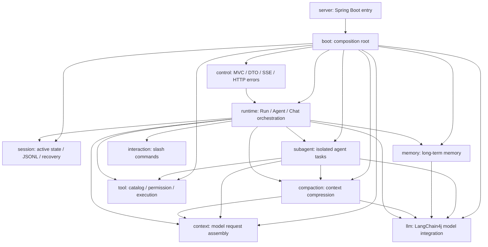

# Veyra 架构与开发规范

## 1. 适用范围

本文只约束 `cn.ayice.veyra`。Veyra 是固定技术栈的 Agent Runtime：Spring MVC + LangChain4j + SSE + JSONL，不采用 DDD，也不引入用于替换固定技术的 Adapter、Gateway 或 Repository 抽象。

重构和新增功能必须保持以下外部契约：

- `/v1` HTTP 路由、状态码和响应字段。
- Run 提交立即返回 `202 Accepted`。
- SSE event type 和 payload key。
- Agent、Chat、Subagent 的提示词、工具顺序、权限决定和终止条件。
- 上下文压缩阈值、恢复内容和 transcript JSONL 格式。
- 会话持久化仍按当前能力工作，完整快照和 tool-call 持久化另行设计。

## 2. 包职责与依赖方向



依赖只能沿箭头方向。`boot` 是唯一完整对象图装配点。`control` 只能通过 `RuntimeHost` 进入运行时；Harness 能力模块不得依赖 `control`、`boot`、`server` 或 Spring MVC。

包内职责：

| 包 | 负责 | 禁止 |
| --- | --- | --- |
| `control` | Controller、请求/响应 DTO、校验、SSE 序列化、HTTP 异常 | Agent 循环、工具执行、持久化、第三方调用 |
| `runtime` | RuntimeHost、RunCoordinator、主 Agent 和 Chat 执行编排 | HTTP、Spring、JSONL 编解码、具体工具构造 |
| `session` | SessionService、SessionRegistry、SessionRuntime、同会话串行队列、事件流、JSONL 和恢复 | Spring MVC、DTO、模型决策 |
| `runtime.agent` | 主 Agent turn 状态、请求准备、工具协调、终止状态 | HTTP、Spring、session map |
| `runtime.chat` | 无工具 Chat 策略 | 复用主 Agent 的工具分支 |
| `subagent` | profile 限定的子 Agent 顺序循环 | 主 Agent 的并行工具策略 |
| `context` | prompt、token、项目指令和最终模型请求组装 | ToolRegistry、PermissionContext、HTTP、压缩决策 |
| `compaction` | Micro/Session/LLM 压缩、检查点、恢复提示和预算验证 | HTTP、长期记忆存储、具体工具状态实现 |
| `memory` | 跨会话长期记忆、召回、自动提取、动态上下文和 MemoryTool | 会话摘要、transcript、HTTP |
| `session.persistence` | JSONL 写入、读取和历史恢复 | 活跃 Session 执行状态、HTTP |
| `tool` | 工具目录、授权、执行、权限、后台工具和内置工具 | Runtime、Memory 和 Subagent 的具体类型、Spring |
| `llm` | 具体 LangChain4j 调用 | Control、Session、Tool |
| `boot` | Spring Bean、Executor 生命周期、完整 SessionRuntime 构造 | 业务决策 |

禁止新增顶层 `common`、`shared`、`util`、`manager` 包。跨包数据应使用窄 record；跨包行为只在真实回调或测试 seam 出现时使用接口。

## 3. 消息执行链

```text
Tauri -> Controller -> Control Service -> RuntimeHost
      -> SessionService / SessionRuntime serial queue -> RunCoordinator
      -> AgentLoop | ChatLoop
      -> Context / Compaction / Memory / Tool / LLM
      -> SessionEventStream -> SSE Controller -> Tauri
```

Controller 只做四件事：接收、校验、调用 `AgentApplicationService`、返回 DTO。Control Service 不得直接获取 AgentLoop、ToolService、PermissionContextStore 或 TranscriptStore。

## 4. 状态与并发

- 一个 `SessionRuntime` 是一个 session 可变状态的唯一所有者。
- 同 session Run 必须按提交顺序串行；不同 session 可并行。
- 主 Agent 多工具调用保持并行执行、按模型调用顺序收集结果。
- Subagent 工具调用保持顺序执行。
- 所有 Executor 由 `RuntimeConfiguration` 创建并由 Spring 关闭。
- 业务包禁止 `Executors.new*`、裸 `new Thread` 和未指定 Executor 的 `runAsync/supplyAsync`。
- Session 关闭只取消该 Session 持有的 Future，不关闭共享 Executor。

新增可变状态前必须回答：所有者是谁、并发访问方式是什么、何时释放。无法回答时不得合入。

## 5. HTTP 与 DTO

- 保留现有 `/v1` 协议；新非兼容 API 才使用 `/api/v1`。
- Controller 使用构造器注入，不写大段 `try-catch`。
- 请求 DTO 与响应 DTO 分离，不返回 persistence model、第三方原始对象或 `Map<String, Object>`。
- 普通接口使用 `ApiResponse<T>`；SSE 和二进制下载例外。
- 所有外部输入必须校验；服务层不依赖 `HttpServletRequest`、`ResponseEntity` 或 SSE 类型。

## 6. 异常与日志

三类失败边界必须分开：

1. Request failure：`AgentApiException` 或参数异常，由 `AgentExceptionHandler` 转为 `Axxxx/Bxxxx`。
2. Run failure：`RunCoordinator` 捕获，记录完整堆栈，并发出兼容的 `run.failed`。
3. Tool failure：`ToolService/ToolDispatcher` 记录 `toolUseId`、工具名和 cause，返回现有 ToolResult 内容。

规则：

- 禁止空 catch、`catch (... ignored)` 和只记录 `e.getMessage()`。
- 降级是业务允许的，也必须用 `debug/warn` 记录原因；高频的格式探测可通过变量名明确表达预期失败。
- 抛出新异常时必须保留 cause。
- 未预期 HTTP 异常只向前端返回 `B0001/系统执行失败`，不得泄露 Java 异常或堆栈。
- 日志不得包含 token、cookie、完整 header、私密用户数据或大段模型/工具原始响应。
- HTTP 使用 `requestId`；异步 Run 使用 `sessionId/runId`；子 Agent 和工具额外记录 `agentId/toolUseId`。
- 同一失败边界只记录一次 ERROR，内层仅在补充关键上下文时记录。

## 7. Tool 规则

工具生命周期固定为：

```text
lookup -> parse -> validate -> permission -> approval -> execute -> normalize
```

- `ToolRegistry` 的可见工具与 `ToolDispatcher` 的可执行工具必须使用同一 profile 过滤。
- 权限判断必须返回 `PermissionDecision`，不能在工具内部绕过审批。
- 新工具继承 `BaseTool`，明确 category、visibility、riskLevel、schema、validation 和 permission。
- 工具不得直接依赖 Controller、SessionRuntime 或 SubagentRuntime。
- `MemoryTool` 和 `AgentTool` 由所属能力模块实现，只能在 Boot 中注册进 ToolCatalog。
- 主 Agent 和 Subagent 通过 Boot 装配的 ToolCatalog 构造工具集合，业务运行时不得直接创建内置工具。

## 8. Context、Compaction 与 Runtime 规则

- Context 只接收构建模型上下文所需的不可变值，例如工具 schema、描述和 workingDir；不得持有 ToolRegistry 或 PermissionContext。
- prompt 文本、压缩阈值、boundary 判定和恢复预算的修改属于业务变更，必须单独评审，不与架构迁移混合。
- Agent、Chat、Subagent 是三种明确策略，不通过大量 mode if/else 合并成一个循环。
- 共用代码只抽取稳定阶段：模型等待、turn preparation、工具协调和 lifecycle hook。
- `AgentLoop` 在 process 之间持有唯一 Working History；进入 process 时整体交给 `LoopState`，process 内只允许 `LoopState` 更新它，结束时整体回交给 `AgentLoop`。禁止跨线程直接修改 history，也禁止同时维护两份可变 history。
- 长文本和多行文本使用 text block、`formatted` 或 `joining` 表达模板结构，禁止通过连续或链式 `StringBuilder.append()` 拼装；逐字符解析和流式缓冲不受此限制。

记忆相关代码必须遵守以下边界：

- `memory` 只负责跨会话长期记忆，topic 是事实来源，`MEMORY.md` 是可重建索引。
- `compaction` 只负责当前会话的上下文压缩摘要和恢复标记，不得读取长期记忆 topic。
- `session.persistence` 只负责会话记录与现有恢复能力，不得作为长期用户偏好来源。
- `memory.extraction` 负责自动提取编排；所有写入必须经过 `MemoryService`，禁止直接使用通用文件工具修改记忆目录。
- 长期记忆正文只能作为当前请求的低优先级参考消息注入，不得写入稳定系统提示词或 transcript。
- 用户级与项目级命名空间必须隔离；不得读取或迁移旧长期记忆目录。

注释规则：

- 每个命名类、接口、枚举和 record 必须有 Javadoc，说明职责、边界或数据语义。
- 每个构造器和方法必须有 Javadoc；覆写方法可以使用 `{@inheritDoc}`，但新增契约或副作用必须显式说明。
- 方法内部只在状态转换、并发屏障、资源释放、异常降级和顺序敏感流程处写注释，禁止复述赋值、判断和返回语句。
- 中文源码和文档统一使用 UTF-8 无 BOM；PowerShell 批处理必须显式使用 `UTF8Encoding(false, true)` 读取和 `UTF8Encoding(false)` 写入。
- `VeyraDocumentationTest` 必须通过，不得通过排除业务包或放宽到只检查 public 方法来绕过缺失注释。

## 9. 测试与架构验收

每次修改至少运行受影响的聚焦测试；合入前必须运行：

```powershell
D:\apache-maven-3.9.9\bin\mvn.cmd `
  -s D:\apache-maven-3.9.9\conf\settings.xml `
  -Dmaven.repo.local=D:\apache-maven-3.9.9\mvn-repo `
  -Dmaven.clean.failOnError=false clean test
```

测试要求：

- Controller：校验、状态码、统一错误码、SSE/二进制例外。
- Session：恢复、同 Session 串行、跨 Session 并行、close/cancel、JSONL。
- Runtime：模型失败重试、超时、工具顺序、终止条件。
- Tool：校验、拒绝、ASK、session allow、执行异常、空结果。
- Context/Compaction/Memory：prompt section、token 边界、压缩和长期记忆。
- 不依赖真实第三方网络；用 fake AIService 或 callback seam。
- `VeyraArchitectureTest` 必须通过，禁止通过放宽规则解决违规。

## 10. 新代码落点决策

1. 是 HTTP 协议或 DTO：放 `control`。
2. 是活跃 Session、JSONL 或恢复：放 `session`。
3. 决定一次 Run、Agent 或 Chat 如何编排：放 `runtime` 对应策略包。
4. 决定模型请求包含什么：放 `context`。
5. 决定何时以及如何压缩上下文：放 `compaction`。
6. 是跨会话长期记忆：放 `memory`。
7. 决定工具是否可见、可执行、需审批或如何运行：放 `tool`。
8. 是子 Agent 执行或任务生命周期：放 `subagent`。
9. 是 LangChain4j 具体调用：放 `llm`。
10. 只是对象构造或 Executor/Spring 生命周期：放 `boot`。

如果一个类同时符合两项，先拆分协议/所有权/执行职责，不要创建新的通用层掩盖混合职责。

## 11. Definition of Done

- 外部兼容不变量有测试保护。
- 没有新增反向依赖、空 catch、裸线程、通配 import 或全局可变单例。
- 异常保留 cause，日志有定位 ID 且不泄露敏感信息。
- 新状态有唯一所有者和明确 close/cancel 路径。
- 聚焦测试、全量测试、`VeyraArchitectureTest` 全部通过。
- 结构变化同步更新本文和架构 Spec。
